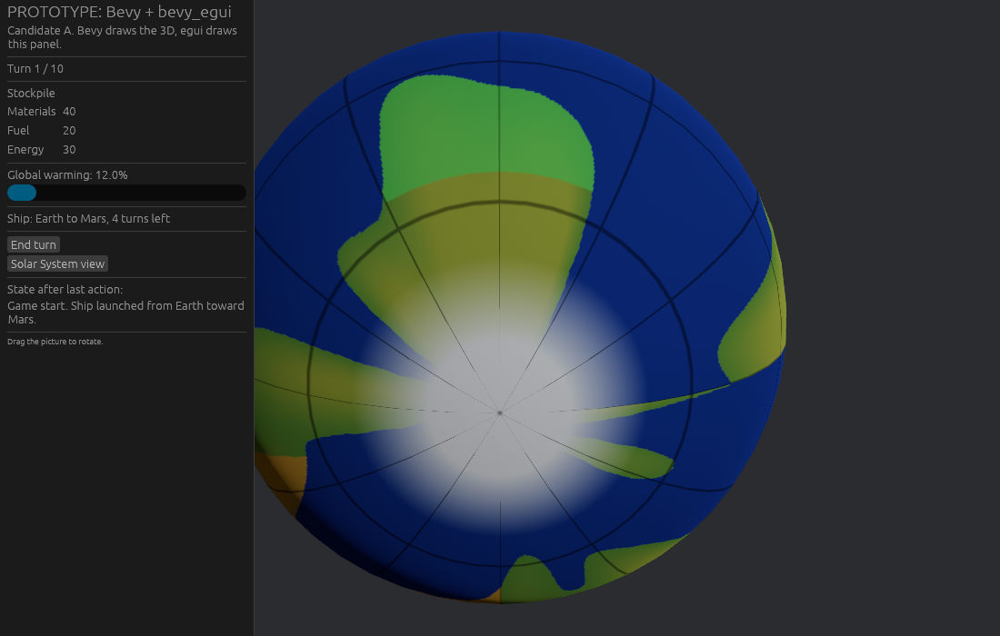
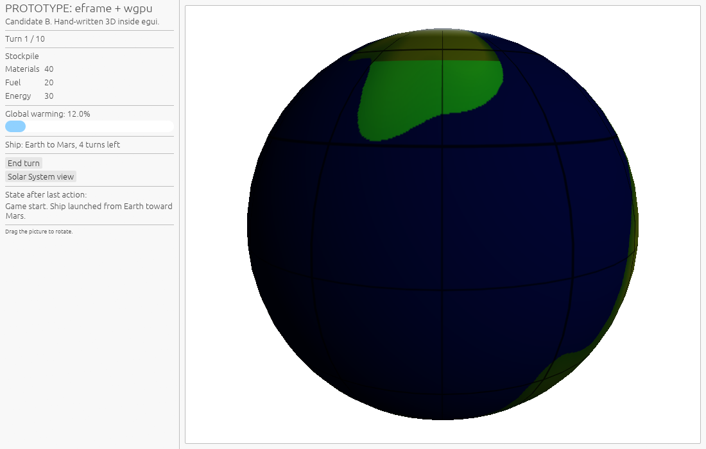
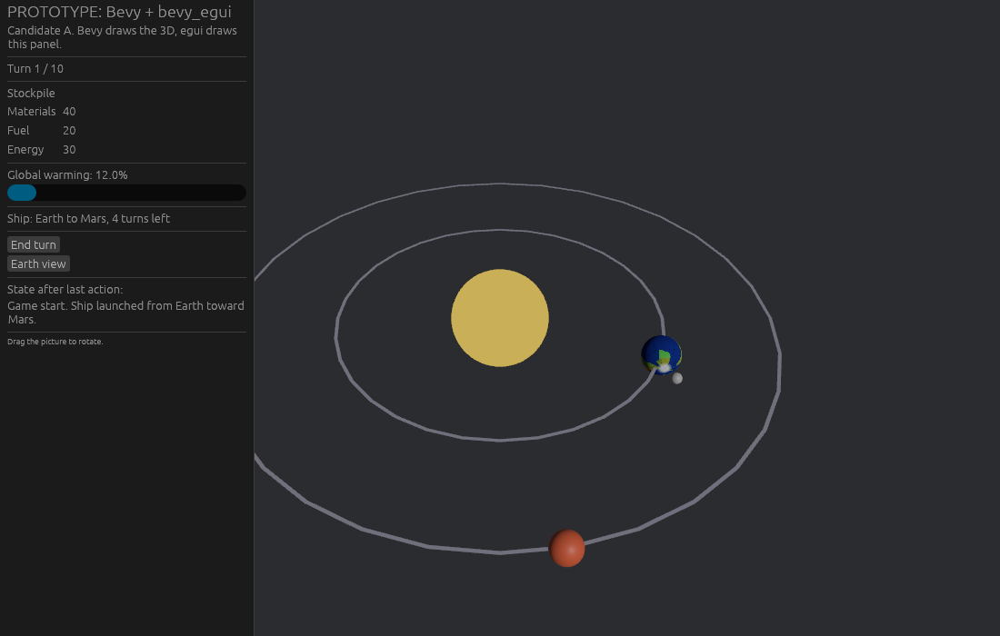
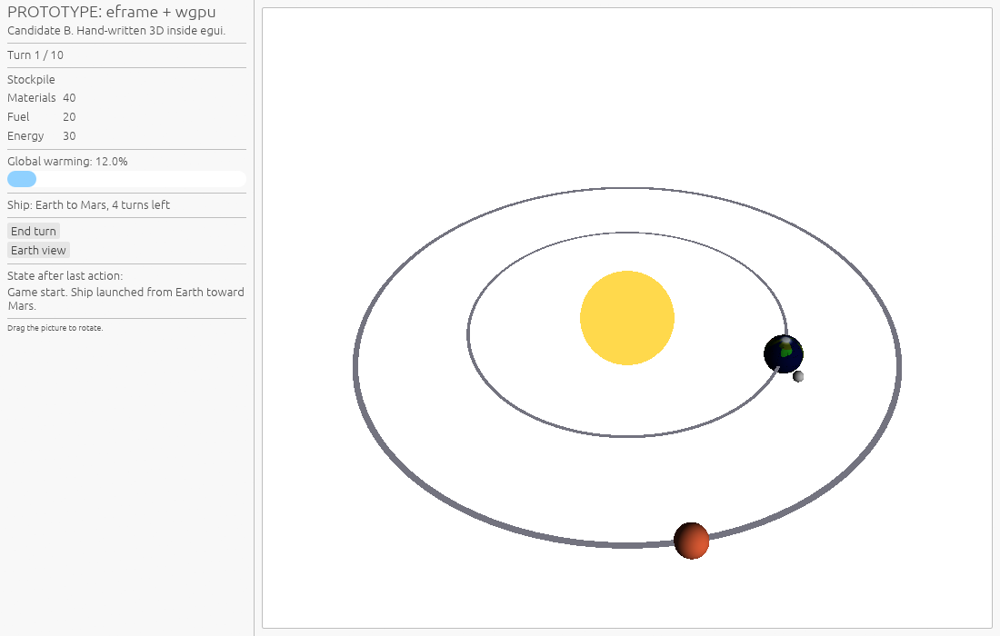
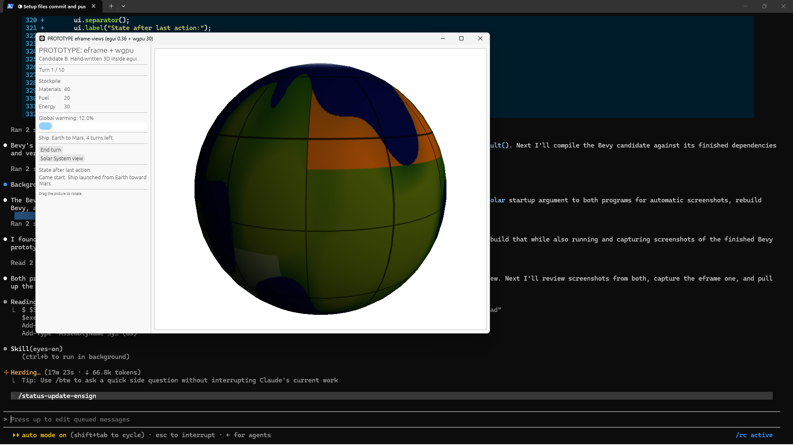

# 2026-09-08: the two 3D candidates, side by side

Throwaway prototypes for the wayfinder ticket
[Pick how the game draws its two 3D views](https://github.com/whaleyjoshua2/Dying-Earth/issues/5).
Code lives on the branch
[`prototype/3d-views`](https://github.com/whaleyjoshua2/Dying-Earth/tree/prototype/3d-views/prototype);
it is not meant to be kept.

Both programs draw the same thing on purpose, so the comparison is fair: an
Earth globe with three tinted nation states (Stewards green, Extractors
orange, one neutral grey), a solar system with the Sun, Earth, Moon, Mars and
a ship in transit, and one HUD panel showing the Stockpile, the turn, the
warming figure and two buttons. The Earth texture is generated in code, so
neither program needs a folder of assets beside its `.exe`.

| | Candidate A: Bevy 0.19.1 + bevy_egui 0.42.0 | Candidate B: eframe / egui 0.36.2 + hand-written wgpu 30 |
| --- | --- | --- |
| Earth view |  |  |
| Solar System view |  |  |

## What the pictures do and do not show

- **The eframe captures are darker than the real window.** egui's built-in
  screenshot reads the frame back through a non-sRGB texture, so the 3D
  content comes out roughly a gamma darker in the PNG. On screen it looks like
  this on-screen capture taken earlier the same evening:
  
  Bevy's screenshot path converts correctly, so its captures match the screen.
- **Bevy over-exposed at first.** A 9,000 lux directional light against the
  default camera exposure washed the globe out to white in the middle; 2,500
  lux fixed it. Not a library problem, a tuning one, but it is the kind of
  thing that silently looks wrong.
- **Bevy showed a white window for over nine seconds on its first-ever
  launch** while it compiled shaders; every later launch drew within a
  second. eframe drew immediately every time.

## How they were captured

Both programs have a headless screenshot mode: `prototype-bevy-views.exe
shot:<prefix>` or `prototype-eframe-views.exe solar shot:<prefix>` puts the
window off-screen at (-5000, -5000), saves the framebuffer to
`<prefix>-<seconds>.png` twice, and exits. Nothing appears on the desktop.
Bevy uses its `Screenshot` component with `save_to_disk`; eframe uses
`ViewportCommand::Screenshot` and writes the returned image with the `image`
crate.

## Numbers measured on this machine (i7-12700K, RTX 3050, Vulkan)

| | Bevy | eframe |
| --- | --- | --- |
| First dependency build, release | 6 min 57 s | under 2 min |
| Rebuild after editing the program | 7-23 s | 2-3 s |
| Lines written for the prototype | main.rs 335 + texgen 78 | main.rs 430 + geom 78 + shader 50 + texgen 78 |
| Shipped as | one `.exe` (texture is generated, so no assets folder needed here) | one `.exe`, 14 MB |
| Compile errors on first build | 0 | 1 (wgpu 30 wants `Some(...)` around a vertex layout) |
