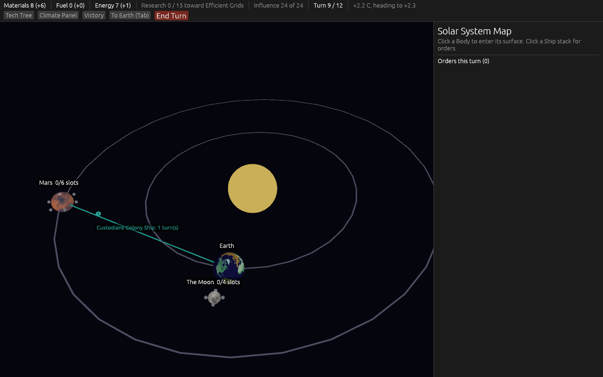
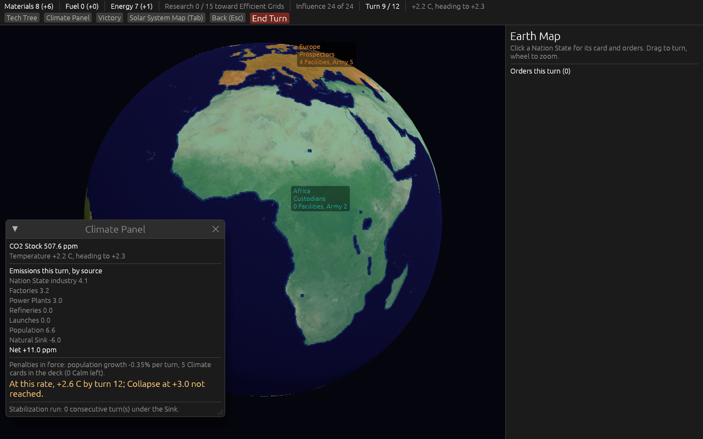
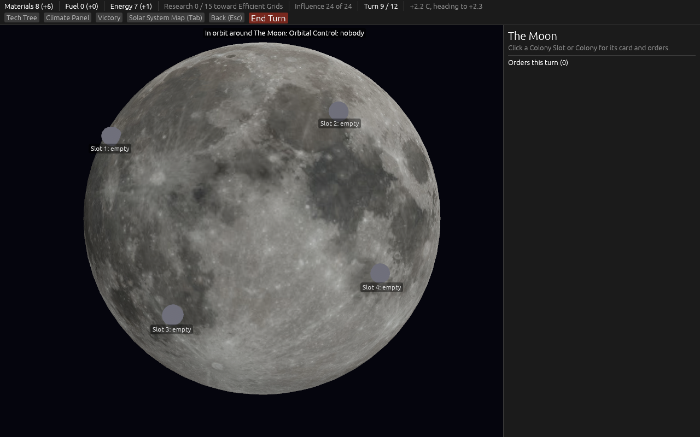
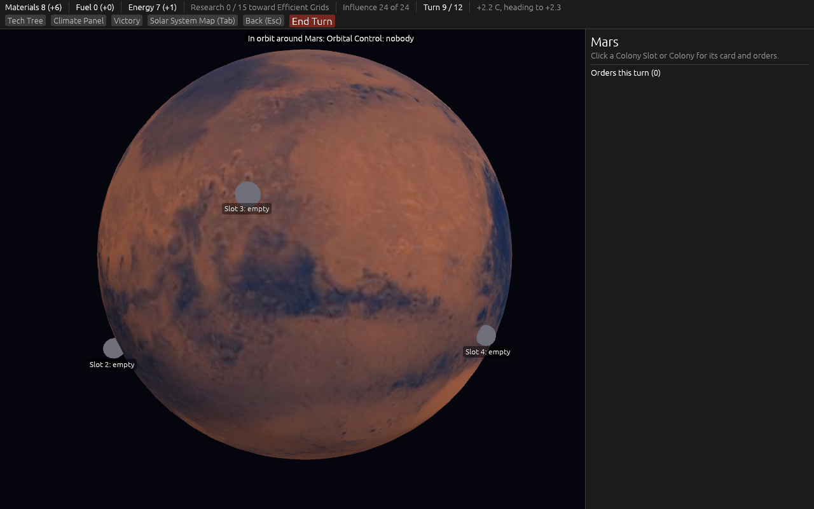
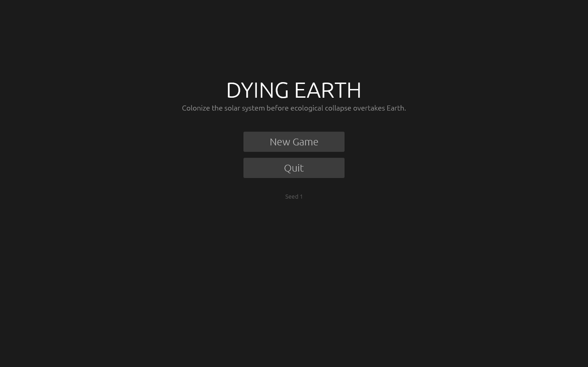
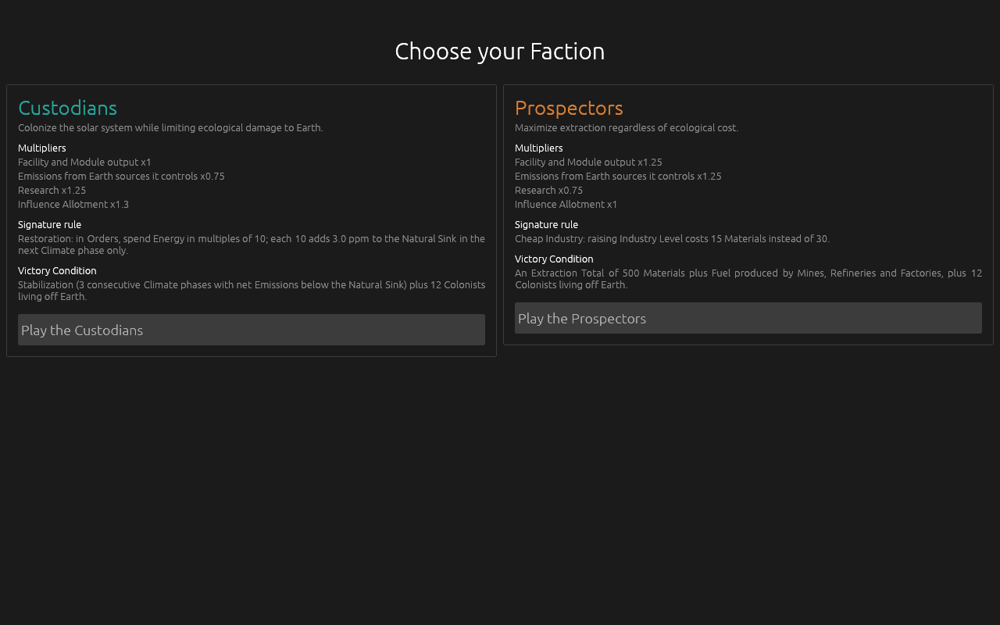
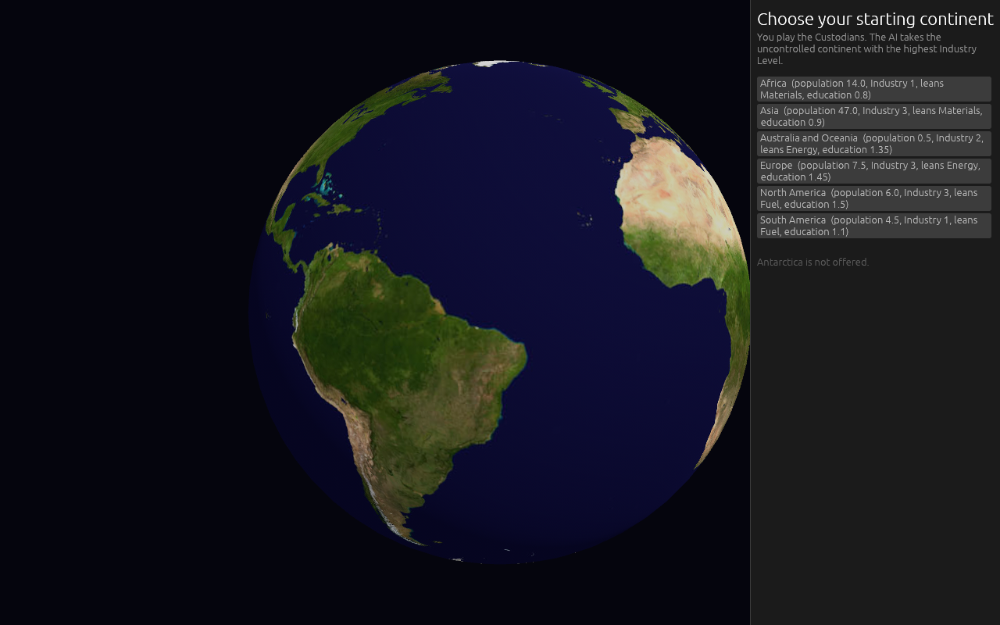
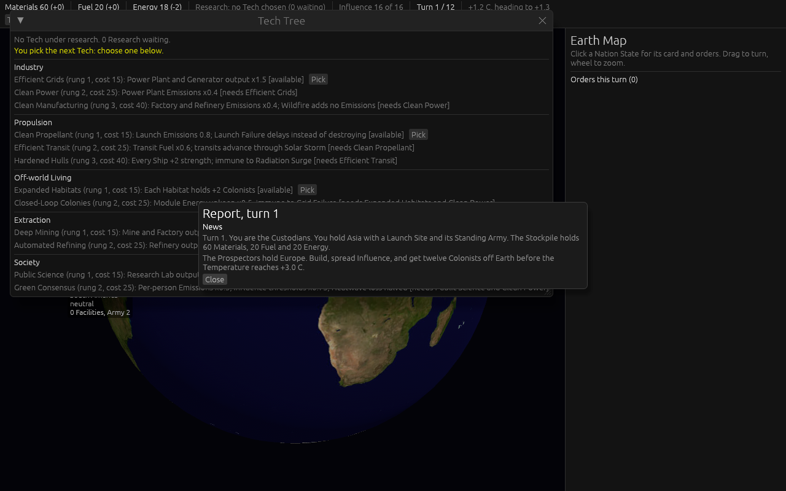
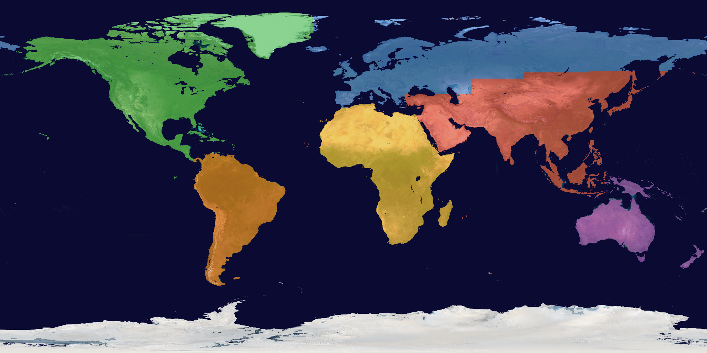

# 2026-09-09: the First Playable, built from the spec

The game described in [`docs/spec/first-playable.md`](../../spec/first-playable.md), built on the
ticket [Build the First Playable from the spec](https://github.com/whaleyjoshua2/Dying-Earth/issues/19).
Every picture here was taken by the game itself in its headless screenshot mode
(`dying-earth.exe shot:<prefix>`), with the window parked off-screen at (-5000, -5000); nothing
appeared on the desktop. The captures below add two building aids the spec does not ask for:
`menus:1` also captures the screens before the game, and `turns:8` lets both AIs play eight turns
first so the board has something on it.

## The four views (spec 19.2)

| | |
| --- | --- |
| Solar System Map, turn 9. A Custodian Colony Ship one turn from Mars, the slot dots around each Body.  | Earth Map, turn 9. Africa and Asia in Custodian teal, Europe in Prospector orange, neutral states untinted, coastlines from NASA Blue Marble.  |
| The Moon's surface with its four Colony Slots on the near side.  | Mars with its six slots; the band along the top names who holds Orbital Control.  |

## The screens around the game

| | |
| --- | --- |
| Title  | Faction choice, each card with its multipliers, signature rule and Victory Condition  |
| Starting continent on a spinning Earth, Antarctica not offered  | Turn 1: the first Report, and the Tech Tree asking for the first pick  |

## The Nation State mask

Seven states drawn on the real coastlines, derived from the Blue Marble image by
`examples/prep_assets.rs`: water where the pixel is blue, then a longitude and latitude rule per
continent. Islands go with the nearest continent, Central America and the Caribbean with North
America, all of Russia with Europe, the Middle East with Asia.

The Russia rule is a straight line: everything north of 50 degrees east of the Urals counts as
Europe, so northern Kazakhstan and northern Mongolia are tinted with Europe. That is the one visible
approximation; the designer can move the line in `state_for` if it matters.

## The designer's anchors (spec 19.3)

Twenty seeds per pairing with `cargo run -p dying-earth-engine --example sim -- 1 <a> <b> --count=20`.
Seat 0 is always the seat the player would sit in.

| Anchor | Measured | Verdict |
| --- | --- | --- |
| About twenty Facilities and Modules per Faction by turn twelve | Custodians versus Prospectors: 5 to 6 against 4. Prospectors versus Custodians: 2 to 4 against 5 to 8. | **Misses.** A Factory makes 4 to 7 Materials a turn against building costs of 20 to 35, and the Stockpile starts at 60. |
| The first Colony founded around turn five | Turn 10 to 12 in every game that founded one. | **Misses.** A Power Plant and a Factory come first or Energy runs out; the Colony Ship (30 Materials) then waits for income. |
| Collapse projected around turn ten when both AIs are Prospectors | Collapse on turn 10 in 5 of 20 games and turn 11 in 15 of 20. | **Holds.** |
| A winner around turn eleven in most games | No Faction ever meets its Victory Condition. Every game is decided on turn twelve by score, or ends in Collapse. | **Misses.** Twelve Colonists off Earth needs three Colony Ship loads; the AI lands one. |
| A defended Colony changes hands in about four turns when attacked | Scripted (the AIs never mount this attack): a Battleship and a Colony Ship land two Armies on a Colony with a Barracks Army; over twelve seeds the median transfer lands three to five turns after landing, and the test asserts it. | **Holds.** |

Reported, not retuned, as section 19.3 asks. Two things the numbers forced on the AI are recorded on
the ticket for the designer to keep or veto: a bootstrap rule (a Materials or Energy producer counts
as advancing the victory part the AI is behind on until the seat has that income) and a saving rule
(the AI holds Materials for a higher-scored action it can afford next turn). Without them the AI of
section 16, read literally, spends its last Materials on turn one and never builds again.

## What broke on the way

- **bevy_egui attached itself to the wrong camera.** Spawning `AmbientLight` as its own entity
  creates a bare camera in Bevy 0.19, and bevy_egui hooks its primary context onto the first camera
  it sees. Every panel was drawn to a camera with no render graph, so the first captures showed the
  3D scene with no interface at all. The ambient light now sits on the game camera.
- **Captures lagged the view switch by a step.** Spawning the screenshot and switching the view in
  the same tick produced pictures whose panels named one view and whose globe showed the previous
  one. The switch now waits a second after each capture.
- **A Colony with no Colonists flipped for free.** Its Influence threshold is ten per Colonist, so
  zero; the rival met zero with zero and took it in the same Resolution the occupier won it. Meeting
  a threshold now needs positive Influence. Found by the Colony anchor test.

## Red witnesses

Fourteen of the formula tests were watched to fail against a deliberately broken rule (the lag
fraction, the once-only sea threshold, the deck swap count, the shortfall order, the decay amount,
the pursuit comparison, the odds formula, the collapse-after-victory order, two Tech effects, the
hit-roll count, the Pacification gain, and the zero-threshold rule), each restored afterwards. Two
mutations were not caught and are noted: raising the Occupation cap from three turns to four changes
nothing, because a gain of one third of the threshold rounded up always Pacifies a place on the
third turn, so the cap never binds; and the round cap in the battle algorithm is not pinned by the
disengage test, which ends after one round on its own.
