# 2026-09-09: version 0.02, ticket by ticket

Work on map [#21](https://github.com/whaleyjoshua2/Dying-Earth/issues/21), on the branch `version-0.02`.

## #22: each building's income on the card and on hover

Every Facility and Module on a Nation State's or Colony's card now shows what it makes each turn at
today's multipliers, its Energy upkeep and its Emissions, and says "offline, making nothing" when the
shortfall rule shut it. Every build button shows the same three figures on hover, for the building it
would make.

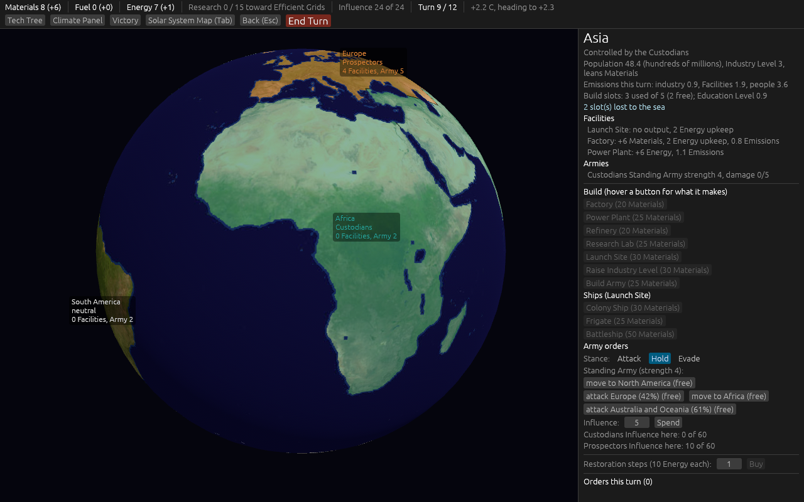

The figures come from one place: `Game::facility_yield` and `Game::module_yield` in the engine, which
the Income phase itself now uses. A formula test builds a mixed board and checks that the sum of the
cards equals what the next Income phase pays and what the Climate phase charges. Two mutations were
tried against it: breaking the Faction's Emissions multiplier on the card went red; breaking the
Resource Lean inside the shared function stayed green, because card and Income share the code, and
that mutation is caught by the Deep Mining test instead.

The hover text cannot be captured off-screen, so it was checked by reading, not by picture.

## #23: the roster

The designer's "liner for units and ships the player controls", decided on the ticket: the side
panel's default content when nothing is selected, listing Ship stacks (and Ships in transit), Armies,
Colonies and Nation States the player directs; each row a button that selects the thing and jumps to
its view; "no order" marked on any Ship stack or Army that has nothing pending this turn. Escape
clears a selection and brings the roster back.

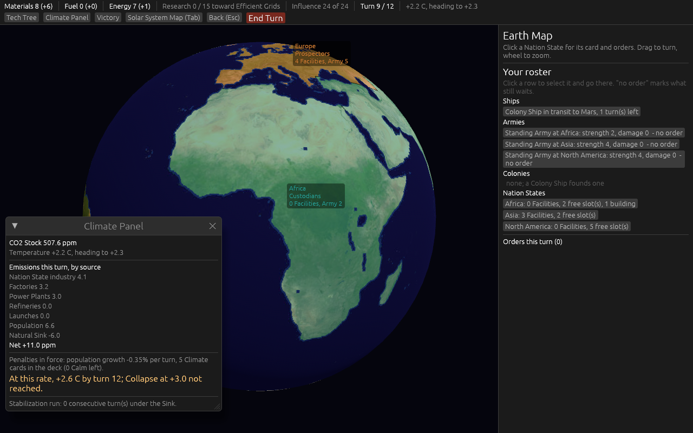

## #24: start buildings

Decided by the designer: every Nation State starts with as many Facilities as its Industry Level,
chosen by its Resource Lean (Materials: Factory, Power Plant, Refinery; Energy: Power Plant, Factory,
Refinery; Fuel: Refinery, Power Plant, Factory); they come with the state whoever takes it; the
Faction start states add their Launch Site; the Stockpile starts at 80 Materials rather than 60. A
Facility nobody directs stands idle: it makes nothing and emits nothing. All of it is one row per
state in `nation_states.toml` and one number in `factions.toml`.

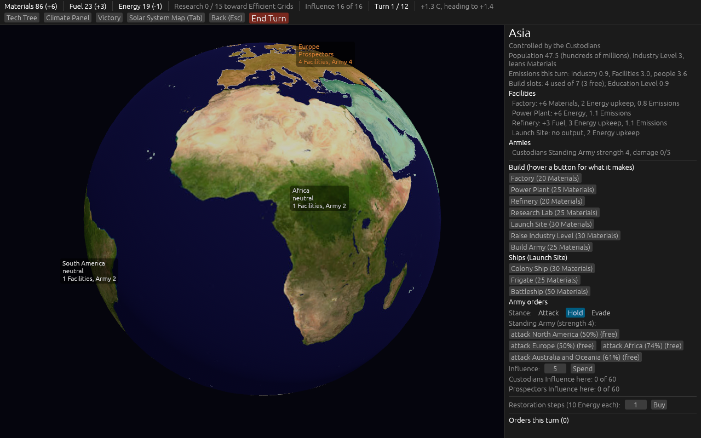

Twenty seeds per pairing afterwards, against the first build's numbers in brackets:

| | Custodians v Prospectors | Prospectors v Prospectors | Prospectors v Custodians |
| --- | --- | --- | --- |
| First Colony | turn 7 or 8 (was 10 to 12) | turn 7 or 8 (none) | turn 7 or 8 (10 to 12) |
| Buildings per Faction | 5 to 8 (5 to 6 v 4) | 3 to 9 (2 to 4) | 3 to 12 (2 to 8) |
| Colonists off Earth | mostly 4 v 4 (4 v 0) | mostly 4 v 4 (0) | 4 v 4 or 4 v 8 |
| Outcome | Collapse, turn 10 or 11 (no Collapse) | Collapse, turn 9 to 11 (10 or 11) | Collapse, turn 10 or 11 (4 of 20) |

Two anchors moved toward their marks and one moved away: with three emitting Facilities per Faction
from turn one, the Temperature crosses +3.0 by turn 10 or 11 in every game. Reported, not retuned:
the CO2 clock is ticket #27's question, and it now has to allow for this.

## #25: Events ten percent rarer, and no more Calm Cards

Decided by the designer, in three rounds: ten points, from 60% to 50%; then, instead of more Calm
Cards, **no Calm Cards at all** and a chance each turn that no card is drawn; the Draw Chance and the
Climate scaling both rise with the Temperature (50% at +1.2 C, +2.5 points per full 0.2 C, 72.5% at
+3.0); the deck grows to **thirty cards, the twelve first-playable Events twice and six new ones
once**, chosen from proposals: Solar Maximum, Meteor Shower, Dust Storm, Unrest, Reactor Leak and
Permafrost Thaw. The deck is still never reshuffled; at these rates twenty-four turns draw about
fifteen cards.

All of it is in `events.toml`: each Event row has a `copies` count and the constants sit at the top.
`CONTEXT.md` retires Calm Card and adds Draw Chance. Nine new tests, five watched red first.

Twenty seeds per pairing afterwards: every pairing still ends in Collapse, and two Prospector AIs now
collapse on turn 7 or 8 rather than 9 to 11, since the deck no longer carries eight blanks and
Permafrost Thaw arrives scaled. Reported, not retuned; #27 owns the clock.

## #27: twenty-four turns and the re-paced CO2 clock

Decided by the designer: a turn stays one month and the game runs twenty-four; **Factions must be
unique**, so the only pairing is one Custodian seat against one Prospector seat (the two-Prospector
run of the first-playable anchors is retired and `simulate` refuses it); that game should collapse by
turn 22 for now; the Natural Sink and the ppm step may move, found by a sweep; the AI's pace schedule
stretches to twenty-four turns and the victory bars stay.

The sweep (`engine/examples/sweep.rs`, twenty seeds per cell, Custodians against Prospectors, both AI):

| Sink | step 40 | 60 | 65 | 70 | 75 | 80 | 85 | 90 | 100 |
| --- | --- | --- | --- | --- | --- | --- | --- | --- | --- |
| 6 | 20/20, turn 10 | 20/20, 13 | 20/20, 14 | 20/20, 15 | 19/20, 17 | **16/20, 18 (16..24)** | 13/20, 21 | 7/20, 22 | 2/20, 23 |
| 7 | | | 20/20, 15 | 18/20, 17 | 14/20, 18 | 13/20, 21 | 5/20, 22 | 3/20, 22 | |
| 8 | 20/20, 11 | 19/20, 15 | 17/20, 17 | 14/20, 18 | 11/20, 20 | 4/20, 23 | 3/20, 22 | 2/20, 24 | 0/20 |

(collapses out of twenty, and the median collapse turn.) Chosen: the Sink stays 6.0 and the step
becomes **80 ppm per +0.5 C**, one number in `climate.toml`: most games collapse, the typical one on
turn 18, the latest on 24. The 85 step, one number away, gives a median of 21 with seven games surviving.

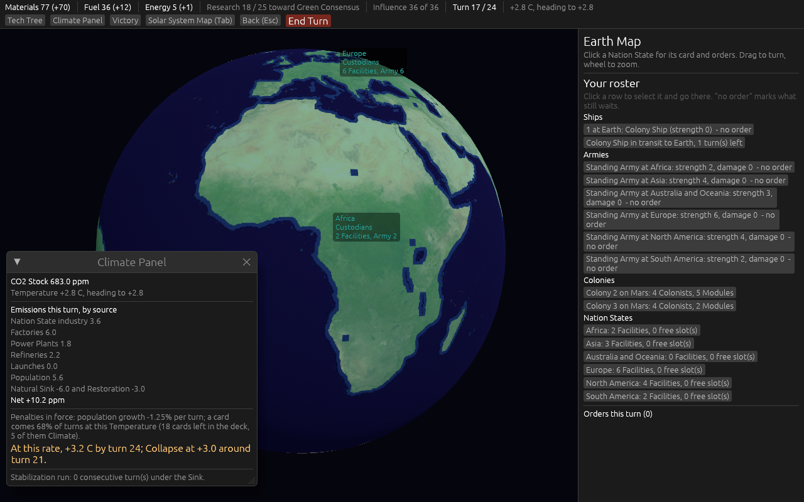

Twenty seeds afterwards, Custodians (seat 0) against Prospectors: 16 Collapse between turns 16 and
24, 4 Custodian wins on score at turn 24. Buildings per Faction reach 18 to 75 for the Custodians and
0 to 9 for the Prospectors; Colonists off Earth 8 to 28. The first-playable anchors on buildings and
the first Colony (turn 7 or 8) are now met or passed. Two things the designer should see: **no
Faction ever meets its Victory Condition** (the Custodians never hold three consecutive turns under
the Sink; the Prospectors never reach 500 Extraction because they lose their states), and **the
Custodian AI takes every Nation State by Influence** over twenty-four turns, its 1.3x Allotment and
weight 8 against 5 compounding. Reported, not retuned.

## #26: two more Nation States

Decided by the designer: **Russia**, cut out of Europe, and **the Middle East**, cut out of Asia;
real-world cards, with each parent losing the population that leaves and one Size; the #24 start
buildings by the same rule. The cards, in `nation_states.toml`:

| State | Population | Industry | Lean | Baseline Emissions | Education | Size | Coastal Exposure | Neighbours |
| --- | --- | --- | --- | --- | --- | --- | --- | --- |
| Russia | 1.5 | 2 | Fuel | 0.4 | 1.35 | 3 | 1 | Europe, Asia, North America |
| The Middle East | 3.5 | 2 | Fuel | 0.5 | 1.0 | 2 | 1 | Europe, Asia, Africa |
| Europe (was 7.5, Size 3) | 6.0 | 3 | Energy | 0.3 | 1.45 | 2 | 1 | North America, Africa, Russia, the Middle East |
| Asia (was 47.0, Size 4) | 43.5 | 3 | Materials | 0.4 | 0.9 | 3 | 2 | Russia, the Middle East, Australia and Oceania |

The Asia to North America edge moves to Russia (the Bering Strait); Asia to Africa goes through the
Middle East (Sinai). The mask rules in `examples/prep_assets.rs` draw Russia east of Finland and the
Baltics above 55N, east of Belarus to 55N, east of Ukraine down to the Caucasus, then Siberia north
of the Kazakh, Mongolian and Manchurian borders; the Middle East from the Bosporus to Iran's eastern
border and the Caucasus below 44N, east of the Red Sea line. First try, Europe ran east to 40E and
swallowed Moscow, and the Middle East ran to 63E and took western Turkmenistan; both seams were moved
after looking at the preview.

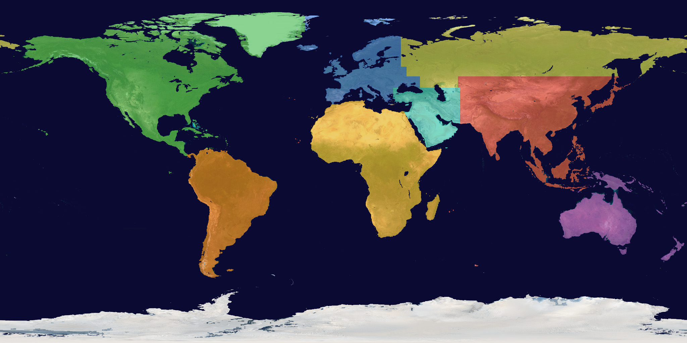

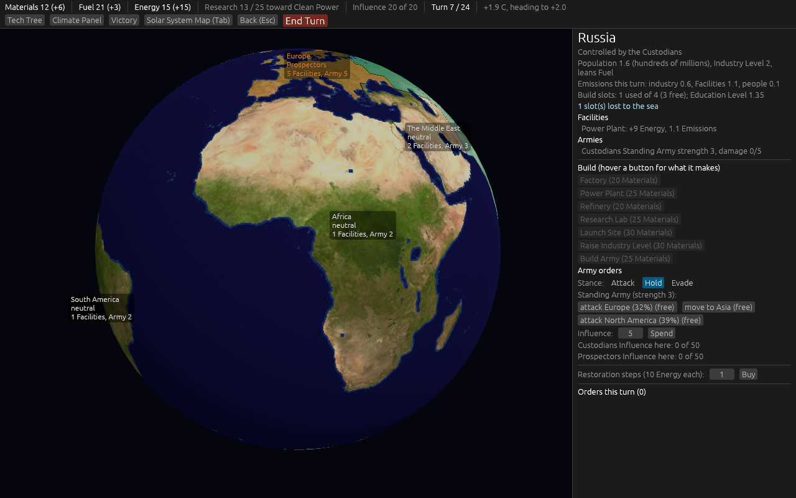

## #28: the amendments written, the clock re-run, the pictures, the pull request

The six decisions are written into [`docs/spec/version-0.02.md`](../../spec/version-0.02.md),
section by section with the numbers; `first-playable.md` carries a line pointing at it, and
`CONTEXT.md` now says nine Nation States and twenty-four turns.

**The clock had to be re-run.** #27 tuned the ppm step to 80 with seven Nation States. #26 then added
Russia and the Middle East, each starting with a Refinery and a Power Plant, and the first
twenty-seed run of this ticket collapsed every game on turns 13 to 17. The target and the knobs were
#27's decision, so the sweep was run again with nine states:

| Sink 6.0, step | 90 | 100 | 110 | 120 | 130 | 140 |
| --- | --- | --- | --- | --- | --- | --- |
| collapses of 20, median turn | **17, 16 (15..21)** | 10, 19 (17..24) | 7, 21 | 4, 22 | 1, 24 | 0 |

The step is now **90**. Twenty seeds afterwards, Custodians (seat 0) against Prospectors: 17 Collapse
between turns 15 and 21, 3 Custodian wins at turn 24 by tiebreak; buildings 7 to 57 against 0 to 26;
Colonists off Earth 4 to 24 against 0 to 8; first Colony on turn 7 or 8. Prospectors in seat 0
against Custodians: 20 Collapse on turns 14 to 16. Neither Faction meets its Victory Condition in
any of the forty games.

**The four views from `shot:check` at turn 1**, as spec 19.2 asks, with nine states:

| | |
| --- | --- |
| 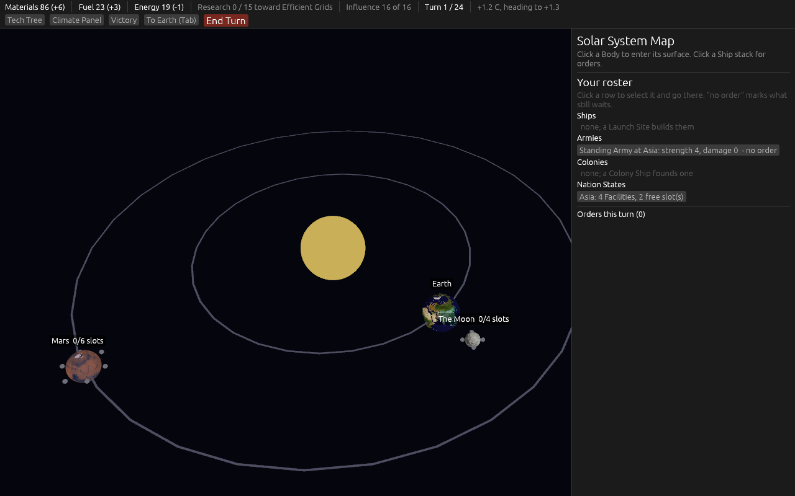 | 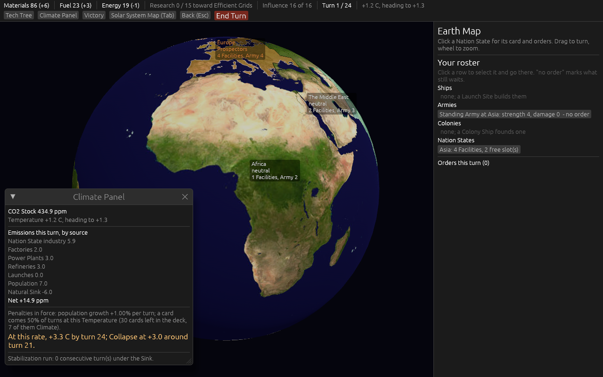 |
| 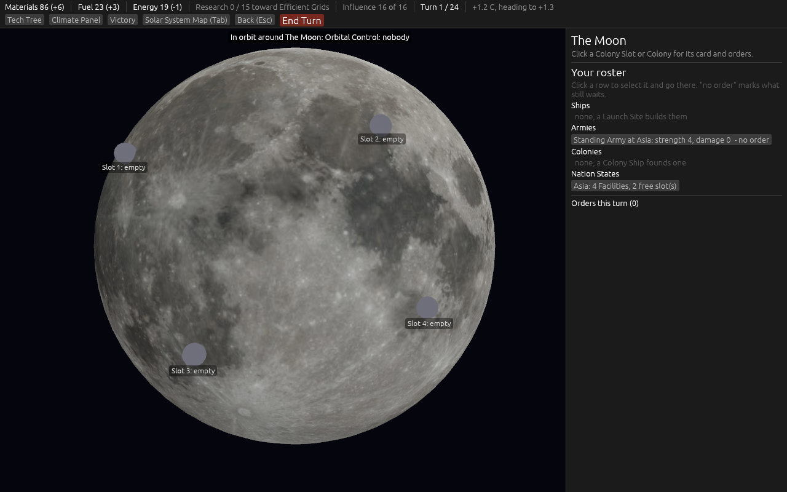 | 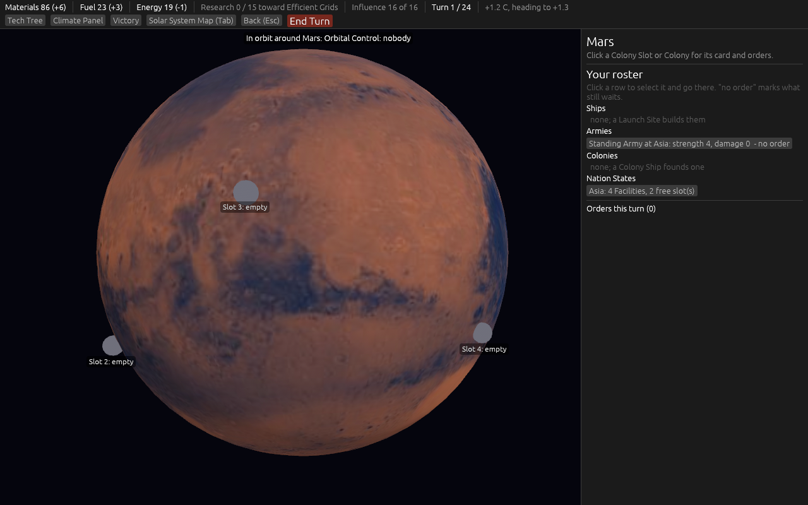 |

And turn 13 of a game both AIs played, on the Solar System Map: two Custodian Colonies on Mars, a
Prospector stack at the Moon, a Colony Ship two turns from Earth.

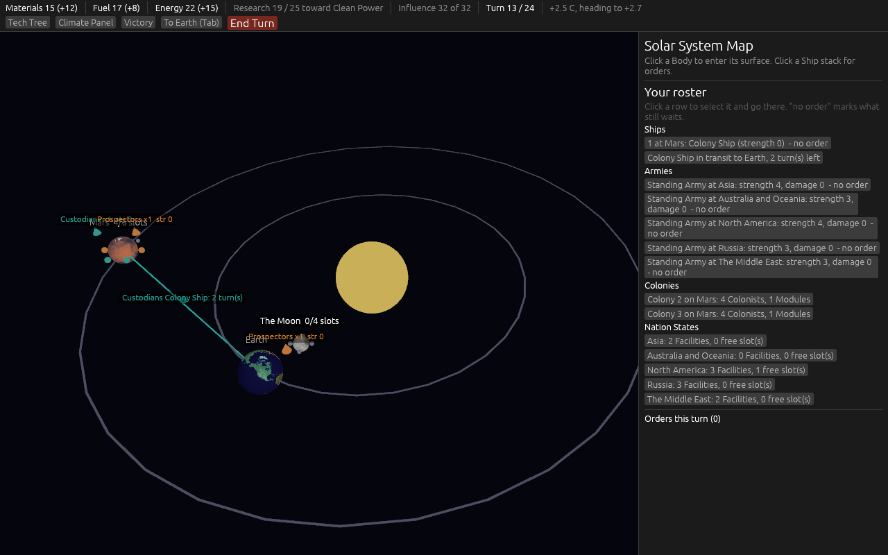
