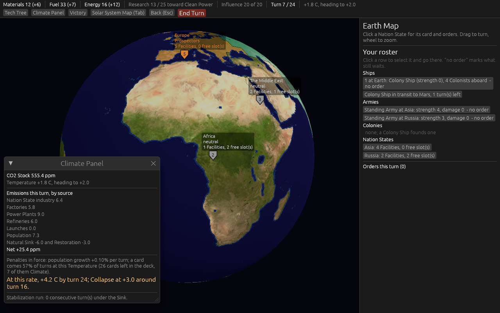
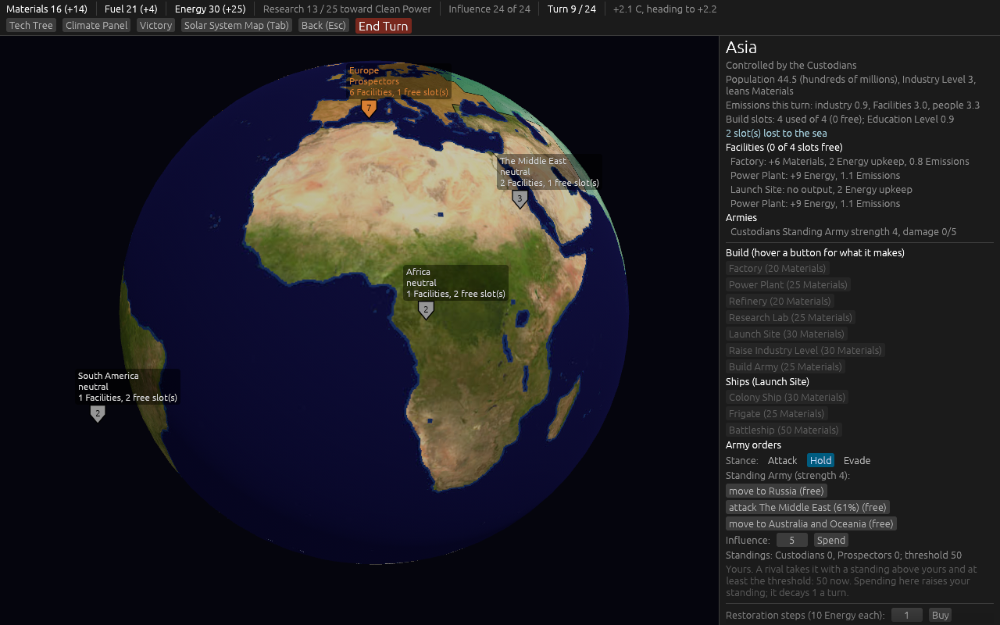

# 2026-09-09: version 0.03, ticket by ticket

Work on map [#30](https://github.com/whaleyjoshua2/Dying-Earth/issues/30), on the branch `version-0.03`.

## #31: six housekeeping items

1. **Only Climate cards scale with the Temperature**, as before; the Event popup now says which it
   was ("A Climate card: x1.35 at this Temperature" or "Not a Climate card: the Temperature does not
   change it"), and a test pins a Solar, Discovery and Failure card to a scale of 1 at +3.0 C.
2. **Hover a resource in the top bar** for last Income by source: each building with its state or
   Colony and its amount, upkeep as negatives, Ships and Armies as one line.
3. **A place taken by Influence keeps every Facility and Module.** The 1-in-4 destruction roll now
   fires only when a place is attacked and when Occupation transfers it. A test takes Africa with
   eight Factories on five seeds; all eight stand each time.
4. **Free build slots** on every Earth Map label ("4 Facilities, 0 free slot(s)") and at the head of
   the card's Facilities list ("Facilities (2 of 5 slots free)").
5. **End Turn asks once when Influence is unspent**: "12 Influence is unspent; it is lost at End
   Turn. End the turn anyway?" with End Turn and Back.
6. **Army shields on the Earth Map**: one per Faction with Armies in a state, in the Faction's
   colour, grey for a neutral state's Standing Army, the stack's strength written on it, clickable.

Both rule changes were watched red first: with the destruction roll restored for Influence the
eight-Factory test failed, and with every card scaled the Meteor Shower test failed.

## #32: the two cards that singled out a Faction

Decided by the designer: Equipment Failure and Launch Failure go; **Launch Pad Fire** (one Nation
State with a Launch Site: the Launch Site is offline until the next Resolution and every Ship due
there this turn completes next turn instead; Clean Propellant delays no Ship) and **Labour Dispute**
(one Nation State by population: its Facilities make nothing at the next Income; Public Science
spares all but one) come in, once each. Both hit a place, so whoever holds it takes the blow.

The deck is twenty-eight cards, not the twenty-six the ticket's option named: ten first-playable
Events twice and eight later ones once. The arithmetic slip is recorded on the ticket for the
designer to keep or trim. A test now asserts that no card in the table targets a Faction.

## #33: standings that persist

Decided by the designer: every Faction keeps a **standing** on every place, never wiped. A neutral
place goes to the first standing at the threshold; a controlled place goes to a rival whose standing
is above the controller's and at least the threshold. Decay is 1 a turn on a place you control and
2 elsewhere. Spending on a place you hold raises your own standing. When Occupation transfers a
place, the occupier's gains are its standing and the old controller keeps its own.

Two rules watched red first: dropping the "above the controller" clause let 55 take a state held at
60; making every place decay 2 broke the decay-of-1 test.

What the twenty-seed batch showed: **10 to 12 Influence transfers per game**, most of them one state
ping-ponging between the AIs turn by turn, because a rival needs only one point more than the
controller and both keep spending there. Reported on the ticket with three one-number options;
not retuned.
