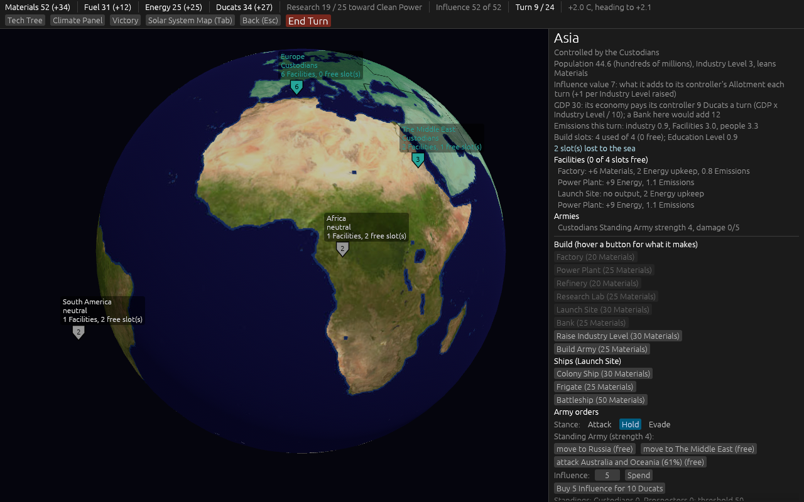
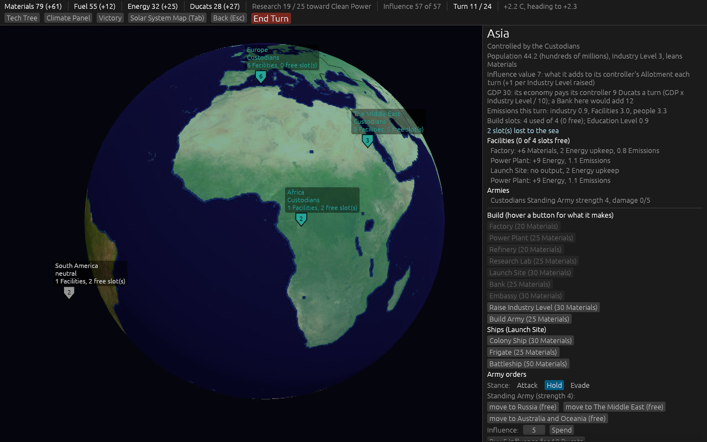
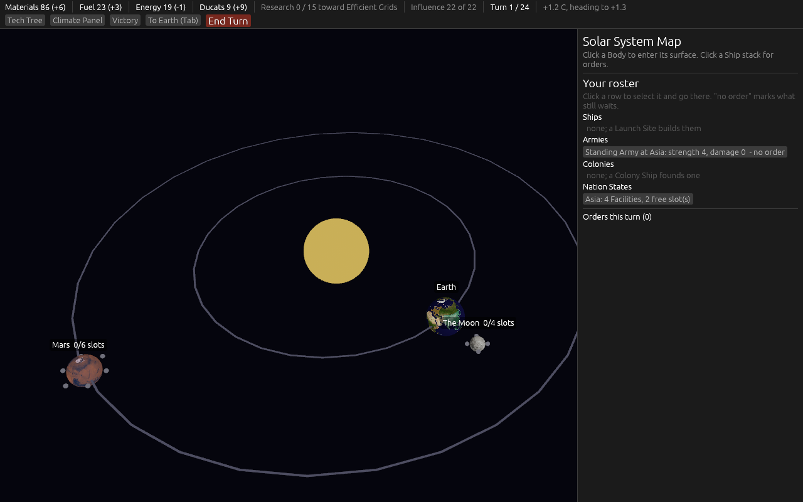
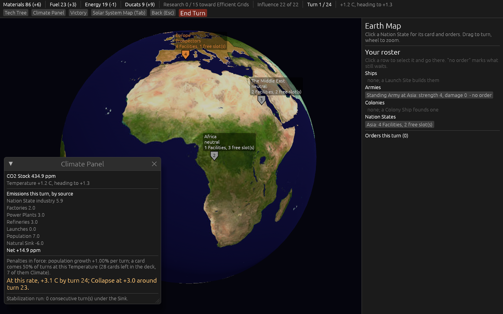
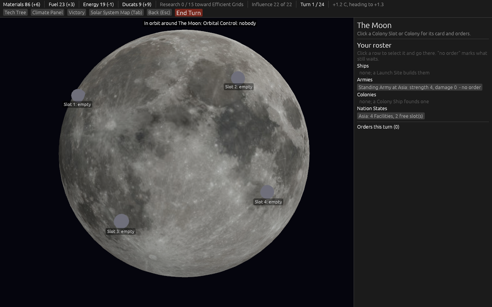
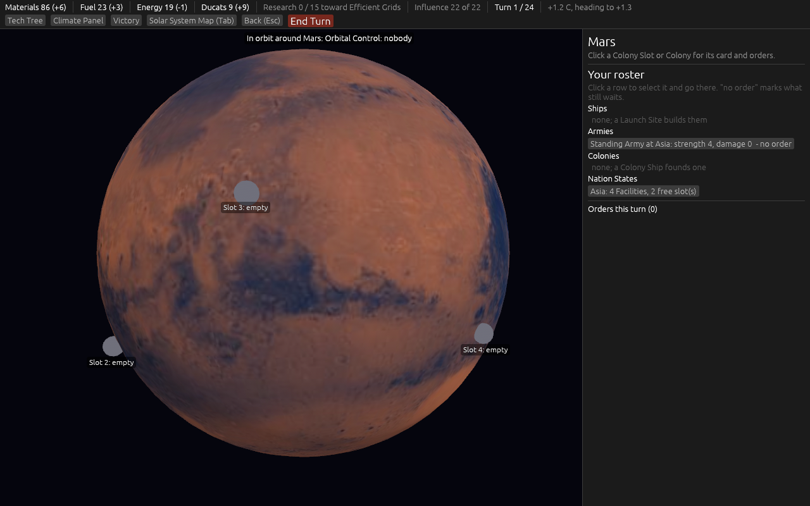
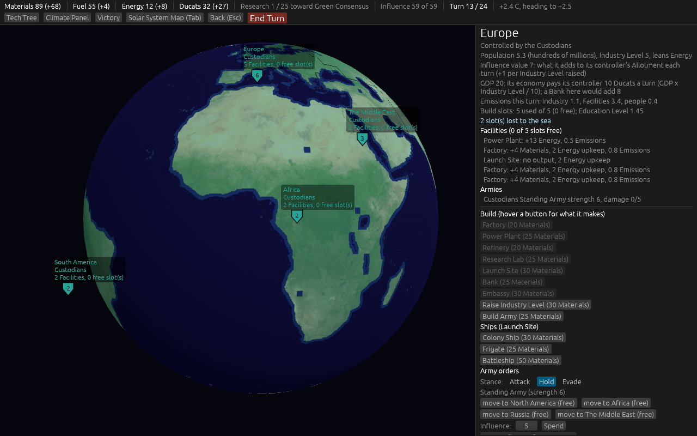

# 2026-09-09: version 0.03, ticket by ticket

Work on map [#30](https://github.com/whaleyjoshua2/Dying-Earth/issues/30), on the branch `version-0.03`.

## #31: six housekeeping items

1. **Only Climate cards scale with the Temperature**, as before; the Event popup now says which it
   was ("A Climate card: x1.35 at this Temperature" or "Not a Climate card: the Temperature does not
   change it"), and a test pins a Solar, Discovery and Failure card to a scale of 1 at +3.0 C.
2. **Hover a resource in the top bar** for last Income by source: each building with its state or
   Colony and its amount, upkeep as negatives, Ships and Armies as one line.
3. **A place taken by Influence keeps every Facility and Module.** The 1-in-4 destruction roll now
   fires only when a place is attacked and when Occupation transfers it. A test takes Africa with
   eight Factories on five seeds; all eight stand each time.
4. **Free build slots** on every Earth Map label ("4 Facilities, 0 free slot(s)") and at the head of
   the card's Facilities list ("Facilities (2 of 5 slots free)").
5. **End Turn asks once when Influence is unspent**: "12 Influence is unspent; it is lost at End
   Turn. End the turn anyway?" with End Turn and Back.
6. **Army shields on the Earth Map**: one per Faction with Armies in a state, in the Faction's
   colour, grey for a neutral state's Standing Army, the stack's strength written on it, clickable.

Both rule changes were watched red first: with the destruction roll restored for Influence the
eight-Factory test failed, and with every card scaled the Meteor Shower test failed.

## #32: the two cards that singled out a Faction

Decided by the designer: Equipment Failure and Launch Failure go; **Launch Pad Fire** (one Nation
State with a Launch Site: the Launch Site is offline until the next Resolution and every Ship due
there this turn completes next turn instead; Clean Propellant delays no Ship) and **Labour Dispute**
(one Nation State by population: its Facilities make nothing at the next Income; Public Science
spares all but one) come in, once each. Both hit a place, so whoever holds it takes the blow.

The deck is twenty-eight cards, not the twenty-six the ticket's option named: ten first-playable
Events twice and eight later ones once. The arithmetic slip is recorded on the ticket for the
designer to keep or trim. A test now asserts that no card in the table targets a Faction.

## #33: standings that persist

Decided by the designer: every Faction keeps a **standing** on every place, never wiped. A neutral
place goes to the first standing at the threshold; a controlled place goes to a rival whose standing
is above the controller's and at least the threshold. Decay is 1 a turn on a place you control and
2 elsewhere. Spending on a place you hold raises your own standing. When Occupation transfers a
place, the occupier's gains are its standing and the old controller keeps its own.

Two rules watched red first: dropping the "above the controller" clause let 55 take a state held at
60; making every place decay 2 broke the decay-of-1 test.

What the twenty-seed batch showed: **10 to 12 Influence transfers per game**, most of them one state
ping-ponging between the AIs turn by turn, because a rival needs only one point more than the
controller and both keep spending there. Reported on the ticket with three one-number options;
not retuned.

## #34: each state's Influence value

Decided by the designer: the flat +3 per state gives way to a figure on each card, from 2023 GDP
and military spending shares (North America 8, Asia 7, Europe 5, the Middle East 4, Russia 4,
South America 2, Africa 2, Australia and Oceania 2, Antarctica 0), plus one for every Industry Level
raised above the card; the Faction multiplier still applies to the whole Allotment. Custodians in
Asia start at 22 Influence a turn, Prospectors in Europe at 15.

Twenty seeds: 13 Collapse and 7 Custodian wins at turn 24, games running to turns 17 to 24, and
Influence transfers up to 13 to 16 a game. Larger Allotments, more ping-pong; the options on #33
still stand.

## #35: Ducats

Decided by the designer: **Ducats**, a fourth resource in the Stockpile. A controlled state pays
GDP x Industry Level / 10 a turn from a GDP figure on its card; a **Bank** adds 4 x GDP / 10; a
**Trade Post** in a Colony makes 3 x the Habitat yield. Two Ducats buy one Influence, added to this
turn's Allotment; Ducats also pay for Restoration (10 a step) and repairs (5 a point), rates the
builder set at the Energy and Materials numbers and flagged for veto.

Four rules watched red first: the Bank's GDP factor, the state economy's Industry factor, bought
Influence counting toward the Allotment, and a Ducat repair reaching the repair list.

Twenty seeds: the AI buys Influence with Ducats 42 to 60 times a game and builds no Bank or Trade
Post, because nothing in its producer weights wants a resource it never lacked. Reported, not retuned.

## #36: Embassies and Relays

Decided by the designer: an **Embassy** on Earth (30 Materials, 2 Energy upkeep) adds 2 to its
controller's Allotment and raises its state's standing by 2 a turn; a **Relay** in a Colony (25
Materials, 2 upkeep) adds 1 and raises its Colony's standing by 2 a turn; any number may stand in
one place; the AI weighs them 6 for both Factions.

Two rules watched red first: the buildings' share of the Allotment, and the standing rise. The AI
builds none of them in twenty seeds; its log shows Colony Ships and producers taking the Materials
first, or the saving rule holding them. Reported, not retuned.

## #37: the amendments written, the pictures, the pull request

The six decisions are written into [`docs/spec/version-0.03.md`](../../spec/version-0.03.md),
section by section with the numbers; the first-playable spec and the README point at it.

**The four views from `shot:check` at turn 1**, with Ducats in the top bar:

| | |
| --- | --- |
|  |  |
|  |  |

And turn 13 of a game both AIs played, with Europe's card open: its Standings line, its GDP line,
the Embassy and Bank on its build list, the Army shields on the globe.

**Twenty seeds per seating**, at the close of the map:

| | Custodians in seat 0 | Prospectors in seat 0 |
| --- | --- | --- |
| Outcome | 14 Collapse, 6 Custodian wins at turn 24 | 19 Collapse, **1 Prospector win by meeting its Victory Condition** |
| Last turn | 17 to 24 | 14 to 16 |
| First Colony | turn 7 | turn 7 |
| Colonists off Earth | 16 to 24 against 0 | 8 to 12 against 4 to 12 |
| Influence transfers a game | 13 to 16 | |
| Influence bought with Ducats a game | 41 to 60 | |
| Banks, Trade Posts, Embassies, Relays built by the AI | none | none |

The Prospector win is the first time any AI game has ended on a Victory Condition rather than
Collapse or the last-turn score. The ping-pong of contested states and the AI's neglect of the new
buildings stand as reported on #33, #35 and #36.
