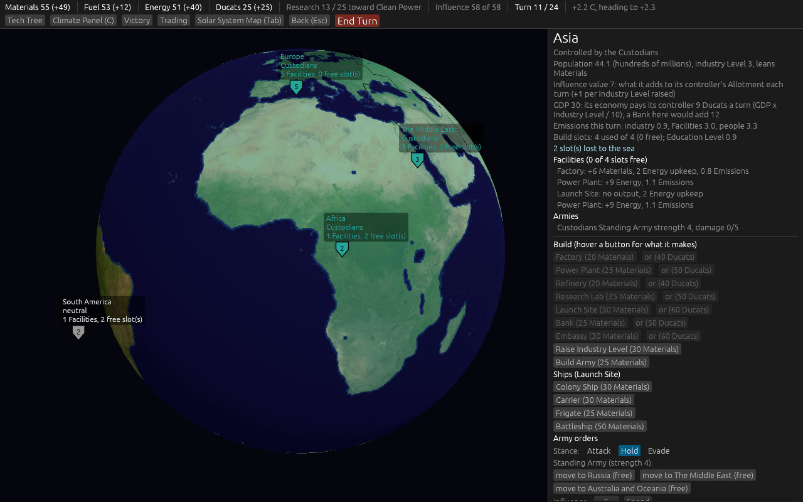
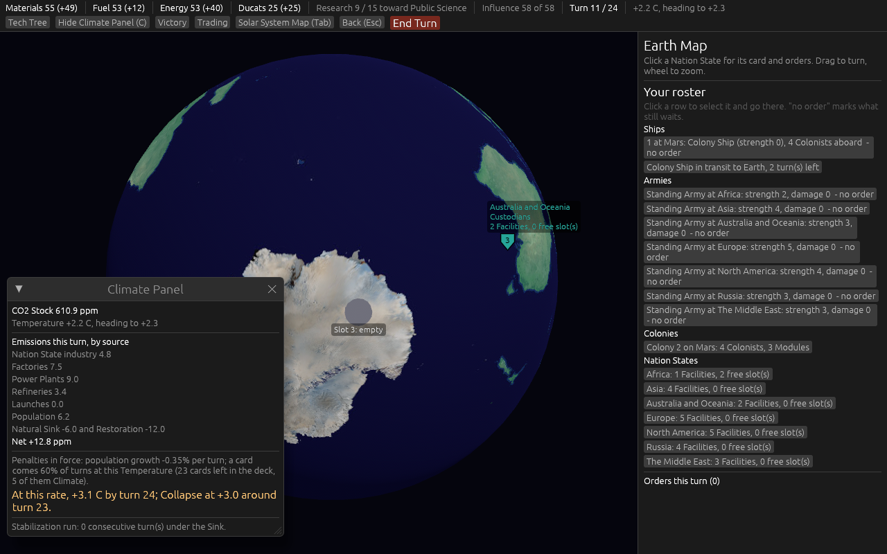
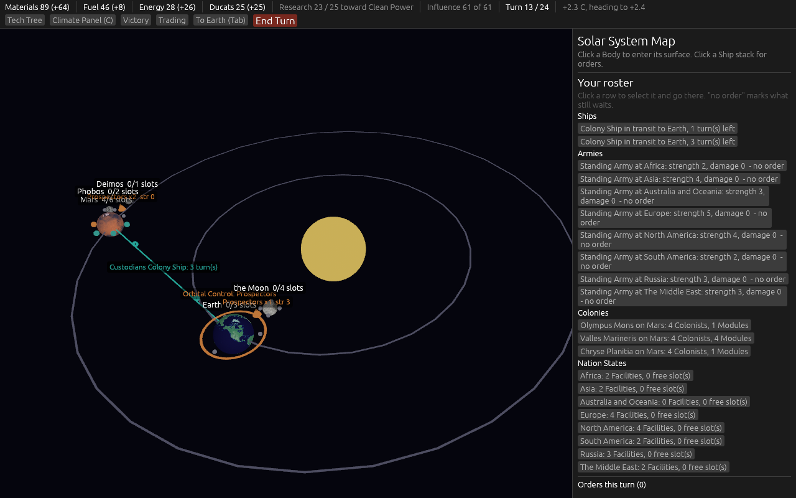
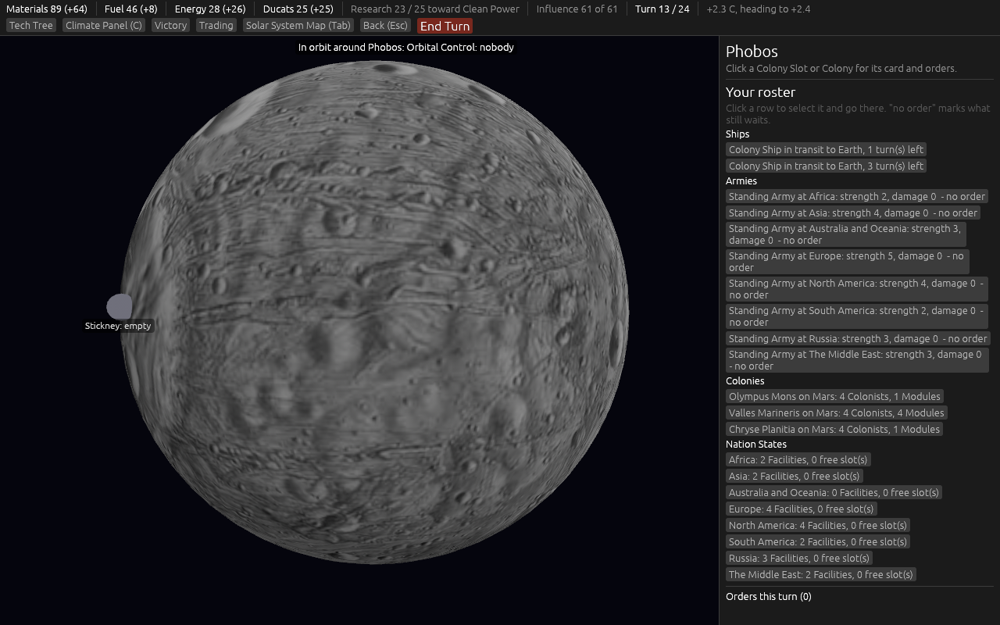
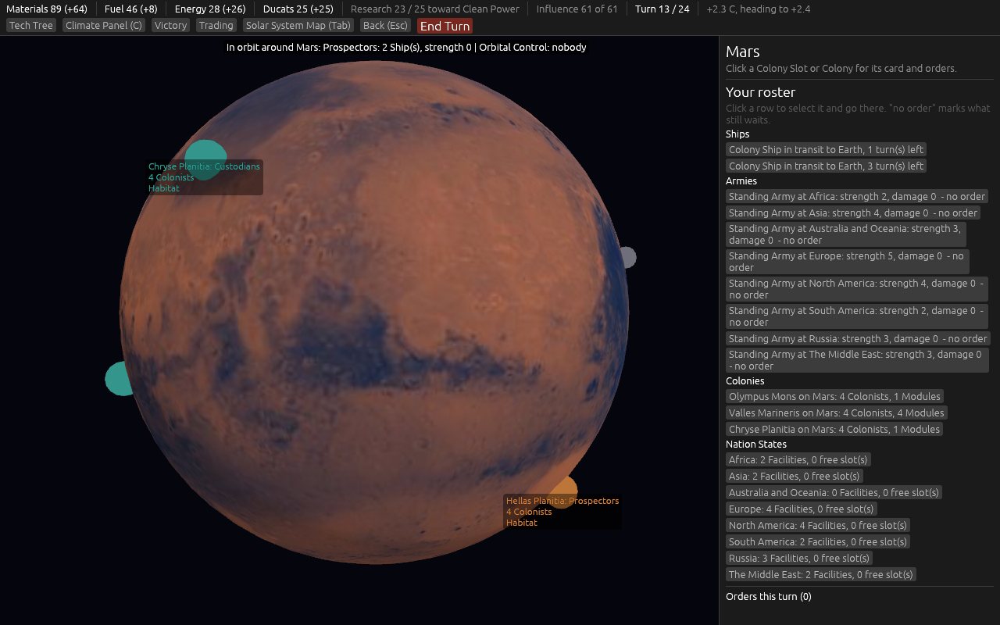

# 2026-09-09: version 0.04, ticket by ticket

Work on map [#40](https://github.com/whaleyjoshua2/Dying-Earth/issues/40), on the branch `version-0.04`.

## #41: the 0.03 answers and two interface fixes

1. **A challenge margin.** A rival taking a controlled place needs a Standing of at least the
   controller's plus `challenge_margin` (10, in `influence.toml`), and at least the threshold as
   before. A neutral place still needs only the threshold. The AI aims for the same figure. The test
   was watched red first: 69 against a controller at 60 flipped Africa before the change and does
   not after; 70 does.
2. **Two Ducats for one.** A Restoration step (10 Energy) costs 20 Ducats and a repair point
   (5 Materials) costs 10, in `factions.toml` under `[ducats]`, the same 2-to-1 as bought Influence.
   The test was watched red first (two steps cost 20, not 40).
3. **The AI and the 0.03 buildings.** The first Embassy in a state and the first Relay at a Colony
   take the threat multiplier (x2) while the rival's Standing there is within the margin of the
   AI's own; a Relay waits for the Colony's first producer Module. Two other rules were tried and
   dropped after measurement, below.
4. **The Climate Panel comes back.** The top-bar button now reads "Hide Climate Panel (C)" or
   "Climate Panel (C)", the C key does the same, and a reopened panel returns to its home position
   at the bottom left, so a panel dragged off the picture and closed is not lost.
5. **The Tech Tree drawn as a tree.** Five columns for the five branches, a row per rung, a line
   from every Tech to each Tech that needs it (green once the source is done), boxes coloured done,
   under research, available or locked, the effect on hover, Pick on the available boxes when it is
   the player's pick.

### Twenty seeds, before and after

`cargo run -p dying-earth-engine --example sim -- 1 custodians prospectors --count=20`, the sim now
counting places that change hands by Influence and the four 0.03 buildings completed by either seat.

| batch | transfers per game | wins | collapses | buildings at the end | Banks / Trade Posts / Embassies / Relays, total |
|---|---|---|---|---|---|
| 0.03 AI, no margin (before) | 14.7 | 6 | 14 | 56 and 2 | 0 / 0 / 0 / 0 |
| 0.03 AI, margin 10 | 13.4 | 2 | 18 | 55 and 1 | 0 / 0 / 0 / 0 |
| 0.04 AI, margin 10 (after) | 12.3 | 3 | 17 | 44 and 2 | 0 / 0 / 40 / 0 |
| 0.04 AI, margin 10, Prospectors in seat 0 | 11.1 | 0 | 20 | 7 and 26 | 0 / 0 / 26 / 0 |

Every win is the Custodians' at turn 24 on the Colonists tiebreak; these games sit on the Collapse
line (+2.9 to +3.1 C at the end), so small changes move the win count.

**What the margin does.** In seed 1, Europe changed hands four times in the game before and twice
after: a place now flips after a push of two or three turns, and the bigger Allotment keeps it.
The seat 0 Custodians still take every Nation State by turn 12 in every seed, and the Prospectors
end with nothing on Earth; that was true before this ticket.

**Two AI rules tried and dropped.**

- *Ducats in the scarcity rule* (a Bank or Trade Post preferred while the seat cannot afford a step
  of bought Influence): the Custodians built a Bank on turn one in place of a Research Lab, and 4
  Ducats a turn buys 2 Influence, which never repays 25 Materials the way a Factory does. Twenty
  seeds: 0 wins, 32 buildings. Without it: 3 wins, 44 buildings.
- *An opportunity multiplier on the seat's most valuable place*: four Embassies a game, Relays at
  every new Colony before its first Mine (starving it), 0 wins.

**Why no Banks, Trade Posts or Relays.** A Bank or Trade Post is a plain producer at the base weight,
and a Factory or Mine at the same weight compounds while Ducats only buy Influence; the AI never
reaches them. A Relay needs the rival to press the AI's Colony, and the losing Prospectors never do.
The AI builds Embassies (two a game) where the rival presses a state it holds.

## #42: the trading window

Decided by the designer: the window sells Influence (2 Ducats), Materials (2), Fuel (3) and
Energy (1); a building can be bought outright for Ducats at twice its Materials cost; the window
buys Materials and Fuel back at half the buying price; no caps.

- **Four new orders**: Buy, Sell, and a Facility or Module "with Ducats". A purchase is a negative
  cost in the resource bought, so what is bought is spendable in the same turn's orders with no
  special case in `remaining`; a sale is the mirror, with a negative Ducat cost, rounded down over
  the lot (2 Fuel sell for 3 Ducats). A building bought for Ducats has the legality of the Materials
  form and takes a build slot like it. Five prices in `factions.toml` under `[ducats]`.
- **The window**: a Trading button in the top bar; one row per line with the price, a quantity, Buy
  and Sell; the trades pending this turn listed under it. The Buy Influence button left the state
  card for the window, and the top bar shows "Influence 40 of 32 (22 free + 10 bought)" once any is
  bought. Every build button on a state or Colony card has an "or (40 Ducats)" beside it.
- **The AI** buys Materials in lots of ten while Materials are its scarcest resource, at a
  producer's weight; it does not sell.

Three tests watched red first (they did not compile without the orders): the prices and the
same-turn spend, the building for Ducats and its build slot, the sale at half.

**Twenty seeds** (Custodians in seat 0): wins 3, transfers 13.2 a game, buildings at the end 60
(44 on #41): the Custodian AI bought Materials fourteen times in seed 1 and built more. With the
Prospectors in seat 0: 0 wins, as on #41.

## #43: Colony Ship and Carrier

Decided by the designer: two ships. A Colony Ship carries Colonists only; a new **Carrier**
(30 Materials, 1 turn, 2 Energy upkeep, strength 0, 4 Hit Points, Pursuit 0) carries one Army and
nothing else; a Battleship fights and carries no Army, so every landing needs a Carrier.

- `units.toml` gained the Carrier's row and the Colony Ship and Battleship lost `carries_army`; the
  Load order already refused cargo a card does not carry, so the rules followed the data.
- The Carrier is in every Ships list, the roster, the stack card and the Solar System Map through
  the shared unit list.
- The AI builds a Carrier at Earth when it has a free Army, a rival Colony to land on and no empty
  Carrier already; an empty Carrier away from Earth goes home; warships no longer offer to load.
- A test watched red first (it did not compile without the Carrier): a Colony Ship and a Battleship
  refuse an Army, a Carrier takes one and refuses Colonists, and the card's six numbers. The
  scripted landing anchor now lands its two Armies from two Carriers and still passes.

**Finding, not retuned:** the Prospector AI has never built an Army in any batch this version or the
last, so it has never loaded or landed one, with a Battleship before or a Carrier now. Twenty seeds
in both orders give the same numbers as #42.

## #44: Antarctica

Decided by the designer: Antarctica becomes Colony Slots on Earth, three of them with Mine 1.0,
Generator 0.75, Refinery 1.5 and Habitat 0.75; its Colonists live on Earth and count nothing
toward Off-world Presence; its Modules emit as Facilities do.

- **It leaves the Nation State list**: eight remain. The Earth mask keeps Antarctica's painted value
  and the window maps it to no state, so the ice stays as painted, untinted and unbrowned.
- **Earth has three Colony Slots** at the Peninsula, the interior and Wilkes Land, founded from a
  Colony Ship at Earth with no transit through the same Unload order as the Moon. Slot markers,
  labels and clicks come through the same code as the other Bodies; a click in Antarctica finds the
  nearest slot first, then the state under it. The Solar System Map reads "Earth 0/3 slots".
- **Colonists there live on Earth**: Presence, the twelve-Colonist condition and the tiebreak skip
  Colonies on Earth.
- **Modules there emit**: `earth_emissions` in `modules.toml` (Mine 1.0 as a Factory, Generator 1.5
  as a Power Plant, Refinery 1.5), on the Climate Panel's Factories, Power Plants and Refineries
  lines, with the Clean techs and the Faction multiplier applying. Off Earth a Module still emits
  nothing.
- **The AI** founds there at half weight and no gap; in twenty seeds it never did, since a loaded
  Colony Ship always has a transit first.

A test watched red first (Earth had no slots): the slots and yields, eight states, a Colony there
adding to the three emission lines while its Colonists count nothing, a Moon Mine adding nothing.
The shot aid `look:<lon>,<lat>` turns every surface picture to face a point.

Twenty seeds in both orders give the same numbers as #43.

## #45: Phobos and Deimos, and every slot a named place

Decided by the designer: both moons, small and different; one turn and 2 Fuel from Mars, five turns
and 24 Fuel from Earth, one turn and 1 Fuel between them; their Colonists off Earth; real maps on
spheres. And, added on the same answer: **every Colony Slot in the system is a real geological place
on its Body, at its approximate position, and a Colony takes its name.**

- **Two Bodies more** in `bodies.toml`, five in all. Phobos: two slots, Mine 1.75, Generator 0.75,
  Refinery 0.5, Habitat 0.5. Deimos: one slot, Mine 1.0, Generator 1.0, Refinery 0.25, Habitat 0.5.
- **Reach** is a rule over the cards now: a Body with a `parent` is that Body's satellite and the two
  are `local_turns` and `local_fuel` apart; two satellites of one parent are the file's
  `sibling_turns` and `sibling_fuel` apart; Earth and the Moon reach anything at its own card's
  figures; anything else is the farther card. The Moon is Earth's satellite (1 turn, 6 Fuel), so
  Earth to Mars stays 4 and 20 and Moon to Mars too.
- **Named slots.** `colony_slots` became a `slots` list of `{ name, lon, lat }`, read by the window
  for every marker, label and click, and by the engine for a Colony's name: the roster reads
  "Olympus Mons on Mars", the log "found a Colony at Tycho on the Moon". The Moon: Mare
  Tranquillitatis, Mare Imbrium, Tycho, the South Pole-Aitken Basin. Mars: Olympus Mons, Valles
  Marineris, Chryse, Hellas, Isidis, Elysium. Antarctica: the Peninsula, Lake Vostok, the Ross Ice
  Shelf. Phobos: Stickney, Roche. Deimos: Swift.
- **Pictures**: the USGS Viking cylindrical map of Phobos and Philip Stooke's map of Deimos, both
  public domain, resampled to 1024 x 512 by `examples/prep_moons.rs`; both moons are potatoes in
  life and spheres here. On the Solar System Map they circle Mars close in, drawn far larger than
  life to be clickable.
- **The AI** weighs every Body but Earth when it picks where to send a Colony Ship; by yields Mars
  still wins for both Factions, so in twenty seeds nobody reached the moons.

Two tests watched red first (they did not compile without the Bodies and the slot list): the two
cards and nine transit pairs including the old ones; every slot named and on the globe, the first
name of each Body, and a Colony named for its slot.

Twenty seeds in both orders give the same numbers as #44.
