# 2026-09-09: version 0.05, ticket by ticket

Work on the 0.05 map, on the branch `version-0.05`.

## #50: four Factions in every game

The engine seats four Factions; this is the window catching up. Four cards at New Game, the rivals'
deeds kept apart per Faction in the Report, four-way Standings on every card, stack markers at four
angles round a Body instead of a left side and a right side, four Earth tints, the attack preview
against everyone present, and a Battle Report line per party.

Every picture below was taken headlessly with the game's own `shot:` mode
(`dying-earth.exe shot:<prefix> ...`, the window off-screen) and opened before it was written about.

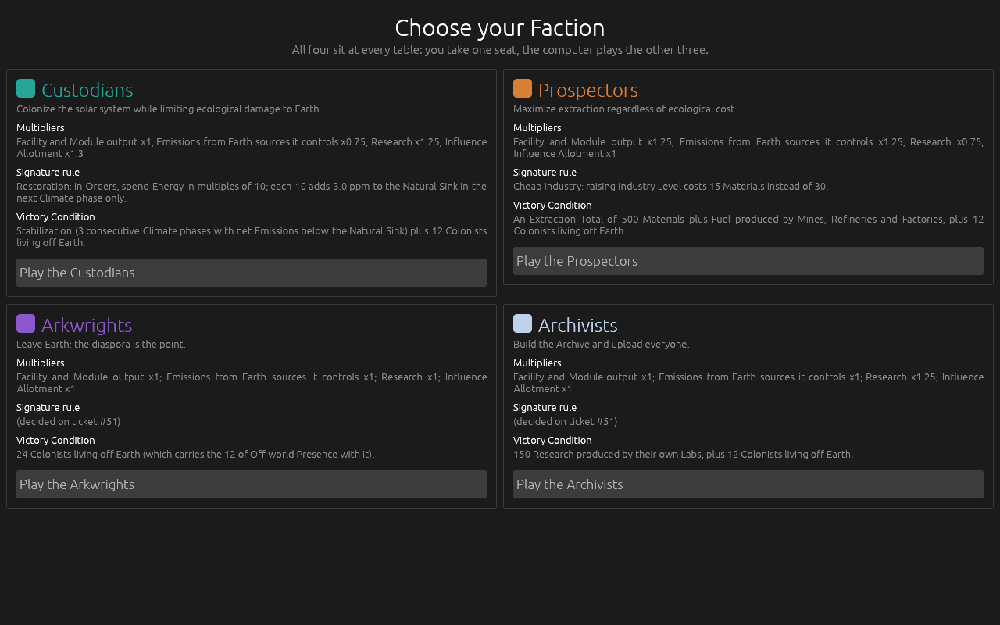

- **factions.png** — `shot:four turns:6`. The choice screen deals all four cards: Custodians (teal),
  Prospectors (orange), Arkwrights (violet), Archivists (pale silver-blue), each with its swatch,
  blurb, multipliers, signature rule and Victory Condition in words, and its own Play button.

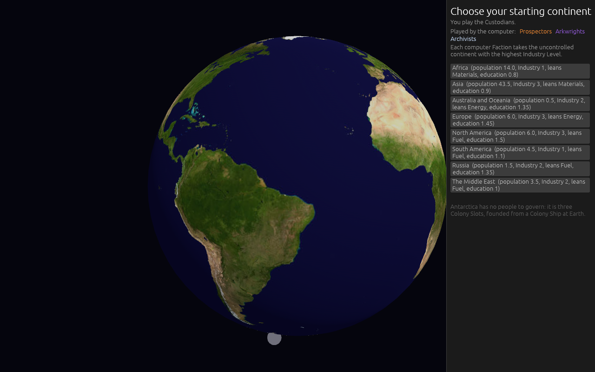

- **start-rivals.png** — `shot:st menus:1`. After the pick, the starting-continent screen names the
  three Factions the computer plays, in their own colours.

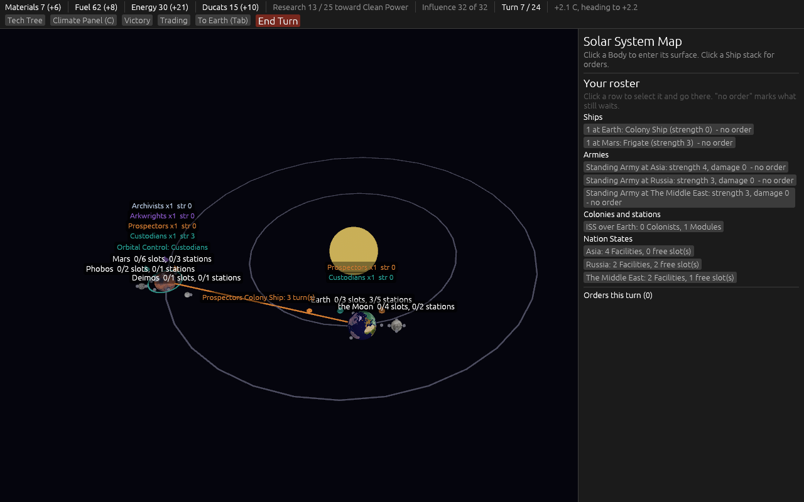

- **solar-four-stacks.png** — `shot:four turns:6`. Four Ship stacks at Mars, one per seat, marked at
  four fixed angles round the Body (left, right, above, below) with their labels stacked above it in
  seat order and coloured by Faction; "Orbital Control: Custodians" in teal above the Mars label.

- **mars-four-stacks.png** — `shot:four turns:6`. The band along the top of a Body Surface Map, which
  used to be one line: now one line per Faction present, in its colour, then Orbital Control in the
  holder's colour.

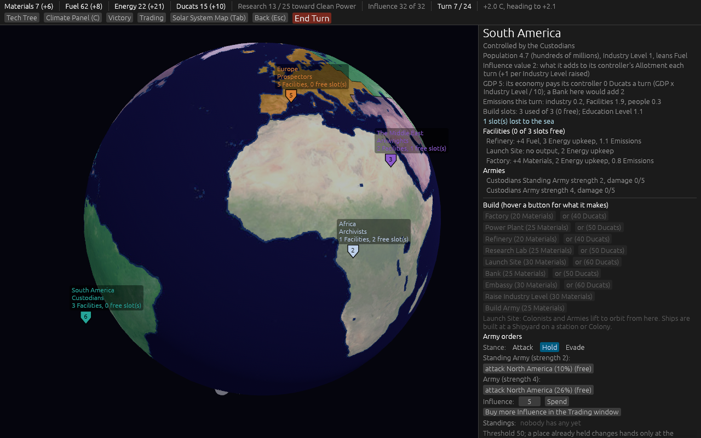

- **earth-four-tints.png** — `shot:tint2 turns:6 tints:1 look:-15,10 select:southamerica`. Four
  controllers, four tints: South America teal, Europe orange, the Middle East violet, Africa pale
  silver-blue. (`tints:1` is a building aid that hands one state to each seat; over twelve AI turns
  the Custodians usually hold everything, so a real board rarely shows four colours at once.)

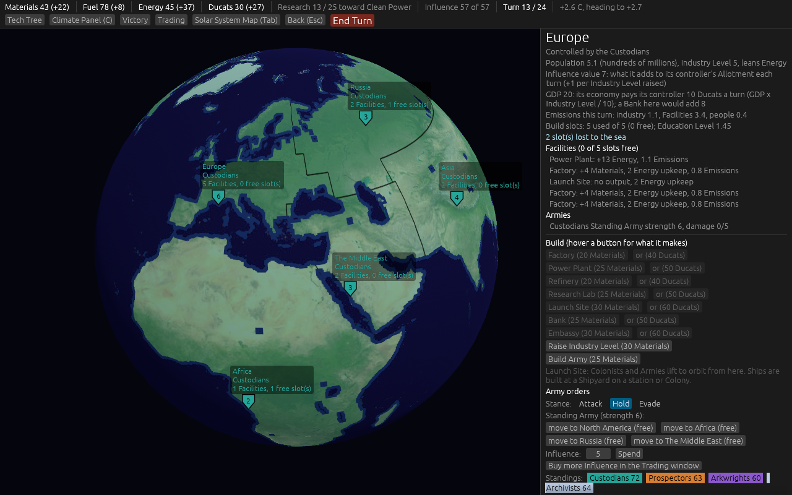

- **standings-four-chips.png** — `shot:stand turns:12 select:europe look:20,35`. The Standings line
  on a Nation State card: a chip per seat with a Standing, in Faction colours, then the threshold and
  the challenge margin.

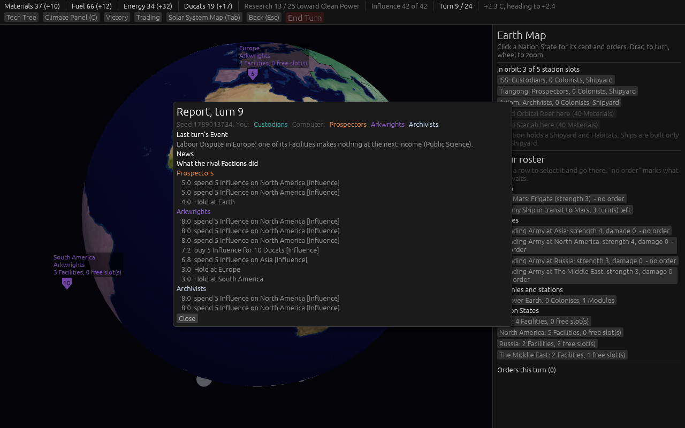

- **report-rivals.png** — `shot:rep menus:1 turns:8`. The Report names the table ("Seed ... You:
  Custodians. Computer: Prospectors, Arkwrights, Archivists", each in its colour) and lists what each
  rival Faction did under its own coloured heading. Empty sections are left out.

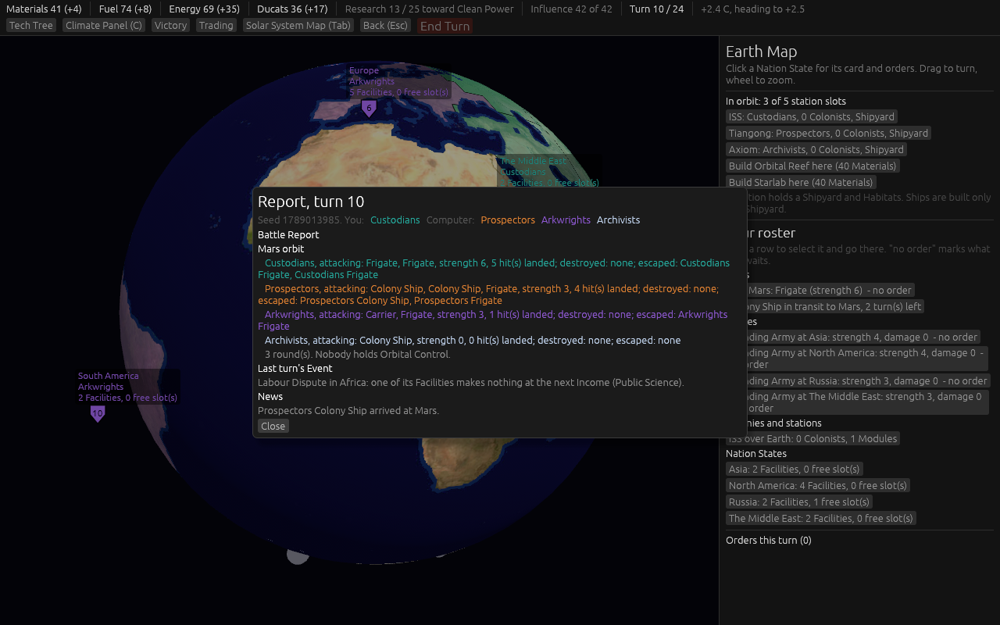

- **battle-four-parties.png** — `shot:bat menus:1 turns:8 battle:1`. A Battle is a melee now, so the
  Battle Report gives the place, then a line per party in its Faction's colour with its units,
  strength, hits landed, losses and escapes, then the result. Four parties here: the Custodians
  attacking, the Prospectors, the Arkwrights and the Archivists. (`battle:1` is a building aid that
  sends everyone's Ships to Mars and orders the attack, since the AI rarely stages a four-way fight.)

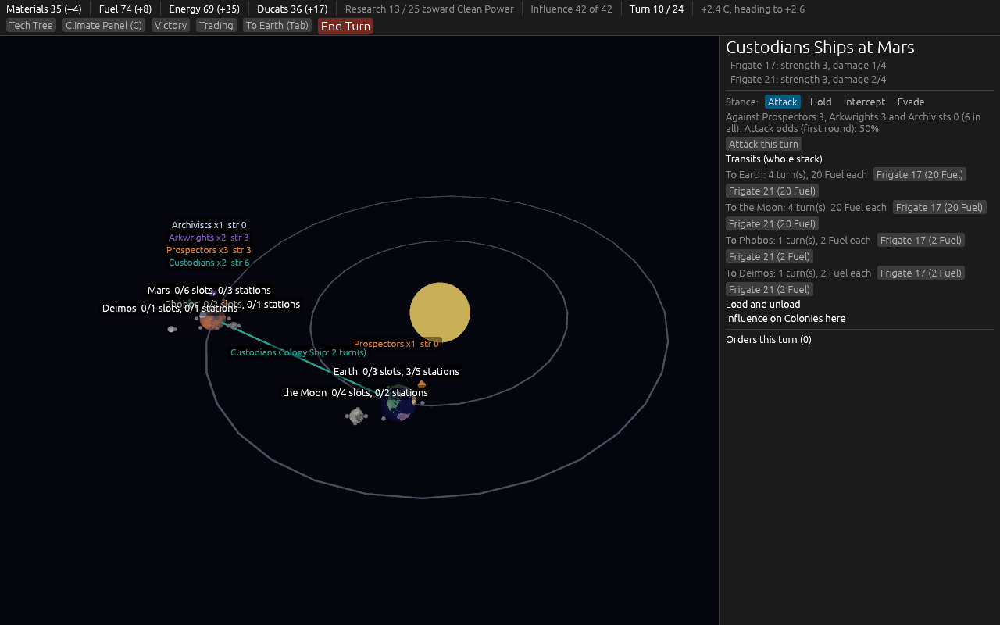

- **attack-preview.png** — `shot:stk turns:8 battle:1 stack:1`. The stack card's attack preview names
  every Faction with Ships at the Body and its strength, then the total and the first-round odds,
  because an attack there is a melee against all of them at once.

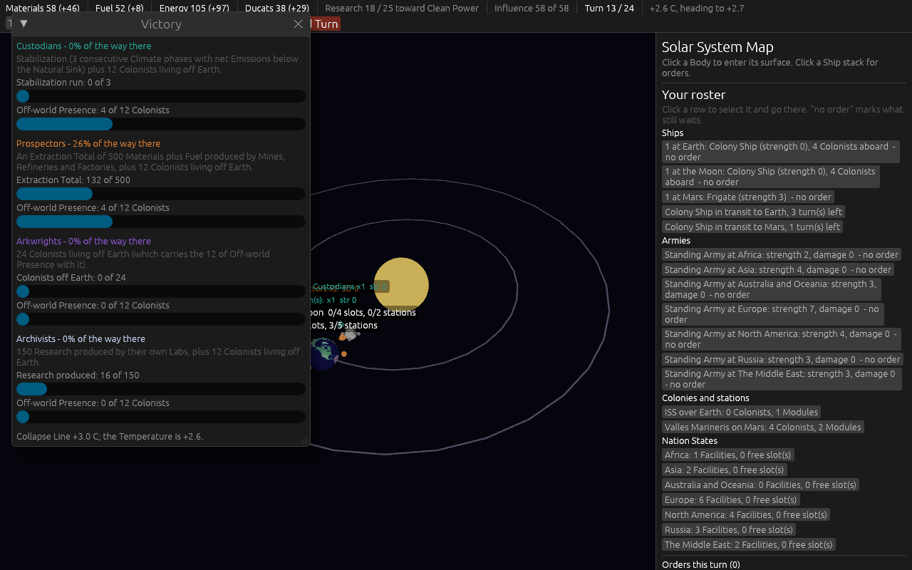

- **victory-four-rows.png** — `shot:vic turns:12 victory:1`. The Victory panel: a row per seat in
  seat order, the Faction name and its percentage in its colour, the Victory Condition in plain
  words, then the two bars.

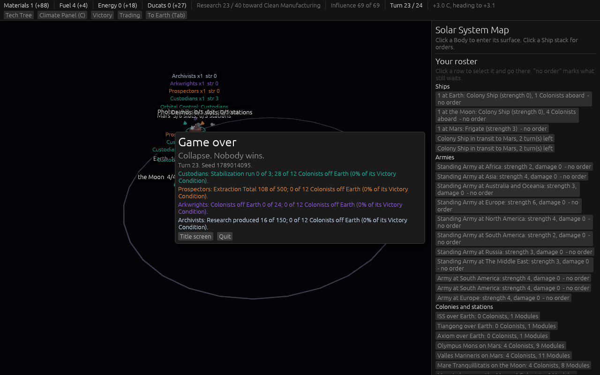

- **game-over-four-rows.png** — `shot:over turns:24`. The game-over modal names the outcome (a
  Collapse in this seed), the turn and the seed, then a row per Faction in its colour with its
  measure and its percentage. Where a Faction wins, the same line names it ("The Custodians win:
  ...").

### The climate clock for four seats

Added to the ticket by the designer. `engine/examples/sweep.rs` now takes `--player=` (the Faction
in seat 0), `--start=` (its Nation State), `--sinks=` and `--steps=`, twenty seeds per cell, and
reports collapses, the collapse turns, the end temperature and the wins by seat. The sim always
starts seat 0 in Asia unless told otherwise; the AIs spread from there by the ticket's rule.

**What the sweep found.** The clock is decided by who holds Asia (population 43.5, a third of the
world's people). A Prospector there at the old step of 90 collapses the world on turn 13 in every
seed; a Custodian there never collapses at any step above 90. No single step reproduces the 0.02
target (collapse in most seeds between turns 15 and 21) for every seating, so the step was chosen
to keep every seating hot at the end rather than to hit one figure.

Seat 0 the Prospectors, starting in Asia:

| sink | step | collapses | collapse turn (median, range) | end temp (median) | wins by seat |
|---|---|---|---|---|---|
| 6 | 90 | 20/20 | 13 (13..13) | +3.06 | 0 0 0 0 |
| 6 | 120 | 20/20 | 17 (16..18) | +3.04 | 0 0 0 0 |
| 6 | 150 | 20/20 | 19 (19..21) | +3.02 | 0 0 0 0 |
| 6 | 160 | 20/20 | 20 (20..21) | +3.02 | 0 0 0 0 |
| 6 | 170 | 6/20 | 24 (22..24) | +2.92 | 7 7 0 0 |
| 6 | 180 | 1/20 | 22 | +2.87 | 11 8 0 0 |
| 8 | 120 | 20/20 | 18 (17..18) | +3.05 | 0 0 0 0 |
| 8 | 180 | 1/20 | 23 | +2.80 | 15 4 0 0 |
| 10 | 150 | 1/20 | 21 | +2.84 | 10 9 0 0 |

Seat 0 the Custodians, starting in Asia:

| sink | step | collapses | collapse turn (median, range) | end temp (median) | wins by seat |
|---|---|---|---|---|---|
| 6 | 90 | 11/20 | 21 (18..23) | +3.01 | 9 0 0 0 |
| 6 | 100 | 11/20 | 23 (21..24) | +3.00 | 9 0 0 0 |
| 6 | 110 | 4/20 | 24 (21..24) | +2.88 | 16 0 0 0 |
| 6 | 120 | 0/20 | - | +2.56 | 20 0 0 0 |
| 6 | 150 | 0/20 | - | +2.30 | 20 0 0 0 |
| 7 | 90 | 10/20 | 22 (19..23) | +3.00 | 10 0 0 0 |
| 8 | 90 | 6/20 | 23 (21..24) | +2.96 | 14 0 0 0 |

Seat 0 starting in Europe, sink 6 (an AI takes Asia):

| seat 0 | step | collapses | collapse turn (median, range) | end temp (median) | wins by seat |
|---|---|---|---|---|---|
| Custodians | 90 | 20/20 | 13 (13..14) | +3.04 | 0 0 0 0 |
| Custodians | 120 | 20/20 | 18 (17..20) | +3.02 | 0 0 0 0 |
| Custodians | 150 | 13/20 | 23 (21..24) | +3.00 | 1 6 0 0 |
| Prospectors | 120 | 4/20 | 24 (21..24) | +2.88 | 0 16 0 0 |
| Prospectors | 150 | 0/20 | - | +2.69 | 0 20 0 0 |
| Arkwrights | 120 | 1/20 | 21 | +2.80 | 0 19 0 0 |
| Archivists | 120 | 0/20 | - | +2.40 | 0 20 0 0 |

**Chosen: `ppm_step = 120`, the Natural Sink unchanged at 6.0** (`climate.toml`). At 120 a
Prospector in Asia collapses the world on turns 16 to 18, a Custodian starting outside Asia on
turns 17 to 20, and every other seating ends between +2.4 and +2.9 C with a collapse in a seed or
two. At 150 half the seatings finish comfortable. The step is re-swept on the build ticket once the
climate tickets (Mothball, per-person Emissions, Scrubbers, Blame, neutral development, Tipping
Points) are in, since each of them moves it.

**The four-way balance, as measured, not fixed.** In every seating the seat that ends up holding
Asia wins, and it is the only seat that ever wins: the Custodians 20 of 20 from Asia, the
Prospectors 16 to 20 of 20 when the Custodians start elsewhere; the Arkwrights and the Archivists,
on provisional cards, have not won a game. Every win is on the last-turn score or the Colonists
tiebreak; no Faction has met its Victory Condition outright. The Custodian AI still takes every
Nation State by Influence when it starts in Asia, so the other three seats end with nothing to
build in (buildings 41, 0, 0, 0 in seed 19). No Battle happened in any logged AI game: the melee
is proven by the formula tests and the `battle:1` shot aid, not by the AI.

Twenty seeds at the chosen step:

| seating | wins | collapses | median collapse turn | median first Colony |
|---|---|---|---|---|
| Custodians in Asia | Custodians 20 | 0 | - | 10 |
| Prospectors in Asia | none | 20 | 17 | 9 |

## #51: the Arkwrights and the Archivists

Ticket #50 seated the two new Factions on provisional cards. This ticket gives them real ones. The
**Arkwrights** get Steerage (a Colony Ship that carries 8, 12 with Expanded Habitats, for 20
Materials, at twice the population per Colonist lifted), Habitats that hold half again, transits at
three quarters of the Fuel, half-price Space Stations and three-quarter-price Colony Modules to make
up for starting with no station, and **Diaspora**: 30 Colonists off Earth spread over at least three
Bodies with 4 on each. The **Archivists** get **the Archive**, the first **Project**: four stages, each
30 Materials and 20 Research and two turns, at one Colony off Earth, 12 Energy to run once complete,
destroyed if its Colony changes hands; **Fund the Archive** diverts a turn's Lab Research out of the
shared Tech into the Archive fund; and **Provisional Findings** gives them half the effect of the Tech
under research on every turn after one where they contributed to it.

The second half of a Victory Condition is now a Faction figure like the first (`victory_second` on
the card): Off-world Presence for the Custodians and the Prospectors, Bodies settled for the
Arkwrights, Colonists at the Archive for the Archivists.

Every picture below was taken headlessly with the game's own `shot:` mode
(`dying-earth.exe shot:<prefix> ...`, the window off-screen) and opened before it was written about.

- **factions.png** — `shot:f51`. Re-taken with the finished cards. The Arkwrights carry a second
  multiplier line of their own (Habitat capacity x1.5, transit Fuel x0.75, Colony Ship capacity x2,
  population per lifted Colonist x2, a Colony Ship 20 Materials, a Space Station x0.5, a Colony
  Module x0.75), then Steerage, then Diaspora in words. The Archivists carry Provisional Findings and
  "Complete the Archive and keep it running, with 12 Colonists living at its Colony to be uploaded."

- **archive-colony-card.png** — `shot:arch52 player:archivists archive:2 turns:4`. The Colony card for
  an Archivist player: the Archive reads as a Project rather than a yield ("The Archive: stage 2 of
  4, building, 1 turn(s) left"), then its own block with "Archive fund 14 of 20", the "Fund the
  Archive this turn" toggle, and "Build stage 4 (30 Materials, 20 Research)", greyed because 14
  banked Research is not the 20 a stage wants. (`player:<faction>` and `archive:<stage>` are new
  building aids: the AI Archivist has never yet held a Colony off Earth to build one at, see below.)

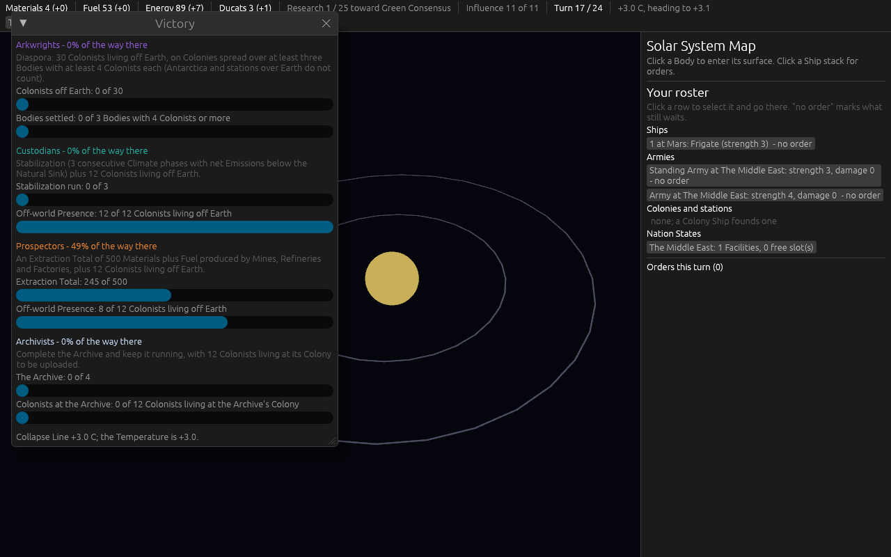

- **victory-diaspora.png** — `shot:vic52 player:arkwrights victory:1 turns:16`. The Victory panel now
  reads both halves off each card. The Arkwrights' row: "Colonists off Earth: 0 of 30" and "Bodies
  settled: 0 of 3 Bodies with 4 Colonists or more". The Archivists': "The Archive: 0 of 4" and
  "Colonists at the Archive: 0 of 12". Both at zero here, which is the honest state of the AI at turn
  17 of this seed rather than a fault in the counters; the counters themselves are pinned by the
  formula tests.

### Twenty seeds

`cargo run --release -p dying-earth-engine --example sim -- 1 --count=20`, seat 0 starting in Asia:

| seat 0 | wins | draws | collapses | median collapse turn | median first Colony |
|---|---|---|---|---|---|
| Arkwrights | none (0 0 0 0) | 0 | 20/20 | 16 | 14 |
| Archivists | none (0 0 0 0) | 0 | 20/20 | 17 | 13 |
| Custodians | Custodians 19 | 0 | 1/20 | 24 | 11 |

`cargo run --release -p dying-earth-engine --example sweep -- 20 --start=europe --sinks=6 --steps=120`:

| seat 0 | collapses | collapse turn (median, range) | end temp (median) | wins by seat |
|---|---|---|---|---|
| Arkwrights | 0/20 | - | +2.88 | 0 20 0 0 (the Custodians, in Asia) |
| Archivists | 15/20 | 21 (18..24) | +3.01 | 0 2 3 0 (Custodians 2, Prospectors 3) |

**What the twenty seeds say, as measured, not fixed.** Neither new Faction has won a game and neither
has completed its Victory Condition. Across all sixty logged games the words "funding the Archive"
and "stage of the Archive" appear **not once**: the AI Archivist funds only once it holds a Colony
off Earth (the ticket's rule), and in every seating where it does not own Earth it never gets one, so
the fund never starts. The Arkwrights end with 0 Colonists off Earth in every Asia seed. The picture
from #50 has not changed: whoever holds Asia wins, and the other three seats finish with nothing to
build in (buildings 70, 0, 0, 4 in seed 1 of the Custodian seating). Nothing was re-tuned on this
ticket; these are the figures as they came out.

### After the build: the AI learns to play the two new Factions

Two AI gaps showed up in the first twenty seeds and were fixed on the same ticket, each seen red
first in `engine/tests/formulas.rs`:

- **The AI never ordered a station over Earth**, because the 0.04 rule only built a station over a
  Body where the seat already had a producing Colony. A Faction that starts without a station (the
  Arkwrights) could therefore never build a Ship. Over Earth the foothold is now a Nation State with
  a working Launch Site, and while the seat has no Shipyard anywhere the first station takes the
  opportunity multiplier. Test: `an_ai_with_no_station_over_earth_orders_one_from_its_launch_site`.
- **The Archivist AI funded the Archive only once it held a Colony off Earth**, which in every
  seating it never did. It now funds from turn one; only the stage needs the Colony. Test:
  `the_archivist_ai_funds_the_archive_before_it_holds_a_colony`.
- **Archive stages are built one at a time** (the builder had let a second stage queue behind the
  first, which made "four stages of two turns" six turns rather than eight). Test: the stage test
  now refuses a second order while one is building.
- The Archivists' `build_warship` weight is 1: they spend on the Archive and Colony Ships.

Twenty seeds afterwards, seat 0 starting in Asia:

| seat 0 | wins | collapses | median collapse turn | seat 0's Colonists off Earth (seeds 1 to 6) |
|---|---|---|---|---|
| Arkwrights | none | 20 | 19 | 24, 16, 16, 16, 16, 16 |
| Archivists | none | 20 | 20 | 0, 0, 0, 0, 0, 0 |

**The Arkwrights now play their Faction**: Orbital Reef, a Shipyard, six Colony Ships of twelve,
Mars Colonies of twelve Colonists, 16 to 24 Colonists off Earth by the Collapse on turn 19; they
would reach 30 around turn 22 if the world lasted. **The Archivists cannot yet**: at output x0.8
their one state pays 4 Materials a turn, they lose Asia to Influence around turn 9, and in sixty
games no Archive stage was ever raised (the fund fills to 80 with nowhere to spend it). That is the
card's economy, not the AI, and it is recorded on the map as a balance finding for the designer.
Starting in Europe the Archivists collapse 6 of 20 games and the Custodians win 14.

## #52: Unrest, Occupation and refugees

Every Nation State now carries **Unrest**, an integer 0 to 10 on its card and in `nation_states.toml`
(every state starts at 0; every number that moves it lives in the new `assets/data/unrest.toml`).
Heat, the sea, the three Climate cards, Occupation and arriving refugees raise it; it falls one on
its own in a turn nothing raised it, one per **Relief** order (10 Ducats on a state you direct), and
one a turn while a **Constabulary** stands there. Two of the four green Techs make every
climate-source rise one smaller and all four make it two, and a Constabulary damps climate and
refugee rises by one on top. At **4** the Standing Army stops replenishing, at **7** every Facility
there produces and emits at half, at **10** a controlled state **throws its controller off** and goes
neutral at 5 with every Standing kept. Neutral states track Unrest too but cap at 9, and a Faction
taking one by Influence inherits the figure. Occupation adds 3 when it begins and 1 a turn after, and
from Unrest 4 the occupier's Pacification gain is halved.

**Refugees.** When the heat takes a state's people, half of what it lost now moves to its neighbours
in proportion to their Industry Level instead of vanishing; when a Sea Level threshold fires, the
state loses 5% of its people per point of Coastal Exposure and half of those move the same way. What
arrives is added to the receiving state, so its Population Emissions and its Research weight follow,
and it raises that state's Unrest by one per half a person, at most three in a turn. **Resettle** (20
Ducats, once a turn per Faction) sends every flow leaving that Faction's states to one state of its
choosing and raises its Standing there by 5.

Every picture below was taken headlessly with the game's own `shot:` mode
(`dying-earth.exe shot:<prefix> ...`, the window off-screen) and opened before it was written about.

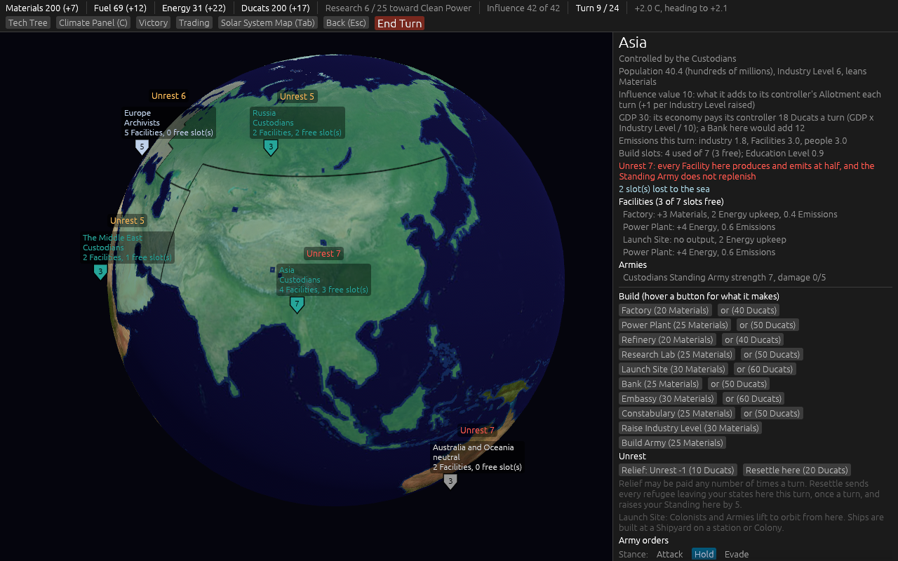

- **unrest-card.png** — `shot:u7 turns:8 unrest:7 select:asia look:95,30`. Asia at Unrest 7, the line
  on its card in red ("every Facility here produces and emits at half, and the Standing Army does not
  replenish"), the **Constabulary (25 Materials)** button in the build list beside the other seven
  Facilities, and an Unrest block with **Relief: Unrest -1 (10 Ducats)** and **Resettle here (20
  Ducats)**. The globe behind it carries the Unrest labels for five states. (`unrest:<n>` is a new
  building aid that spreads n, n-1 and n-3 over Asia, Europe and Africa and hands seat 0 room and
  money, since the AI seldom leaves a state of the player's this restive with slots to spare.)

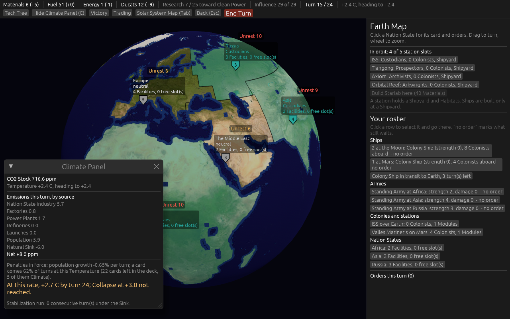

- **earth-unrest-labels.png** — `shot:lab turns:14 look:20,25`. The Earth Map label carries "Unrest
  N" above a state's name once it is 4 or more, amber to 6 and red from 7. Five states are labelled
  here without any building aid at all: Russia 10, Asia 9 and Africa 10 in red, Europe and the Middle
  East at 6 in amber. Europe already reads "neutral": it threw its controller off two turns earlier.

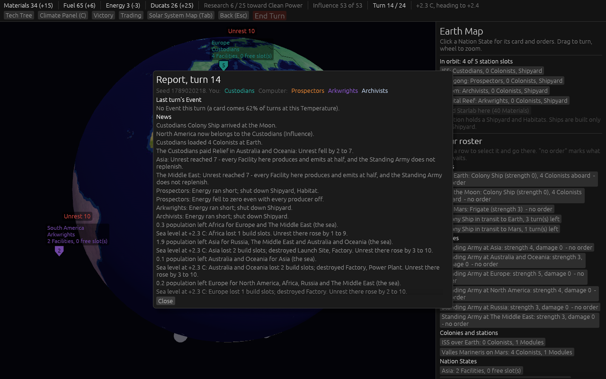

- **refugees-report.png** — `shot:r13 menus:1 turns:13`. The Report reads the whole system in one
  screen: "The Custodians paid Relief in Australia and Oceania: Unrest fell by 2 to 7", two states
  crossing the second threshold ("Asia: Unrest reached 7 - every Facility here produces and emits at
  half..."), the refugee flows in words ("1.9 population left Asia for Russia, The Middle East and
  Australia and Oceania (the sea)"), and the Sea Level lines with the Unrest they cost ("Sea level at
  +2.3 C: Asia lost 2 build slots; destroyed Launch Site, Factory. Unrest there rose by 3 to 10").

### Twenty seeds

`cargo run --release -p dying-earth-engine --example sim -- 1 --count=20`, seat 0 starting in Asia:

| seat 0 | wins | draws | collapses | median collapse turn | median first Colony |
|---|---|---|---|---|---|
| Custodians | Arkwrights 20 (seat 2) | 0 | 0/20 | - | 10 |
| Prospectors | Prospectors 2 | 0 | 18/20 | 24 | 9 |

`cargo run --release -p dying-earth-engine --example sweep -- 20 --player=custodians --start=europe --sinks=6 --steps=120`:

| seat 0 | collapses | collapse turn (median, range) | end temp (median) | wins by seat |
|---|---|---|---|---|
| Custodians in Europe | 17/20 | 24 (23..24) | +3.01 | 0 2 1 0 |

The Unrest statistics over the same twenty seeds:

| seating | states that threw off a controller | median peak Unrest | Constabularies built | Relief orders paid | population moved by refugees |
|---|---|---|---|---|---|
| Custodians in Asia | 776 | 10 | 0 | 478 | 187.6 |
| Prospectors in Asia | 810 | 10 | 0 | 566 | 261.5 |

**What the twenty seeds say, as measured, not fixed.** The rules as specified make Unrest a ratchet
rather than a pressure. From about turn 8 the population is falling worldwide every turn, so every
state takes +1 or +2 in every Climate phase and another +1 to +3 from the refugees its neighbours
send it; the falls available are one natural fall (which never lands, because something raised it
every turn), one per Relief order at 10 Ducats, and one a turn per Constabulary. Every state
therefore climbs to 10 and stays there: the median peak Unrest is 10 in every seed of both seatings,
and across twenty games states threw off a controller **776 and 810 times** — about forty a game on
eight states, so a state is taken by Influence, ratchets back to 10 and throws its Faction off again
every two or three turns for the second half of the game. The Custodian seating stopped collapsing
altogether (0 of 20, against 1 of 20 on ticket #51), because a world of neutral states has no
directed Facilities and so emits far less; the Arkwrights win all twenty on the last-turn score
instead. Nothing here was re-tuned: these are the ticket's numbers as they came out, and the knobs
that would settle it (`natural_fall`, `population_fall`, `refugees_per`, `constabulary_fall`,
`throw_off_reset`) are all one line each in `unrest.toml`.

**The AI built no Constabulary in any of the forty games**, though the rule and the weights are in
and pinned by a formula test. Two reasons, both measurable in the scored lists: the victory-gap
multiplier is x3 for most of a game and applies to producers but not to a Constabulary, so at
build_constabulary 4 to 6 against build_producer 6 to 8 x1.5 x3 it never wins a build slot; and by
the time Unrest reaches 5 the state usually has no free slot left. **Relief it pays readily** (478
and 566 orders), but only from Unrest 9, where the opportunity multiplier doubles it: below that it
loses to buying Influence with the same Ducats (relief 4 to 6 against influence 5 to 8 x0.9).

## #53: twelve Nation States, and Unrest as a pressure rather than a ratchet

Two tickets in one commit each, both asked for after the twenty seeds of #52 were read.

### The Unrest rebalance

#52 measured Unrest as a **ratchet**: every state climbed to 10 and stayed, and states threw off a
controller about forty times a game. The cause was the shape of the rule, not the size of the
numbers — the fall of 1 landed only in a turn nothing raised Unrest, and from about turn 8 something
raised it every turn, so nothing ever came down. The designer's fix, three parts:

- **The fall is 1.5 and lands every turn**, whatever else happened, by subtraction: a rise and the
  fall net out. The one turn a state goes without it is the turn it **changed hands** — a population
  with a fresh grievance is not calmed by the passing of a month. `changed_hands` is set wherever
  control actually moves (a transfer, an Occupation beginning or ending, a throw-off), and the
  Occupation turn counter ticking does not count as a change.
- **The climate and refugee rises are smaller**: a population fall 1.5 (2 when it is more than one
  per cent), a Sea Level slot 1 rather than 2, a Climate card 1.5 rather than 2, and the refugee cap
  2 rather than 3.
- **The green Techs now moderate arriving refugees as well as the climate**, which they did not on
  #52, and the damping is in halves: 0.5 for two Techs, 1.0 for four, 0.5 more for a Constabulary.

Unrest is no longer a whole number: it moves in halves, and the card and the map print the fraction
("Unrest 4.5"). Everything else about it — the thresholds at 4, 7 and 10, the neutral cap of 9,
Occupation's +3 and +1, the Unrest card's flat +3, Relief, Resettle and the Constabulary — is
unchanged from #52.

**What it did, over the same twenty seeds** (eight Nation States, so these compare like with like):

| seating | threw off a controller | median peak Unrest | Relief orders |
|---|---|---|---|
| Custodians in Asia, #52 | 776 | 10 | 478 |
| Custodians in Asia, #53 | 10 | 10.0 | 112 |
| Prospectors in Asia, #52 | 810 | 10 | 566 |
| Prospectors in Asia, #53 | 8 | 10.0 | 305 |

About half a throw-off a game instead of forty, and the median game still sees one state reach the
ceiling, so the drama is there without the board dissolving. The climate clock went back to the
shape #51 left it in: the Custodian seating won 19 of 20 again, and the Prospector seating collapsed
20 of 20.

### Twelve Nation States

Two new Factions need more places to go, and eight states made one of them — Asia, a third of the
world's people — decide every game. Ticketed as
[#63](https://github.com/whaleyjoshua2/Dying-Earth/issues/63).

- **Asia** becomes **East Asia** (China, Mongolia, the Koreas, Japan, Taiwan, Central Asia),
  **South Asia** (India, Pakistan, Bangladesh, Nepal, Sri Lanka, Afghanistan) and **South-East
  Asia** (Myanmar round to the Philippines and most of Indonesia).
- **Africa** splits at the Sahara into **North Africa** and **Sub-Saharan Africa**.
- **Central America and the Caribbean** is cut out of **North America**.
- **Antarctica stays off the list**: it is Earth's three Colony Slots, as version 0.04 made it.

Every split shares out its parent's real-world figures rather than inventing new ones, as ticket #26
did for Russia and the Middle East: Asia's 30 GDP becomes 23 + 4 + 3 and its Influence value 7
becomes 4 + 2 + 1; Africa's 3 and 2 become 2 + 1 and 1 + 1; North America's 25 and 8 become 23 + 2
and 7 + 1. **The world's totals are unchanged** — 34 Influence and about 7.9 billion people — so the
Influence economy plays as it did, pinned by
`twelve_nation_states_share_out_the_eight_they_came_from`. Central America is the map's first
**Size 1** state: two build slots and the lowest Influence threshold on the board, a small place
between two large ones.

The globe mask is derived from longitude and latitude rules in `examples/prep_assets.rs`, which now
takes `--mask-only` so the borders can be redrawn from the `earth.png` already in the tree without
the source JPEGs. Mask values were **appended** (10 North Africa, 11 South Asia, 12 South-East Asia,
13 Central America) rather than renumbered, so every old value still means what it meant and the map
can be split again the same way when a later version wants more states.

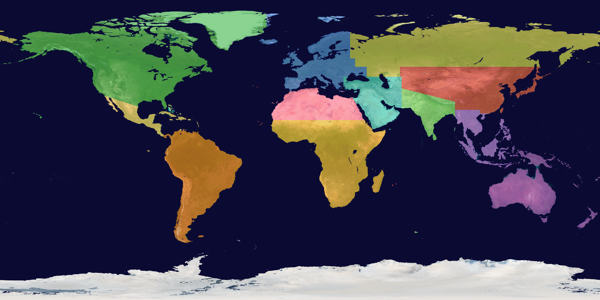

- **twelve-states-mask.png** — `cargo run --example prep_assets -- --mask-only preview.png`. The
  twelve regions as the mask paints them. The borders are lines of longitude and latitude, close
  enough for a globe drawn at 2048 by 1024: North Africa parts from Sub-Saharan Africa at 18 N, the
  Himalaya line slopes from 37 N at Iran's border to 29 N at the Burmese one, South-East Asia sits
  below 24 N (22 N past Hong Kong, so Taiwan stays with East Asia), and Central America runs below
  the United States border from San Diego to Brownsville, taking Cuba, Hispaniola and the Bahamas.
  They are a board, not an atlas.

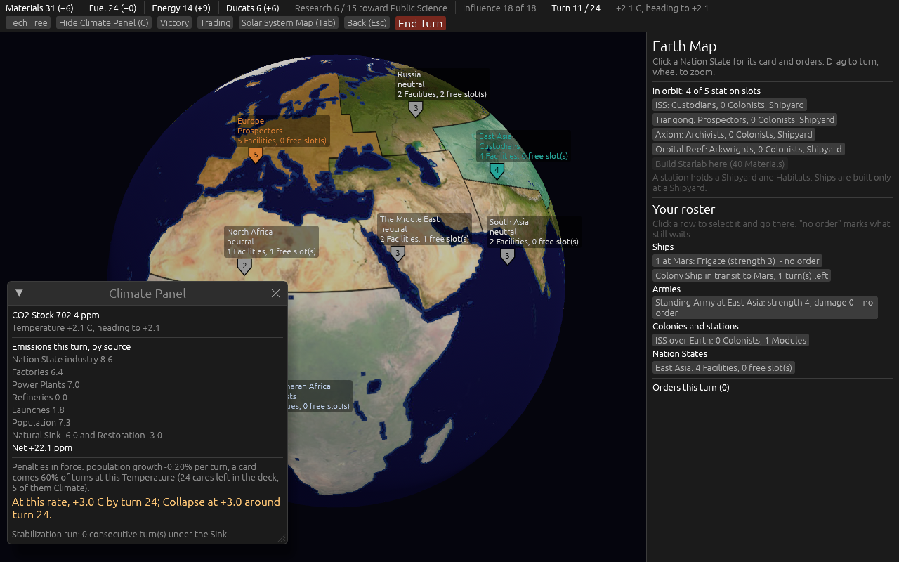

- **twelve-states.png** — `shot:tw turns:10 look:20,20`. The Earth Map with the twelve states drawn,
  outlined and labelled: the Sahara border across Africa, the Middle East between Europe and South
  Asia, and East Asia tinted for the Custodians. The Climate Panel shows what the bigger board costs
  — Nation State industry 8.6 a turn where eight states charged 6.0.

### The climate clock, re-swept

Twelve states raise total Industry Level from 17 to 23 and state industry Emissions from 6.0 to 8.4
a turn, with six more start Facilities on the board, so `ppm_step` was re-swept exactly as tickets
#26 and #46 re-swept it whenever the state list changed. Twenty seeds a cell.

| seat 0, start | step 120 | step 150 | step 170 | step 190 |
|---|---|---|---|---|
| Prospectors in East Asia | 20/20, turn 19 | 20/20, turn 22 | 14/20, turn 24 | 0/20, +2.90 |
| Custodians in East Asia | (collapsed by 21) | 1/20, turn 23 | 0/20, +2.74 | - |
| Custodians in Europe | - | 20/20, turn 23 | 10/20, turn 24 | - |

**Chosen: `ppm_step = 150`** (`climate.toml`; it was 120). At 120 every seating collapsed, including
the Custodian-in-East-Asia game that never collapsed at all on eight states. At 150 every seating
stays hot to the end — the two Prospector-ish boards collapse on turns 22 to 24 and a Custodian
holding East Asia survives 19 of 20 at +2.90 — which is what #46 chose its step for. At 170 half the
seatings finish comfortable.

Twenty seeds at the chosen step, on the twelve-state board:

| seat 0 | wins | collapses | median collapse turn | threw off a controller | Relief orders | population moved |
|---|---|---|---|---|---|---|
| Custodians in East Asia | Prospectors 19 (seat 1) | 1/20 | 23 | 0 | 34 | 226.0 |
| Prospectors in East Asia | none | 20/20 | 22 | 12 | 256 | 233.6 |
| Custodians in Europe (sweep) | none | 20/20 | 23 | - | - | - |

**What the twelve seeds say, as measured, not fixed.** The one-state-decides-it problem is gone:
holding East Asia is no longer holding a third of the world, and in the Custodian-in-East-Asia
seating it is now the **Prospectors** who win 19 of 20 from Europe and what they take around it,
where at eight states the Custodian in Asia won 19 of 20. That is the board the split was asked
for. The AI still builds no Constabulary — the same finding as #52, and for the same reason: the
victory-gap multiplier applies to producers and not to a Constabulary, so it never wins a build slot
while the gap is wide.

## #53: Blame and neutral development

Two rules that make the world answer back. **Blame** is the CO2 each Faction is answerable for over
the whole game: at every Climate phase the Emissions the Climate Panel attributes to the sources a
Faction controls — a controlled state's industry line, its Facilities and its Antarctic Modules, its
population line, and the Faction's own launches — are added to its emitted total, and whatever CO2 it
removed that turn (Restoration now; a Scrubber will join `Climate::removal_next` on its own ticket)
to its removed total. Blame is the difference, floored at zero. What no Faction controls is nobody's:
a neutral state's industry and people, and every Event card, are the world's doing. A Faction's share
of the four Factions' Blame, above a fair quarter, multiplies its Influence thresholds on every
Nation State it does not hold by `1 + (share - 0.25)`, floored at x1.0 and capped at x1.5
(`influence.toml`, `[blame]`). Never on a Colony or a Space Station, never on the challenge margin,
never on Standing decay, never on Pacification.

**Neutral Development** is what a Nation State nobody holds does for itself: every six turns of
unbroken neutrality it raises its own Industry Level by one, up to 4, and brings the first idle
Facility in its list online (`nation_states.toml`, `[development]`). The clock is the state's own and
runs from the turn it was last freed, so a state taken and then thrown off counts six fresh turns. A
world at +2.5 C or above develops nothing, and neither does a state whose Unrest has reached 7
(`may_develop`, the hook #52 left).

Every picture below was taken headlessly with the game's own `shot:` mode
(`dying-earth.exe shot:<prefix> ...`, the window off-screen) and opened before it was written about.

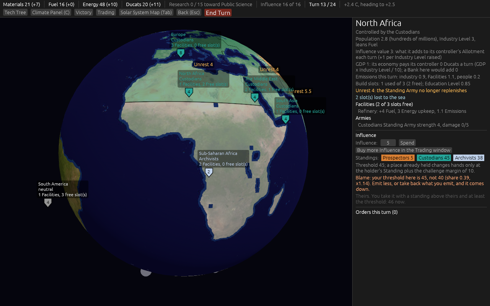

- **blame-card.png** — `shot:bcard turns:12 player:prospectors select:northafrica`. North Africa's
  card, seen by a Prospector player who does not hold it. The threshold line now reads the player's
  own figure, and the orange line under it says what a 0.39 share of the table's Blame is costing
  them here: 45 where a clean Faction would need 40. The line is omitted entirely at x1.00, so a
  Faction pulling its weight never sees it.

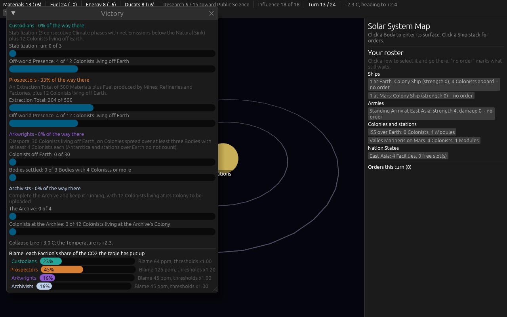

- **blame-victory-strip.png** — `shot:bvic turns:12 victory:1`. Under the four Victory rows, one bar
  per Faction in its own colour: the share as a percentage inside the bar, the Blame in ppm and the
  thresholds multiplier beside it. At turn 13 of this game the Prospectors carry 45% of the table's
  Blame on 125 ppm and pay x1.20 for it; the other three sit at or under a fair quarter and pay
  nothing.

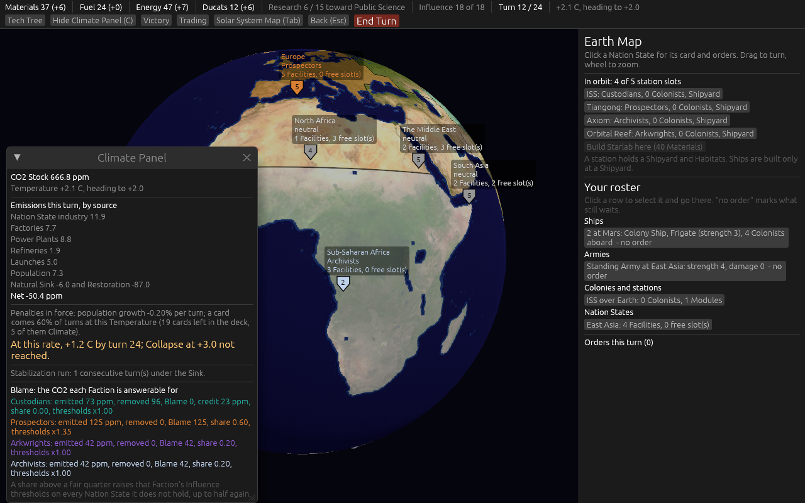

- **blame-climate-panel.png** — `shot:bcp turns:10 blame:1`. The Blame section sits under the
  Stabilization run, in the panel that attributes the Emissions in the first place: emitted, removed,
  Blame, share and thresholds, one line per Faction in its colour. `blame:1` is a building aid that
  has the Custodian player buy, in one turn, enough Restoration to take back more than it has emitted
  all game (the -87.0 ppm on the Restoration line), so the credit case is visible: **Custodians:
  emitted 73 ppm, removed 96, Blame 0, credit 23 ppm, share 0.00, thresholds x1.00**, against the
  Prospectors on Blame 125 and x1.35.

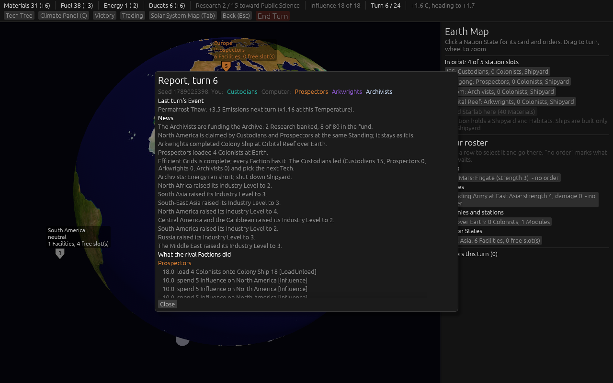

- **neutral-development-report.png** — `shot:ndev turns:5 menus:1`. The Report the player opens on
  turn 6, the first six-turn mark: eight neutral states raise their Industry Level in one Climate
  phase — North Africa to 2, South Asia to 3, South-East Asia to 3, North America to 4, Central
  America to 2, South America to 2, Russia to 3, the Middle East to 3. No line names a Facility, and
  that is a finding rather than a bug: see below.

### Twenty seeds

`cargo run --release -p dying-earth-engine --example sim -- 1 --count=20`, three seatings, plus
`sweep -- 20 --player=custodians --start=europe --sinks=6 --steps=150`. Nothing was re-tuned; these
are measurements.

| seat 0 | wins | collapses | median collapse turn | median turn of first Colony | Relief orders |
|---|---|---|---|---|---|
| Custodians in East Asia | none | 20/20 | 23 | 10 | 42 |
| Prospectors in East Asia | none | 20/20 | 21 | 10 | 213 |
| Arkwrights in East Asia | none | 20/20 | 21 | 9 | 187 |
| Custodians in Europe (sweep) | none | 20/20 | 21 (20..21) | - | - |

Blame at the end of each game, median over the twenty seeds, with the multiplier that share puts on
the seat's Influence thresholds.

| seat 0 the Custodians | median Blame | median share | median thresholds |
|---|---|---|---|
| Custodians (seat 0) | 88 | 0.22 | x1.00 |
| Prospectors (seat 1) | 191 | 0.47 | x1.22 |
| Arkwrights (seat 2) | 50 | 0.12 | x1.00 |
| Archivists (seat 3) | 76 | 0.18 | x1.00 |

| seat 0 the Prospectors | median Blame | median share | median thresholds |
|---|---|---|---|
| Prospectors (seat 0) | 178 | 0.30 | x1.05 |
| Custodians (seat 1) | 307 | 0.51 | x1.26 |
| Arkwrights (seat 2) | 45 | 0.08 | x1.00 |
| Archivists (seat 3) | 66 | 0.11 | x1.00 |

| seat 0 the Arkwrights | median Blame | median share | median thresholds |
|---|---|---|---|
| Arkwrights (seat 0) | 142 | 0.24 | x1.00 |
| Custodians (seat 1) | 317 | 0.53 | x1.28 |
| Prospectors (seat 2) | 78 | 0.13 | x1.00 |
| Archivists (seat 3) | 65 | 0.11 | x1.00 |

| seating | median neutral developments a game |
|---|---|
| Custodians in East Asia | 30 |
| Prospectors in East Asia | 20 |
| Arkwrights in East Asia | 18 |

**What the twenty seeds say, as measured, not fixed.** One Faction a game runs away with the Blame
and pays x1.20 to x1.28 for it; the other three sit at or under the fair quarter and pay nothing, so
the rule taxes the runaway rather than the table. Which Faction it is depends on **how much Earth it
holds, not on its Emissions multiplier**: the AI Custodians in seat 1, on a x0.75 multiplier, carry
the largest Blame in two of the three seatings (307 and 317 ppm) because they end up directing more
Nation States than anyone else, while the Prospectors' x1.25 only wins them the title when they also
hold the board. The cap is never reached in an AI game; the largest median share measured is 0.53.

Neutral development is **large**: 18 to 30 raises a game, and every clock starts on turn 1, so eight
neutral states develop together on turn 6, again on turn 12, and so on, in one visible pulse in the
Report rather than a trickle. That is exactly what "the clock runs from the turn the state was last
neutral, i.e. the game start" asks for, and it is worth the designer seeing what it looks like.

It also **costs the world its one habitable board**, and a control run says so plainly. Against the
same twenty seeds on #52/#63 the Custodian-in-East-Asia seating was the board that stayed liveable:
the Prospectors won 19 of 20 there and only one seed collapsed. It now collapses 20 of 20 with nobody
winning. Re-running that seating with `development_turns` set to 9999 — Blame in force, neutral
development off — returns it exactly to the old figures:

| Custodians in East Asia, twenty seeds | wins | collapses | median collapse turn | developments |
|---|---|---|---|---|
| #52/#63, before this ticket | Prospectors 19 | 1/20 | 23 | - |
| #53 as built | none | 20/20 | 23 | 30 |
| #53 with `development_turns = 9999` (control) | Prospectors 19 | 1/20 | 23 | 0 |

So **Blame changes no outcome on its own** — the control's Blame figures (91 / 202 / 53 / 80 ppm at
x1.00 / x1.23 / x1.00 / x1.00) are within noise of the built game's — and **neutral development
changes all of them**. Twelve states developing themselves up to Industry Level 4 is a great deal of
new industry no Faction ever chose to build, and it lands before anyone can reach their bar; the two
dirtier boards moved from a median collapse of 22 to 21 and the Europe sweep from 23 to 21 for the
same reason. Nothing was re-tuned here. If the designer wants that board liveable again,
`development_turns` (6) and `development_max_level` (4) are the two numbers to turn, and sweeping
them belongs on its own ticket.

**The idle-Facility clause fires almost never.** A neutral state's start Facilities are created
`online: true`, and a Facility nobody directs is already idle in the sense the Climate phase means
(it makes nothing and emits nothing), so "the first idle one in its list" finds nothing to wake in a
state that has never been held. It only bites on a state that was held, had a Facility shut down by
the Energy shortfall rule or a card, and was then thrown off. The formula test covers the clause with
such a state; no Report line in sixty games named a Facility. If the intent was that a neutral
state's Facilities should stand idle until the state develops itself — which is what the Climate
phase's own comment says about them — that is a change to how neutral states start, and the
designer's call.

### After the build: neutral states run what they wake, and the opening clocks are staggered

Two corrections on the same ticket, each seen red first:

- **"Brings one idle start Facility online" could never fire.** A neutral state's start Facilities
  are `online` from the first turn; they make nothing and emit nothing only because nobody directs
  them (ticket #24). Development now marks the woken Facility **self-run**: while the state stays
  neutral it emits at x1.0 (with the worldwide Clean Techs and the Unrest-7 halving applied) to
  nobody's Blame, and it makes nothing for anyone. Test: the development test asserts the Factory
  is self-run, that the world's Factory Emissions rise, and that no seat's Blame moves.
- **Every state neutral at the start shared one clock**, so on turn 6 eight states developed at
  once (pictured above, the turn-6 Report). The opening clocks are now staggered by the seed across
  the first development period, so first developments fall between turns 6 and 11. Test:
  `the_opening_neutral_states_do_not_all_develop_on_the_same_turn`.

Twenty seeds afterwards, seat 0 in East Asia: the Custodian seating collapses 20 of 20 (median
turn 19, 22 developments a game), the Prospector seating 20 of 20 (median 20, 14 developments).
Before neutral development the Custodian seating had one Collapse in twenty. Whether the six-turn
clock, the Industry Level 4 ceiling, or the +2.5 C stop moves is the designer's call, recorded on
the map.

**The designer's answer: a nine-turn clock** (`nation_states.toml`, `[development] turns = 9`),
ceiling 4, stop at +2.5 C, so a state steps at most twice a game. Twenty seeds afterwards, seat 0
in East Asia: the Custodian seating collapses 20 of 20 at a median turn 22 with 14 developments a
game; the Prospector seating 20 of 20 at a median 21 with 6. The step is re-swept on the build
ticket with every climate rule in.
