# 2026-09-10: version 0.05.5, ticket by ticket

Work on the 0.05.5 map ([issue #66](https://github.com/whaleyjoshua2/Dying-Earth/issues/66)), on the
branch `version-0.05.5`. Every picture below was taken headlessly with the game's own `shot:` mode
(`dying-earth.exe shot:<prefix> ...`, the window off-screen) and opened before it was written about.

## #67: thirty-six turns of two months

[The ticket](https://github.com/whaleyjoshua2/Dying-Earth/issues/67). The game runs thirty-six turns
of two calendar months, January 2030 to November 2035, named by the first month alone; every per-turn
figure stays per turn; the sky follows the calendar at sixty days a turn, so the Hohmann flight is
five turns and the game holds three Mars windows; the Tech costs stay; and `ppm_step` gets a
provisional re-sweep so the six tickets that follow measure a game that reaches its late turns.

### What moved

| file | figure | was | is |
| --- | --- | --- | --- |
| `victory.toml` | `turns` | 24 | 36 |
| `victory.toml` | `months_per_turn` (new) | 1 | 2 |
| `ephemeris.toml` | `days_per_turn` | 30 | 60 |
| `ephemeris.toml` | `max_turns` (the flight cap) | 18 | 9 |
| `climate.toml` | `ppm_step` | 180 | 270 (provisional) |

One rule changed with the calendar, a builder's call recorded on the ticket: a turn now spans two
months, over which the phase angle moves nearly thirty degrees, so a turn's window offset is the
nearest the angle comes to the Hohmann angle **anywhere in the turn**, zero when it crosses inside
the turn. Read at the turn's first instant alone, no turn would ever stand at the window and every
crossing paid a Fuel over the card (the first green run showed 21 for 20).

### The provisional sweep

The step alone, the Sink and the Breaks untouched, twenty seeds a cell.

| seat 0 | step | collapses | median Collapse turn (range) | end Temperature |
| --- | --- | --- | --- | --- |
| Prospectors in East Asia | 180 | 20/20 | 22 (20..23) | +3.03 |
| Prospectors in East Asia | 240 | 20/20 | 29 (27..32) | +3.02 |
| Prospectors in East Asia | **270** | **15/20** | **35 (32..36)** | **+3.02** |
| Prospectors in East Asia | 300 | 2/20 | 34 | +2.89 |
| Prospectors in East Asia | 360 | 0/20 | - | +2.58 |
| Custodians from Europe | 240 | 20/20 | 28 (26..32) | +3.02 |
| Custodians from Europe | **270** | **17/20** | **34 (31..36)** | **+3.01** |
| Custodians from Europe | 300 | 4/20 | 36 (35..36) | +2.93 |

270 chosen: three quarters of seeds collapse, late, and the world stays at +3.0 to the last turn.
There is nothing between 240 (everything collapses) and 300 (almost nothing does) but this cell.

### Twenty seeds at the chosen step

| seat 0 | wins | collapses | first Colony (median turn) | Mars system reached | Antarctic Colonies | Techs (median) | highest rung | Sea Walls |
| --- | --- | --- | --- | --- | --- | --- | --- | --- |
| Prospectors in East Asia | Custodians 5 (seat 1) | 15/20 | 10 | **20/20 seeds, median turn 11** | 32 | 2 | 2 | 0 |
| Custodians from Europe | Custodians 3 | 17/20 | 10 | **20/20 seeds, median turn 11** | 32 | 3 | 3 | 0 |

No Victory Condition was met outright in any seed; the wins are the last-turn ranking. Every Break
fired in every seed. Colonists off Earth at the end: median 28, all seats. Scrubbers 88 to 129,
Leapfrogs 425 to 434, Constabularies 100 to 133 a batch.

**The Mars system, unreachable in every 0.05 batch but one, is now reached in every seed**, at a
median turn 11, one window and one five-turn flight in. **Rung 2 arrives, and once rung 3**, where
0.05 never left rung 1 in six batches of eight. **The Sea Wall is still never built**, so Coastal
Engineering on rung 2 is still not reached in time; the Research ticket moves it to rung 1.

### Pictures

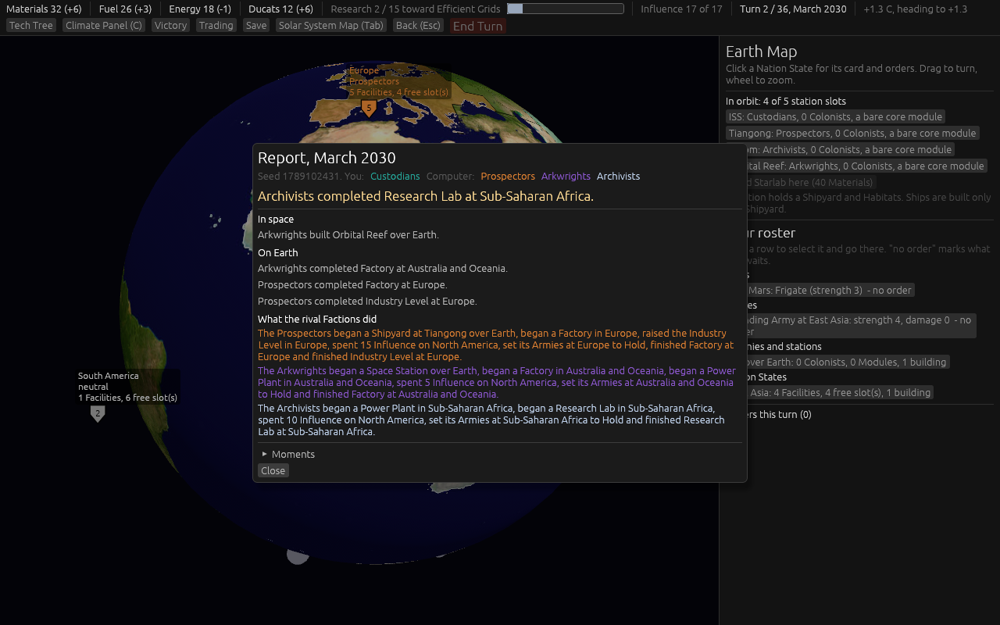

- **calendar-report.png** — `shot:calendar turns:1 menus:1`. Turn 2. The top bar reads **"Turn 2 /
  36, March 2030"** and the dispatch is headed **"Report, March 2030"**: a turn is named by its first
  month alone, and turn 2 is March, not February. Under the 0.05 calendar this same turn read
  February 2030 and "Turn 2 / 24".

- **window-solar.png** — `shot:window turns:6 hover:mars`. Turn 7, **January 2031**, the first Mars
  window, where 0.05's `solar-window-turn.png` showed the same real window on **turn 14, February
  2031**, with a nine-turn flight. The tooltip now reads **"Flight now: 5 turns, 20 Fuel"**: the
  card's Fuel at the window, which the span rule above is for. Earth and Mars stand left of the Sun
  about forty-five degrees apart, the departure geometry, as in the 0.05 picture.

Not pictured: the Load screen's month column and the save file names read the same `date` function
and so name the first month too; the six save tests pass unchanged.

## #68: the Archive as a Module of three turns, its fund capped at a quarter until it stands

[The ticket](https://github.com/whaleyjoshua2/Dying-Earth/issues/68). The Archive is one Module,
50 Materials and three turns from its own button at a Colony off Earth; the four stages are retired.
Its 80 Research is still required, paid into the fund at any pace once the Module stands; until then
the fund holds a quarter (20), and at the cap a turn of funding is refused rather than wasted. The
Archive is complete when it stands and every point is paid; from then it draws its 12 Energy and the
Victory Condition reads as before. Provisional Findings is unchanged.

### What moved

| file | figure | was | is |
| --- | --- | --- | --- |
| `modules.toml` | the Archive row | 30 Materials, 2 turns, a stage | 50 Materials, 3 turns, one Module |
| `modules.toml` | `[archive]` | 4 stages of 20 Research | `research` 80, `banked_before_built` 0.25 |
| `factions.toml` | the Archivists' first part | `archive_stages`, bar 4 | `archive_research`, bar 80 |
| `ai.toml` | `[pace.archivists] first` | stages by turn 8, 13, 18, 22 | Research 20, 40, 60, 80 by turns 10, 18, 26, 32 |
| `save.rs` | the rules version stamp | 0.05 | 0.05.5 (a Module lost its stage field) |

**The AI learned the whole path.** Ticket #51 never counted a Launch Site or a Shipyard as
advancing the Archive, so an Archivist AI whose station starts bare spent every turn on Influence
and never left Earth; both count now, and for the steps of the Archive's own path the AI banks
Materials over twelve turns of income rather than four, since 50 Materials is never within four
turns of four a turn. The glossary retires "Project" and rewords the Archive and its fund.

### Measured, twenty seeds each

| seat 0 | collapses | Archivist Shipyards | Colony Ships | Archivist Colonies founded | Archive begun | Archive standing | lost their start state |
| --- | --- | --- | --- | --- | --- | --- | --- |
| Archivists in East Asia | 7/20 | 40 | 42 | 10 | 1 | **0/20** | **20/20, median turn 20 (13..23)** |
| Archivists from Europe | 20/20 | | | | | **0/20** | |

Before this ticket the same seat founded no Colony in twenty seeds. Now it builds a Shipyard at Axiom
in every seed and a Colony Ship in most, founds a Colony in about half, and began the Archive once;
the Module stood in none. The fund sits at its quarter (20) at the end of every seed.

**Why it stops there is not the Archive.** In every seed the Custodians take East Asia from the
Archivists by Influence at a median turn 20, and from then the Archivists' income reads `+0
Materials, Research 0`: a one-state Faction at output x0.8 and Influence x1.0, beside a Custodian
seat at x1.25, holds its state for half the game and then holds nothing. That is the card and the
start, which the map rules out of this version's scope; it is recorded for the build ticket's "Open
for the designer" beside 0.05's finding 4. Other lines from the same batches: the Mars system
reached in every seed (median turn 12), Techs at a median 8 and 13 a game with rung 3 reached, no
Sea Wall, and four Custodian Stabilization wins outright in the East Asia batch, the first ever seen.

### Pictures

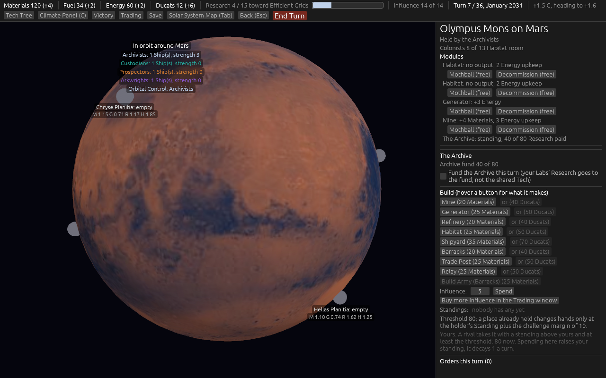

- **archive1-mars.png** — `shot:archive1 player:archivists turns:6 archive:1`. The Archive Module
  standing at Olympus Mons with half its Research paid: the Modules list says **"standing, 40 of 80
  Research paid"**, the Archive section reads **"Archive fund 40 of 80"** with the Fund box live, and
  there is no Build button, because it is built.

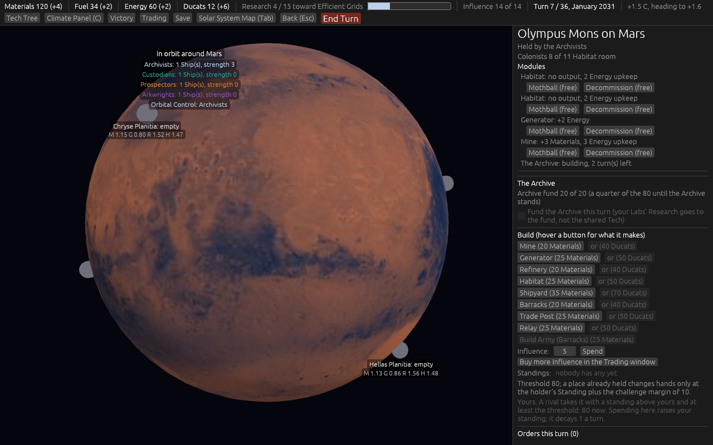

- **archive0-mars.png** — `shot:archive0 player:archivists turns:6 archive:0`. The Module on order:
  **"building, 2 turn(s) left"**, the fund at **"20 of 20 (a quarter of the 80 until the Archive
  stands)"**, and the Fund box **greyed out** at the cap, which is the refusal of the resolution's
  point 4 made visible.

## #69: two start Labs, the neutral half, and the Sea Wall's Tech on rung 1

[The ticket](https://github.com/whaleyjoshua2/Dying-Earth/issues/69). North America and South-East
Asia each start with a Research Lab added to their start Facilities, standing inland. A Lab in a
Nation State nobody holds, or one under Occupation, runs itself, pays no Energy, and pays half its
yield (rounded down) into the Tech under research for no Faction; under Occupation the occupier pays
the Lab's upkeep and draws nothing from it. A Faction starting in either state keeps its Lab whole.
Coastal Engineering moves from Industry rung 2 at 25 to rung 1 at 10 with no prerequisite.

### What moved

| file | figure | was | is |
| --- | --- | --- | --- |
| `nation_states.toml` | North America's start Facilities | Refinery, Power Plant, Factory | + Research Lab |
| `nation_states.toml` | South-East Asia's start Facilities | Refinery, Power Plant | + Research Lab |
| `techs.toml` | Coastal Engineering | rung 2, cost 25, needs Efficient Grids | rung 1, cost 10, needs nothing |

**Builder's calls.** A start Research Lab stands inland whatever the coastal count. The world's Lab
yield is the row's figure by the state's people and schooling, times Public Science once every
Faction has it, with no Faction multiplier: 3 in North America and 2 in South-East Asia, so 1 each a
turn to the pool. A Lab idled by a Wildfire or mothballed pays nothing. The Report says it under On
Earth on turns it is more than zero. The state card's Lab line says "in no one's hands: N Research a
turn to the Tech under research" rather than the old "idle, nobody directs this state". Ticket #24's
rule that start Facilities number as many as the Industry Level now reads "plus a start Lab".

### Measured, twenty seeds each

| seat 0 | collapses | end Temperature | Techs (median) | highest rung | Coastal Engineering done | Sea Walls | neutral Labs paid (median) | outright wins |
| --- | --- | --- | --- | --- | --- | --- | --- | --- |
| Prospectors in East Asia | **0/20** | +2.35 | **11** | 3 | 20/20, median turn 18 | **0** | 17 | Custodians 16/20 (Stabilization) |
| Custodians from Europe | **0/20** | +2.28 | **12** | 3 | 20/20, median turn 16 | **0** | 17 | Custodians 20/20 (Stabilization) |

After the calendar ticket the same seatings collapsed 15 and 17 of 20 at a median turn 34 to 35
with the world at +3.0, and completed 2 or 3 Techs a game. **The Tech pace has quadrupled and the
climate has turned over with it**: no seed collapses, the world ends at +2.3, and the Custodians
meet Stabilization outright in 36 of 40 games where no Custodian had ever met it in any version.
The neutral Labs' 17 Research a game is not the cause on its own; the two start Labs are a Faction's
from turn 1 whenever a seat starts there, and the AI now reaches Clean Power and Green Consensus.
The climate step (270, provisional) was chosen at the old pace; **the build ticket's re-sweep is
where the clock is set**, and this is recorded on the map rather than re-tuned here.

**Coastal Engineering is done by turn 16 to 18 in every seed, and still no Sea Wall is built.** The
logged run says why: the Sea Wall is offered, and every time the AI holds its Materials for a
Scrubber instead ("holding Materials for build a Scrubber in ..."), since only the Custodian AI
considers coastal defence and the Scrubber advances its Victory Condition while a Sea Wall does
not. Reachable now, never chosen: an AI weighting for the build ticket.

### Pictures

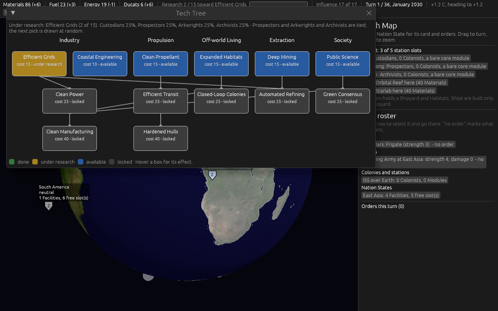

- **tree-earth.png** — `shot:tree tech:1 turns:0 panel:0`. **Coastal Engineering on Industry rung 1
  at "cost 10 - available"**, beside Efficient Grids, with Clean Power alone on rung 2 under
  Efficient Grids and Clean Manufacturing under it. In 0.05's `tech-tree-thirteen.png` the same box
  sat on rung 2 beside Clean Power at cost 25.

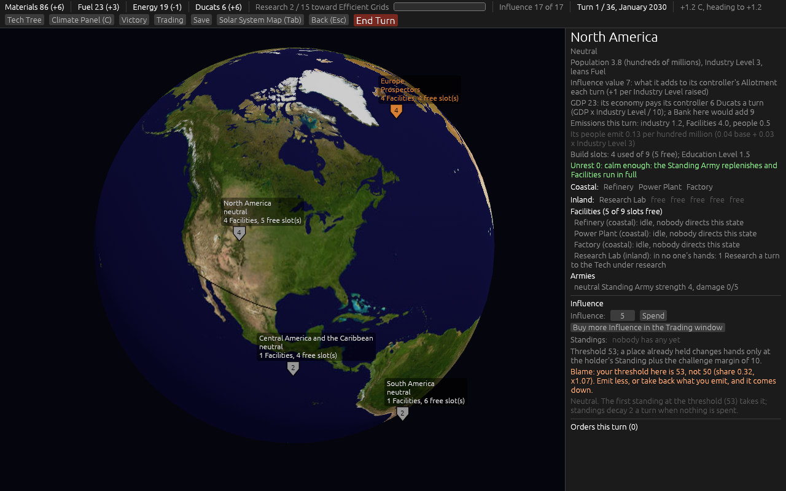

- **lab-earth.png** — `shot:lab select:northamerica turns:0 look:-100,40`. Neutral North America
  with its four start Facilities: the three from ticket #24 on the coast and the **Research Lab
  inland**, its line reading **"in no one's hands: 1 Research a turn to the Tech under research"**.
  The first take of this picture showed the old "idle, nobody directs this state" line, which is
  what the label fix above answered.

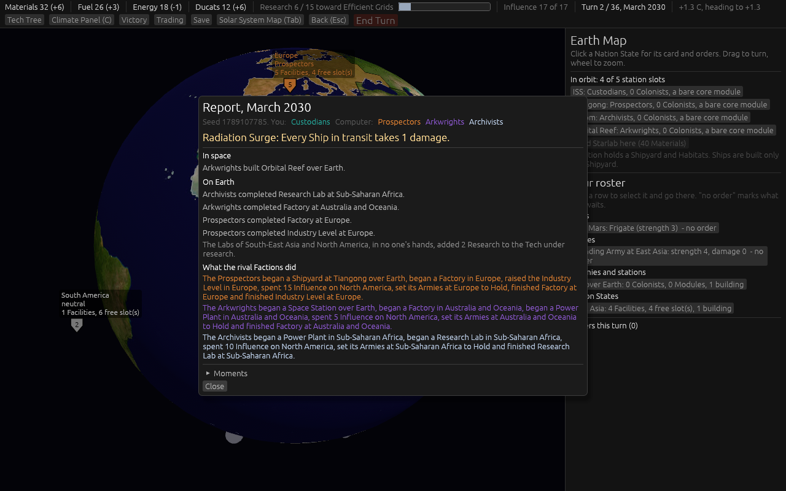

- **neutral-report.png** — `shot:neutral turns:1 menus:1`. Turn 2's dispatch, under **On Earth**:
  "The Labs of South-East Asia and North America, in no one's hands, added 2 Research to the Tech
  under research."

## #70: Influence ties by lot, fifteen coastal slots moved inland, and the Sea Wall the AI now builds

[The ticket](https://github.com/whaleyjoshua2/Dying-Earth/issues/70). Two challengers at the same
Standing on a neutral place draw lots from the game's own generator; on a held place the holder
keeps it. Coastal slots per point of Coastal Exposure go from 3 to 2, so the world holds 34 coastal
slots where it held 49, and Europe's Refinery and North America's Factory stand inland from turn 1.
While the sea is within 0.2 C a Sea Wall takes the victory-gap and threat multipliers, so it competes
with the Scrubber.

### What moved

| file | figure | was | is |
| --- | --- | --- | --- |
| `nation_states.toml` | `coastal_per_exposure` | 3 | 2 |
| `report.toml` | `claim_lot` (new) | | "{place} is claimed by {factions} at the same Standing; the lot falls to the {winner}." |

**Builder's calls.** The lot is drawn with the same generator a contested orbital slot uses, so a
seed replays the same draw. A Faction's Launch Site, added after the card's Facilities, now stands
inland in Europe and North America because their two coastal slots are full. The Sea Wall's threat
multiplier is the sea itself: the state is under threat, as it is from an Army next door. Three older
tests moved with the count: East Asia has four coastal slots now, so the Ice Sheets Break and the
+1.8 threshold take them all and the scheduled +2.3 fires and finds nothing.

### Measured, twenty seeds each

| seat 0 | collapses | end Temperature | Sea Walls built | coastal slots lost (median) | Facilities drowned (median) | Custodian wins |
| --- | --- | --- | --- | --- | --- | --- |
| Prospectors in East Asia | 0/20 | +2.32 | **3** (was 0) | **34** (was 49) | **24** (was 27 to 29) | 20/20 |
| Custodians from Europe | 0/20 | +2.25 | **5** (was 0) | **34** (was 49) | **24** | 20/20 |

**The first Sea Walls ever built in any version**: three and five a batch, all by the Custodian AI,
where every earlier batch of every version reported zero. The sea still takes every coastal slot the
world has by the end of a game; there are fifteen fewer to take, and three to five fewer Facilities
drown. The rest of the picture is the Research ticket's: no Collapse, the world at +2.3, the
Custodians winning every seed on Stabilization.

### Picture

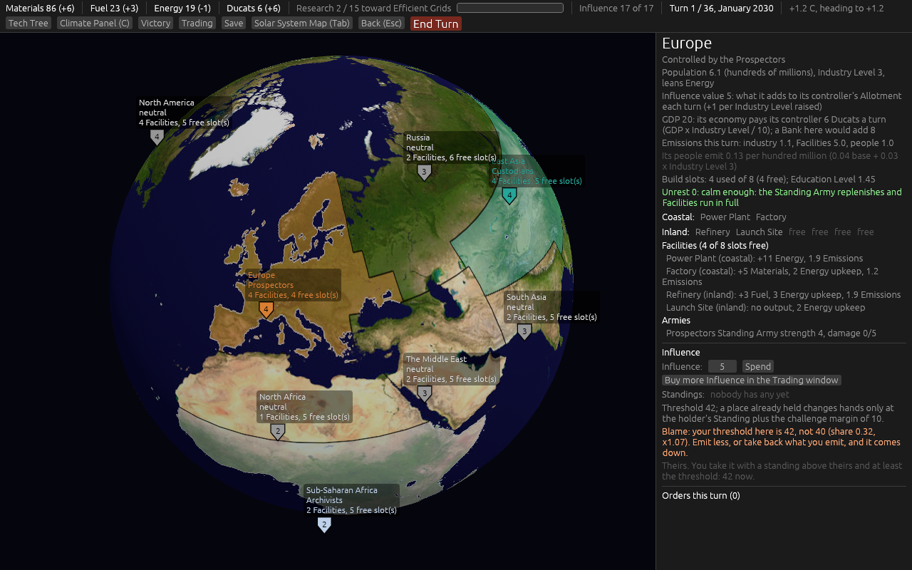

- **coast-earth.png** — `shot:coast select:europe turns:0 look:15,50`. Europe at turn 1 as the
  Prospectors' start state: **Coastal: Power Plant, Factory**; **Inland: Refinery, Launch Site**, and
  four free inland slots. In 0.05 all three start Facilities and the Launch Site stood on the coast
  (three coastal slots per point of Exposure), and the sea took the lot.

## #72: the Venture Capital Fund, the 15% discount, and the Moon's yields

[The ticket](https://github.com/whaleyjoshua2/Dying-Earth/issues/72). The Prospectors' first
Victory part is 750 Materials in their **Venture Capital Fund**, a pool beside the Stockpile that
takes a share of their Factories' and Mines' Materials output each Income, set on any turn from 0%
to 80% in steps of 10; a draw returns nine tenths. The running Extraction Total is retired. Their
Facilities and Colony Modules cost 15% less, rounded down. The Moon's four yields are up a tenth.

### What moved

| file | figure | was | is |
| --- | --- | --- | --- |
| `factions.toml` | the Prospectors' first part | `extraction_total`, bar 500 | `venture_fund`, bar 750 |
| `factions.toml` | `facility_materials_multiplier`, `module_materials_multiplier` | 1.0 | 0.85 |
| `factions.toml` | `[venture_capital]` (new) | | `max_share` 0.8, `share_step` 0.1, `draw_return` 0.9 |
| `victory.toml` | `extraction_total` | 500 | retired |
| `ai.toml` | `[pace.prospectors] first` | 40, 150, 320, 500 by turns 6, 12, 18, 24 | 100, 250, 450, 750 by turns 9, 18, 27, 34 |
| `bodies.toml` | the Moon | 1.5, 1.25, 0.5, 1.0 | 1.65, 1.375, 0.55, 1.1 |

**Builder's calls.** Two orders, the Prospectors only: setting the share (refused off the steps) and
a draw (refused past what the Fund holds); both land at Resolution, and the share is read at the
next Income. The banked Materials show in the Income sources as "Venture Capital Fund (banked)".
The share row and the Draw button sit on the Victory panel under the Prospectors' own bars, and the
top bar shows "Fund N (S%)" beside their Materials. The AI plays the share as the designer
described: nothing before the pace's first waypoint (turn 9, it builds first), then the smallest
step that reaches 750 by turn 34 at its current output, and 80% when nothing less will. A first cut
zeroed the share whenever the AI was holding Materials for a build, which is nearly every turn, so
it never banked; that is gone. A Module lost nothing, but a seat gained three fields, so saves are
already refused by the stamp bumped on the Archive ticket.

### Measured, twenty seeds each

| seat 0 | collapses | Prospectors' Fund at the end (median) | Custodian wins | Sea Walls | Scrubbers |
| --- | --- | --- | --- | --- | --- |
| Prospectors in East Asia | 0/20 | **0** | 20/20 (Stabilization) | 5 | 677 |
| Custodians from Europe | 0/20 | **0** | 20/20 (Stabilization) | 12 | 685 |

**The Fund cannot be measured yet, and the reason is not the Fund.** In every seed the Prospectors
in East Asia lose it **on turn 7** (min 7, median 7, max 7): from about turn 4 the Custodian AI
pours 25 Influence a turn into East Asia, the other two AIs join it, and the holder's defence is a
single 5-Influence "hold" a turn, so the richest state on the board passes to the Custodians before
the Fund's first waypoint, and the Prospectors' Materials income reads +0 from then to the end. The
same thing took East Asia from the Archivists at turn 20 on the Archive ticket; with the Prospectors
it is turn 7. That is the four-way balance the map keeps out of this version, and it is now the one
finding under every measurement since the Research ticket: the Custodians win every seed of every
seating on Stabilization. It is written up as its own ticket for the designer, blocking the build.

### Picture

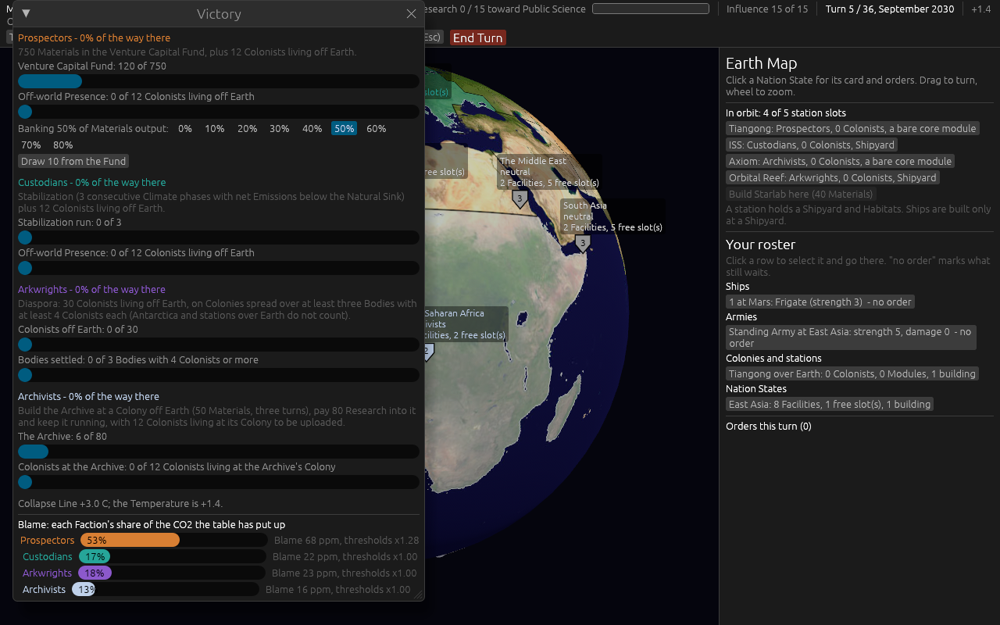

- **fund-earth.png** — `shot:fund player:prospectors turns:4 victory:1 venture:120 panel:0`. The
  Victory panel with the Prospectors in seat 0: **"Venture Capital Fund: 120 of 750"**, the row of
  share buttons from 0% to 80% with **50% lit**, and **"Draw 10 from the Fund"**. The first take
  had the Climate Panel over the share row, and was retaken with `panel:0`.

## #76: a deck for thirty-six turns

[The ticket](https://github.com/whaleyjoshua2/Dying-Earth/issues/76), added by the designer while
the map was worked: the 28-card deck was sized for twenty-four turns and a hot thirty-six-turn game
could draw it dry. Now **40 cards**, never reshuffled, the draw chance unchanged: a third copy of
Heatwave, Wildfire, Rich Seam and Solar Storm, a second of Unrest, Methane Burst, Labour Dispute and
Dust Storm, and four new Events once each.

| card | kind | target | effect | blunted by |
| --- | --- | --- | --- | --- |
| **Drought** | climate | a Nation State | its Facilities make half at the next Income; Unrest +1 | Green Consensus |
| **Volcanic Eruption** | climate | everyone | 5 ppm leave the CO2 Stock at once, scaled by the Temperature | nothing |
| **Moonquake** | failure | the Moon | every Module on the Moon offline until the next Resolution | Closed-Loop Colonies |
| **Helium-3 Vein** | discovery | the Moon | the Moon's Generators x2 for two turns | Efficient Grids (x3) |

**Builder's calls.** A Drought is the one Climate card the Temperature scale does not reach, since a
halving cannot scale; its Unrest rise is a flat 1 as a climate source. A Volcanic Eruption scales, so
it cools more when the world is hotter. A Moonquake shares the Dust Storm's arm with the Moon in
place of Mars; a Helium-3 Vein is a discovery on Generators, as Rich Seam is on Mines. Figures in
`events.toml`: `drought_output_multiplier` 0.5, `drought_unrest` 1.0, `volcanic_co2` 5.0.

### Measured, twenty seeds each

| seat 0 | cards drawn a game (median) | deck empty at the end |
| --- | --- | --- |
| Prospectors in East Asia | 11 | 0/20 |
| Custodians from Europe | 17 | 0/20 |

Both low because the Custodians win outright around turn 20 in every seed (the home-state finding);
a game that runs its thirty-six turns hot would draw 22 to 26 of the 40.

### Picture

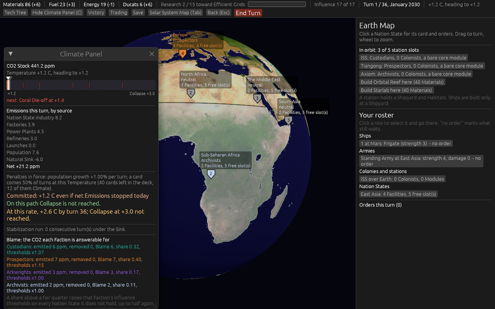

- **deck-earth.png** — `shot:deck turns:0`. The Climate Panel's penalties line at turn 1: **"40
  cards left in the deck, 12 of them Climate"**, where 0.05 read 28 and 7. Twelve is three
  Heatwaves, three Wildfires, two Storm Surges, two Methane Bursts, the Drought and the Eruption.

## #73: Colonists are built, four a turn, launched or sent to Antarctica, and building them lowers Unrest

[The ticket](https://github.com/whaleyjoshua2/Dying-Earth/issues/73). Colonists are built now: a
Faction musters up to four **Emigrants** a turn, in one Nation State it directs, at a tenth of a
person each, on the state's card at End Turn (a turn to muster: nothing lifts them the turn they are
ordered). A batch takes 0.5 off the state's Unrest. A Launch Site lifts only the Emigrants waiting
in its state, still a turn and still a launch. Once the ice is open, Emigrants go to Antarctica by
sea from any state the Faction directs, a turn to arrive and no launch, founding a Colony in a free
slot or joining the Faction's own. Steerage: the Arkwrights muster eight at twice the population.

### What moved

| file | figure | was | is |
| --- | --- | --- | --- |
| `factions.toml` | `[emigrants]` (new) | | `per_turn` 4, `population_each` 0.1, `unrest_fall` 0.5, `antarctica_turns` 1 |
| `factions.toml` | the Arkwrights' `emigrants_multiplier` (new) | | 2.0 |
| the lift | population taken | 0.1 a Colonist at the lift | 0.1 an Emigrant at the muster; the lift takes none |

**Builder's calls.** Two new orders, Muster Emigrants and Send to Antarctica; the muster lands at
End Turn (the population, the Emigrants and the Unrest fall together), the send puts the Emigrants
at sea and they land at the next turn's Resolution, into their slot if it is still free, else into
the Faction's own Antarctic Colony with room, else home to their state. A Launch Site refuses a lift
past the Emigrants waiting ("only N Emigrants are waiting there"). The state card shows "Emigrants
waiting: N" under the Unrest line and carries the Muster button and, with the ice open, a Send
button per free Antarctic slot and per own Colony there; the Ship's Load button lifts what waits.
The AI musters in the state with a working Launch Site while fewer wait than two Ship loads (one
more with the ice open), lifts what waits, and with the ice open sends what waits by sea. Seven
older tests that lifted straight from a population now muster first. The glossary gains Emigrant and
rewords Colonist, Steerage and the Launch Site line.

### Measured, twenty seeds each

| seat 0 | Emigrant batches | Antarctic Colonies founded (by sea) | Colonists off Earth (median) | Mars system reached | median peak Unrest | throw-offs | Custodian wins |
| --- | --- | --- | --- | --- | --- | --- | --- |
| Prospectors in East Asia | 946 | 60 (58) | 20 | 17/20, median turn 17 | **9.0** (was 10.0) | 4 (was 0 to 75) | 20/20 |
| Custodians from Europe | 1105 | 60 (58) | 32 | 20/20, median turn 15 | | | 17/20 |

About fifty batches a game are mustered; all three Antarctic slots are settled in every seed, nearly
all by sea; Colonists off Earth stay at 20 to 32; the Mars system is reached a few turns later than
before (the muster is one more step before the first lift). **The median peak Unrest falls from 10.0
to 9.0**, the first time it has left the ceiling in any batch since ticket #52. The home-state
finding stands: the Custodians win 17 and 20 of 20.

### Picture

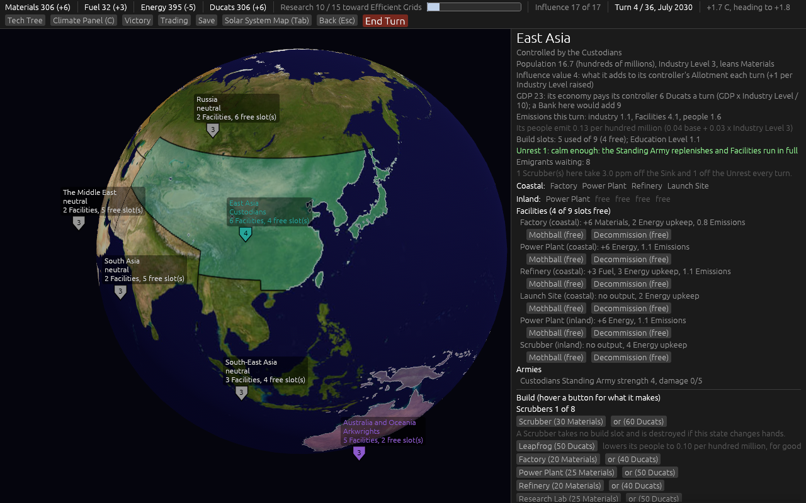

- **emigrants-earth.png** — `shot:emigrants select:eastasia turns:2 temp:1.7 emigrants:8 look:110,30
  panel:0`. East Asia's card with eight Emigrants mustered: **"Emigrants waiting: 8"** under the
  Unrest line. The Muster and Send-by-sea buttons sit further down the card, in the orders list
  below the Build buttons, past the bottom of this capture (the Muster button is in frame on the
  shorter North Africa card of the next ticket's picture).

## #75: the undefended home state

[The ticket](https://github.com/whaleyjoshua2/Dying-Earth/issues/75), opened from the Prospectors
ticket's finding. The designer chose the AI fix inside scope and a warning on the player's card.
Every AI holder now pushes as many 5-Influence holds as it takes to stand two steps clear of a
rival's Standing plus the challenge margin once the rival comes within two steps, as many as its
Allotment and Ducats allow; the state card warns in orange when a rival's Standing is within two
steps of the player's own on a place the player holds; the simulation reports the turn seat 0
loses its start state.

### Measured, twenty seeds each, and the fix does not hold the state

| seat 0 | lost its start state | Custodian wins | Prospectors' Fund |
| --- | --- | --- | --- |
| Prospectors in East Asia | **20/20, median turn 8** (was 7) | 20/20 | 0 |
| Archivists in East Asia | **20/20, median turn 21** (was 20) | | |
| Custodians from Europe | 0/20 | 17/20 | 0 |

**Why, from one seed's log.** The Custodians spend 10 on East Asia on turn 5 and 25 a turn from
turn 6; the Prospectors answer with their whole Allotment, 15 on turn 6 and 20 on turn 7; the state
goes on turn 7 at a Custodian Standing of 60. The defence fires, and it is outspent from a standing
start: **a Faction's own Standing on its start state is zero when the game begins**, so a challenger
needs only the threshold (about 58 on East Asia) until the holder has built a Standing, and a holder
at 17 a turn cannot build one faster than a challenger at 25 tears past it. The margin of 10 over
the holder's Standing is the only thing a hold buys, and it is bought too late.

**So this is a rule, not the AI, and it is the designer's.** Three knobs, none touched here: a
Faction beginning with a Standing on its start state equal to that state's threshold; the challenge
margin of 10; the Custodians' Influence x1.25. The map's "Not yet specified" carries them, and the
build ticket asks before it sweeps, since the Fund, the Archive and Diaspora cannot be measured
while seat 0 loses its only state before turn 10.

**Builder's calls.** The warning line sits at the top of the card under the Unrest line, not in the
Influence section, which is below the fold on every card; the first two takes of the picture showed
that. The AI's hold count is capped by what its Allotment and Ducats can buy in a turn.

### Picture

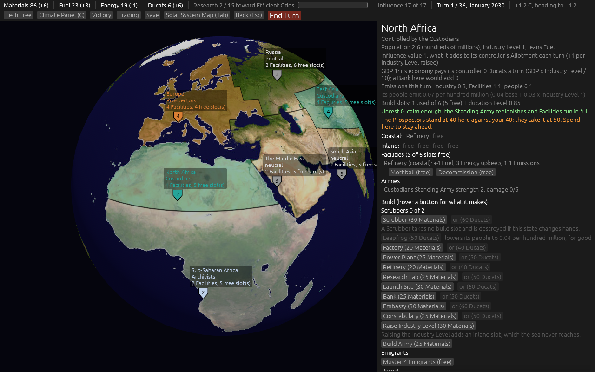

- **pressed-earth.png** — `shot:pressed select:northafrica turns:0 pressed:40 look:15,25 panel:0`.
  North Africa held by the player (the aid gives it to seat 0 for a short card) with a rival's
  Standing level with the player's: the orange line **"The Prospectors stand at 40 here against
  your 40: they take it at 50. Spend here to stay ahead."** under the Unrest line. The Emigrants
  section's **"Muster 4 Emigrants (free)"** button is in frame at the foot of the card. (Taken at a
  margin of 10; the line reads "they take it at 60" since the second round below.)

### The second round: the rule

The designer chose the rule after the AI fix failed: **a Faction begins with a Standing on its start
state equal to that state's threshold** (a claim on its home from turn 1), **the challenge margin goes
from 10 to 20**, and **a held state counts 0.3 of a neutral one** on the AI's Influence target list
(0.6 before), so a held place is attacked only when no neutral one is worth having.

| file | figure | was | is |
| --- | --- | --- | --- |
| `influence.toml` | `challenge_margin` | 10 | 20 |
| `ai.toml` | `[thresholds] held_state_weight` (new) | 0.6 in code | 0.3 |
| the start | a Faction's Standing on its start state | 0 | the state's threshold |

Two older tests moved with the rules: the ticket #33 challenger test now flips at 60 plus 20, and
the Embassy test counts its rises from the home claim rather than from zero. The start-Standing
test was watched red first (a margin of 10 for 20), and the AI-weight test red under a mutation of
the weight to 1.0.

| seat 0 | lost its start state | Custodian wins | Prospectors' Fund at the end | Colonists off Earth |
| --- | --- | --- | --- | --- |
| Prospectors in East Asia | **11/20, median turn 11** (was 20/20 at 8) | **10/20** (was 20) | **219** (was 0) | 16 |
| Custodians from Europe | 0/20 | 12/20 (was 17) | 87 | 30 |
| Archivists in East Asia | 20/20, median turn 22 (was 21) | 20/20 | 165 | 36 |

The home holds for half the Prospector seeds now and for eleven turns where it held for seven, the
Fund fills to a median 219 of 750, and the Custodians' wins fall by half in two seatings. The
Archivists still lose East Asia in every seed, four turns later. No rule limits a Faction to one
state (the Archivist AI took a second one fourteen times in a twenty-seed batch); in AI play they
usually hold only their start state, at Influence x1.0 beside a Custodian at x1.25 pouring 25 a
turn in, and cannot hold the richest state on the board past turn 22 whatever it starts with. That, and the Sea Wall count back at 0 in these batches, are the build ticket's to report. The
walls are not the holds' doing (holds spend Influence, a wall spends Materials, and the AI never
listed one): a wall needs a free coastal slot, most states have none to spare since the
coastal-slots ticket, the sea's first two events take what there is by about turn 13, and
Coastal Engineering arrives around turn 17. The designer's question, on the map.

## #77: the Sea Wall takes no build slot, as the Scrubber does

[The ticket](https://github.com/whaleyjoshua2/Dying-Earth/issues/77), opened from a question of the
designer's about why no wall was built, and decided at once: "make the sea wall take no slot like
the scrubber." The Sea Wall takes no build slot and stands in no row; it still needs Coastal
Engineering, one per state, 35 Materials and two turns, and still absorbs the state's next Sea Level
threshold and is destroyed doing it. It is offered to the AI only while the state has a coast left.

### What moved

| file | figure | was | is |
| --- | --- | --- | --- |
| `facilities.toml` | the Sea Wall | `coastal_only = true` | `no_slot = true` |
| `ai.toml` | the Custodians' Tech picks | Public Science, Efficient Grids, ... | Public Science, **Coastal Engineering**, Efficient Grids, ... |
| `ai.toml` | the Archivists' Tech picks | Public Science, Efficient Grids, Green Consensus | Public Science, Efficient Grids, **Coastal Engineering**, Green Consensus |

**Builder's calls.** The slot alone changed nothing: with the wall offered only while a coast
remains, and Coastal Engineering arriving around turn 17 as "the cheapest Tech left" on nobody's
pick list, the sea had taken every coastal slot by turn 13 and the AI still listed no wall (the
batch figures came back identical). So Coastal Engineering went onto the Custodians' pick list in
second place and the Archivists' in third, the AI's own blind spot rather than a rule. The wall's
candidate moved out of the slot-taking loop to sit beside the Scrubber's. Two ticket #56 tests
changed sides: a wall is legal with every slot full and counts against none.

### Measured, twenty seeds each

| seat 0 | Sea Walls built | Coastal Engineering done (median turn) | coastal slots lost (median) | Facilities drowned | Custodian wins |
| --- | --- | --- | --- | --- | --- |
| Prospectors in East Asia | **220** (was 0) | 20/20, turn **9** (was 19) | 34 | 24 | 7/20 (was 10) |
| Custodians from Europe | **372** (was 0) | 20/20, turn **6** (was 16) | **29** (was 34) | **19** (was 24) | 9/20 (was 12) |

Eleven to eighteen walls a game where there were none, the Tech in by turn 6 to 9, and in the
Custodian seating five coastal slots and five Facilities a game saved from the sea. Whether that
many walls is too many, at 35 Materials each, is the designer's to judge from the build ticket's
report; the count is in the sweep now.

### The second round: back in a coastal slot, at 20 Materials

The designer, on seeing eleven to eighteen walls a game: "now that we've fixed the tech choice order
let's see what happens if it takes up a slot. Let's also reduce the materials cost to 20." So the
wall stands in a coastal slot again, as ticket #56 had it (read as the coastal slot, not any slot),
at 20 Materials, and the early Tech pick stays. The tests changed sides again and were run.

| seat 0 | Sea Walls built | Coastal Engineering (median turn) | coastal slots lost | Facilities drowned | Custodian wins |
| --- | --- | --- | --- | --- | --- |
| Prospectors in East Asia | **30** (no slot: 220; before the ticket: 0) | 9 | 34 | 24 | 6/20 |
| Custodians from Europe | **48** (no slot: 372; before: 0) | 6 | 34 | 25 | 10/20 |

One or two walls a game: the Tech now comes in time, but a wall needs a free coastal slot and few
states have one (Europe, North America, Russia and the Middle East none), so most coasts go
unwalled and the sea takes what it took. The two rounds are the designer's pair to choose from: a
wall in a coastal slot at 20 Materials, one or two a game; or a wall taking no slot at 35, eleven to
eighteen a game.
