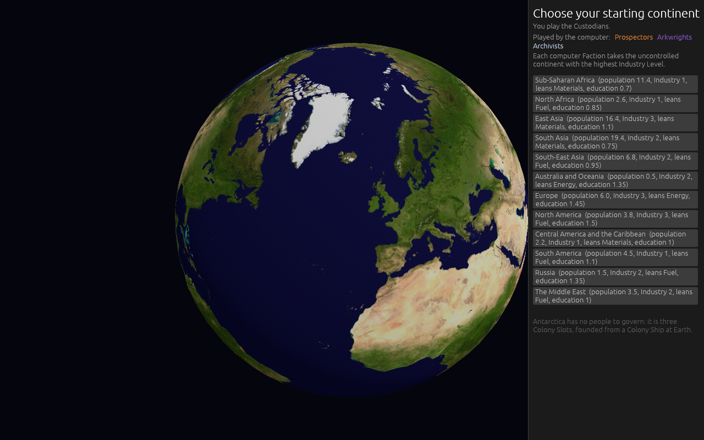

# Version 0.07.0, the UI, AI and accessibility version

Pictures and notes from the build, taken headlessly with `shot:` mode. The map is
[Map: version 0.07.0](https://github.com/whaleyjoshua2/Dying-Earth/issues/96).

## The start screen's globe turns under the hand

Ticket [#100](https://github.com/whaleyjoshua2/Dying-Earth/issues/100). The globe on
"Choose your starting continent" used to ignore the mouse entirely: its central panel was
allocated with `Sense::hover()`, and the Earth turned on a fixed spin nobody could stop.

It now opens on the Faction's own home — Europe for the Custodians, pictured, with the
Mediterranean and North Africa in view — turns under a drag, zooms on the wheel, and a click
on a continent picks it. The spin runs until the first drag and then stops for good, so the
home does not drift back out of sight while its card is being read.

The four homes are the designer's, one per Faction and each on a different axis: the
Custodians in Europe (energy-lean, education 1.45), the Prospectors in East Asia
(materials-lean, Industry 3, GDP 23), the Arkwrights in South Asia (population 19.4, the
largest on Earth, which Steerage eats), the Archivists in North America (education 1.5, the
highest there is). The home changes nothing but where the globe opens: any of the twelve may
still be chosen, from the globe or from the list beside it.

## The Climate Panel says what it means

Ticket [#101](https://github.com/whaleyjoshua2/Dying-Earth/issues/101). The figure behind
"Committed" was read off its own code and turned out to be **correct**:
`target_temperature() = base 1.2 + 0.5 x (CO2 - 420) / 300`, the Temperature the CO2 now
standing will deliver once the lag has caught up, the Temperature moving half the remaining
distance toward it every Climate phase. So only the wording was owed, and it now reads
**"Already locked in"** — the one word on the panel a player might have had to look up, beside
"Last turn to act", which is plain English doing precise work.

The designer also asked for the panel to show where the current course ends. Adding it turned
out to be unnecessary, and only looking at the panel showed why: **the line was already there**,
two rows down — "At this rate, +2.4 C by turn 36; Collapse at +3.0 not reached." The added line
was removed rather than shipped as a duplicate. Three numbers now sit together and each is said
once: what is already locked in, whether cutting can still avoid Collapse, and where the course
ends.
