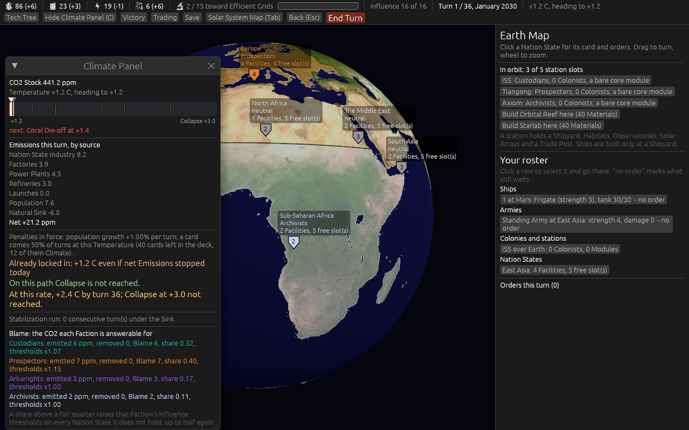
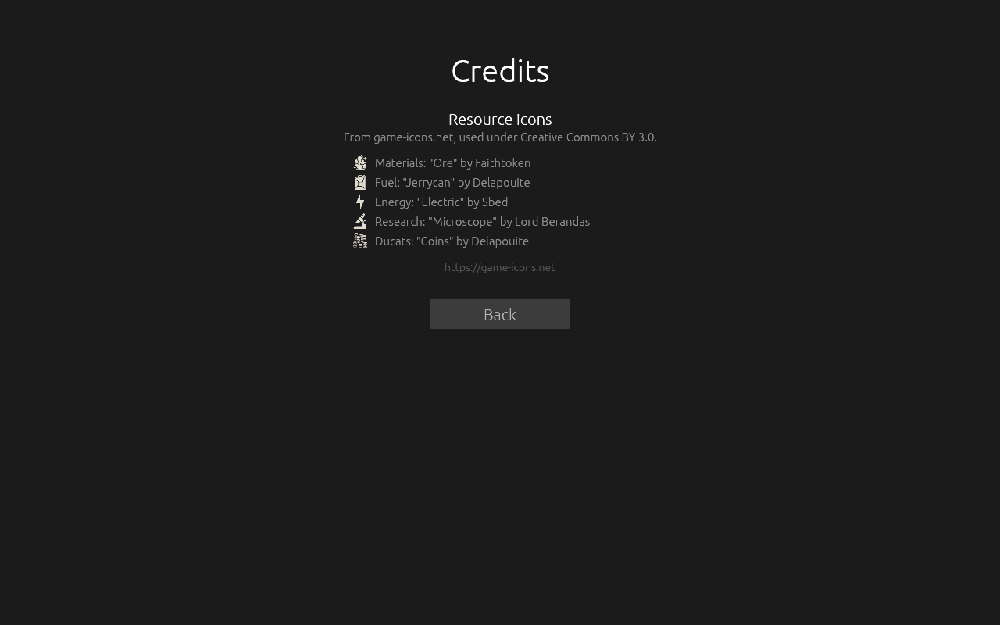
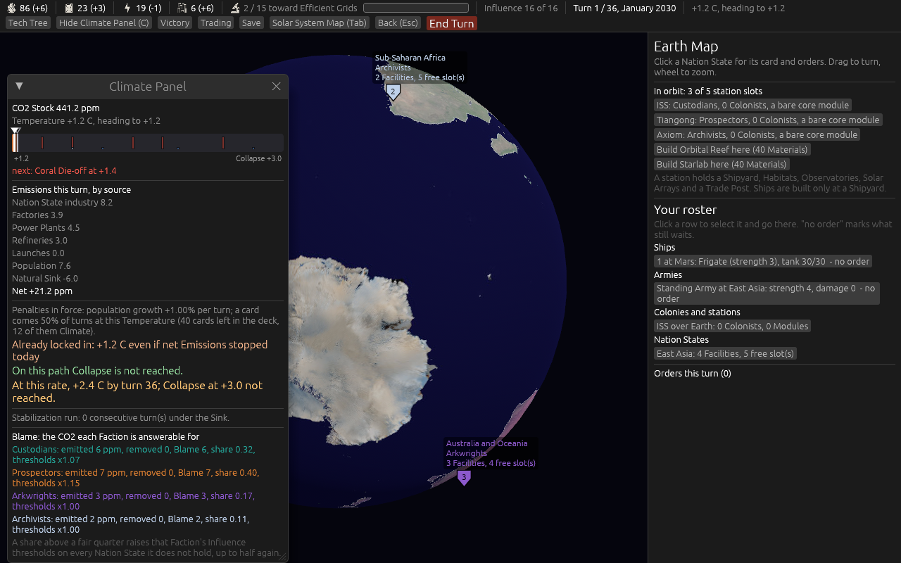
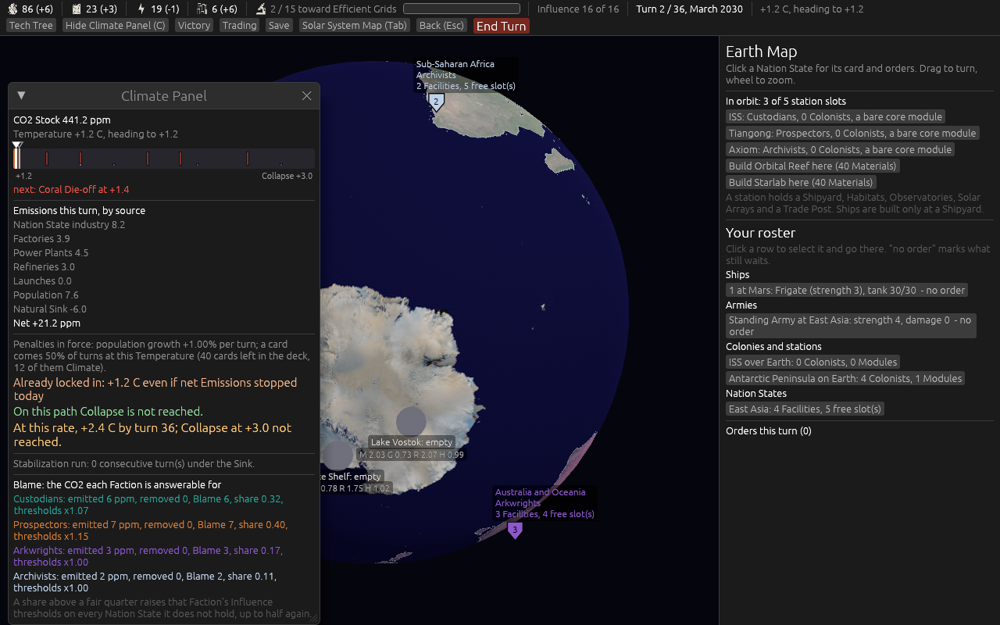

# Version 0.07.0, the UI, AI and accessibility version

Pictures and notes from the build, taken headlessly with `shot:` mode. The map is
[Map: version 0.07.0](https://github.com/whaleyjoshua2/Dying-Earth/issues/96).

## The start screen's globe turns under the hand

Ticket [#100](https://github.com/whaleyjoshua2/Dying-Earth/issues/100). The globe on
"Choose your starting continent" used to ignore the mouse entirely: its central panel was
allocated with `Sense::hover()`, and the Earth turned on a fixed spin nobody could stop.

It now opens on the Faction's own home — Europe for the Custodians, pictured, with the
Mediterranean and North Africa in view — turns under a drag, zooms on the wheel, and a click
on a continent picks it. The spin runs until the first drag and then stops for good, so the
home does not drift back out of sight while its card is being read.

The four homes are the designer's, one per Faction and each on a different axis: the
Custodians in Europe (energy-lean, education 1.45), the Prospectors in East Asia
(materials-lean, Industry 3, GDP 23), the Arkwrights in South Asia (population 19.4, the
largest on Earth, which Steerage eats), the Archivists in North America (education 1.5, the
highest there is). The home changes nothing but where the globe opens: any of the twelve may
still be chosen, from the globe or from the list beside it.

## The Climate Panel says what it means

Ticket [#101](https://github.com/whaleyjoshua2/Dying-Earth/issues/101). The figure behind
"Committed" was read off its own code and turned out to be **correct**:
`target_temperature() = base 1.2 + 0.5 x (CO2 - 420) / 300`, the Temperature the CO2 now
standing will deliver once the lag has caught up, the Temperature moving half the remaining
distance toward it every Climate phase. So only the wording was owed, and it now reads
**"Already locked in"** — the one word on the panel a player might have had to look up, beside
"Last turn to act", which is plain English doing precise work.

The designer also asked for the panel to show where the current course ends. Adding it turned
out to be unnecessary, and only looking at the panel showed why: **the line was already there**,
two rows down — "At this rate, +2.4 C by turn 36; Collapse at +3.0 not reached." The added line
was removed rather than shipped as a duplicate. Three numbers now sit together and each is said
once: what is already locked in, whether cutting can still avoid Collapse, and where the course
ends.

## The resources have faces, and the icons have a credit

Ticket [#109](https://github.com/whaleyjoshua2/Dying-Earth/issues/109). Five icons from
game-icons.net — Ore, Jerrycan, Electric, Microscope, Coins — fetched unmodified into
`assets/icons/` and rendered **from SVG at runtime**, the designer's call over baking PNGs, so
any future icon is a drop-in and every one comes out crisp at whatever size is asked for.
`tiny-skia`, which does the rasterising, was already in the tree; `resvg` joins it.

On the top bar the icon **replaces** the word, since the bar is cramped and five glyphs are
learned in a turn or two. Everywhere else it sits beside the words. Where the art fails to load
the words come back, so the bar is never mute.

Two things only the pictures showed. Every game-icons SVG opens with a **full-canvas black
rectangle** behind its white glyph, which draws as a black square in the middle of the interface;
it is stripped before the tree is parsed. And Research was left as a word on the first pass,
sitting oddly among four glyphs — it now carries the microscope like the rest.

The credits screen exists because the licence is CC BY 3.0 and wants its authors named where a
player can see them. It is reachable from the title screen, it names each icon, its author and
the licence, and the menus screenshot run now photographs it with every other menu, so a future
change that breaks the attribution shows up in a picture.

## Nothing to see under the ice

Ticket [#103](https://github.com/whaleyjoshua2/Dying-Earth/issues/103). Earth's three Colony
Slots are Antarctica's, and they were drawn from turn 1 with their names and their four yields
readable — so a player could shop for the best Antarctic site three degrees of warming before
they could reach it. Now **nothing** of them is drawn until the ice opens: no marker, no name,
no yields.

What stays is the fact of it. The Solar System Map still reads "Antarctica: opens at +1.6 C",
and the Climate Panel's coloured bar already carried an ice-blue notch at exactly that
temperature — so the opening can still be planned for, and the grim trade the game is built on
stays visible: your cheapest colony site is bought by wrecking the planet a little further.

A Bevy query conflict came out of this, and neither the build nor the tests could see it: giving
the slot markers a `Visibility` put that query in conflict with three others that also write
`Visibility`, and the game panicked on the first frame. `cargo build` and `cargo clippy -D
warnings` were both clean. Only running it found it.
