# Version 0.07.1, the reading-and-reaching version

The map is [Map: version 0.07.1](https://github.com/whaleyjoshua2/Dying-Earth/issues/111).

## Antarctica showed on the start screen

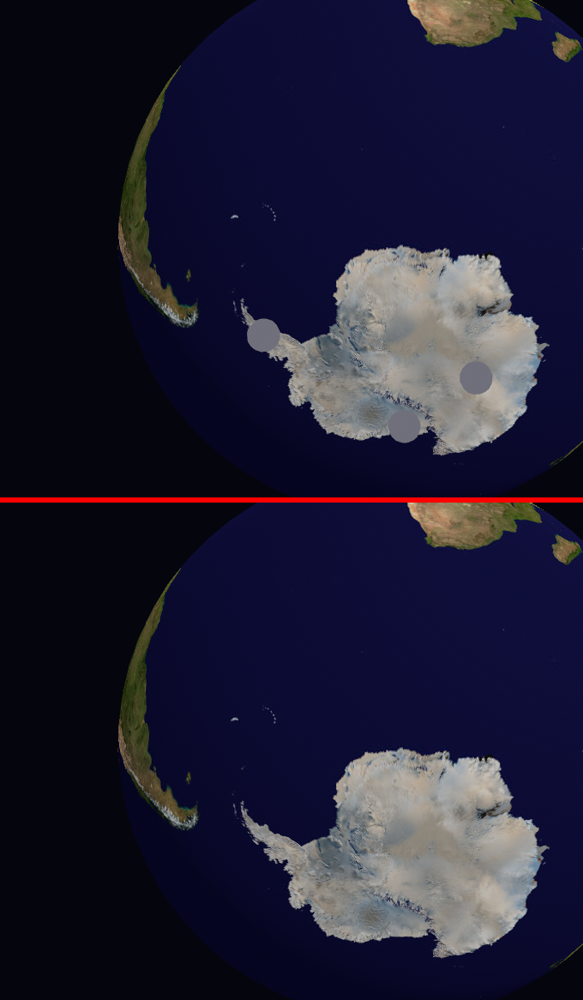

Reported by the designer against version 0.07.0: the Antarctic sites still showed while
choosing a starting continent. [Nothing of Antarctica is drawn until the ice
opens](https://github.com/whaleyjoshua2/Dying-Earth/issues/103) hid them in a game, and the
start screen is **not** a game: `sync_scene` returns early when `session.game` is `None`, and
that return sits **before** the loop that hides the markers, so they kept the visibility they
were spawned with. Before a game exists the ice is shut by definition, so they are hidden
there too.

It took two attempts to photograph, which is the interesting part. The start globe now opens
aimed at the Faction's home with a latitude tilt, so Antarctica is off-view and the first two
captures showed nothing **either way** — the fix looked confirmed by a picture that proved
nothing. The designer would have seen the markers only after dragging the globe south, which
[the globe ticket](https://github.com/whaleyjoshua2/Dying-Earth/issues/100) made possible in
the same version. Standing the camera where a dragging player stands is what produced the
picture above: three markers without the fix, none with it.

## Looking at the icons at the size they are actually drawn

The designer, reading the top bar: *"currently I don't know what materials is; fuel is jerry can,
energy lightning bolt, and duckets looks like some mineral; tech is a microscope."*

Confirmed, and four of the five readings were exact. Left to right that sheet is **ducats,
energy, fuel, materials, research**. Fuel, Energy and Research read correctly. The two that
fail are the two the designer flagged, and they fail symmetrically: **Materials is drawn as
sparkling faceted gems** and reads as treasure, while **Ducats is drawn as a dozen stacked
coins** which, shrunk to the 16 pixels the bar draws, flatten into a lumpy mass — a mineral.
The glyph that looks like money is labelled Materials and the glyph that looks like a mineral
is labelled Ducats.

That vindicates the designer's line *"current ducket icon becomes materials and add new ducats
icon"*, which the charting round had flagged as possibly backwards. It was not backwards; the
charting was reading the filenames rather than the art.

### Candidates, rendered at both sizes

`cargo run --release --example icon_sheet -- out.png [folder]` renders any folder of SVGs twice:
large, and **at the 16 pixels the top bar actually uses**, magnified without smoothing. The
second row is the only one that decides anything.

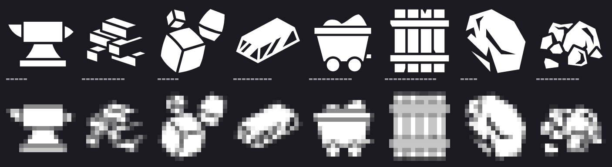

*anvil, brick-pile, cubes, metal-bar, mine-wagon, packed-planks, rock, stone-pile.* Surviving
16px: **anvil, metal-bar, mine-wagon, packed-planks**. Dissolving: brick-pile, stone-pile (the
same failure as the current ore), rock, cubes.

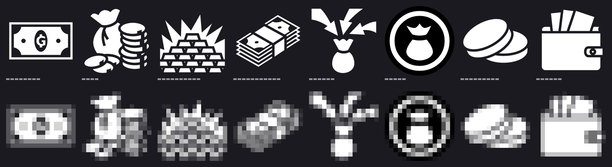

*banknote, cash, gold-stack, money-stack, profit, purse, two-coins, wallet.* Surviving 16px:
**banknote, purse, two-coins, wallet**. Dissolving: gold-stack (the worst of the eight),
cash, money-stack; profit reads as an arrow rather than as money.

**The rule both sheets prove, and the one to hold the three new icons to:** a glyph made of
many small repeated shapes does not survive 16 pixels. Population and Emissions will both tempt
an artist toward lots of little things.

### The two replaced

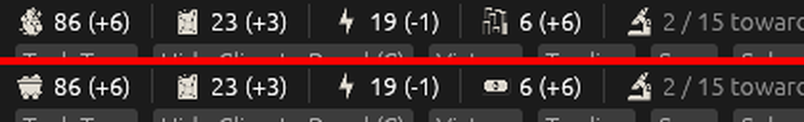

The designer chose **the mine cart for Materials** and **the banknote for Ducats**, both
Delapouite's, both from the surviving half of their sheets.

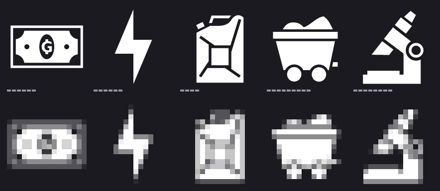

On the bar at its own size: Materials was a cluster of gem shards nobody could name and is now
a laden cart with wheels; Ducats was the lumpy mass that read as a mineral and is now
unmistakably a note. Fuel, Energy and Research are untouched, having read correctly all along.
The Credits screen follows the art, since the licence credits the icon actually used.

### Candidates for the three figures that have no icon

Population, Influence and Emissions are words on the board today. Eight candidates each, rendered
the same way: large above, and at the sixteen pixels the top bar draws, magnified, below. Only the
second row decides anything.

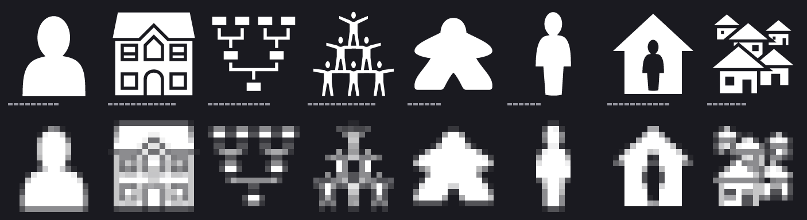

*character, family-house, family-tree, human-pyramid, meeple, person, player-base, village.*
Surviving: **person, meeple, character, player-base**. Dissolving: family-tree (a diagram, and the
wrong register), human-pyramid and village — both the many-small-shapes failure again.
**Recommended: person**, since population here counts people in a country rather than households
or settlements. **meeple** is the bolder glyph and would suit a game that means to feel like a
board game.

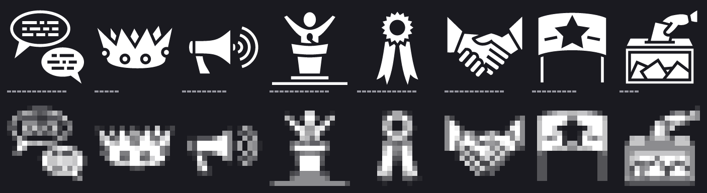

*conversation, crown, megaphone, public-speaker, ribbon-medal, shaking-hands, star-flag, vote.*
Surviving: **megaphone, star-flag, crown, shaking-hands**. Dissolving: conversation (two bubbles
smear into one), public-speaker (the figure vanishes into the podium), vote, ribbon-medal.
**Recommended: megaphone** — Influence is spent to win countries over, which is projection rather
than diplomacy between equals. **shaking-hands** reads as diplomacy if that is wanted; **crown**
implies you already rule the place.

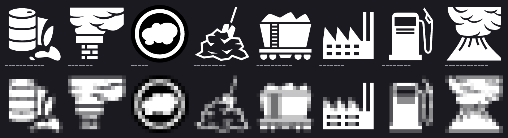

*barrel-leak, chimney, cloud, coal-pile, coal-wagon, factory, gas-pump, smoking-volcano.*
Surviving: **factory, gas-pump, cloud, chimney**. Dissolving: barrel-leak, coal-pile.
**Recommended: factory**, the most legible on the sheet, and it names the source — the game's
Emissions are literally industry. **chimney** if the smoke is wanted rather than the thing making
it. **coal-wagon is out regardless**: Materials is a mine cart now and the two would be twins at
sixteen pixels.

### The three chosen, and in place

The designer chose **the head-and-shoulders bust for population** (`character`), **the megaphone for
Influence**, and **the chimney for Emissions** — all three Delapouite's, all three from the surviving
half of their sheets. Two of the three went against the recommendation above, and both departures
are defensible: `character` is the same silhouette as `person` with a heavier shoulder line, which
is what makes it hold at sixteen pixels; and `chimney` names the smoke rather than the building,
which is the more honest label for a figure that counts eight sources and a sink rather than
factories.

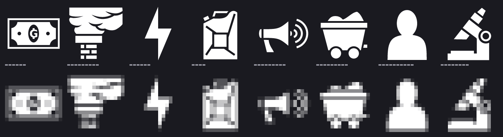

Left to right: **ducats, emissions, energy, fuel, influence, materials, population, research**. The
bottom row is the deciding one. The bust is the cleanest of the eight at size. The chimney is the
weakest: its smoke plume takes most of the sixteen pixels and the brick stack below narrows to a
couple of columns, so it reads as *smoke* rather than as *chimney* — which, for a figure named
Emissions, is arguably the right failure.

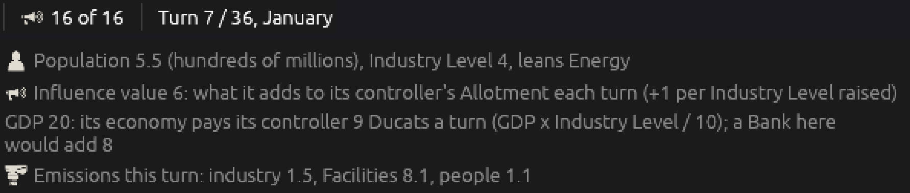

The rule the designer set for the resources — *"use the same way"* — is applied without exception:

- **On the top bar the glyph replaces the word.** Only Influence appears there, and it now reads
  `🕪 16 of 16` where it read `Influence 16 of 16`.
- **Everywhere else the glyph sits beside the words**, which is the Nation State card's population,
  Influence and Emissions lines, the card's Influence section, the Colony panel's Influence
  section, and the Climate Panel's Emissions block.
- **Inside a tooltip the glyph stands in for the word**, as it already did for the five resources.
  Population and Emissions needed their lower-case spellings added to that table as well, since the
  game's prose capitalises the five resources and Influence but writes those two mid-sentence.

The Credits screen carries all eight, and its heading is no longer "Resource icons", since three of
the eight are not resources.

### The glyphs come down into the lists, and Emissions joins the top bar

The designer's answer to *what does the Emissions glyph label*: everywhere it appears — the dense
lists, the Blame block, **and a new figure on the top bar**.

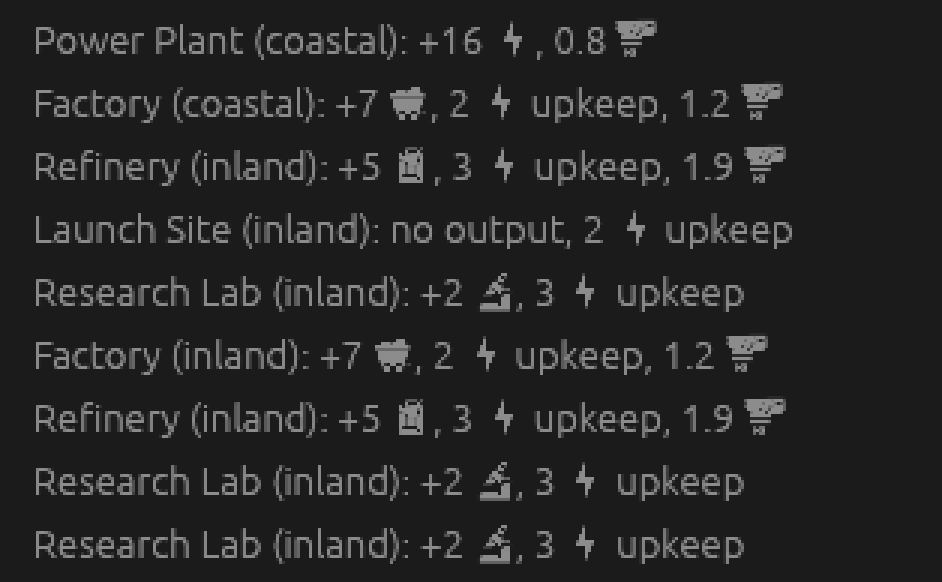

`Factory (coastal): +7 Materials, 2 Energy upkeep, 1.2 Emissions` is now
`Factory (coastal): +7 🛒, 2 ⚡ upkeep, 1.2 🏭`. This is the line a player compares two buildings
across, and the words were most of its width.

**The first attempt was wrong and the picture caught it.** Version 0.07.0's tooltip renderer swaps a
word for its glyph *anywhere* it appears, and pointed at a list that ate the word out of a
building's own name: `Research Lab (inland): +2 Research` came out as `🔬 Lab (inland): +2 🔬`. The
rule for a list is therefore narrower than the rule for prose — **a word is traded for its glyph
only directly after a number**, since that is what makes it a figure rather than a name. Tooltips
keep the old rule, because a tooltip is prose. A second, smaller fault in the same picture: the
commas floated a space away from their glyphs, because egui applies item spacing *after* a widget,
so the gap to close is the one the image leaves behind rather than the one before the punctuation.

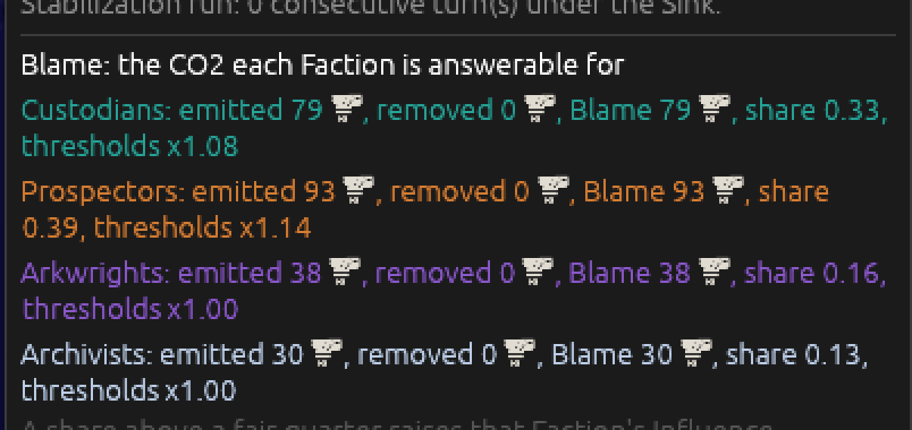

Every Blame figure is in ppm and so every one of them carries the glyph; *share* and *thresholds*
are not ppm and keep their words. `ppm` means Emissions **here and nowhere else** — four lines above
this block the same three letters are the CO2 Stock and a Scrubber's pull on the Natural Sink, and a
chimney against either of those would be a lie — so the renderer takes that word as a local extra
rather than learning it globally.

**An icon's colour belongs to the icon.** The first build of this block let the glyph take its
line's tint, so the chimney came out teal on the Custodians' line and orange on the Prospectors' —
which quietly made an icon's colour mean *whose*, the exact collision this version is trying to end.
The designer's correction, and its scope: *"I wanted the glyphs a single fill color... I want all
glyphs that are used to carry a single fill color everywhere they are used."*

So the rule is not a convention the Blame block follows; it is enforced by the shape of the code.
**Both icon constructors have lost their tint parameter.** A glyph's colour is now decided in one
function, `icons::fill(name)`, by which figure it is, and no call site can pass one — the compiler
refuses. Witnessed rather than assumed: putting `Color32::RED` back into a call site gives
`error[E0061]: this method takes 2 arguments but 3 arguments were supplied`, and removing it builds
clean again. The Faction colour stays on the words and the figures, where it has always meant
*whose*.

That function is also where the open half of this ticket lands. Today every figure answers the same
neutral off-white; if the designer gives each figure a colour, it is `icons::fill` that grows the
arms, and *one fill everywhere* holds unchanged.

`🏭 +47.5 ppm` sits after the Temperature. Until now the only way to learn whether the world went
over or under the Natural Sink this turn was to open the Climate Panel; the Temperature beside it
moves far too slowly to answer that question.

### Two building aids this needed

Photographing the Blame block turned out to be impossible, and the reason is a finding in itself.
The Climate Panel settles at about **400 rows tall whatever room it is given**, scrolls the rest,
and a scroll cannot be driven headlessly — so **the Blame block is below the fold for a player at
1280x800 too**, until they scroll or drag the panel. That is pre-existing, from ticket #53, and not
something this ticket introduced, but it is worth writing down.

Two aids now exist, neither part of the spec: `window:<w>x<h>` sets the off-screen window's size,
and `climate:top` opens the Climate Panel at the top of the window at full height. Together they
photograph a panel taller than the screen.

### Palette candidates

Rendered on the real bar and the real Facility list rather than mocked, by a building aid
`palette:<n>` that swaps what `icons::fill` answers. Nothing is decided here; these are for looking
at.

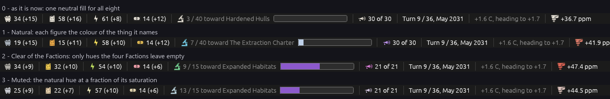

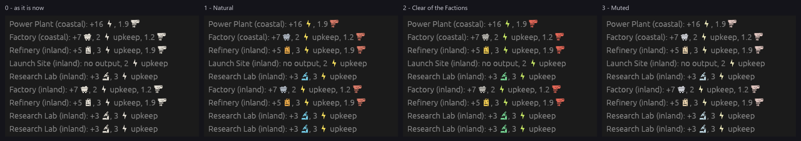

**What the pictures say.** In the *lists* colour does real work: with candidate 1 or 2 the question
"which of these buildings emits?" is answerable without reading a word, because the red chimneys
pick themselves out of the row. With candidate 0 or 3 it is not. **Candidate 3 (Muted) is very
nearly candidate 0** — at sixteen pixels the desaturated hues are almost invisible, so it buys the
cost of a second colour language and delivers almost none of the benefit. Candidate 2 pays a
different price: a *pink* banknote and a *green* microscope do not name anything, so the colours
become a code to learn rather than a reminder of what the figure is.

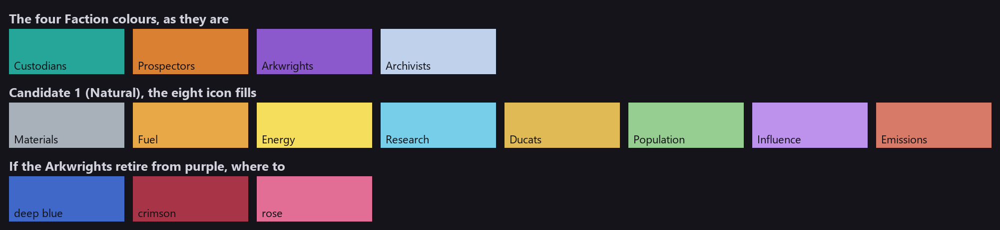

**Where the two schemes actually collide**, which is what the ticket's fourth option exists to fix.
Against candidate 1 there are four near-neighbours and they are not equally bad:

- **Influence's lilac against the Arkwrights' purple** — the worst by a distance, effectively the
  same hue at different lightness.
- **Fuel's amber and Ducats' gold against the Prospectors' orange** — close, and there are two of
  them.
- **Materials' steel grey against the Archivists' pale blue** — both desaturated and light.
- **Research's cyan against the Custodians' teal** — the mildest; cyan is markedly lighter and bluer.

So retiring **one** Faction hue does not clear the board on its own: moving the Arkwrights off purple
removes the worst collision and leaves the Prospectors' one. The other half of the answer is to nudge
the icon colours rather than the Faction ones — Fuel toward straw and Materials toward a warm grey
cost nothing, because no player has learned them yet, whereas a Faction colour is something they
read on the map every turn.

### The designer's palette, checked before it is nailed down

The designer's amendment to candidate 1: *"let's go natural but make duckets the green of the
research icon in the clear of factions pallet, shift the jerry can redder and the emissions browner.
As for factions slightly darken the arkwrights purple and replace the archivists with crimson.
Please check these don't conflict."*

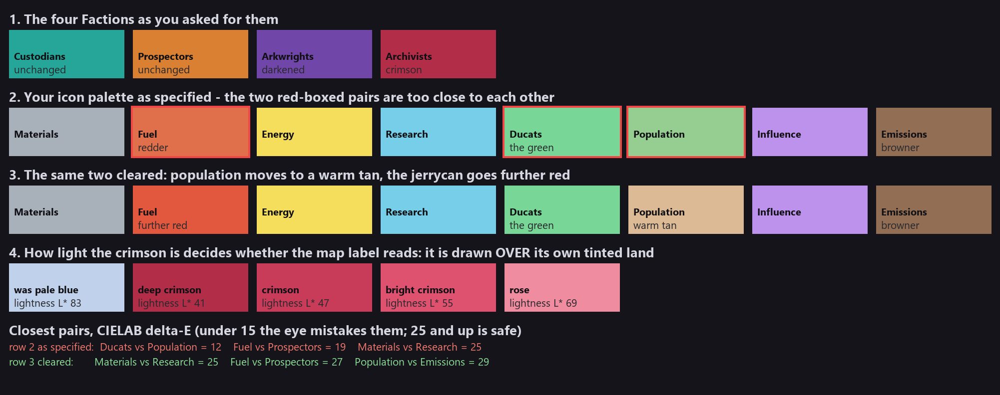

Checked by measuring, in CIELAB, the distance between every pair of colours on the board — icon
against icon and icon against Faction. Below about 15 the eye mistakes two colours for each other;
25 and up is comfortable. **Two pairs came back too close, and neither is visible on a swatch row
until it is measured:**

- **Ducats against population, ΔE 12.** The green asked for for Ducats is all but the same colour as
  the green candidate 1 gave population — RGB (120,214,150) against (150,206,146). They would stand
  in the same Facility list.
- **Fuel against the Prospectors, ΔE 19.** Shifting the jerrycan *redder* from amber moved it
  **toward** the Prospectors' orange rather than away: amber sits at hue 36 degrees, the Prospectors
  at 28, so a partial shift red lands on top of them. Going *further* red, past them to hue 13,
  clears it again at ΔE 27.

Row 3 clears both: **population moves to a warm tan**, which a bust of a person wants anyway and
which leaves the asked-for green exactly where it was asked for, and **the jerrycan goes further
red** rather than part way. The worst remaining pair is Materials against Research at 25.

Everything else the designer asked for measured clean. Darkening the Arkwrights' purple *does* open
the gap to Influence's lilac, from the 12 that made it candidate 1's worst collision out to 30.

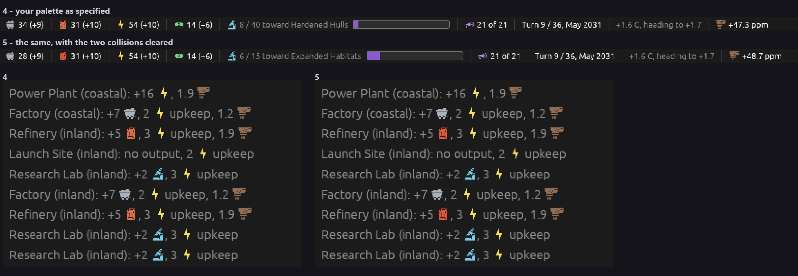

### What the swatches could not show: crimson on the map

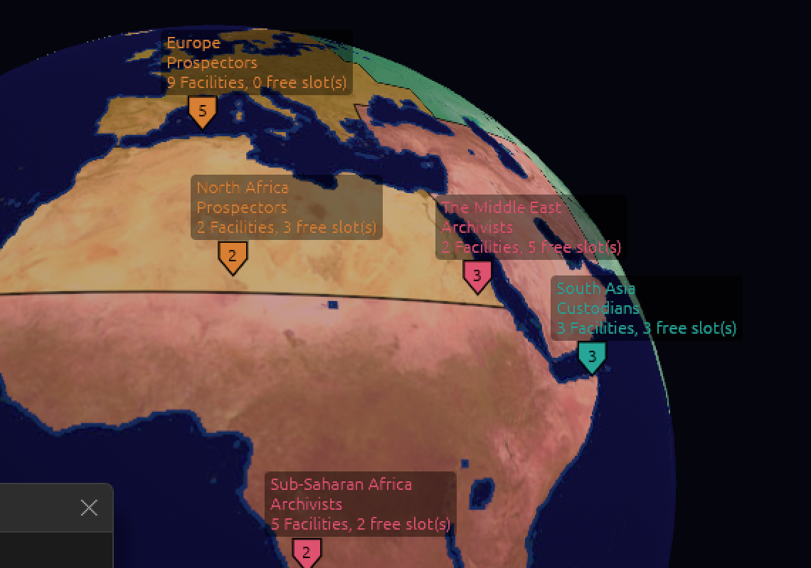

A Faction's colour does two jobs: it tints that Faction's territory on the globe **and** prints the
label drawn on top of it. The Archivists' pale blue-white had a lightness of **L\* 83** and so read
against anything. Crimson is dark by definition — L\* 41 deep, 55 bright — and in the picture above
the Archivists' own labels nearly vanish into their own pink land, at the *bright* value. The
Custodians and Prospectors sit at L\* 62 and read; the Arkwrights are being taken from 48 down to 39,
in the same direction.

This is not an argument against crimson. It is a choice between three answers, and it is the
designer's: take the crimson lighter, to a rose at about L\* 69; keep it deep and accept that
Archivist labels are read from the shield markers and the panel rather than the map; or lighten
**every** Faction's map-label text by a fixed amount, which would help the Prospectors too and is a
small change to one function.
