# Version 0.07.2, the atlas version

The map is [Map: version 0.07.2](https://github.com/whaleyjoshua2/Dying-Earth/issues/120). Branch
`version-0.07.2`, cut from `main` after version 0.07.1 merged as
[pull request #119](https://github.com/whaleyjoshua2/Dying-Earth/pull/119).

## The Nation card: plain verbs, prices in glyphs, and no Influence controls

Ticket [#121](https://github.com/whaleyjoshua2/Dying-Earth/issues/121). The designer's four lines,
answered (a) each:

> Remove "(free)" in all cases that don't refer to build slots e.g mothball; decommission; load emigrant
> build portion of the nation card should use icons rather than words for built cost e.g no (25 materials) just +25 ICON
> build portion of the nation card needs to adjust mouse over to exclude costs - that's already stated. Also the words "once it stands" replace that part with the turn cost
> remove buttons to buy/spend influence from nation card

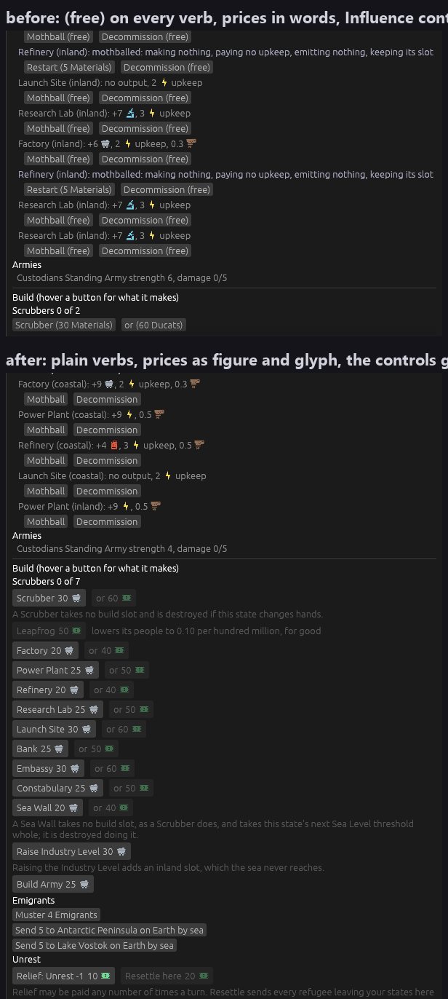

**"(free)" came from one place** — `Cost::text()` prints `free` for an order with no price, and every
button printed its price in parentheses. The button no longer prints a price it does not have:
`Mothball`, `Decommission`, `Muster 4 Emigrants` are plain verbs. The slot rows' `free`, which is a
count of empty slots, is untouched, as asked.

**A price is a figure and a glyph, unsigned.** `Factory (25 Materials)` is `Factory 20 🛒`, and the
Ducats alternative beside it is `or 40 💵`. The designer wrote `+25`; the figure carries **no sign**
because every other figure on the card is unsigned and the glyph already says it is a cost — offered
as a choice and taken. egui's own `Button` cannot hold an image mid-text, so a priced button is a
clickable group drawn in the button's own visuals (`UiBuilder::sense` for the response, the style's
`interact` for the hover and press colours); a free order stays a plain `Button`. A disabled one
dims the way a button does — Leapfrog, in the picture.

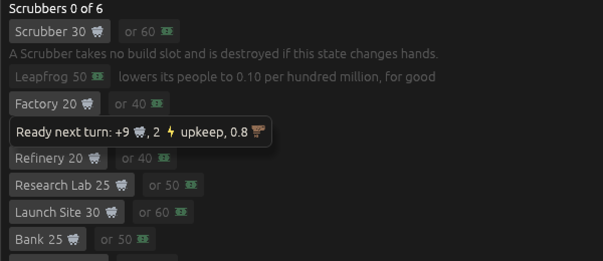

**The hover stopped repeating the price and started saying how long.** `Costs 20 Materials. Once it
stands: …` is now `Ready next turn: +9 🛒, 2 ⚡ upkeep, 0.8 🏭`, from the building's own `build_turns`.
Eight of the ten Facilities take one turn, so it is *next turn* far more often than *in 2 turns*.

**The Influence controls went; the figures stayed.** The spend box, the Spend button and the
"Buy more Influence in the Trading window" button are gone from a Nation State's card, since the
Command Cluster spends on the selected place and they had become a second copy. The Standings row,
the threshold line and the Blame note stay where 0.07.1 moved them, at the top — they are what a
player reads before pressing Spend in the corner. **A Colony's card keeps its controls**, that not
being what was asked; it is the obvious follow-up question and is on the ticket as one.

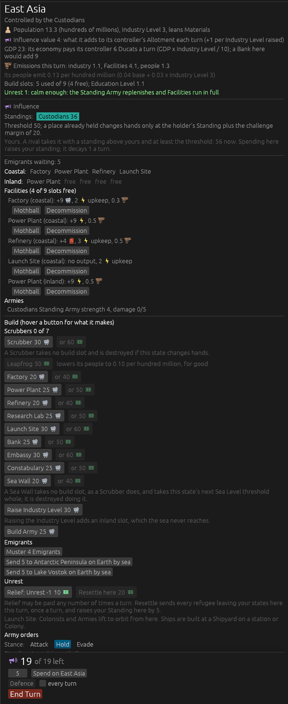

**The `tip:<word>` aid learned to fire once a frame.** Pointed at a card of twelve build buttons with
`tip:Ready`, it opened twelve tooltips at once, which is a picture of nothing. It now fires on the
first match per frame, and the build hovers go through `rule_tip` so the aid can reach them at all.

Clippy clean with `-D warnings`, 254 tests passing.

## A Region is named for its Nation, and wears its flag

Ticket [#122](https://github.com/whaleyjoshua2/Dying-Earth/issues/122). The designer's line: *"Nation
should be referred to as the primary power of the region and title card should display flag next to
name … South Asia - now India."*

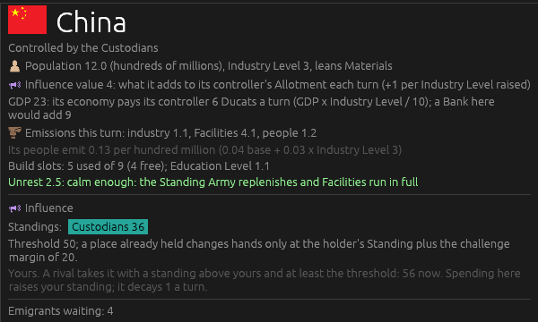

**The twelve are renamed**, reading (a) of three offered — not captioned, renamed, everywhere a name
is said: China, India, the United States, Brazil, Russia, Australia, **the European Union** and
**Iran** (the two the designer chose against the proposals of Germany and Saudi Arabia), Egypt,
Nigeria, Indonesia and Mexico. Ids did not move: `south_asia` is still the id of the Region now called
India, so saves, tests and the shot aids that name a Region by id are untouched. The geographic name
each was charted under stays as the comment above its block in `nation_states.toml`, since it still
says what ground a Region covers and the map ticket is about to redraw that ground.

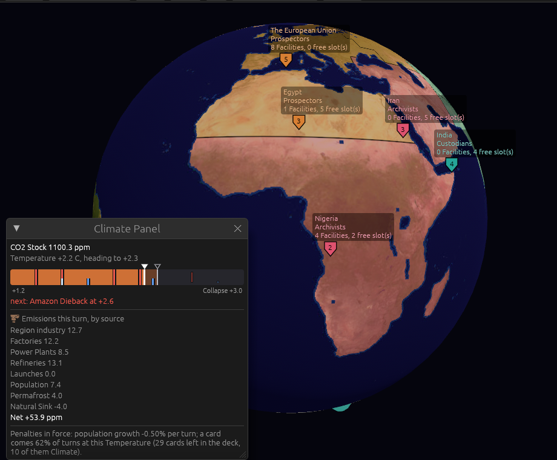

**The word changed with the thing.** A territory called India that holds Pakistan, Bangladesh and Sri
Lanka is not honestly a *Nation State*, and the game needed a word for the power itself. The designer
chose **Region** for the territory and **Nation** for the power — the second being the word in their
own line. `CONTEXT.md` gains a **Nation** entry, its **Nation State** entry becomes **Region** with
the history kept, and the interface says *Region* in the twenty places it said *Nation State*: the
roster heading, the Climate Panel's `Region industry`, the Earth Map help, the Trading window.

**The flag is thirty-two pixels tall and the name is set to match it**, the designer's answer to the
research's finding that at sixteen pixels a tricolour survives and an emblem does not — Egypt's,
Iran's, Mexico's, Australia's dissolve to a smudge — and that thirty-two brings the emblems back. A
flag is neither square nor tintable, so it is a second set beside the icons with its own renderer
(four by three, nothing stripped, nothing tinted) and its own fetch, `Icons::flag_from_ctx`. The
card's title went from 22 to 32 points to sit beside it.

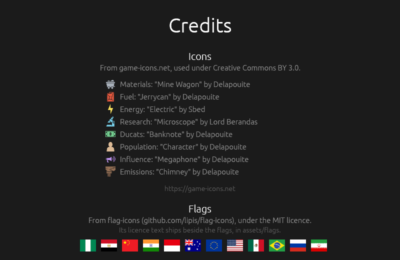

**The art is flag-icons under MIT**, the research's recommendation, with its licence text shipped in
`assets/flags/LICENSE`. MIT asks nothing on screen; the Credits screen names it anyway, with the
twelve flags in a row, since a player who wonders where the art came from should not have to open a
folder to find out. The provenance caveat the research raised — that the project's per-flag MIT claim
rests on its own word about where the originals came from — is on the ticket.

**Two builder's calls, for the designer to veto.** *The European Union* and *The United States* carry
a leading *The* in their names, following *The Middle East* before them, so Report lines read
"the Custodians founded … in The United States" rather than "in United States" — capital T
mid-sentence and all, which the Middle East already had. And **eight tests that pinned old names in
Report text** ("Emigrants mustered in East Asia", "You play the Custodians from East Asia") now pin
the new ones; nothing they test changed.

Clippy clean with `-D warnings`, 254 tests passing.

## The Earth Map redrawn along real borders, and two more Regions

Ticket [#125](https://github.com/whaleyjoshua2/Dying-Earth/issues/125). The largest change in the
version: the borders stop being lines and become countries, and twelve Regions become fourteen.

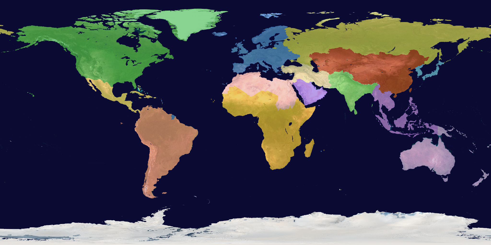

**The borders are countries now.** `examples/prep_assets.rs` had drawn every border as a line of
longitude or latitude — its own words were *"a board, not an atlas."* It now reads Natural Earth's
Admin 0 countries at 1:50m (public domain; the research on [#124](https://github.com/whaleyjoshua2/Dying-Earth/issues/124)
found it and measured that World Bank totals over a country-by-country assignment reproduce the
game's own figures), fills each country polygon into the 2048-by-1024 grid, keeps the coastline from
the photograph as it always did, and floods the land the polygons miss — 44,721 pixels, 3.6 % of the
land — from the nearest Region. 242 countries went in; four Antarctic and Indian Ocean territories
had no Region and took the nearest by the flood, which is right for them.

**A country belongs whole to one Region, and an island belongs to its country.** The designer took the
research's block of flagged cases as recommended, with one exception — **Cyprus to the European
Union** — and kept **Greenland with the United States'** Region. So Kazakhstan, the one country the
old lines split, goes whole to China's Region; all of Indonesia goes to Indonesia's, with the real
border across New Guinea at 141° E; Hawaii goes with the United States and the Canaries with Spain.
One consequence is written down rather than hidden: Natural Earth keeps **French Guiana, Réunion and
Mayotte inside France's feature**, so under this rule they are the European Union's — French Guiana is
the blue notch on South America's north coast in the preview.

**Two Regions were added, and the designer split the difference between the research's two pairs.**
*Japan and Korea* out of China's Region, from the economy-first pair, and *the Arabian Peninsula* out
of Iran's, from the geography-first pair. Their Nations are **Japan** and **Saudi Arabia**. The figures
follow the rule ticket #53 set — a split hands out its parent's figure exactly — so China went 16.4 /
23 / 4 to 14.4 / 17 / 3 with Japan taking 2.0 / 6 / 1, and Iran went 3.5 / 5 / 4 to 2.5 / 3 / 2 with
the peninsula taking 1.0 / 2 / 2. The rest of each new card is set by hand and written beside it in
`nation_states.toml` for the designer to veto: Japan leans Energy, has the most exposed coast on the
map and the highest Education Level after Europe and North America; the peninsula leans Fuel and
inherits the Middle East's Emissions figure. No Faction's home moved.

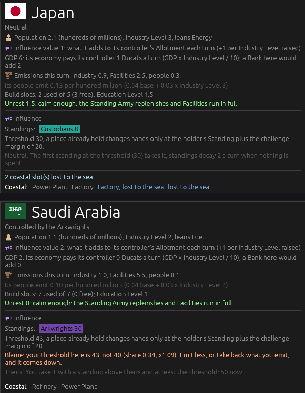

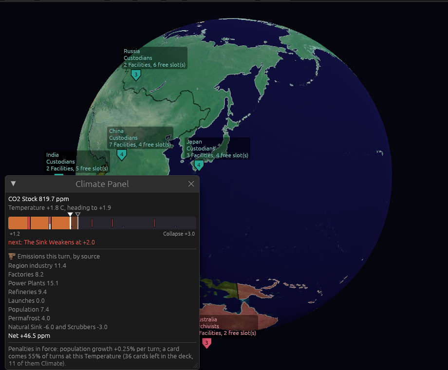

**Fourteen tests broke, and every one of them was pinning the old world.** Allotments that assumed
China at Influence 4, Ducats that assumed GDP 23, the coastal-slot count of the world, the spreading
rule's start picks, refugee flows into a neighbour set that now includes Japan, and a share-out test
whose Asia had three members. Each was moved to the new figure with the reason written beside it.
Two were more interesting. **The start-Facility rule caught a hand-set card**: every card starts with
as many Facilities as its Industry Level and only two carry a Lab (#69), and the first draft of Japan
had three plus a Lab; the rule won, and Japan starts with two Factories and a Power Plant. And **the
sea-crossing test had been asserting a coincidence**: a fresh Antarctic Colony holds `min(n, room)`,
room is the slot's Habitat yield, and that yield is *drawn from the seed* — fourteen Regions shift the
stream, so the slot's room is 7 on that seed where it was 8. The test's claim is that nobody is lost,
not that eight land; it now asserts that.

**The sweep baseline restarts here.** Twenty seeds in each of four seatings, on fourteen Regions:

| seat 0 | wins | Collapses | tree completes |
|---|---|---|---|
| Custodians | Custodians 12 | 8 | 20 of 20 |
| Prospectors | Custodians 20 | 0 | 20 of 20 |
| Arkwrights | Custodians 19, Arkwrights 1 | 0 | 13 of 20 |
| Archivists | Custodians 19, Archivists 1 | 0 | 20 of 20 |

**Custodians 70 of 80, Collapses 8, Prospectors 0.** Nothing measured before this is comparable — the
board itself changed — and the honest reading is that the standing imbalance came through the redraw
untouched, which is what a map version should expect. Two things to carry forward: the spreading rule
now seats the third computer player in **Saudi Arabia** rather than Sub-Saharan Africa, since the
peninsula is untouched at Industry 2 and more populous than Australia; and **Saudi Arabia pays no
Ducats** — GDP 2 × Industry 2 / 10 rounds to nothing — which the sharing rule produced and which the
designer may not want for the oil state.

`serde_json` joined `Cargo.toml` as a dev-dependency so the example can read the GeoJSON; it was
already in the lock through bevy, and nothing new enters the shipped game. Clippy clean with
`-D warnings`, 254 tests passing.

## The start is chosen on the map, and every Region has a colour of its own

Ticket [#126](https://github.com/whaleyjoshua2/Dying-Earth/issues/126). *"Starting location selection
screen should display the regions and allow the player to choose by clicking map; retire the
clickable list."* And, arriving mid-ticket while the designer looked at the mask preview: *"i'd like
neutral countries the default colors in this latest mask test. shown on the start screen and on the
globe."*

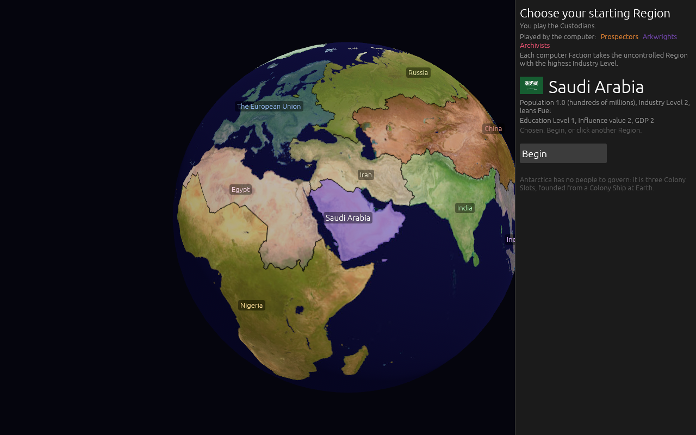

**Every Region carries a colour of its own now**, on its card in `nation_states.toml`. A Region
nobody holds wears it on the globe at 0.35 strength; a held Region wears its holder's Faction colour
at 0.45 as before, so the two still read apart; the light coastline stays a mark of a held Region.
On the start screen, where nothing is held, all fourteen wear their colours with their borders drawn
— it had shown the bare photograph. The mask generator's preview reads the same numbers from the
same cards, so the picture it draws and the board a player sees agree to within a rounding of two in
255.

**Six of the colours collided with a Faction, measured before they were shown.** In CIELAB, Brazil's
orange sat 8 from the Prospectors' — the same colour — and Iran, Australia, Saudi Arabia, China and
Egypt sat within 25 of one Faction or another, so a neutral Region could read as a held one. A search
over candidate hues found six that clear every Faction by 29 or more and their own neighbours by 30
or more; the designer took them as proposed: Brazil to salmon, Iran to cream, Australia to lavender,
the Arabian Peninsula to a blue-violet (still violet, as asked, pushed off the Arkwrights' purple),
China to brick, Egypt to pale rose. India and the United States are both green, 11 apart, and were
left — opposite sides of the globe, and clear of every Faction.

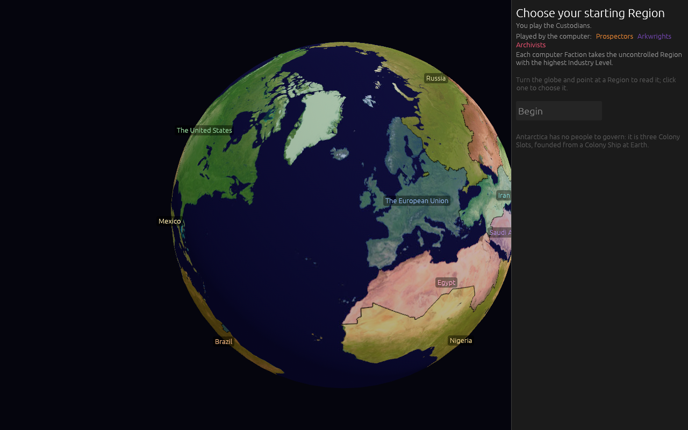

**The list of fourteen buttons is gone.** In its place: every Region's name painted on the globe in
its own colour, where the game view paints it; the Region under the pointer lit at 0.7 strength with
its card in the panel — flag at thirty-two, name to match, population, Industry, lean, education,
Influence value, GDP; a click that **chooses** rather than starts, since a globe of real borders has
small Regions beside large ones and a mis-click on Japan should cost nothing; and a **Begin** button.
The flag lives in the card and not on the globe, the research having measured that a flag at label
size is a smudge for half the fourteen.

**A click answers by the border you see.** The old picker took the *nearest label* — on a board of
straight lines that was close enough, and on a board of real borders it gave Kazakhstan to Russia
and the Nejd to Iran. It reads the mask now, the same mask the borders are drawn from.

**The globe is recomposed when the lit Region changes and only then.** A recompose is two million
pixels, and a hover is not a reason to do it every frame; the system remembers what it last drew lit.

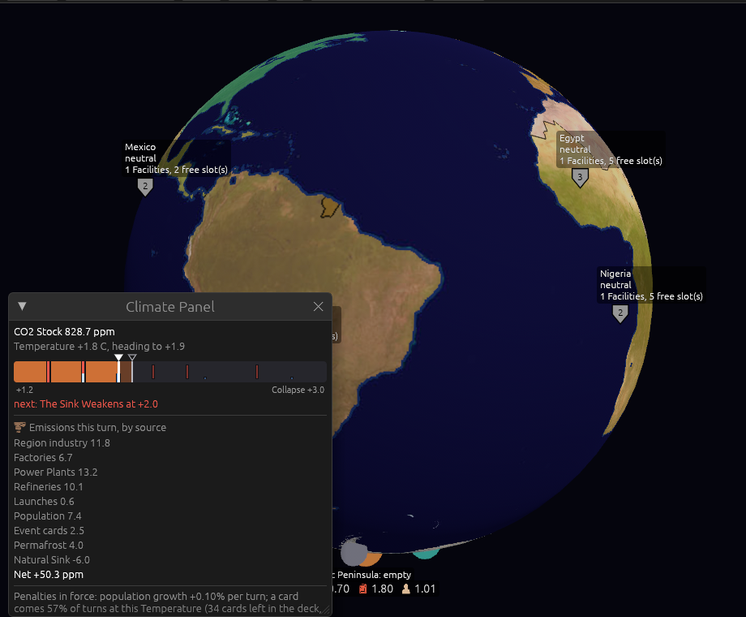

`start:<state>` is a new building aid — the start screen with that Region already chosen — since a
click cannot be made in a headless picture. Clippy clean with `-D warnings`, 254 tests passing.

## The roster's glyphs: candidates on a sheet

Ticket [#127](https://github.com/whaleyjoshua2/Dying-Earth/issues/127). *"Lets get a set of icons
denoting ships (one for military one for colony ship) than one for stations and one for colonies and
one for nation states to place in front of their text. keep these off white."*

Candidates from game-icons.net, each sheet large on top and then at 14 and 16 pixels magnified —
the sizes a roster row uses — since an emblem that reads at 512 can dissolve at 16. Names run left
to right.

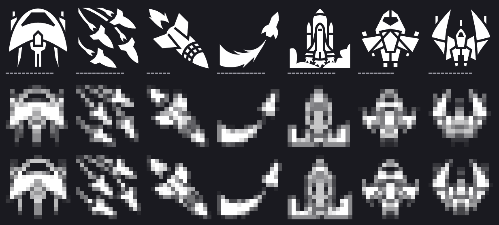

**Warship:** interceptor-ship, missile-swarm, rocket, rocket-flight, space-shuttle, spaceship,
starfighter.

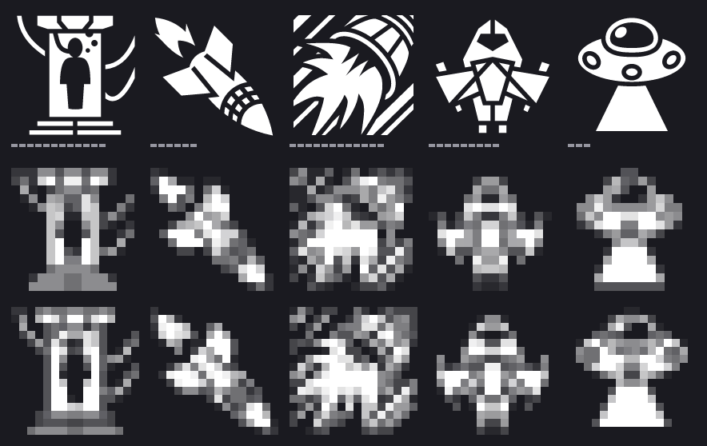

**Colony Ship:** cryo-chamber, rocket, rocket-thruster, spaceship, ufo.

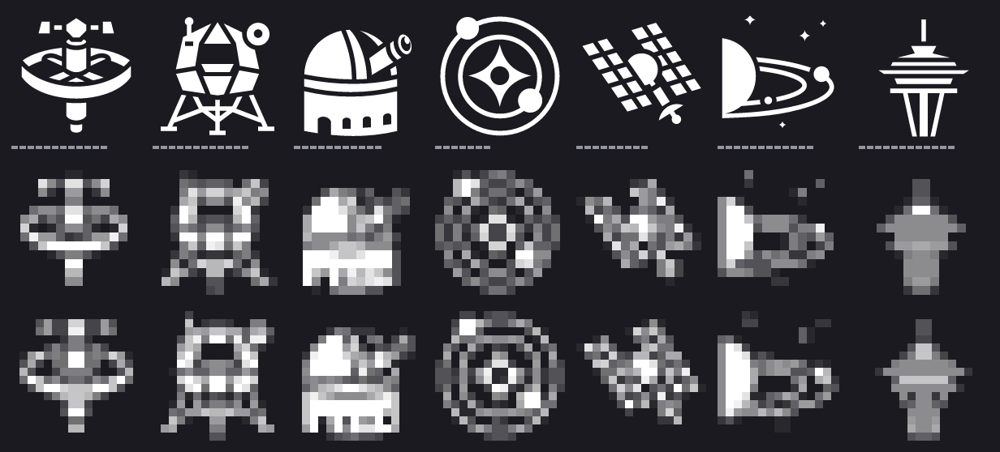

**Station:** defense-satellite, lunar-module, observatory, orbital, satellite, solar-system,
space-needle.

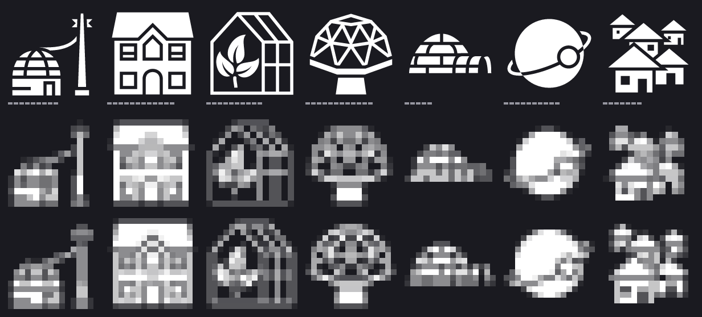

**Colony:** base-dome, family-house, greenhouse, habitat-dome, igloo, moon-orbit, village.

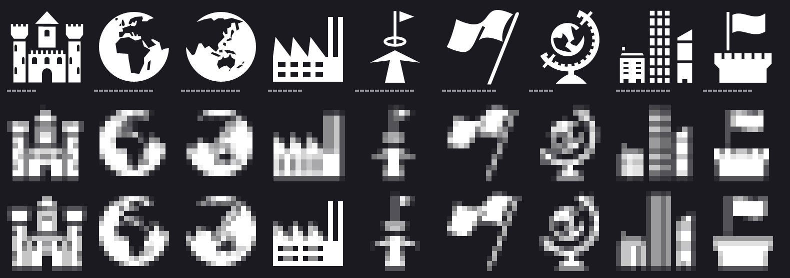

**Region:** castle, earth-africa-europe, earth-asia-oceania, factory, flag-objective, flying-flag,
globe, modern-city, tower-flag.

## The roster marks what wants an order, and everything wears the glyph of its kind

Ticket [#127](https://github.com/whaleyjoshua2/Dying-Earth/issues/127). *"Rather than a button to
filter I want an icon displayed to the right of the item indicating an order is needed. Lets get a
set of icons denoting ships (one for military one for colony ship) than one for stations and one for
colonies and one for nation states to place in front of their text. keep these off white."*

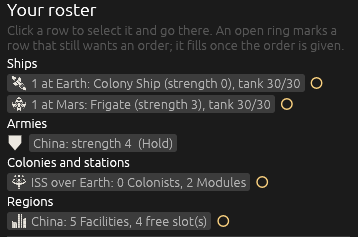

**The filter lasted one version.** 0.07.1 put a count on each heading, clickable to show only the
rows that still wanted an order; the designer replaced it with a mark on the row itself, and took no
count either. The heading is a heading again, and the filter's state and its `roster:filter` aid
went with it. In its place, **a ring at the end of every row that can want an order**: open, in the
warm amber the count wore, while the row still wants one this turn; filled, in a quiet grey, once
the order is given. A Ship in transit and an Army wear no ring, since neither can want anything —
the Army because it keeps the stance it was last given, as 0.07.1 decided.

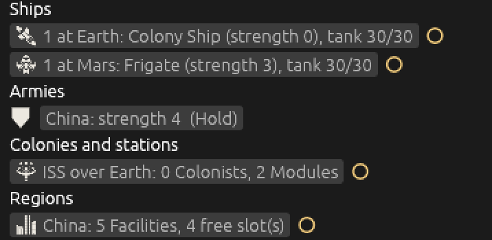

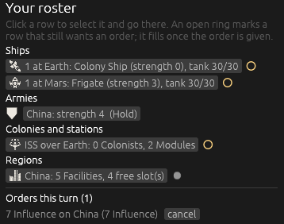

**Five kinds, chosen off the sixteen-pixel row of the sheets** filed above: the **warship** is
Delapouite's *Spaceship*, the arrowhead with wings; the **Colony Ship** is Lorc's *Rocket*, which
cannot be mistaken for it; the **station** Delapouite's *Defense Satellite*, the dish on a ring; the
**Colony** Delapouite's *Habitat Dome*; the **Region** Delapouite's *Modern City*, the designer's
pick over the globe and the flag. Asked about Armies, the designer gave them the **shield the Earth
Map already draws** for one — drawn, not loaded, so it needs no art and no credit. All six wear one
fill, a named **kind** entry in the palette (`icons::fill` maps the five names to it), so "off white"
is one number in one place and cannot drift if the neutral fallback is ever retuned for something
else. A Carrier, being a transport, wears the Colony Ship's glyph: the designer named two kinds of
Ship and not three.

**Everywhere a thing is named, at the designer's word — (c).** The map labels first:

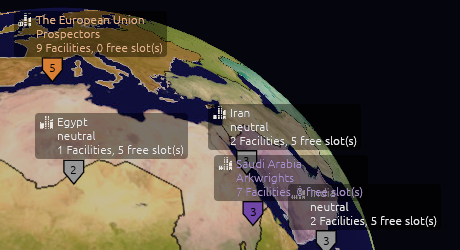

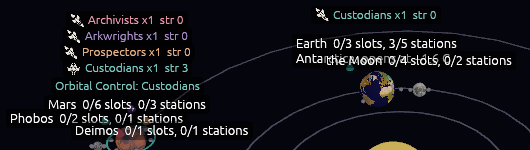

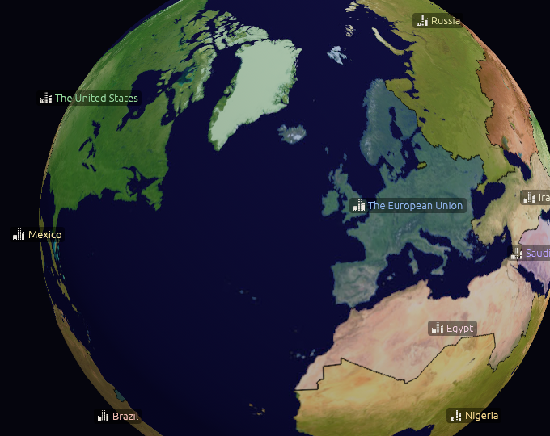

A map label is painted, not laid out, so the glyph is painted beside the text in the same box and
the pair is centred where the bare label was; where the art has not loaded the bare label is drawn,
so the map cannot go mute. The Report, where a line that points somewhere wears the glyph of what
it points to; and the card titles:

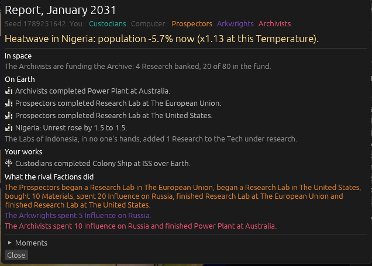

**The Region card keeps its flag and takes no glyph** — a builder's call, for the designer to veto:
a flag at thirty-two beside a name at thirty-two is already the card's mark, and a city glyph as a
third item in the title row read as clutter. Everywhere else a Region is named it wears the city.
A Report line that points at a Body wears nothing, a Body being no one kind of thing.

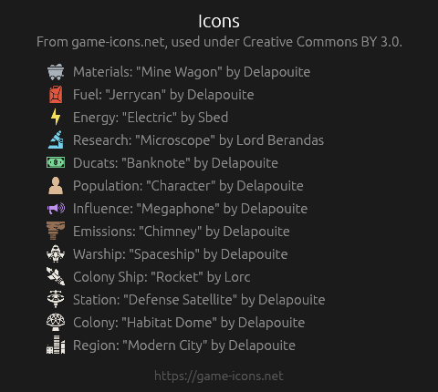

**Five credits**, and a test that the credits and the folder agree: every SVG in `assets/icons/`
must have its line and every line its file. Witnessed red with `region.svg` hidden — *left: [..12
names without "region"] right: [..13 names]* — and green restored. `attend:1` is a new building aid
(the standing Defence order switched on for seat 0, so a filled ring can be photographed; wants
`threat:1` to have anything to defend). Clippy clean with `-D warnings`, 255 tests passing.

## The top bar: Influence before Research, larger buttons, and every key named

Ticket [#128](https://github.com/whaleyjoshua2/Dying-Earth/issues/128). *"swap influence and science
locations / make buttons slightly larger and place all short cut keys in () in the text."*

**The swap.** Influence stands left of Research now, and the race bar and the **Pick a Tech**
button — which appears only when the Research Lead owes a pick — went with Research, being its
furniture. The figures are otherwise as 0.07.1 left them.

**One step larger.** The buttons' text went from egui's 14 to 15 and their padding from 4×1 to
10×5; the figures above them did not grow, being sized to their glyphs already. The row is still
one row at 1280 wide.

**A key for every button**, named in parentheses in its text: `Tech Tree (T)`, `Climate Panel (C)`,
`Victory (V)`, `Trading (R)`, `Save (Ctrl+S)`, `To Earth (Tab)` / `Solar System Map (Tab)`,
`Back (Esc)`. Each key toggles its window as the button does. Save takes Ctrl, since a bare key that
writes a file over the last save is a hazard; and the key honours the same rule the button does —
no save while an order is pending. In the Command Cluster, **End Turn (Enter)**, and nothing else
there names a key, at the designer's word; the spectator's End Turn on the bar says the same.

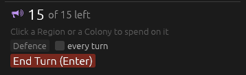

**Enter goes through the button's door.** Pressing End Turn — by button or by key — is one function
now: dead while a Tech pick is owed or a popup is up; with Influence unspent it raises the
confirmation rather than ending the turn; and on that confirmation, Enter again confirms it, being
the same key asked the same question. A key can never do more than its button.

**Nothing fires from behind a popup.** `Tab` and `C` used to work while the Report or a Moment was
showing; an `Enter` that ended the turn from behind the Report would have been an accident waiting
to happen, so while a popup is up `Esc` is the one key that does anything — it closes the popup —
with the End Turn confirmation's Enter as the sole exception. Every key still stands down while a
text box has focus, as before, so nothing types into the spend box.

Clippy clean with `-D warnings`, 255 tests passing; the change is all interface, and the pictures are
its check.
