# Version 0.07.3, the depth version

The map is [Map: version 0.07.3](https://github.com/whaleyjoshua2/Dying-Earth/issues/131). Branch
`version-0.07.3`, cut from `main` after version 0.07.2 merged as
[pull request #130](https://github.com/whaleyjoshua2/Dying-Earth/pull/130).

## Resource glyphs on the start screen

Ticket [#132](https://github.com/whaleyjoshua2/Dying-Earth/issues/132). The designer's line: *"Use
resource icons for faction selection cards on start screen and for territory cards when selecting
starting location."* Decided in one round and a half: the Multipliers line as a **compact glyph row**
(option c), every multiplier shown so the four cards line up; a mixed line where a piece has no
glyph; every price in the paragraphs by the existing rule, `12 Colonists` staying words; `leans 🛒`
on the start globe's Region panel, and a second line there of the three figures a start is chosen on.

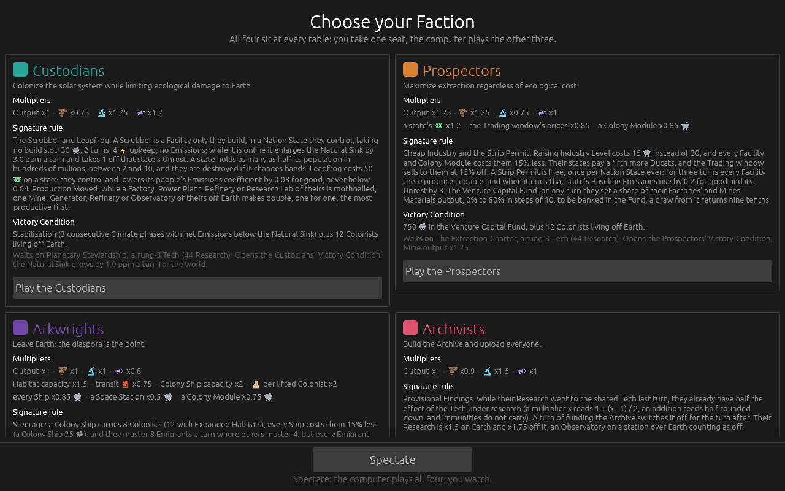

**The Multipliers line is a row of glyphs.** `Output x1 · 🏭 x0.75 · 🔬 x1.25 · 📣 x1.2` where it read
`Facility and Module output x1; Emissions from Earth sources it controls x0.75; Research x1.25;
Influence Allotment x1.2`. Every multiplier is drawn, x1 included, so the same glyph sits in the same
place on all four cards. This is the one place the glyph rule bends -- the glyph *heads* a
multiplier instead of following a number -- and `CONTEXT.md`'s **Figure** entry now says so. The
phrase each glyph replaced is on its hover, through `rule_tip` so the `tip:<word>` aid can reach it:

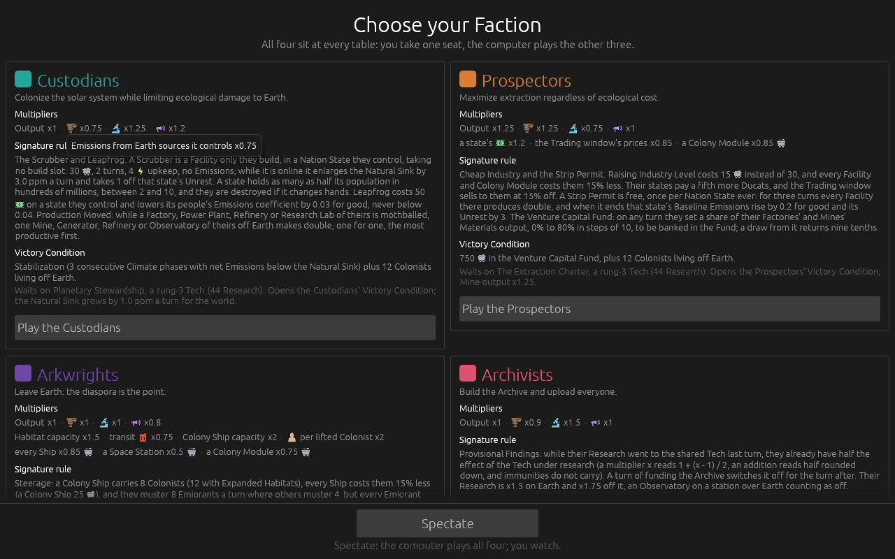

**The Arkwrights' extras are a mixed row**: `Habitat capacity x1.5 · transit ⛽ x0.75 · Colony Ship
capacity x2 · 👤 per lifted Colonist x2 · every Ship x0.85 🛒 …`. Only the eight Figures have glyphs;
a Habitat or a Ship is a piece and stays a word. **The paragraphs** take their prices by the existing
rule: `30 🛒, 2 turns, 4 ⚡ upkeep`, `Leapfrog costs 50 💵`, `750 🛒 in the Venture Capital Fund`, and
`(a Colony Ship 25 🛒)` now that a closing bracket rides on the word like a comma does.

**The first picture caught a layout fault** the suite could not: a row part was a nested
`horizontal` inside a `horizontal_wrapped`, laid out at the cursor and simply overrunning the card's
edge, so the Arkwrights' last part crossed into the Archivists' card. The part is now measured first
and the row broken before it, and a part that opens a new line takes no separator.

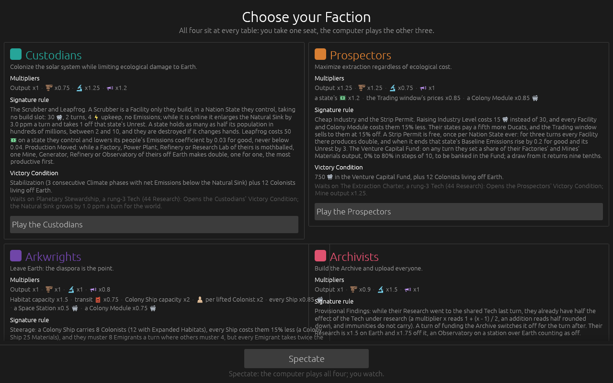

**The Region panel on the start globe** reads `👤 Population 14.4 (hundreds of millions) · Industry
Level 3 · leans 🛒`, and beneath it `📣 3 · 💵 5 a turn · 🏭 5.5 · Education Level 1.1`: the Influence
value, the Ducats a turn and the Emissions as the game opens, each with a hover saying what it is.
No game exists yet on that screen, so the engine grew `Tables::start_ducats` and
`Tables::start_emissions`, computed from the cards as turn 1 will compute them -- and the Ducats
formula moved into `Tables::base_ducats`, one place that `Game::state_ducats` and the panel both
read, so the ticket that changes the formula changes one line.

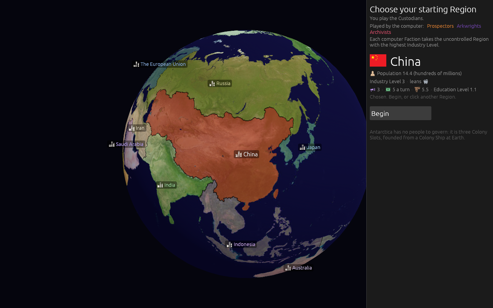

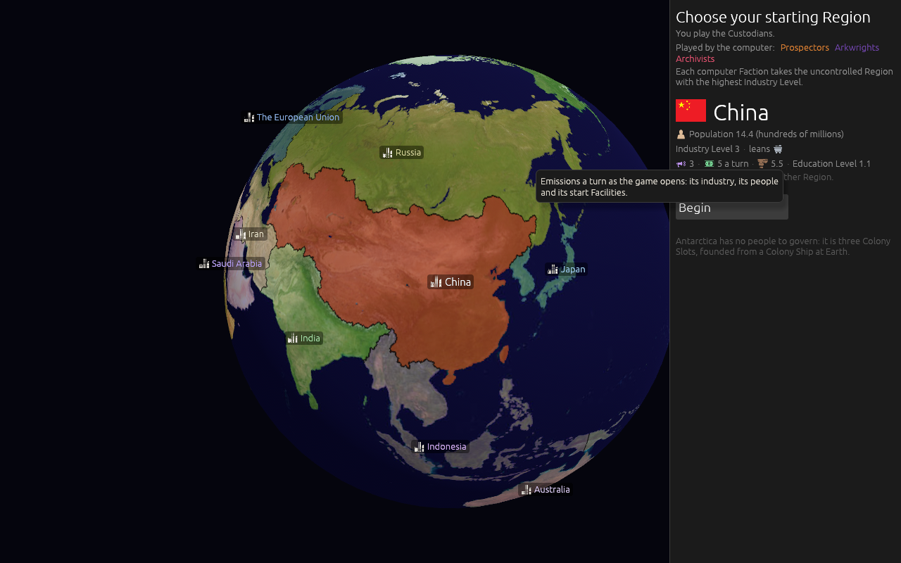

Clippy clean with `-D warnings`, 255 tests passing.

## The Tech Tree transposed

Ticket [#133](https://github.com/whaleyjoshua2/Dying-Earth/issues/133). The designer's line: *"Transpose
tech tree."* Decided in one round: branch names as row headings on the left; two Techs on one rung
side by side; no rung headings; elbowed prerequisite lines; the effect staying on hover.

**One row per branch, one column per rung**, so time runs left to right the way a tree is read.
Industry and Society each hold two Techs on one rung; they sit **side by side** and the column widens
for that rung, because stacked the tree would be seven box-rows tall (about 700 pixels) and would
not fit under the top bar, where side by side keeps it five rows and about 640 wide.

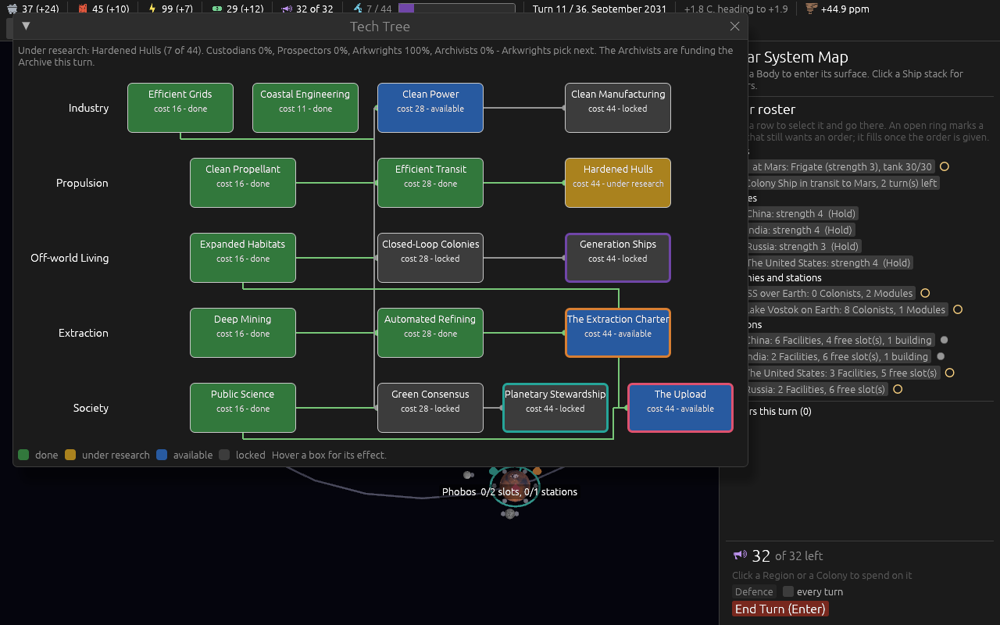

**The lines are elbowed.** A line leaves the needed box, runs along the gap to the left of the
needing box's column, and enters the needing box's left edge, so it never crosses a box; a Tech that
needs one on its own rung (Closed-Loop Colonies needs Clean Power) is reached the same way, out of
the needed box's left edge and down the same gap. Two things the first pictures caught that the
decision had not said: **every line into a column merged into one trunk**, so nobody could tell
which Tech fed which, and **a line from Efficient Grids to Clean Power ran behind Coastal
Engineering**, which then seemed to be the source. Each source row now takes its own lane in the
gap, and a line whose source has a neighbour in the way leaves the box's bottom, runs along the
row gap, and only then climbs the lane.

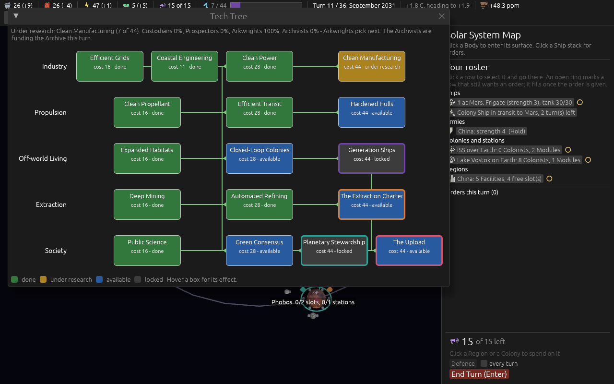

Clippy clean with `-D warnings`.

## Defence gives way to Max

Ticket [#134](https://github.com/whaleyjoshua2/Dying-Earth/issues/134). The designer's line: *"Get rid
of defense button replace with a max spend button that just say Max."* Decided in two rounds: one
press places the order; Max exactly where Defence stood; the computer players lose the rule too and
go back to their own arithmetic; `every turn` survives as Max's standing order, ending on untick, on
the placed order being cancelled, or on the place being lost; Defence retired from the vocabulary.

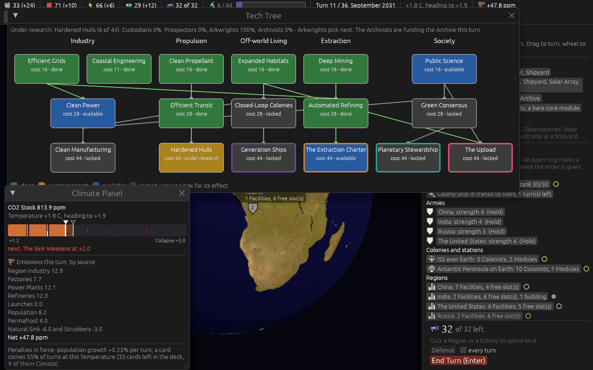

**Max, in Defence's row.** With a Region or Colony selected and Influence left, one press places one
order spending all of it there; with nothing selected it is greyed out and its hover says to click a
place. The Spend box and button stay above it for a lesser amount.

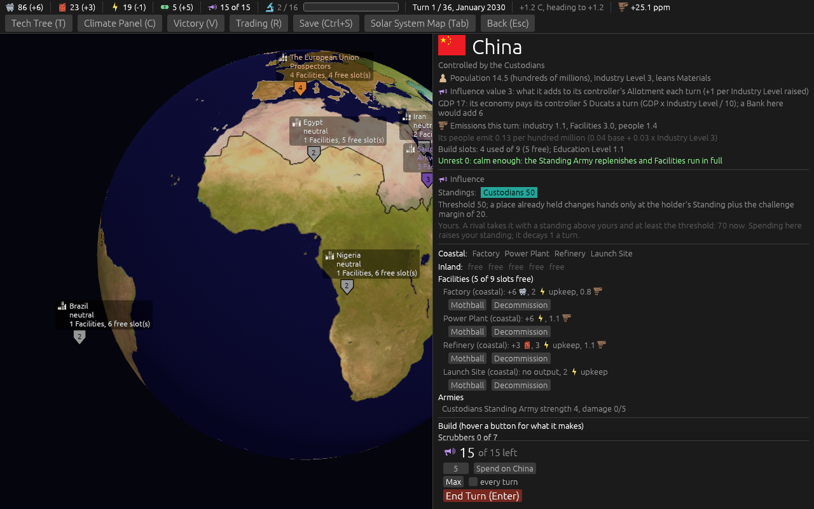

**`every turn` is now Max's standing order.** Ticking it remembers the place selected at that moment
(`every turn on China`), and at the start of each turn the whole Allotment is placed on that place as
an ordinary pending order, readable and cancellable like any other. It ends when the box is unticked,
**when the player cancels the placed order** (the designer's addition on the ticket), or when the place
is no longer theirs to spend on, which the Report says. The order behind it is `SetMaxStanding`, with
the place inside it, where `SetDefenceStanding` carried a flag.

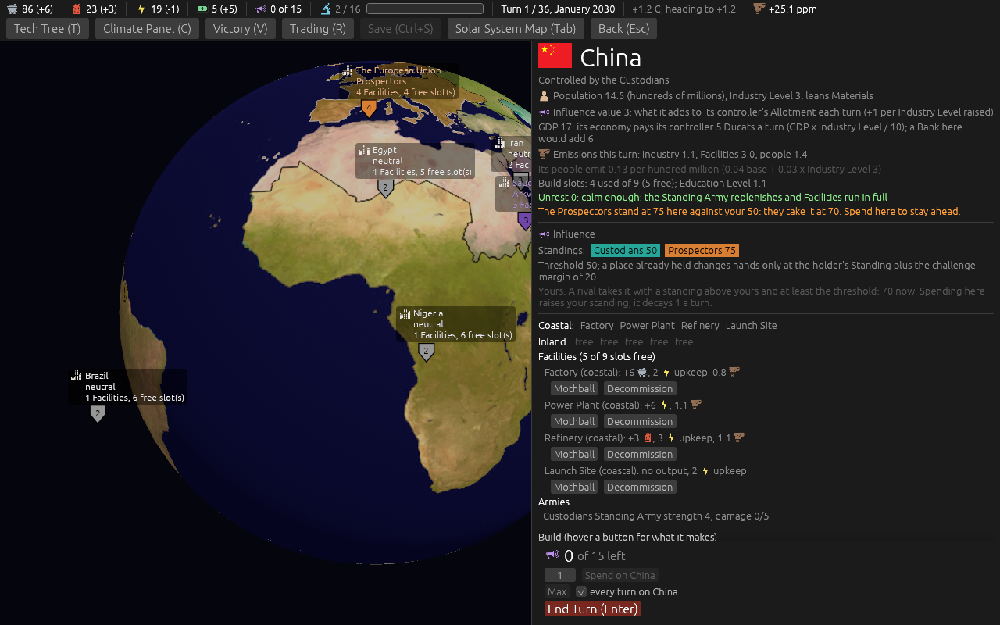

**The computer players lost the rule with the button.** Ticket #114 had given them `defence_needs`,
the same rule the player's button split by; the designer's answer was *"computer players lose it too"*,
and they are back on ticket #75's arithmetic -- once a rival's Standing comes within two steps of
their own, push as many holds as it takes to stand two steps clear of the rival plus the margin.
`defence_needs` and `defence_split` are gone from the engine with their two tests, and the ticket-#114
AI test is the ticket-#75 one again.

**Measured, twenty seeds in each of four seatings, after the change, against the 0.07.2 baseline:**

| seat 0 | wins | Collapses | tree completes | 0.07.2 baseline |
|---|---|---|---|---|
| Custodians | Custodians 12 | 8 | 20 of 20 | Custodians 12, Collapses 8, 20 of 20 |
| Prospectors | Custodians 19, Arkwrights 1 | 0 | 20 of 20 | Custodians 20, 20 of 20 |
| Arkwrights | Custodians 20 | 0 | 15 of 20 | Custodians 19, Arkwrights 1, 13 of 20 |
| Archivists | Custodians 19, Archivists 1 | 0 | 20 of 20 | Custodians 19, Archivists 1, 20 of 20 |
| **totals** | **Custodians 70**, Arkwrights 1, Archivists 1 | **8** | **75 of 80** | Custodians 70, Arkwrights 1, Archivists 1, Collapses 8, 73 of 80 |

Two games in eighty changed hands and the tree completed twice more: the cruder holding rule costs
the computer nothing the sweep can see. The Custodians' seventy stays exactly seventy, which is the
imbalance the map carries as out of scope, untouched. (The instrument is `simulate:<seed>
--player=<faction>` on the dev build; a game runs in under a second.)

Clippy clean with `-D warnings`, 253 tests passing.

## The station glyph is replaced: the candidates

Ticket [#135](https://github.com/whaleyjoshua2/Dying-Earth/issues/135). The designer's line: *"Replace
station icon."* Twelve columns from game-icons.net, rendered by the `icon_sheet` aid at full size and
at 13, 16 and 20 pixels (the map label, the roster row and the card title), left to right:

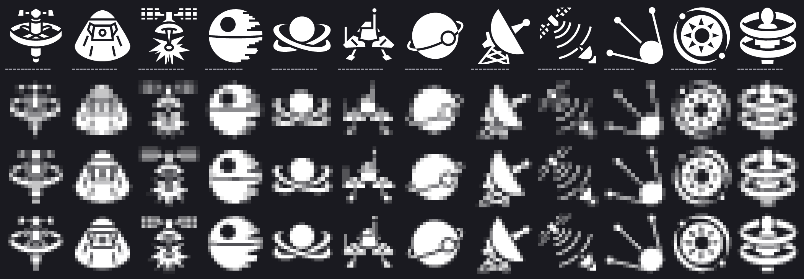

1. **Defense Satellite** (Delapouite), the glyph today, for comparison.
2. **Apollo Capsule** (Delapouite): a capsule at every size, but a capsule is a ship.
3. **Beam Satellite** (Delapouite): the panels dissolve at 13.
4. **Death Star** (Delapouite): the strongest shape at 13, but it reads as a moon with a crater.
5. **Double Ringed Orb** (Lorc): a body inside a tilted ring; survives at 13 and reads as a thing in orbit.
6. **Mars Pathfinder** (Delapouite): a lander on legs, thin at 13.
7. **Moon Orbit** (Delapouite): a planet with a small moon on a ring; clear at 13, mistakable for a Body.
8. **Radar Dish** (Lorc): clear at 13, but a dish on the ground.
9. **Satellite Communication** (Delapouite): the same dish family as today's; the waves go to mush.
10. **Spoutnik** (Lorc): the antennae thin to nothing at 13.
11. **Star Satellites** (Lorc): a ring round a sun, a blur at 13.
12. **Transportation Rings** (Lorc): busy at every small size.

The seven 0.07.2 offered (lunar module, observatory, orbital, satellite, solar system, space needle
and today's) are not repeated; the site has nothing that draws an ISS truss. Recommended to the
designer: **5, the Double Ringed Orb**, the one that reads as a thing in orbit rather than a dish, a
ship or a world, with Lorc already on the Credits screen.

## Building art: candidate sheets (research, ticket #144)

Sixty-two game-icons.net candidates for the twenty-two building kinds, drawn with the game's own
`resvg` at 64, 48, 32 and 28 pixels and the 28 magnified three times, one sheet per group
(`facilities`, `modules`) and per tint (`untinted`, `offwhite` = the kind fill, `tint1` = the
Custodians' teal, `tint2` = the Prospectors' orange), plus `worn` (the thirteen glyphs already on
the board, as the control for collisions). Row numbers match the table in
[`docs/research/building-art.md`](../../research/building-art.md).
