# Version 0.07.3, the depth version

The map is [Map: version 0.07.3](https://github.com/whaleyjoshua2/Dying-Earth/issues/131). Branch
`version-0.07.3`, cut from `main` after version 0.07.2 merged as
[pull request #130](https://github.com/whaleyjoshua2/Dying-Earth/pull/130).

## Resource glyphs on the start screen

Ticket [#132](https://github.com/whaleyjoshua2/Dying-Earth/issues/132). The designer's line: *"Use
resource icons for faction selection cards on start screen and for territory cards when selecting
starting location."* Decided in one round and a half: the Multipliers line as a **compact glyph row**
(option c), every multiplier shown so the four cards line up; a mixed line where a piece has no
glyph; every price in the paragraphs by the existing rule, `12 Colonists` staying words; `leans 🛒`
on the start globe's Region panel, and a second line there of the three figures a start is chosen on.

**The Multipliers line is a row of glyphs.** `Output x1 · 🏭 x0.75 · 🔬 x1.25 · 📣 x1.2` where it read
`Facility and Module output x1; Emissions from Earth sources it controls x0.75; Research x1.25;
Influence Allotment x1.2`. Every multiplier is drawn, x1 included, so the same glyph sits in the same
place on all four cards. This is the one place the glyph rule bends -- the glyph *heads* a
multiplier instead of following a number -- and `CONTEXT.md`'s **Figure** entry now says so. The
phrase each glyph replaced is on its hover, through `rule_tip` so the `tip:<word>` aid can reach it:

**The Arkwrights' extras are a mixed row**: `Habitat capacity x1.5 · transit ⛽ x0.75 · Colony Ship
capacity x2 · 👤 per lifted Colonist x2 · every Ship x0.85 🛒 …`. Only the eight Figures have glyphs;
a Habitat or a Ship is a piece and stays a word. **The paragraphs** take their prices by the existing
rule: `30 🛒, 2 turns, 4 ⚡ upkeep`, `Leapfrog costs 50 💵`, `750 🛒 in the Venture Capital Fund`, and
`(a Colony Ship 25 🛒)` now that a closing bracket rides on the word like a comma does.

**The first picture caught a layout fault** the suite could not: a row part was a nested
`horizontal` inside a `horizontal_wrapped`, laid out at the cursor and simply overrunning the card's
edge, so the Arkwrights' last part crossed into the Archivists' card. The part is now measured first
and the row broken before it, and a part that opens a new line takes no separator.

**The Region panel on the start globe** reads `👤 Population 14.4 (hundreds of millions) · Industry
Level 3 · leans 🛒`, and beneath it `📣 3 · 💵 5 a turn · 🏭 5.5 · Education Level 1.1`: the Influence
value, the Ducats a turn and the Emissions as the game opens, each with a hover saying what it is.
No game exists yet on that screen, so the engine grew `Tables::start_ducats` and
`Tables::start_emissions`, computed from the cards as turn 1 will compute them -- and the Ducats
formula moved into `Tables::base_ducats`, one place that `Game::state_ducats` and the panel both
read, so the ticket that changes the formula changes one line.

Clippy clean with `-D warnings`, 255 tests passing.

## The Tech Tree transposed

Ticket [#133](https://github.com/whaleyjoshua2/Dying-Earth/issues/133). The designer's line: *"Transpose
tech tree."* Decided in one round: branch names as row headings on the left; two Techs on one rung
side by side; no rung headings; elbowed prerequisite lines; the effect staying on hover.

**One row per branch, one column per rung**, so time runs left to right the way a tree is read.
Industry and Society each hold two Techs on one rung; they sit **side by side** and the column widens
for that rung, because stacked the tree would be seven box-rows tall (about 700 pixels) and would
not fit under the top bar, where side by side keeps it five rows and about 640 wide.

**The lines are elbowed.** A line leaves the needed box, runs along the gap to the left of the
needing box's column, and enters the needing box's left edge, so it never crosses a box; a Tech that
needs one on its own rung (Closed-Loop Colonies needs Clean Power) is reached the same way, out of
the needed box's left edge and down the same gap. Two things the first pictures caught that the
decision had not said: **every line into a column merged into one trunk**, so nobody could tell
which Tech fed which, and **a line from Efficient Grids to Clean Power ran behind Coastal
Engineering**, which then seemed to be the source. Each source row now takes its own lane in the
gap, and a line whose source has a neighbour in the way leaves the box's bottom, runs along the
row gap, and only then climbs the lane.

Clippy clean with `-D warnings`.

## Defence gives way to Max

Ticket [#134](https://github.com/whaleyjoshua2/Dying-Earth/issues/134). The designer's line: *"Get rid
of defense button replace with a max spend button that just say Max."* Decided in two rounds: one
press places the order; Max exactly where Defence stood; the computer players lose the rule too and
go back to their own arithmetic; `every turn` survives as Max's standing order, ending on untick, on
the placed order being cancelled, or on the place being lost; Defence retired from the vocabulary.

**Max, in Defence's row.** With a Region or Colony selected and Influence left, one press places one
order spending all of it there; with nothing selected it is greyed out and its hover says to click a
place. The Spend box and button stay above it for a lesser amount.

**`every turn` is now Max's standing order.** Ticking it remembers the place selected at that moment
(`every turn on China`), and at the start of each turn the whole Allotment is placed on that place as
an ordinary pending order, readable and cancellable like any other. It ends when the box is unticked,
**when the player cancels the placed order** (the designer's addition on the ticket), or when the place
is no longer theirs to spend on, which the Report says. The order behind it is `SetMaxStanding`, with
the place inside it, where `SetDefenceStanding` carried a flag.

**The computer players lost the rule with the button.** Ticket #114 had given them `defence_needs`,
the same rule the player's button split by; the designer's answer was *"computer players lose it too"*,
and they are back on ticket #75's arithmetic -- once a rival's Standing comes within two steps of
their own, push as many holds as it takes to stand two steps clear of the rival plus the margin.
`defence_needs` and `defence_split` are gone from the engine with their two tests, and the ticket-#114
AI test is the ticket-#75 one again.

**Measured, twenty seeds in each of four seatings, after the change, against the 0.07.2 baseline:**

| seat 0 | wins | Collapses | tree completes | 0.07.2 baseline |
|---|---|---|---|---|
| Custodians | Custodians 12 | 8 | 20 of 20 | Custodians 12, Collapses 8, 20 of 20 |
| Prospectors | Custodians 19, Arkwrights 1 | 0 | 20 of 20 | Custodians 20, 20 of 20 |
| Arkwrights | Custodians 20 | 0 | 15 of 20 | Custodians 19, Arkwrights 1, 13 of 20 |
| Archivists | Custodians 19, Archivists 1 | 0 | 20 of 20 | Custodians 19, Archivists 1, 20 of 20 |
| **totals** | **Custodians 70**, Arkwrights 1, Archivists 1 | **8** | **75 of 80** | Custodians 70, Arkwrights 1, Archivists 1, Collapses 8, 73 of 80 |

Two games in eighty changed hands and the tree completed twice more: the cruder holding rule costs
the computer nothing the sweep can see. The Custodians' seventy stays exactly seventy, which is the
imbalance the map carries as out of scope, untouched. (The instrument is `simulate:<seed>
--player=<faction>` on the dev build; a game runs in under a second.)

Clippy clean with `-D warnings`, 253 tests passing.

## The station glyph is replaced: the candidates

Ticket [#135](https://github.com/whaleyjoshua2/Dying-Earth/issues/135). The designer's line: *"Replace
station icon."* Twelve columns from game-icons.net, rendered by the `icon_sheet` aid at full size and
at 13, 16 and 20 pixels (the map label, the roster row and the card title), left to right:

1. **Defense Satellite** (Delapouite), the glyph today, for comparison.
2. **Apollo Capsule** (Delapouite): a capsule at every size, but a capsule is a ship.
3. **Beam Satellite** (Delapouite): the panels dissolve at 13.
4. **Death Star** (Delapouite): the strongest shape at 13, but it reads as a moon with a crater.
5. **Double Ringed Orb** (Lorc): a body inside a tilted ring; survives at 13 and reads as a thing in orbit.
6. **Mars Pathfinder** (Delapouite): a lander on legs, thin at 13.
7. **Moon Orbit** (Delapouite): a planet with a small moon on a ring; clear at 13, mistakable for a Body.
8. **Radar Dish** (Lorc): clear at 13, but a dish on the ground.
9. **Satellite Communication** (Delapouite): the same dish family as today's; the waves go to mush.
10. **Spoutnik** (Lorc): the antennae thin to nothing at 13.
11. **Star Satellites** (Lorc): a ring round a sun, a blur at 13.
12. **Transportation Rings** (Lorc): busy at every small size.

The seven 0.07.2 offered (lunar module, observatory, orbital, satellite, solar system, space needle
and today's) are not repeated; the site has nothing that draws an ISS truss. Recommended to the
designer: **5, the Double Ringed Orb**, the one that reads as a thing in orbit rather than a dish, a
ship or a world, with Lorc already on the Credits screen.

**A second set**, after the designer passed on all twelve: game-icons.net has no station drawn as a
station, so this set comes from four other open sets and from three shapes drawn for the purpose,
which, like the Army's shield, would need no art file and no credit. Left to right:

1. **Satellite**, Font Awesome Free (CC BY 4.0): a blob at 13.
2. **Orbit**, Lucide (ISC): a ring with two moons; holds at 13.
3. **Satellite**, Lucide (ISC): stroked and thin; fades at 13.
4. **Orbit**, Material Design Icons (Apache 2.0): a ball inside a ring; clear at every size.
5. **Satellite Variant**, Material Design Icons: a satellite with dish and panels; a blob with a tail at 13.
6. **Space Station**, Material Design Icons: **the ISS truss** -- a core with panel pairs either side. Reads as a station at 20 and 16 and as an H-shaped truss at 13. The only icon in any of these sets that draws a station.
7. **Satellite**, Tabler filled (MIT): a blob at 13.
8. **Satellite**, Tabler outline (MIT): stroked; fades at 13.
9. **Drawn: a rotating station**, a ring seen edge-on with an axis rod and a hub; clear at 13.
10. **Drawn: panels**, two solar panels on a bar with a central module; clear at 13, the ISS reduced to its silhouette.
11. **Drawn: a wheel station**, a ring with a hub and four spokes; clear at 13.

Recommended to the designer: **6, Material Design's Space Station**, the one glyph that is the thing
itself, with **10, the drawn panels**, as the runner-up if a silhouette that owes nothing is preferred.

**The designer chose 10, the drawn panels.** Two solar panels on a bar with a central module, the ISS
reduced to its silhouette, drawn for the game in four rectangles and a circle. It ships as
`assets/icons/station.svg` and loads and tints through `Icons` like every other Kind Glyph, so
nothing in the interface changed to wear it; Delapouite's *Defense Satellite* is gone from the tree.
The Credits screen gained a `DRAWN` list beside `CREDITS` -- a glyph that is the game's own owes no
credit but must still exist, and the credits test now checks both -- and names the station as
*drawn for Dying Earth, no credit owed*, so the list of icons on screen stays complete.

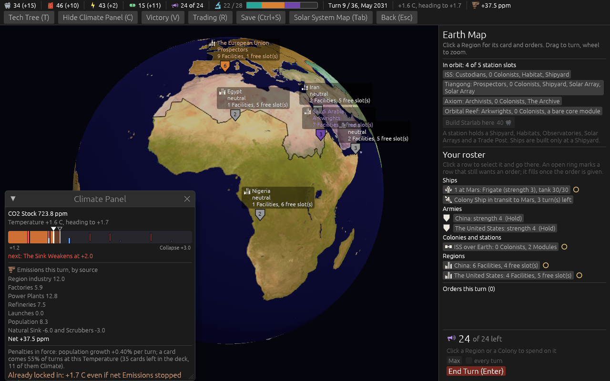

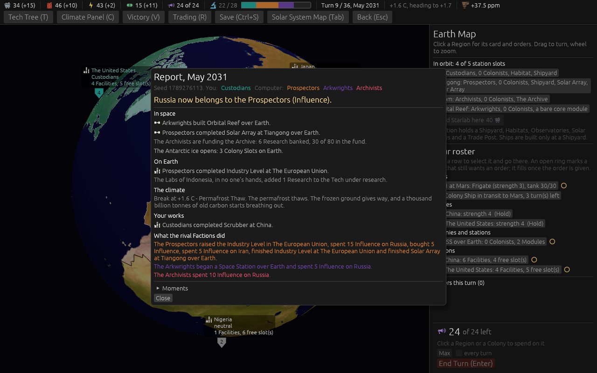

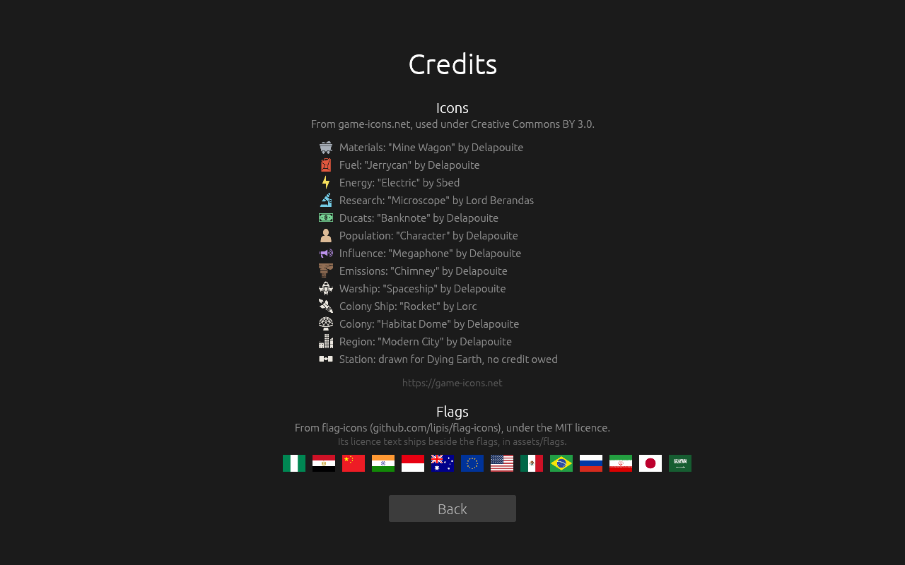

Clippy clean with `-D warnings`, 253 tests passing.

## Orbital Slots drawn as orbits round their Bodies

Ticket [#136](https://github.com/whaleyjoshua2/Dying-Earth/issues/136). The designer's lines: *"Want to
see icons representative of orbitals orbiting their parent bodies each slot a separate orbit"* and
*"List orbital slots in the body card."* Decided in one round, every answer (a): both maps; an empty
slot a dashed ring; glyphs fixed; tilted rings in the 3D scene; a blockading warship drawn on its
ring; the Solar System Map's label listing every slot by name and holder.

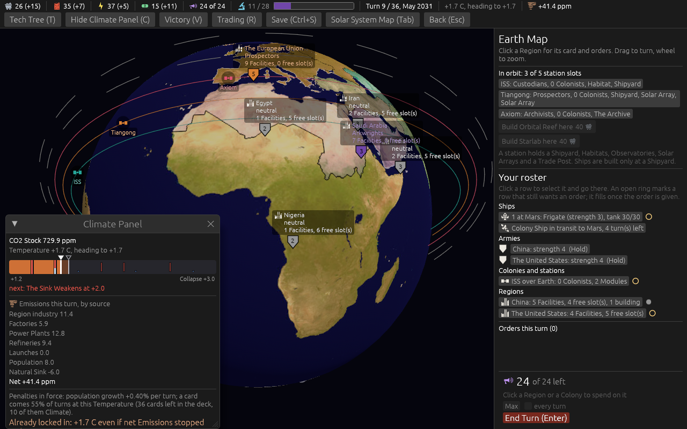

**One ring per Orbital Slot round the globe** on a Body Surface Map, a step further out and a little
more inclined than the last, the part behind the globe not drawn. A built station wears the drawn
panels glyph at a fixed point on its ring in its holder's colour, with its name beneath, and is
clickable; an empty slot is a dashed ring; a warship blockading a slot is drawn beside the station's
place in its Faction's colour -- the first time Blockade has been visible on a map.

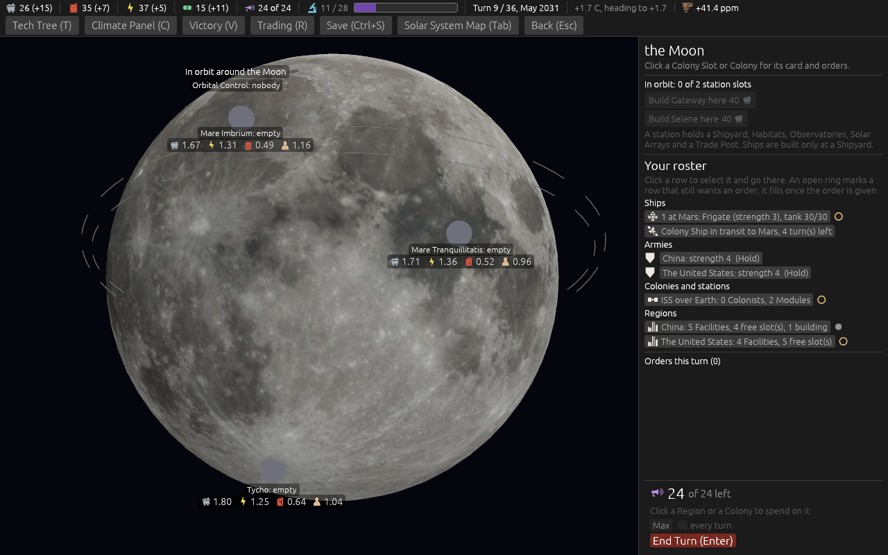

**The first picture caught the rings edge-on.** They were drawn in the globe's own equatorial frame,
which from where this camera sits is a line, so five near-vertical lines ran off the screen. The
rings now live in the **camera's frame**, not the globe's: an orbit is not fixed to the ground (the
ISS does not turn with China), and drawn this way every ring is an ellipse round the globe whatever
the globe's spin. That is a refinement of the decision's "turn with the globe", made by the picture.

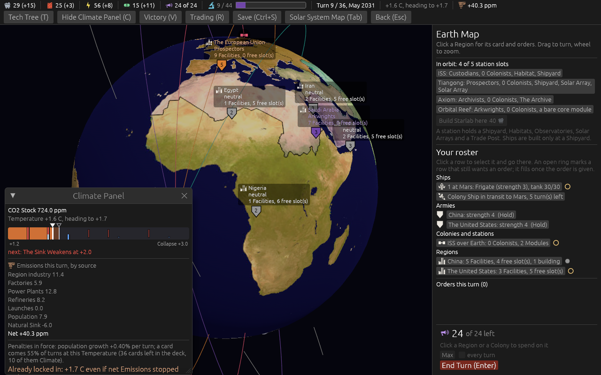

**On the Solar System Map** each Body has **one orbit**, dashed while nothing is in it, carrying the
station glyphs at spaced positions -- five rings will not fit round an eighteen-pixel Earth without
swallowing the Moon. **The slot list on the label unfolds while the Body is under the pointer**
(`ISS: Custodians · Tiangong: Prospectors · Axiom: Archivists · Orbital Reef: free · Starlab: free`);
always open, Earth's six lines lay over the Moon and Mars's over its moons in the first picture, so
the resting label keeps its count and the list is one hover away. The `hover:<body>` aid photographs it.

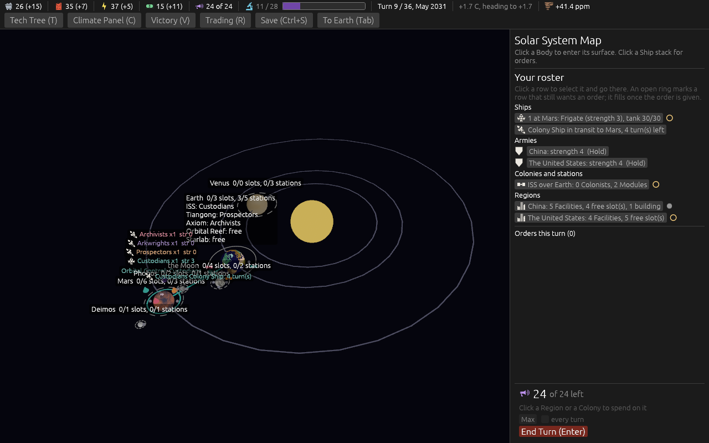

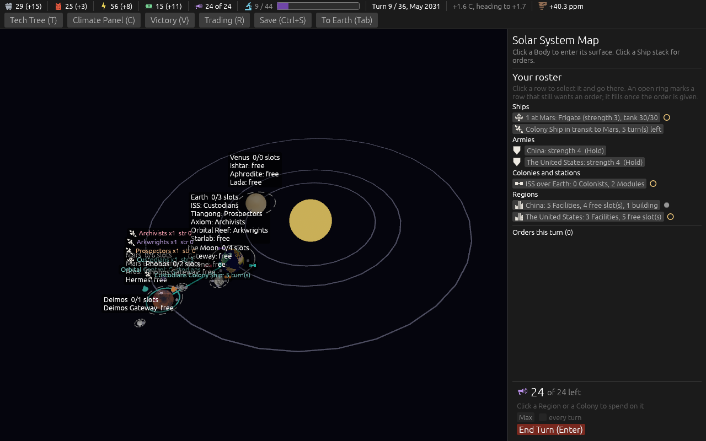

Clippy clean with `-D warnings`, 253 tests passing.

## The Nation card's Influence paragraph becomes a hover

Ticket [#137](https://github.com/whaleyjoshua2/Dying-Earth/issues/137). The designer's line: *"remove
this language from the nation cards … replace with mouse over that relays the same information in
far fewer words."* Decided in one round: one line stays, the explanation is a hover on the whole
line, one sentence and a number per case, and the Colony's card follows.

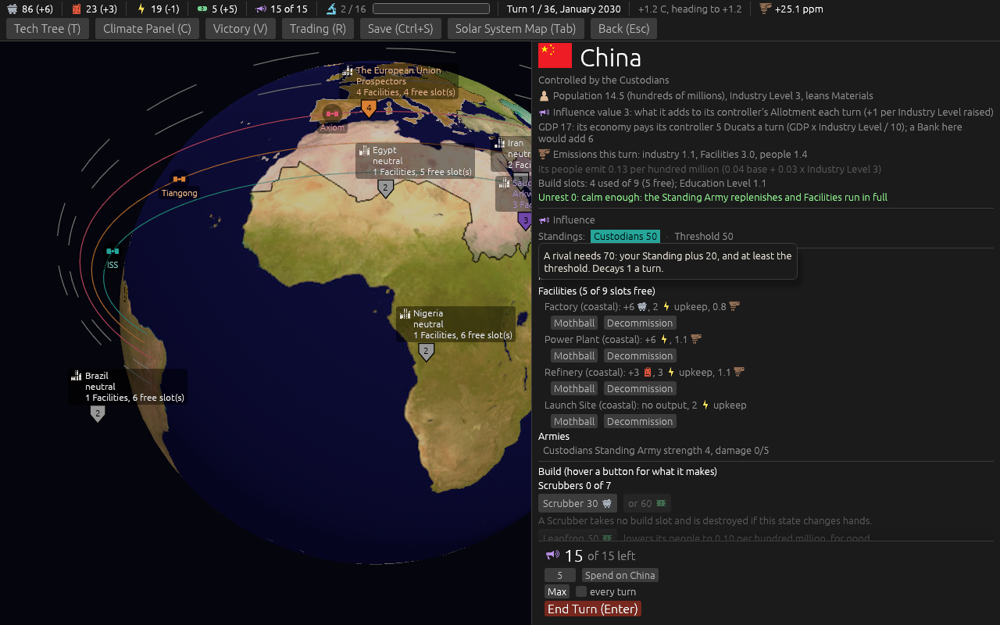

**Two sentences became one line and a hover.** `Threshold 50; a place already held changes hands only
at the holder's Standing plus the challenge margin of 20.` and `Yours. A rival takes it with a
standing above yours and at least the threshold: 70 now. Spending here raises your standing; it
decays 1 a turn.` are now `Standings: Custodians 50 · Threshold 50`, and under the pointer: *A rival
needs 70: your Standing plus 20, and at least the threshold. Decays 1 a turn.* A Region held by a
rival says *You need 70: their Standing plus 20, and at least your threshold. Decays 2 a turn*, and a
neutral one *First to 50 takes it. Decays 2 a turn*. Every figure in the hover is the engine's own,
as before; the red within-reach warning and the Blame note are untouched. The spectator's cards
carry the same line with a hover that names the holder. A Colony's card goes through the same
function, so it follows without a second change.

Clippy clean with `-D warnings`, 253 tests passing.

## Mothball and Decommission on the line, and the Army's shield inside its button

Ticket [#138](https://github.com/whaleyjoshua2/Dying-Earth/issues/138). The designer's lines: *"Mothball
and decommission buttons moved next to facility name not under (after yields and upkeep)"* and *"The
army icon on the cards left of buttons when other icons are not."* Decided in one round: the buttons
right-aligned on the name line, Restart in Mothball's place, the Module rows following -- and the
second line, which the charting had read as a card question, corrected by the designer: *"on roster
every other glyph is a part of the button while armies stands apart."*

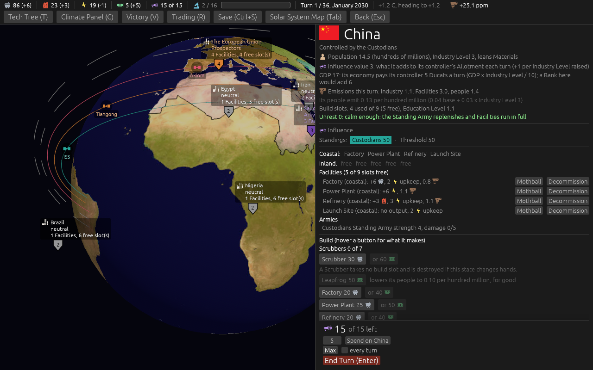

**The two buttons ride on the building's own line**, right-aligned after its figures, so they make a
column down the card and every row is one line shorter. The line keeps its hover on the figures. The
buttons drop beneath, as they were, only when the panel is too narrow to hold both after the figures
(about 196 pixels' worth); a building under a pending change keeps its weak "ordered, lands at turn
N" line. A Colony's Module rows do the same.

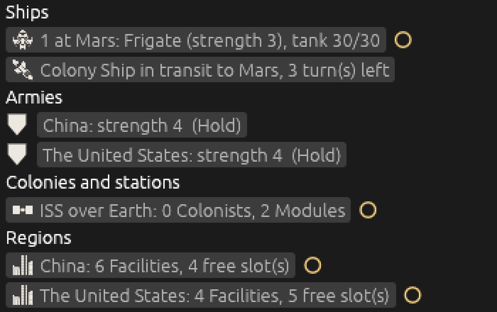

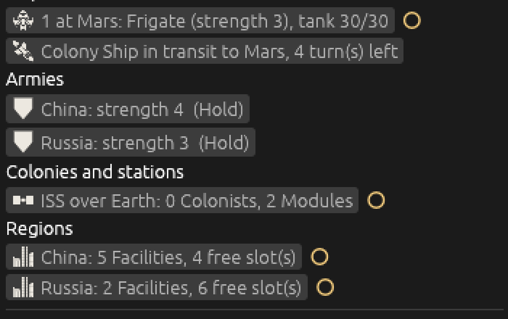

**The Army's shield is inside its roster button.** Every other kind's glyph is loaded art and rides
inside the row's button through egui's own image-and-text button; the shield is drawn, and had no
way into one, so 0.07.2 drew it beside the button. The designer saw the difference at a glance. The
Army's row is now a hand-drawn button in the button's own visuals -- the shape `priced_button`
already uses -- with the shield painted inside, so it looks and behaves like the rest.

Clippy clean with `-D warnings`, 253 tests passing.

## The Ducats formula: every Region pays something

Ticket [#139](https://github.com/whaleyjoshua2/Dying-Earth/issues/139). The designer's line: *"Adjust the
ducket formula Saudi Arabia can't pay 0."* It was wider than Saudi Arabia: under `GDP x Industry
Level / 10, rounded down`, ten of the fourteen Regions paid nothing at the start and eighteen Ducats
a turn left the whole table. Decided in one round and a measurement: **`GDP x Industry Level / 5,
rounded down, never below 1`**. The United States 13, the European Union 12, China 10, Japan 3,
every other Region 1; forty-eight a turn across the table. A small economy pays a flat one until
GDP x Industry reaches 10. One line in `Tables::base_ducats`, which the Region card and the start
globe both read.

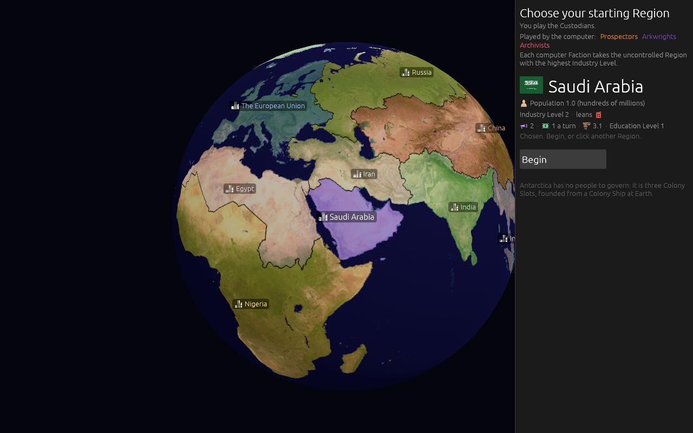

**Measured before it was final**, twenty seeds in each of four seatings, three rules side by side:

| rule | Custodian wins | other wins | Collapses | tree completes |
|---|---|---|---|---|
| / 10 rounded down (the 0.07.2 baseline) | 70 | Arkwrights 1, Archivists 1 | 8 | 73 of 80 |
| / 10 rounded up, never below 1 | 68 | Archivists 2 | 10 | 75 of 80 |
| **/ 5 rounded down, never below 1** | **62** | **Arkwrights 2, Archivists 2** | **14** | **76 of 80** |

Five of the six new Collapses are in the seating where the Prospectors sit in China: a Prospector
with twice the Ducats buys more Materials, builds more and emits more, and the world crosses the
Collapse Line before turn 36 in a quarter of those games. The Custodians lose eight wins, most to
those Collapses rather than to a rival; both rival wins doubled. Put to the designer with the gentler
rule beside it; the designer kept the chosen one -- *"looks most balanced yet"* -- and the Collapse
rise is written on the map for the balance version.

Clippy clean with `-D warnings`, 253 tests passing (two rewritten for the divisor and the floor).

## Habitat yields become Research yields

Ticket [#140](https://github.com/whaleyjoshua2/Dying-Earth/issues/140). The designer's line: *"Replace
habitat bonuses with science bonuses."* Decided in one round: a Research yield per Body and per
slot, drawn as the other three are, multiplying an Observatory; Habitat capacity flat at eight;
the figures Earth 1.0, the Moon 1.0, Mars 1.3, Venus 1.3, Phobos and Deimos 0.8; a station reads
its Body's figure; the computer weighs it for Observatories; measured before it was final.

**The fourth yield is Research.** `habitat_yield` is `research_yield` in `bodies.toml` and on the
card; a slot draws its own near the Body's as before; the slot label's fourth figure wears the
flask where it wore the bust. An Observatory's Research is multiplied by its slot's yield on the
ground and by its Body's on a station -- `Game::research_yield_at`, the first Body yield a station
has ever read -- and the computer players multiply their Observatory weight by the same figure, so
they build where the science is the way they dig where the ore is. A Habitat holds eight everywhere
(ten with Expanded Habitats, half again for the Arkwrights): Mars lost its half-again room and the
moons their halving. The computer lands by Energy now where it landed by room.

**Measured before it was final**, twenty seeds in each of four seatings, on top of the two balance
changes before it:

| after | Custodian wins | other wins | Collapses | tree completes |
|---|---|---|---|---|
| the 0.07.2 baseline | 70 | Arkwrights 1, Archivists 1 | 8 | 73 of 80 |
| Max replacing Defence | 70 | Arkwrights 1, Archivists 1 | 8 | 75 of 80 |
| the Ducats formula | 62 | Arkwrights 2, Archivists 2 | 14 | 76 of 80 |
| **Research yields** | **72** | **Arkwrights 1, Archivists 1** | **6** | **62 of 80** |

Collapses fell from 14 to 6, every one out of the Prospectors' seating, and the Custodians took
back what the Ducats change had cost them; the tree completed fourteen games less often. In 42 of
the 80 games nobody built an Observatory and in 21 more only one Faction did, so the Research yield
itself is barely exercised; the larger effect is the flat Habitat -- fewer people off Earth for
everyone, the Colonist-driven Research bonus and the Archive slower, and the Prospectors' extra
Ducats going into fewer, smaller Colonies rather than industry. Put to the designer; kept as decided,
with this table for the balance version.

Clippy clean with `-D warnings`, 253 tests passing (seven rewritten for the yield and the flat room).

## Emigrants lifted straight to a station over Earth

Ticket [#141](https://github.com/whaleyjoshua2/Dying-Earth/issues/141). The designer's line: *"Send
emigrates from earths surface directly to stations that it orbits - similar to the Antarctica is
handled."* Decided in one round, every answer (a): the order on the Region's card; it wants a working
Launch Site and it is a launch; no crowd; the Faction's own stations only; as many as wait and the
station has room for; the computer learns it; measured before it is final.

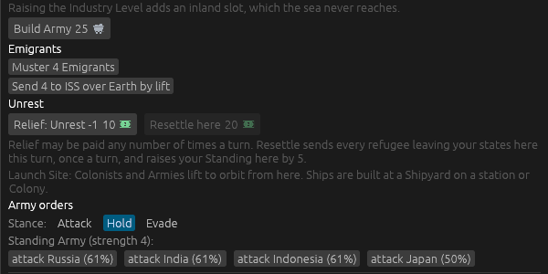

**`Send N to ISS over Earth by lift`** sits under `Muster N Emigrants`, one button per station of
yours over Earth with Habitat room, for as many as it has room for. It is `Order::LiftToStation`:
checked like the sea order (the same waiting people cannot be ordered twice, by sea or by lift,
through one `emigrants_leaving` count), wanting a working Launch Site as a lift onto a Ship does,
refusing a rival's station and a slot a rival warship blockades. At the Resolution the Emigrants are
aboard, the seat's launch count rises by one so the lift emits and goes on Blame, and the Report says
*4 Emigrants lifted from China to ISS over Earth*. The computer players lift to their own station
over Earth whenever it has room, at the unload's full weight, since a station over Earth is off Earth.
A `room:1` aid gives seat 0's station a Habitat on turn 1 so the button could be photographed.

**Measured before it was final**, on top of the three balance changes before it:

| after | Custodians | Archivists | Arkwrights | Prospectors | Collapses | tree completes |
|---|---|---|---|---|---|---|
| the 0.07.2 baseline | 70 | 1 | 1 | 0 | 8 | 73 of 80 |
| the Ducats formula | 62 | 2 | 2 | 0 | 14 | 76 of 80 |
| Research yields | 72 | 1 | 1 | 0 | 6 | 62 of 80 |
| **the lift** | **47** | **15** | **8** | **1** | **9** | **67 of 80** |

Colonists off Earth across the eighty games nearly doubled, 2,361 to 4,326. The Archivists win ten of
their own twenty where they won none before this version; the Arkwrights eight of theirs; the
Prospectors a game for the first time in any sweep; the Custodians still the most at 47. Every
Faction's station over Earth fills as fast as its Region musters, with no Colony Ship in the loop, so
the Archive on Axiom has people from turn two and Diaspora's thirty are within the Arkwrights' reach.
Put to the designer; kept as decided -- the closest to a four-way table any sweep has shown, and for
the reason the rules say: people who can reach orbit without a Ship colonise.

Clippy clean with `-D warnings`, 254 tests passing (one new).

## Research costs rounded to the nearest five, and Coastal Engineering 12

Ticket [#142](https://github.com/whaleyjoshua2/Dying-Earth/issues/142). The ticket was charted as
*"Another 10% increase to science rounded up to nearest 5 - costal engineering stays 12"*, which
would have been 20 / 35 / 50 and a tree of 587. After the four balance changes before it the
designer redirected it: *"with everything so balanced let's make coastal engineering 12 and just
round everything else to the nearest 5."* No tenth is added: rung 1 **16 to 15**, rung 2 **28 to
30**, rung 3 **44 to 45**, Coastal Engineering **11 to 12**; the whole tree **495 to 507**, up two
per cent. Four lines in `techs.toml`, three tests repinned.

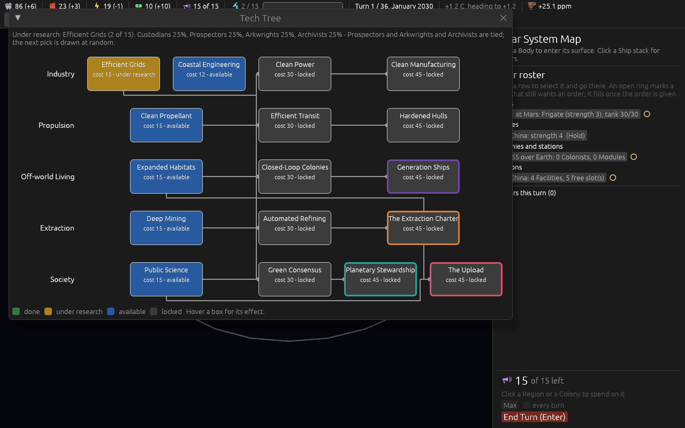

**Swept once after**, on top of everything before it:

| after | Custodians | Archivists | Arkwrights | Prospectors | Collapses | draws | tree completes |
|---|---|---|---|---|---|---|---|
| the lift | 47 | 15 | 8 | 1 | 9 | 0 | 67 of 80 |
| **the rounded costs** | **40** | **12** | **12** | **3** | **12** | **1** | **66 of 80** |

The same shape as the lift left it, within the noise of twenty seeds: the four Factions all win
games, the Custodians the most, and the tree completes about as often. This is the table the
version's write-up will restart the baseline from.

Clippy clean with `-D warnings`, 254 tests passing.

## Population in real numbers

Ticket [#143](https://github.com/whaleyjoshua2/Dying-Earth/issues/143). The designer's lines: *"I want
country cards to use the actual population … Population 12.2 (339M) … a reduction of 4 emigrants in
a country with a population of 12.2 would become 8.2 … Please track earth and space populations on
the top bar."* Decided in two rounds: the unit is **five million people**; one Emigrant is one unit;
the card reads `Region population 228.0 (1.14B)`; every rule rescaled by twenty and none retuned;
the top bar carries Earth and space; space counts Habitats only.

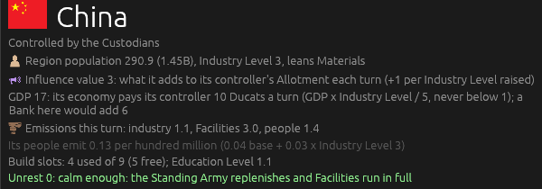

**The unit is five million.** Every Region's figure is twenty times what it was -- India 388, China
288, the Nigeria Region 228, Indonesia 136, the European Union 120, Brazil 90, the United States 76,
Egypt 52, Iran 50, Mexico 44, Japan 40, Russia 30, Saudi Arabia 20, Australia 10, 1,572 units and
7.86 billion people in all -- and every rule that read it is rescaled by the same twenty: the
per-person Emissions coefficients (0.04 and 0.03 per hundred million are 0.002 and 0.0015 per unit,
and every card and tooltip still quotes the rate per hundred million), the Scrubber cap (one per
forty units, the two hundred million it was), the Lab's population factor (a thousand units where
fifty hundred-millions stood). `Game::PEOPLE_PER_UNIT` and `Game::people_text` are the one place the
unit and its spelling live.

**One Emigrant is one unit**, as the designer's example says: four Emigrants take four off. An
Emigrant was ten million people; it is five million now, so a Region empties half as fast to
emigration. The designer chose that knowing it, and the sweep below shows what it does.

**"Nigeria does not have 1.14 billion people."** It does not, and the figure is not Nigeria's: it is
the whole Region's, Sub-Saharan Africa, some forty-six countries, which the World Bank totals put
at 1.2 billion when the borders were redrawn. Since 0.07.2 named each Region for its Nation, the
card's plain `Population` read as the Nation's. The data was right; the word was wrong. The card and
the start panel say **`Region population`** now, with a hover on the start panel saying whose it is.

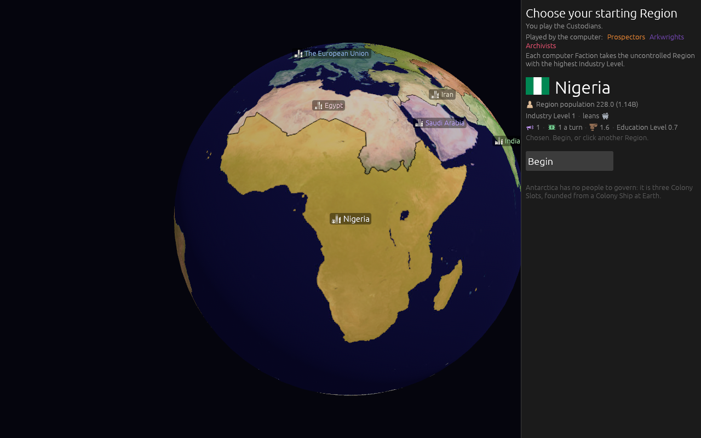

**The top bar** carries `Earth 8.17B · Space 50M` at its right end in the population glyph's fill:
Earth is the Regions' figures and the Colonists in Antarctica, space is every Colonist living off
Earth with a station over Earth counting as off, as Off-world Presence counts it, and the hover
lists every Region and every Body. People aboard a Ship are nowhere yet and are not counted.

**Swept once after**, on top of everything before it:

| after | Custodians | Archivists | Arkwrights | Prospectors | Collapses | draws | tree completes |
|---|---|---|---|---|---|---|---|
| the rounded costs | 40 | 12 | 12 | 3 | 12 | 1 | 66 of 80 |
| **five million a unit** | **36** | **21** | **6** | **1** | **14** | **2** | **68 of 80** |

The one rule that changed in substance is the Emigrant's drain, halved; the swing between the
Archivists and the Arkwrights is larger than twenty seeds' noise usually is and is written here for
the balance version. The four-way shape holds.

Clippy clean with `-D warnings`, 254 tests passing (six repinned to the unit).

## The Hab View

Ticket [#145](https://github.com/whaleyjoshua2/Dying-Earth/issues/145). The designer's line: *"I would
like a window popup showing the modules of the space stations and colonies similar the ones in
terra invicta."* Decided in one round off three mocked pictures (`module-window-mock-*.png`): a
popup; five columns; the tiles as mocked with the Habitat wearing the Colony's own dome; off-white;
a click puts the tile's figures and controls in a strip under the grid; a free tile offers the
build buttons; the name is the Hab View.

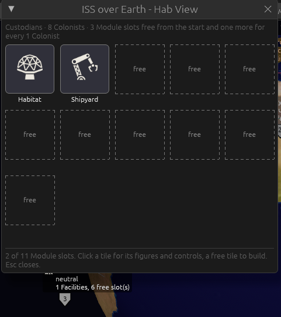

**One tile per Module**, its picture on a dark tile with its name beneath; dimmed with the word for
a mothballed one, hatched with the word for one building, dashed and empty for every free place
under the cap, and the Archive on a row of its own outside the count. The pictures are the first
candidate of each kind on ticket #144's sheets (Lorc's *Mining* for the Mine, since *Gold Mine*
collides with the Materials' cart), eleven files in `assets/icons/` credited on the Credits screen,
with the Habitat wearing the Colony glyph and needing no file; the slot-boxes ticket may swap any of
them so the two drawings share one set. Opened from the card's `Modules (M)` button, by clicking a
station's or Colony's roster row, or with `M` on the selected place; closed with Esc or its own
cross, and Esc closes it before it leaves a Surface Map.

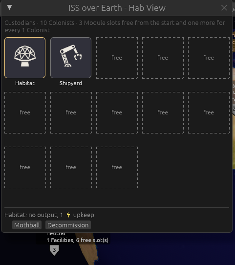

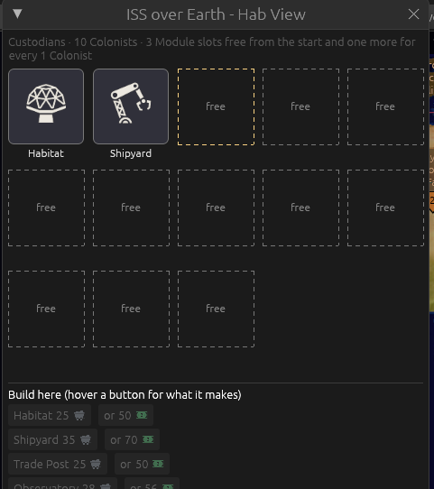

**The card is shorter.** Its Module rows -- name, figures and the two buttons each, which ticket #138
had only just put on one line -- have moved into the strip; the card keeps `Modules: Habitat,
Shipyard` as a line, the button, and its own build buttons, which the strip draws through the same
function so the two can never differ. A spectator opens a rival's Hab View and finds no buttons in
it. `hab:1` and `habtile:<n>` / `habtile:free` are the aids that photographed it.

Clippy clean with `-D warnings`, 244 engine tests and 254 in all passing.

## Building art: candidate sheets (research, ticket #144)

Sixty-two game-icons.net candidates for the twenty-two building kinds, drawn with the game's own
`resvg` at 64, 48, 32 and 28 pixels and the 28 magnified three times, one sheet per group
(`facilities`, `modules`) and per tint (`untinted`, `offwhite` = the kind fill, `tint1` = the
Custodians' teal, `tint2` = the Prospectors' orange), plus `worn` (the thirteen glyphs already on
the board, as the control for collisions). Row numbers match the table in
[`docs/research/building-art.md`](../../research/building-art.md).
