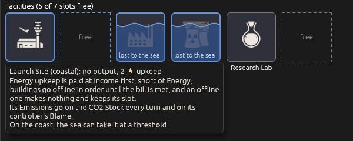
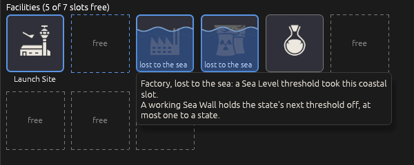
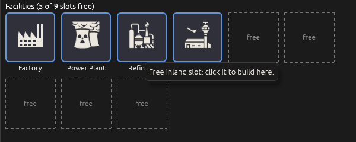
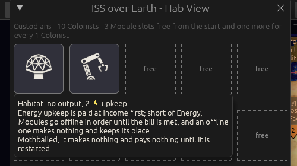
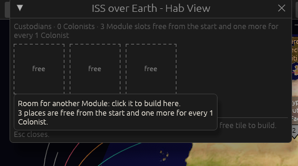
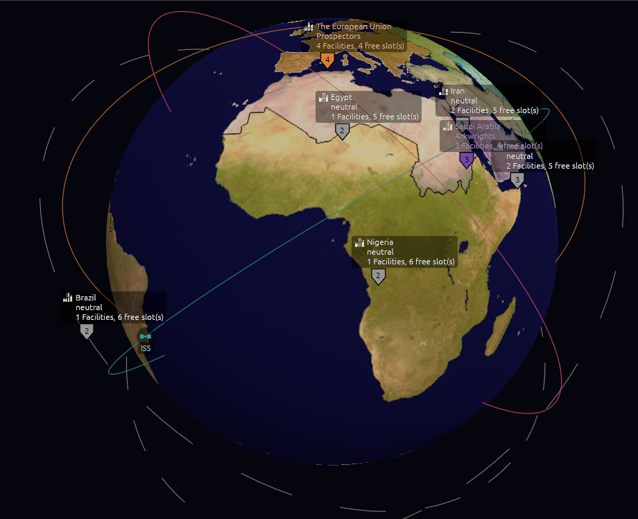
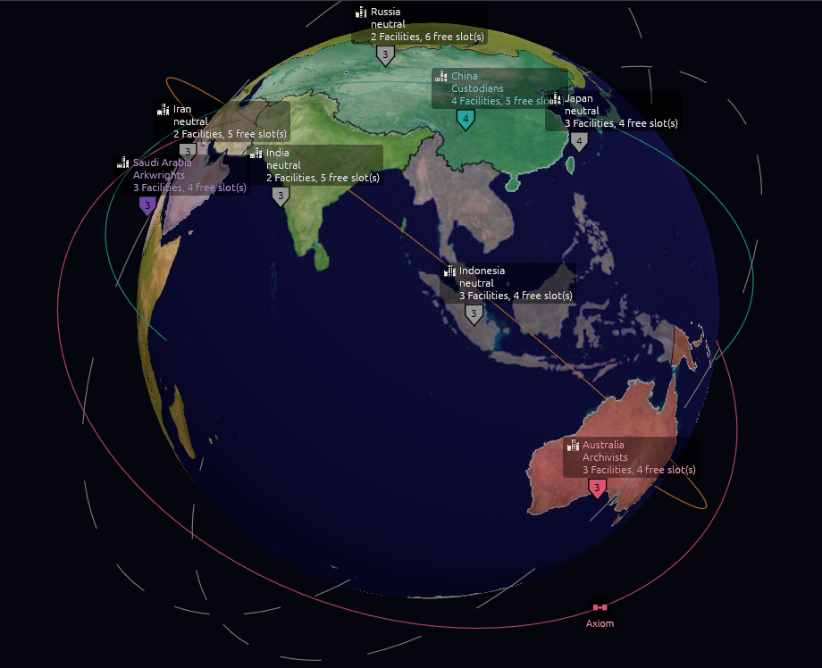
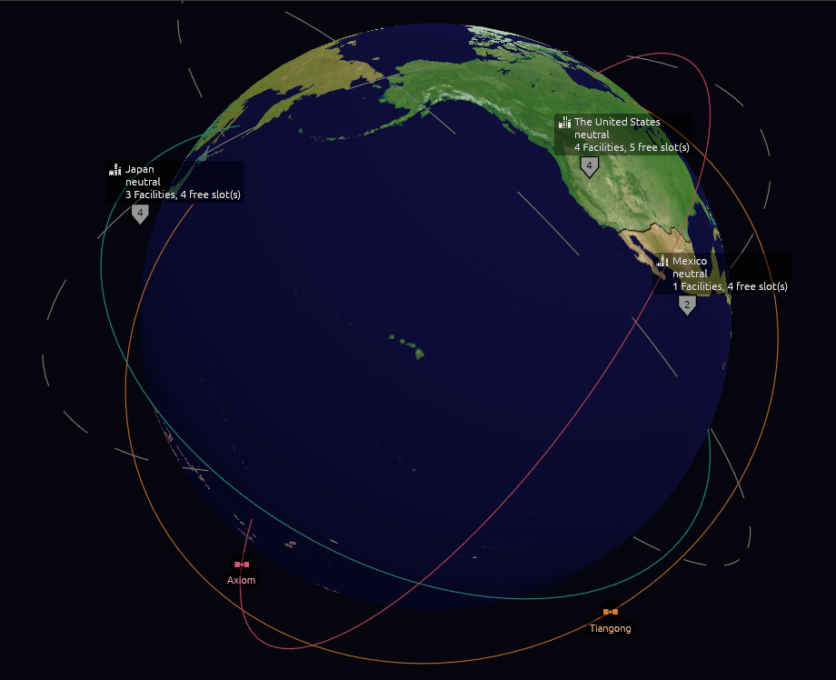
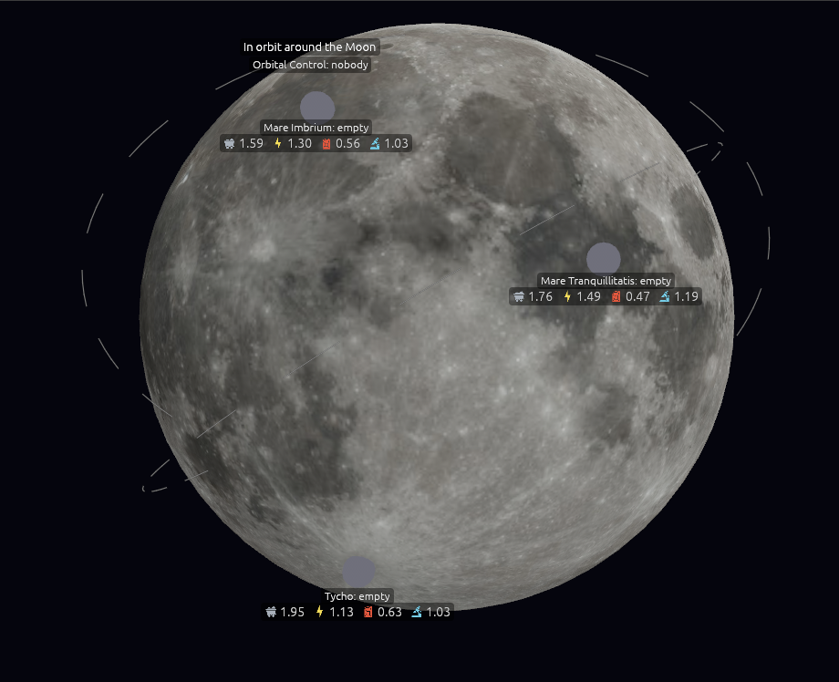
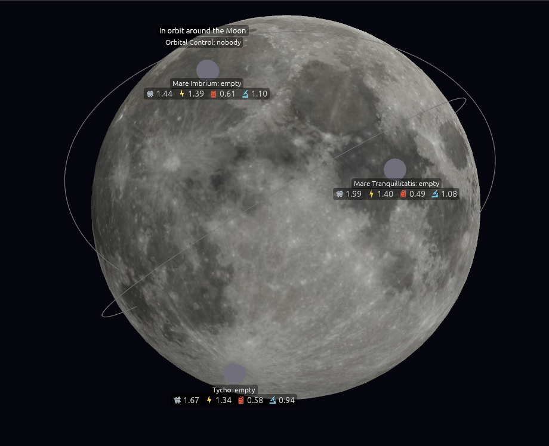

# Version 0.07.4, the reactions version: the pictures

The map is [Map: version 0.07.4](https://github.com/whaleyjoshua2/Dying-Earth/issues/149). Every
picture here was taken headlessly in `shot:` mode on `version-0.07.4`; nothing was opened on the
designer's desktop.

## The building hovers return

Ticket [#150](https://github.com/whaleyjoshua2/Dying-Earth/issues/150). The designer's line: *"mouse
over information on buildings didn't xfer to icon grid."* The Facility row's hover had survived
0.07.3, but only on the row a click puts in the strip; the boxes and the Hab View's tiles had no
hover at all, and the Module rows never had one. Built as the ticket's recommendation (b) for the
designer to react to: every box and tile says on hover what its row says, and the free, building
and flooded states say what they are.

The Facility row's figures and rules became two helpers the box hover shares with the row, so the
two can never drift apart; the Hab View's strip line became a helper its tiles share the same way.
A building box now knows the turn it is ready (the old rows said so; the boxes had lost it). The
`tip:<word>` aid photographed every hover, with `select:EastAsia walls:1` for China's card and
`hab:1 turns:12` for a Hab View with a Habitat on it.

## Orbits on their own planes, turning with the globe

Ticket [#151](https://github.com/whaleyjoshua2/Dying-Earth/issues/151). The designer's line: *"fix
orbital slots each should be on slightly different orbital plane and should rotate with the globe
allow them to move slowly so they can be clicked."* Built as the ticket's recommendation for the
designer to react to: the rings back in the globe's frame (version 0.07.3 had pinned them to the
camera after the first attempt came out edge-on), each leaning 32 to 61 degrees from the equator on
a heading of its own so the five cross rather than stack; a station's glyph travelling its ring,
one revolution in ninety seconds for the first slot and eight seconds longer for each after, the
name riding beneath it; the click circle widened to sixteen pixels and the click taken where the
mouse was pressed; the clock stopped in `shot:` mode. Three headings of the same globe, from the
`look:` aid with `panel:0`:

Seen and put to the designer: a ring fixed to the globe is edge-on for a moment at two headings per
turn of the globe (the camera sits in the equatorial plane), which the different headings keep to
one ring at a time; and the outer rings reach past the window's bottom edge at the default zoom, so
a travelling station leaves the screen for part of each revolution.

**Decided by the designer** off those pictures: *"1 - just slightly tighter - let's also rethink the
hashed lines for unoccupied orbits, lets make them sold lines, same color 2 90 seconds is good
perfectly scaled 3 riding beneath the glyph."* So the rings a step tighter (1.08 to 1.24 of the
globe's radius where they had been 1.12 to 1.30), **an empty slot's ring solid in the same grey**
rather than dashed, the ninety-second revolution kept, and the name riding beneath the glyph.

