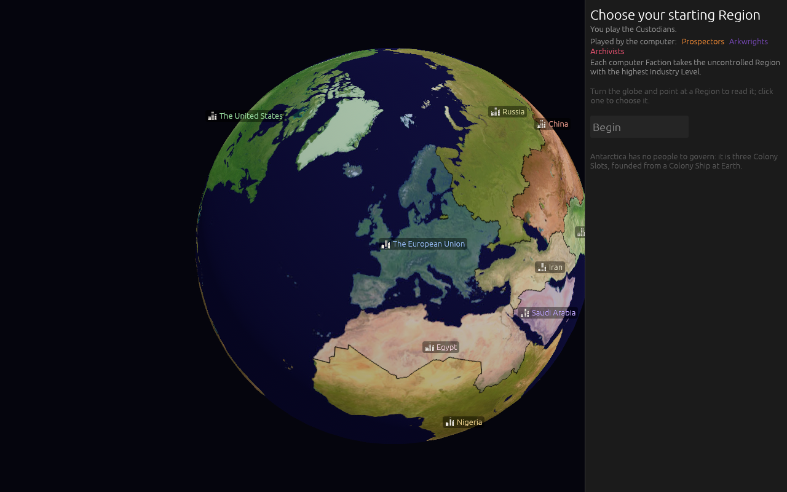
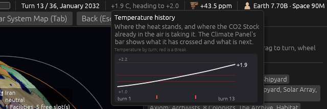
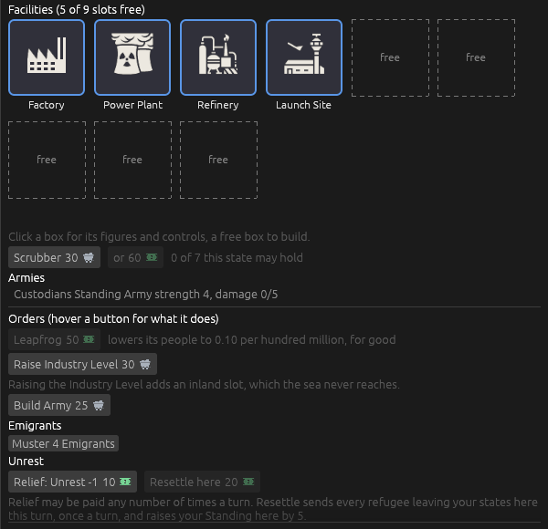

# Version 0.07.4, the reactions version: the pictures

The map is [Map: version 0.07.4](https://github.com/whaleyjoshua2/Dying-Earth/issues/149). Every
picture here was taken headlessly in `shot:` mode on `version-0.07.4`; nothing was opened on the
designer's desktop.

## The building hovers return

Ticket [#150](https://github.com/whaleyjoshua2/Dying-Earth/issues/150). The designer's line: *"mouse
over information on buildings didn't xfer to icon grid."* The Facility row's hover had survived
0.07.3, but only on the row a click puts in the strip; the boxes and the Hab View's tiles had no
hover at all, and the Module rows never had one. Built as the ticket's recommendation (b) for the
designer to react to: every box and tile says on hover what its row says, and the free, building
and flooded states say what they are.

The Facility row's figures and rules became two helpers the box hover shares with the row, so the
two can never drift apart; the Hab View's strip line became a helper its tiles share the same way.
A building box now knows the turn it is ready (the old rows said so; the boxes had lost it). The
`tip:<word>` aid photographed every hover, with `select:EastAsia walls:1` for China's card and
`hab:1 turns:12` for a Hab View with a Habitat on it.

## Orbits on their own planes, turning with the globe

Ticket [#151](https://github.com/whaleyjoshua2/Dying-Earth/issues/151). The designer's line: *"fix
orbital slots each should be on slightly different orbital plane and should rotate with the globe
allow them to move slowly so they can be clicked."* Built as the ticket's recommendation for the
designer to react to: the rings back in the globe's frame (version 0.07.3 had pinned them to the
camera after the first attempt came out edge-on), each leaning 32 to 61 degrees from the equator on
a heading of its own so the five cross rather than stack; a station's glyph travelling its ring,
one revolution in ninety seconds for the first slot and eight seconds longer for each after, the
name riding beneath it; the click circle widened to sixteen pixels and the click taken where the
mouse was pressed; the clock stopped in `shot:` mode. Three headings of the same globe, from the
`look:` aid with `panel:0`:

Seen and put to the designer: a ring fixed to the globe is edge-on for a moment at two headings per
turn of the globe (the camera sits in the equatorial plane), which the different headings keep to
one ring at a time; and the outer rings reach past the window's bottom edge at the default zoom, so
a travelling station leaves the screen for part of each revolution.

**Decided by the designer** off those pictures: *"1 - just slightly tighter - let's also rethink the
hashed lines for unoccupied orbits, lets make them sold lines, same color 2 90 seconds is good
perfectly scaled 3 riding beneath the glyph."* So the rings a step tighter (1.08 to 1.24 of the
globe's radius where they had been 1.12 to 1.30), **an empty slot's ring solid in the same grey**
rather than dashed, the ninety-second revolution kept, and the name riding beneath the glyph.

## The start globe turns slower

Ticket [#152](https://github.com/whaleyjoshua2/Dying-Earth/issues/152). The designer's line: *"slow
the rotation of the earth in the territory select screen."* It turned once every 25 seconds, a
bare number in the code, and only a drag stopped it. Decided with the designer without a picture,
since a picture cannot show speed: **once every 75 seconds**, a third of the speed, and **a click on
a Region stops it for good** as a drag does, so the Region chosen stays where it was chosen. The
number is a named constant now, `START_GLOBE_PERIOD_SECS`.

## An Emissions history on the top bar's hover

Ticket [#153](https://github.com/whaleyjoshua2/Dying-Earth/issues/153). The designer's line: *"mouse
over on emissions on top bar should proc a history graph."* The game kept no history: the engine held
only the last turn's breakdown. Built as the ticket's recommendation (b) for the designer to react
to: **one record per Climate phase** kept in the engine and saved with the game (the breakdown by
source, the Stock, the Temperature, and the Breaks that fired); a **hand-painted chart** of three
lines -- what the world emitted, what the Sink and Scrubbers removed, and the net between them --
against a plain zero line, a red tick on the turn axis where a Break fired, the last net figure at
the line's end; drawn small in the top bar's hover and wide on the Climate Panel under the by-source
list. No charting crate: the same allocate-and-paint the Temperature bar uses. A new `rule_tip_ui`
lets the `tip:` aid photograph a hover that draws.

First try had the zero line's `0` label colliding with `turn 13` while nothing had gone below zero;
the label now appears only when the zero line stands clear of the turn axis.

## A Temperature history on the top bar's hover

Ticket [#158](https://github.com/whaleyjoshua2/Dying-Earth/issues/158), graduated from the map's fog
when the designer said *yes, the same for Temperature* on ticket #153. Built as the ticket's
recommendation for the designer to react to: the Temperature turn by turn on the same
base-to-Collapse scale the Climate Panel's bar runs, the Breaks' Temperatures as faint red lines
across it, the Collapse line labelled, the Breaks fired ticked red on the turn axis, the last figure
at the line's end; the hover only. The heading-to figure is a projection and is not drawn.

**Decided by the designer** off that picture: **the data's own range** rather than base-to-Collapse
(the detail over the context), the faint Break lines and the ticks kept, the hover only. The range
takes a margin above and below and is never narrower than half a degree; the Breaks' Temperatures
and the Collapse line are drawn only where they fall inside it.

## The build list folded into the boxes

Ticket [#154](https://github.com/whaleyjoshua2/Dying-Earth/issues/154). The designer's line: *"remove
redundant build list from the region cards - scrubber sea wall need to stay but put them in the same
section as the tiles just below them."* The per-kind `Build Factory 20 · or 40` list at the bottom of
the card was the very list a free box's click strip draws. Built as the ticket's recommendation for
the designer to react to: the list gone; **the Scrubber and the Sea Wall under the boxes with no
heading**, each a row when it stands and a build button pair when it may be built (the Scrubber's
with the state's cap beside it, the Sea Wall's once Coastal Engineering is in and while none stands);
the Sea Wall out of the free box's strip, since it takes no slot; the bottom header renamed
**Orders** with Leapfrog and the Strip Permit staying under it; the slot count said once, on the
Facilities header; and a no-slot row no longer says `(inland)` or, mothballed, `keeping its slot`.

