# Version 0.07.5, the reading-and-founding version: the pictures

The map is [Map: version 0.07.5](https://github.com/whaleyjoshua2/Dying-Earth/issues/160). Every
picture here was taken headlessly in `shot:` mode on `version-0.07.5`; nothing was opened on the
designer's desktop.

## Every word of the Influence section explained on hover

Ticket [#161](https://github.com/whaleyjoshua2/Dying-Earth/issues/161). The designer's line:
*"influence mouse over on all words in the influence portion of the nation card."* One line of that
section had a hover; eight things did not. Built as the ticket's recommendation for the designer to
react to: hovers on all eight, each naming the rule behind its figure rather than restating it, as
the tooltip rule set on ticket #116 requires.

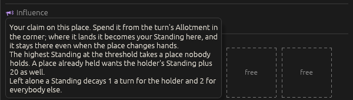

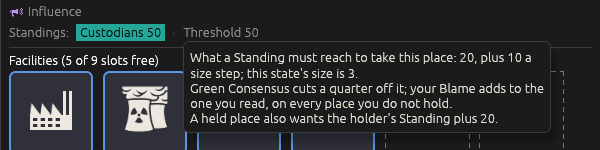

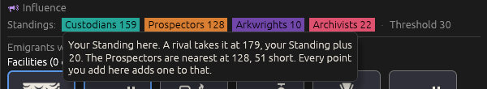

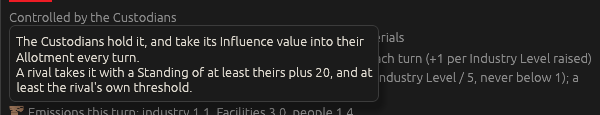

The other four are the **within-reach warning** (which never named the challenge margin behind its
own figure), the **Blame note** (four rule-governed figures and no hover at all), the **Influence
value** line (which names the Allotment and never says what an Allotment is), and **`nobody has any
yet`**. The Colony's card followed, and its three controls -- `Influence:`, `Spend` and `Buy more
Influence in the Trading window`, which the Nation card lost on ticket #121 -- gained hovers of
their own.

**Decided by the designer** off those pictures: *"revise verbage to be the most efficient possible
in conveying information"*, so every one of the new hovers was tightened -- the heading's went from
six rendered lines to four with no fact dropped; **your own chip says what it would take to be safe
from the nearest rival** rather than repeating the rule; **Threshold gains an entry in
`CONTEXT.md`**, which it never had, saying plainly that this is the Influence sense and not the
climate one; and the Colony card **follows the same choices as the Nation card** rather than being
special-cased.

`icon_word` now hands back its response so a heading drawn with a glyph can carry a hover, which is
what the Influence heading and the Influence value line needed.

## The Module grid moves onto the card, and the Hab View window retires

Ticket [#162](https://github.com/whaleyjoshua2/Dying-Earth/issues/162). The designer's line: *"Move
the station module grid to its in the card like nation states and retire the window."* Built as the
ticket's recommendation, with one change the pictures forced: **six columns, not three.**

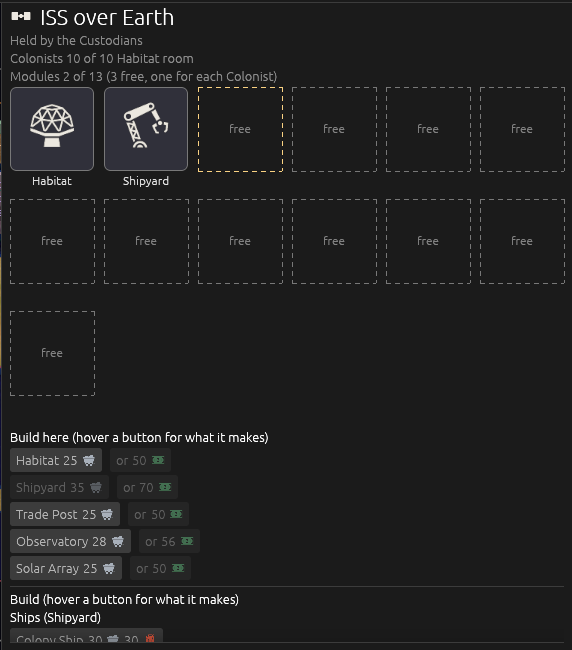

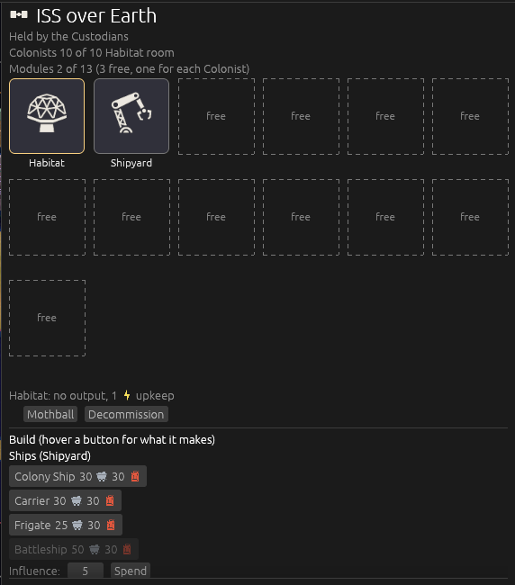

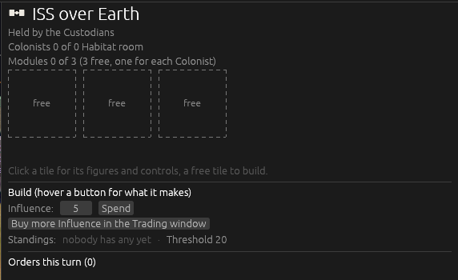

**Why six and not three.** Three columns fit the side panel at its default width, which is what the
ticket recommended. Built, they push the strip below the fold on any station with room to grow: the
ISS at turn 13 has thirteen places, which is five rows of tiles, and the build buttons a free tile
is clicked for are off the bottom of the screen.

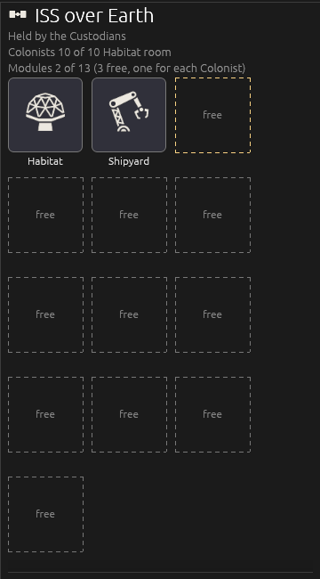

Six columns is also what *"like nation states"* means literally -- the Region card's boxes are six
across -- and it widens the card to the width the Region card already takes, so the two read as one
thing. The cost is that a Colony's card covers more of the globe than it did.

**What retired with the window**: the `Modules (M)` button, the list of Module names (the tiles say
it better), the **M** key, the Esc branch that closed the window, the roster row's auto-open, and
the window's header and `Esc closes.` tail. `view.hab_view` is gone from the view state. Esc now
clears a clicked tile, which is what it did by closing the window. The `hab:1` picture aid
**selects** seat 0's first station or Colony instead of opening a window, and `habtile:` stands on
its own as `slotbox:` does. **The Module build buttons live only in a free tile's strip**, as a
Facility that takes a slot has been buildable only from a free box since ticket #154; the card's
Build section keeps the Army, the Ships and the Archivists' Archive, which take no Module slot, and
the Build-Where-You-Dig discount note moved up to stand above the tiles where it says what a Module
here will cost.

**Decided by the designer** off those pictures: *"q1 the grid should match the one used by nations q2
use it to bring up the solar system map replace tab q3 retire it q4 which ever matches the nation
state cards."* So the Colony's tiles are laid out in **the same constant** the Region's boxes use,
not a number of their own, and the two can never drift apart; **M swaps to the Solar System Map and
back, the job Tab held** until the Hab View freed the key, with the bar's button renamed to match;
the **Hab View is retired** in `CONTEXT.md` as a term, with its tiles written into *Module* the way a
Region's boxes live in *Build Slot*; and the Colony card's bottom header is **`Orders (hover a
button for what it does)`**, matching the Nation card's since ticket #154.

## The Pick a Tech button is red

Ticket [#163](https://github.com/whaleyjoshua2/Dying-Earth/issues/163). The designer's line: *"'Pick
a tech' button when present should be red."* It was **black text on the default dark fill**, the
only styled button on the bar and the least legible of the seven places the game asks for a Tech.
Built as the ticket's recommendation: **the red End Turn wears**, since the two are the pair that
gate a turn -- the turn cannot end until the pick is made -- with light text.

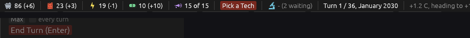

The refused modal's `Pick a Tech` button, the same words and the same job, takes the same red. The
Tech Tree's own `Pick` buttons and its yellow prompt are left alone: six red buttons inside one
window is a wall rather than a signal. The red was written twice as a bare literal and is a named
constant now, `TURN_RED`. A new `pick:0` picture aid leaves the opening Tech pick unmade, since the
harness makes it so it can drive turns and the button could not otherwise be photographed.

**Decided by the designer**: the End Turn red, the modal's button kept, the Tech Tree's own buttons
left alone -- and **Tab, freed when M took the map, brings the roster back**. The panel shows the
roster whenever nothing is selected, so Tab clears the selection; the heading names the key, which
is the rule every button on the bar follows.

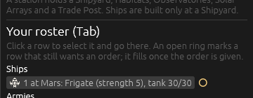

## The Core Module: how a Colony or a station is founded

Ticket [#164](https://github.com/whaleyjoshua2/Dying-Earth/issues/164), the version's one rules
change. The designer's line: *"let's adjust the way colonies and stations are founded, now their
construction comes with a core module - a new module that provides room for four emigrants no
further build slots until its populated."*

**Decided before it was built**, in one round: the base allowance drops from **three to zero**, so
the cap is exactly the number of Colonists and a place nobody lives in builds nothing; the **Core
Module replaces the free Habitat** a ground Colony was founded with; it **holds a flat four for
everyone** -- neither Expanded Habitats nor the Arkwrights' capacity multiplier reaches it, the
designer adding *"arkwrights can always build habitats"*; and it **draws 1 Energy a turn**.

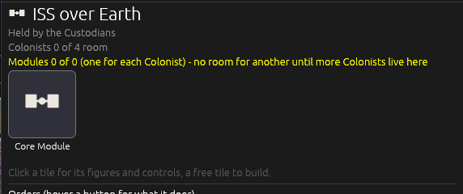

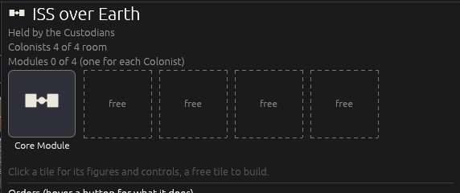

The Core Module is never ordered, never mothballed, never decommissioned, and is never shut for want
of Energy: it is the walls of the place rather than a building in it. It stands outside the Module
count as the Archive does. It wears the station glyph the game drew for itself on ticket #135, which
is what a core module looks like; a ground Colony's wears it too, for want of a drawing of its own.

**It kills a deadlock that has been in the game since stations existed.** A bare station used to
need a Habitat to hold anybody and Colonists to earn the slot to build one. Now the Core Module
holds four from the day the station stands, so Emigrants can be lifted to it at once, and each one
buys a slot.

## The game opens full size, and the Climate Panel opens tall enough to read

Ticket [#165](https://github.com/whaleyjoshua2/Dying-Earth/issues/165). Two of the designer's lines,
together because the second depends on the first: *"climate panel should start long enough to show
all the information in the panel"* and *"Game starts in full sized window."*

The game opens **maximised**, filling the screen with its title bar and buttons where they can be
found; a `shot:` run is never maximised, since it wants the exact off-screen size it was given. The
Climate Panel opens **at the top, under the bar, and as tall as the window leaves room for**, where
it opened four hundred rows tall and four hundred rows off the bottom -- about a third of its
thousand rows of content, with the whole Blame block below the fold before the player touched it.

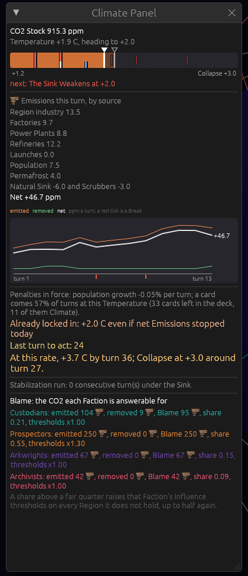

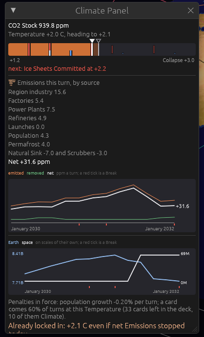

**Decided by the designer**: maximised rather than borderless fullscreen, the panel at full height,
the size left as a number in the code -- and one thing the Core Module ticket had left behind. Every
station and Colony has a Core Module, so naming it in a list said nothing about the place; it is
left out of both the station list on a Surface Map and the roster's Module count, which now matches
the card's. The happy accident is that *"a bare core module"*, the placeholder those station lines
have shown since version 0.04 when a station held nothing, is now literally what such a station has.

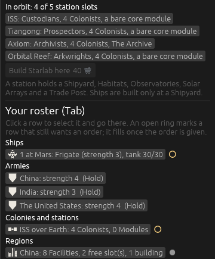

## A population history on the top bar's hover

Ticket [#166](https://github.com/whaleyjoshua2/Dying-Earth/issues/166). The designer's line: *"get a
mouse over graph for the population as well."* Built as the ticket's recommendation: **two lines on
two scales**, Earth read against the left of the chart and space against the right, each with its
own ends written small at its own side.

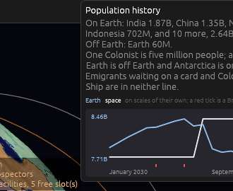

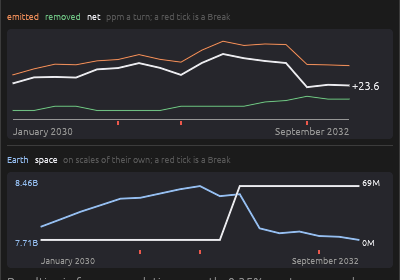

One scale would not do: Earth is counted in the hundreds of units and space in single figures, so a
shared axis lays the space line flat on the floor for the whole game. On scales of their own the
chart says the thing worth seeing -- Earth falling while space rises -- which is the arc of the game.
The Breaks are ticked red on the turn axis as on the other two charts, because the heat is what
takes the people.

Two pieces of engine work came with it. The record now carries **Earth's people and space's**, and
**the record is written later in the Climate phase** than it was: it used to be pushed before the
heat had taken its losses and the Refugees had moved, so a population read there would have lagged a
turn behind the Emissions and Temperature on the same record. Nothing else on the record moves in
between. The caption says what is in neither line: Emigrants waiting on a card and Colonists aboard
a Ship belong to neither figure, exactly as they belong to neither figure on the bar.

**Decided by the designer**: the two scales kept as pictured, the chart left above the growth rate
on the Climate Panel, the hover's list of Regions cut to **the four largest and a count of the
rest** (all fourteen were listed, which buried the chart the player hovered for), and one thing that
reaches further than this ticket -- **a chart's time axis carries the date, not the turn number**,
*"a rule for all charts."* All three now read `January 2030` to `September 2032` where they read
`turn 1` to `turn 17`, which is the form the top bar has always used. The Break ticks were shortened
and the plot floor lifted in the same pass, because a tick landing near the last turn sat on top of
the label.

## The four Faction symbols

Ticket [#168](https://github.com/whaleyjoshua2/Dying-Earth/issues/168), chosen off the candidate
sheets that [the research](https://github.com/whaleyjoshua2/Dying-Earth/issues/167) filed. The
designer's line: *"I want to pick four symbols to represent the factions - for now these symbols
should only appear on the faction selection screen in their respective cards."*

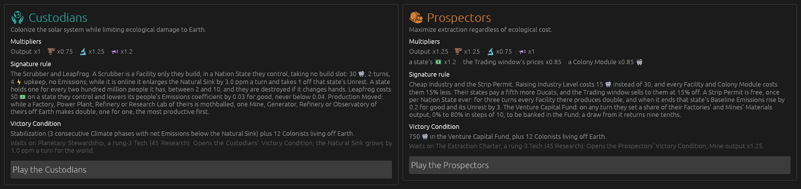

**Chosen by the designer off the sheets**, row by row, which changed three of the four I had put up:
the hands and the Earth for the Custodians, the ringed planet for the Arkwrights, the processor for
the Archivists; the helmet stood. Built as the ticket's recommendation: **the symbol stands where
the colour swatch stood**, drawn in
the Faction's own colour at 28 pixels, so the card says which Faction and which colour in one mark
and grows by nothing. The research measured that 28 is the size to use and not the swatch's 24 -- at
24 a glyph has a quarter fewer pixels and three of the candidates stopped naming themselves.

The four, all from game-icons.net under the licence the game already carries, and both authors
already on the Credits screen, so it gains four rows and no new name:

| Faction | symbol | why |
|---|---|---|
| Custodians | **Ecology** (Delapouite) | two hands cupped under a globe: the Faction's whole business in one gesture, and the gesture is what survives 24 even as the continents blur |
| Prospectors | **Mining Helmet** (Delapouite) | the cleanest shape on its sheet; `miner` and `war-pick` are the Mine Module's own picture |
| Arkwrights | **Moon Orbit** (Delapouite) | a ringed disc with a moon: bold at 24, which the darkest of the four colours needs, and it says *another world* rather than *a journey* |
| Archivists | **CPU** (Delapouite) | a square die with a window and pins, clean at 24; `open-book` is the Archive Module's own picture and `microchip` is the same object tilted, which aliases its pins

**One standing rule is bent here, deliberately and nowhere else.** An icon's colour is decided in
`icons::fill` and never by its caller, because a colour on this board means *whose*. A Faction symbol
is exactly a statement of whose, so the Faction card picks the tint itself, with the reason written
where the bending happens. The symbols appear on the Faction screen and nowhere else: the roster,
the map labels, the Report and the Victory screen keep their Faction colours and names.

## A quick tutorial, played as the Custodians

Ticket [#169](https://github.com/whaleyjoshua2/Dying-Earth/issues/169). The designer's line: *"Let's
build a quick tutorial where the player plays as the custodians."* The game has never had one: the
standing design has said *no tutorial beyond the first Report* since the first playable.

**The designer chose the shape**, over the scripted step panel the ticket recommended: **a guided
free game**. Nothing is forced and nothing is checked. It is an ordinary game on an ordinary board,
and a note at the head of each of its first five turns says what that turn is for.

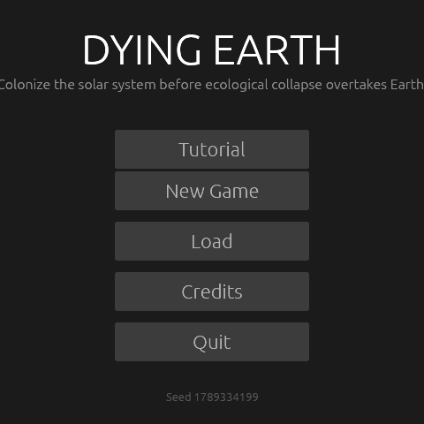

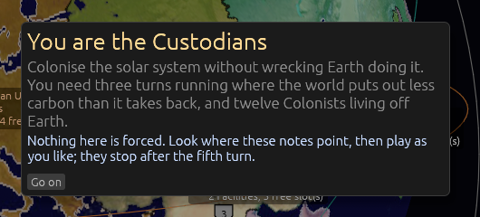

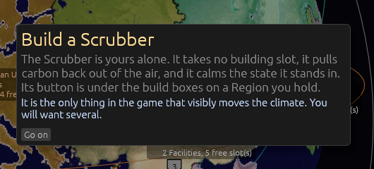

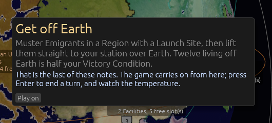

The five notes are **read the board**, **build a Scrubber**, **spend your Influence** and **get off
Earth**, after the first one which says what the Faction is for. The button on the title screen
starts the game in one click -- as the Custodians at their own home, the Faction and the start not
asked for -- and the last note ends the tutorial, after which it is an ordinary game on the same
board with nothing thrown away.

Every word lives in **`assets/data/tutorial.toml`** with every other sentence the game says, so the
notes can be rewritten without a build, and the turn a note opens is a field on the note rather than
its place in the file. A note is drawn the way a Moment is drawn, because it is the same thing to
the player: the turn stops for one short thought. A `tutorial:<turn>` picture aid photographs one.

**Written knowing the seat is the hard one.** Over eighty computer-played games the Custodian seat
wins 3 in 20 and collapses the world in 11, the worst record of the four, which the designer chose
anyway: it is the seat that teaches the climate. The notes do not promise an easy win.
