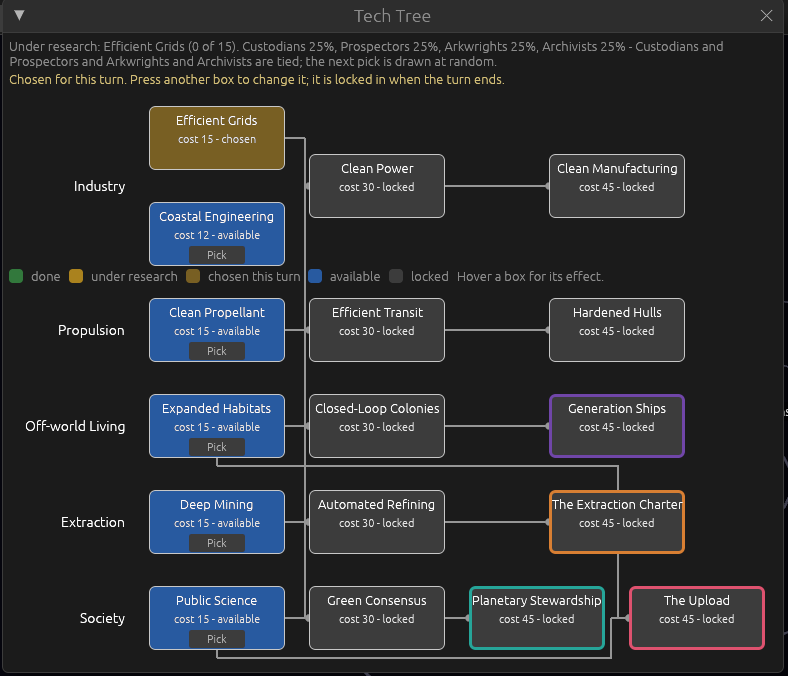
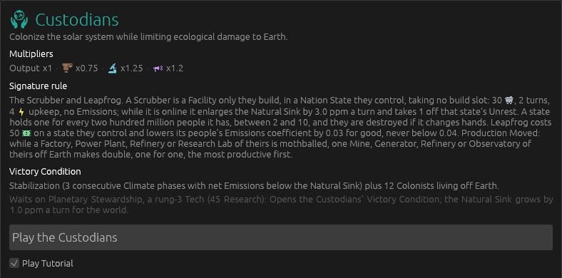
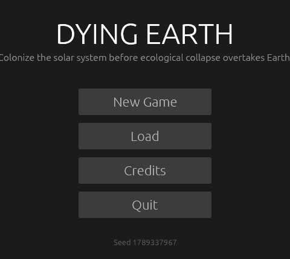
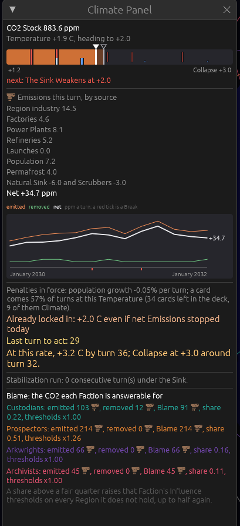
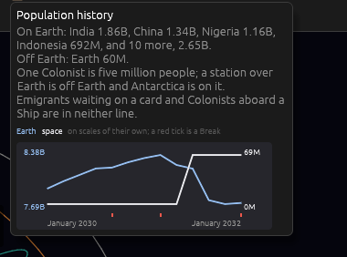
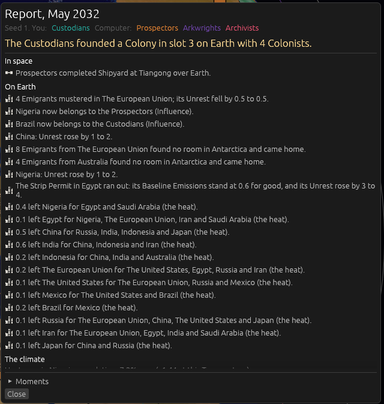
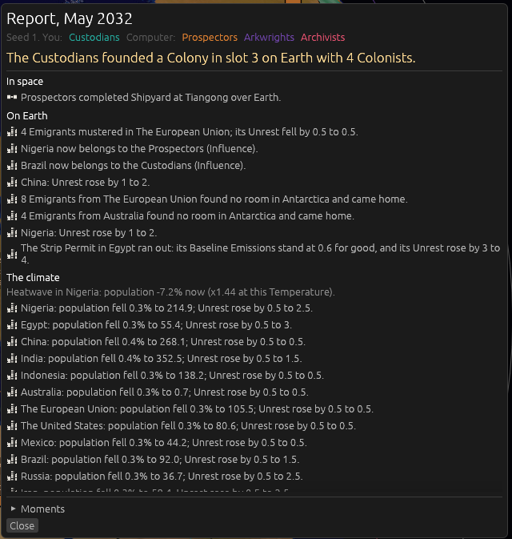

# Version 0.07.6, the small-revisions version: the pictures

The map is [Map: version 0.07.6](https://github.com/whaleyjoshua2/Dying-Earth/issues/172). Every
picture here was taken headlessly in `shot:` mode on `version-0.07.6`; nothing was opened on the
designer's desktop.

## A Tech pick is not locked in until the turn ends

Ticket [#173](https://github.com/whaleyjoshua2/Dying-Earth/issues/173). The designer's line: *"tech
choice is not locked in until the turn is ended."*

Until now a pick was final the instant it was pressed: the shortlist was thrown away, every banked
point of Research poured into the new Tech, and a Tech with enough banked behind it could finish in
the middle of the Orders phase. A misclick could not be taken back.

Now a human Lead's pick is **provisional**. Pressing a box records the choice and stops there.
Pressing another box replaces it, as often as you like, for as long as the turn lasts. Ending the
turn commits it, and from then on it is the settled Tech under research.

The chosen box wears a **paler amber** than the settled one, reads `chosen`, and loses its own
`Pick` button (there is nothing to press it for). The legend carries the new colour beside the
settled amber it has to be told apart from. Above the tree, in the Lead's own colour:
*"Chosen for this turn. Press another box to change it; it is locked in when the turn ends."*

**Decided by the designer** on the ticket:

- **The pick spends nothing until it commits.** The banked Research pours in at the commit, not at
  the press, so a Tech finished by the bank now lands with the turn's other Moments instead of
  arriving mid-Orders.
- **The Archivists' Provisional Findings reads the Tech frozen at the turn's head**, not whatever
  is picked this instant, so a Lead changing its mind cannot re-price orders already placed.
- **The shortlist is kept while the pick can change.** Redrawing the three on every change would be
  a free reroll.
- **A computer seat's pick commits in the same breath**, since it never changes its mind.

A new test, `a_tech_pick_can_be_changed_until_the_turn_ends`, pins the whole rule: the pick is
provisional, spends nothing, can be changed twice, commits when the turn ends, and is final after.
Three older tests were repinned with their reasons written in. The rule was witnessed red before it
was believed green: reverted on purpose, the new test failed, the rule restored, 255 pass.

The headless driver reads the pick too, so it was taught the same rule. Its board now says
*"Deep Mining IS CHOSEN FOR THIS TURN, and not locked in until the turn ends"* where it used to
demand a pick, and two `tech` lines in one turn now both apply, the second winning.

## The tutorial is asked for on the Custodians' card

Ticket [#174](https://github.com/whaleyjoshua2/Dying-Earth/issues/174). The designer's line: *"move
tutorial choice to a radio box on custodian card during faction selection."*

Version 0.07.5 put a **Tutorial** button on the title screen that began a Custodian game at Europe
in one click, asking for neither Faction nor start. The choice now lives on the one card it belongs
to, as a tick at the foot of the Custodians' card reading **`Play Tutorial`**.

The title screen's button is gone, and New Game is the top of the list again.

**Decided by the designer** on the ticket:

- **The tick sits at the bottom of the card and reads `Play Tutorial`**, under the `Play the
  Custodians` button rather than above it.
- **A ticked card still picks a start.** The tick is on the Faction, not on the whole opening, so
  `Play the Custodians` goes on to the start screen as it always did and the notes begin once a
  Region has been chosen. None of the five notes names a Region, so any start reads correctly.
- **The other three cards stay quiet.** A line about a thing the card in front of you cannot give
  is clutter.

The tick is remembered while the Faction screen is open, so looking at another card and coming back
does not clear it, and it is cleared when a game begins. A hover says what it does: *A note at the
head of each of the first five turns, saying what that turn is for. Nothing is forced, and it stops
after the fifth.*

A player who ticks the box, thinks better of it and plays the Prospectors instead gets **no notes**:
every note is written about the Custodians. That rule is `tutorial_wanted` in the engine-facing app
layer rather than a condition buried in one caller, and a new test,
`the_tutorial_runs_only_when_the_tick_and_the_custodians_agree`, pins all three cases. It was
witnessed red before it was believed green. **256 tests pass; clippy clean.**

The headless harness gained `tutorialtick:1`, which stands the tick up for a picture, since a
headless run cannot click it.

## The population graph comes off the Climate Panel

Ticket [#175](https://github.com/whaleyjoshua2/Dying-Earth/issues/175). The designer's line: *"remove
pop graph from climate window."*

Version 0.07.5 drew the population history twice: small, in the top bar's Population hover, and at
full width on the Climate Panel above the growth rate that drives it. The panel keeps one chart now.

The population history keeps its hover, where it now has the picture to itself.

**Decided by the designer** on the ticket:

- **The Emissions history stays on the panel.** The same argument would have taken it off -- it is
  on the Emissions figure's hover too -- but the panel is the page about emissions and that chart is
  the page's own subject over time, where the population chart was a guest.
- **Nothing fills the space**, and the Emissions chart keeps the height it had. A chart that grows
  because its neighbour left is a chart sized by accident.
- **The growth-rate line is left alone.** It already carries three facts, and the hover is one
  pointer-move away.

The panel is shorter by about a hundred pixels, which at the full-height start decided in version
0.07.5 means the Blame block sits inside the window with room to spare.

## The Report says only net migration, and only when migration happens

Ticket [#176](https://github.com/whaleyjoshua2/Dying-Earth/issues/176). The designer's line: *"reduce
report clutter by reporting only net migration from refugees and only when migration occurs."*

**Measured before the change**, over ten computer-played games: the worst turn spent **39 of its 74
Report lines** on refugees, the median turn **12**, and refugees were **30% of the median Report**.
A Region spoke once for every cause that drove people out and once more for arrivals, so one that
lost people to the sea and to the heat spoke twice, and one that took ten people and sent ten away
spoke twice while netting nothing.

Turn 15 of seed 1, the same board photographed twice. Before, twelve lines of fractions of a person,
pushing the whole climate section below the fold:

After, the same turn. Every one of those nets was under half a person, so the Report says nothing
about them and the climate section is in view instead:

**Measured after the change**, over the same ten games:

| Refugee lines | Before | After |
| --- | --- | --- |
| Worst turn | 39 of 74 | 14 of 29 |
| Median turn | 12 | 0 |
| Turns saying anything | 74% | 45% |
| Median share of the Report | 30% | 0% |

**Decided by the designer** on the ticket: **one line per Region**, not one for the world; silent
under **half a person**, the figure Unrest itself rounds by; **both drafted sentences as written**;
and **the largest cause kept**, since *why* is the most interesting word in the old line.

What a Region gained: `Russia took in 3.0 people; Unrest rose by 1 to 4.` What it lost:
`China lost 4.0 people to its neighbours: mostly the heat.` Where a Region both gained and lost, the
line names the gross as well, because **Unrest is still charged on everyone who arrived** and the
Unrest clause would otherwise be charged on a number the line never gives.

The engine gained `refugees_out` beside `refugees_in`, kept by cause, since departures were never
counted per Region and a net figure needs them. **The log is untouched**: it keeps one line per flow,
naming where the people went and why, because it is the developer's transcript and nobody reads it a
turn at a time.

One new test, `the_report_says_one_net_migration_line_per_region_and_only_when_it_is_worth_saying`,
pins the whole rule, and the old refugee test is repinned with its reason written in. Witnessed red
before green. **247 tests pass; clippy clean.**
