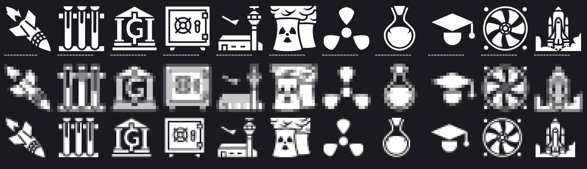
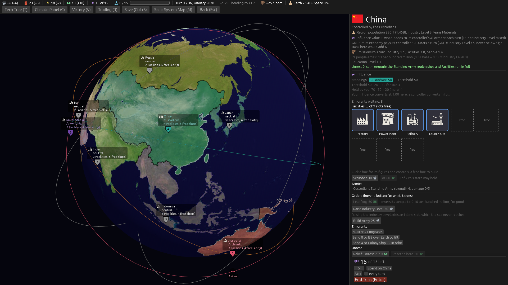
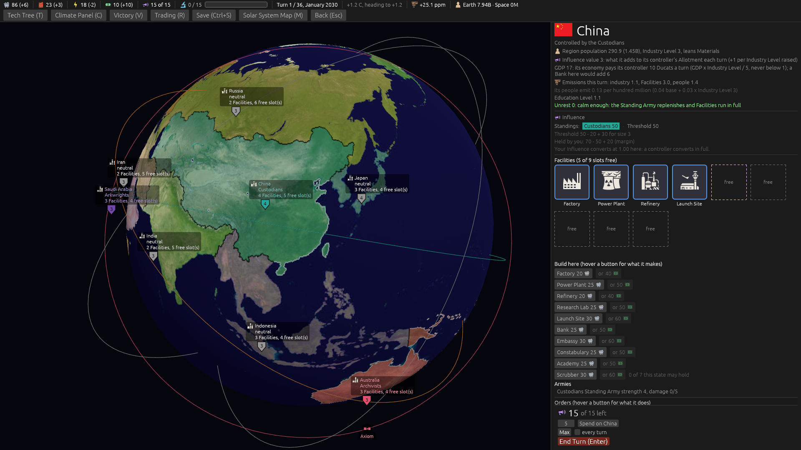
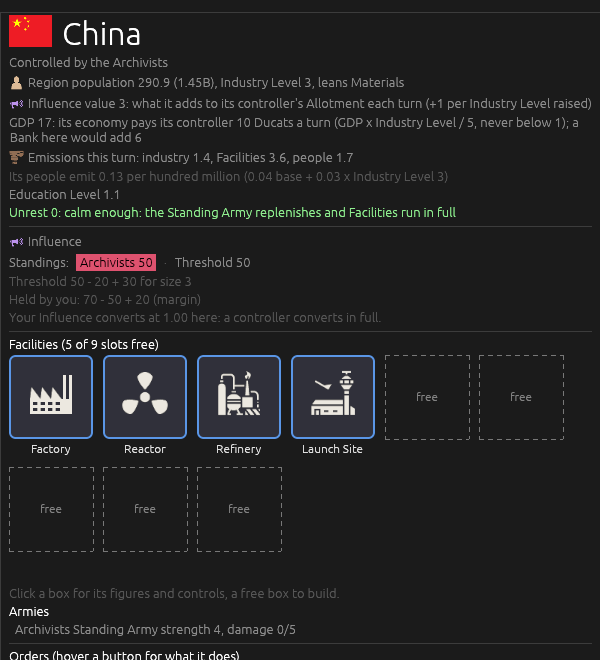
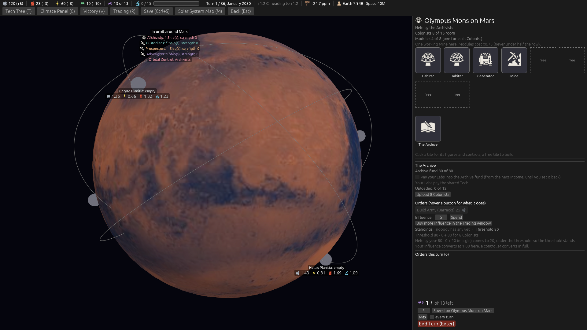
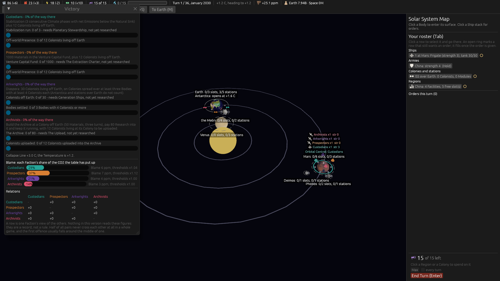
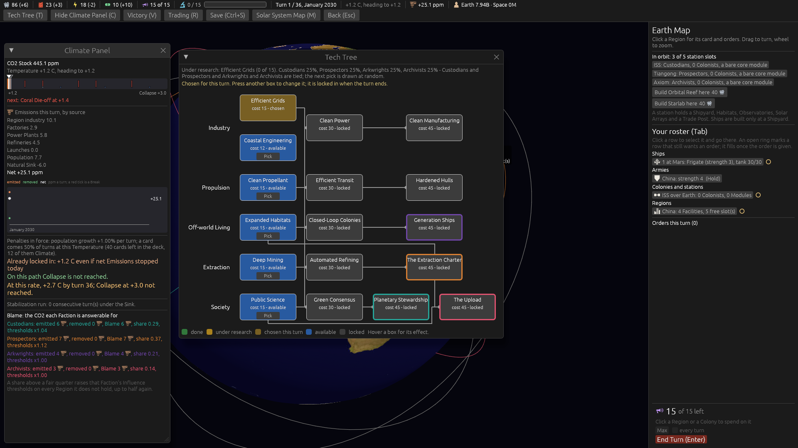
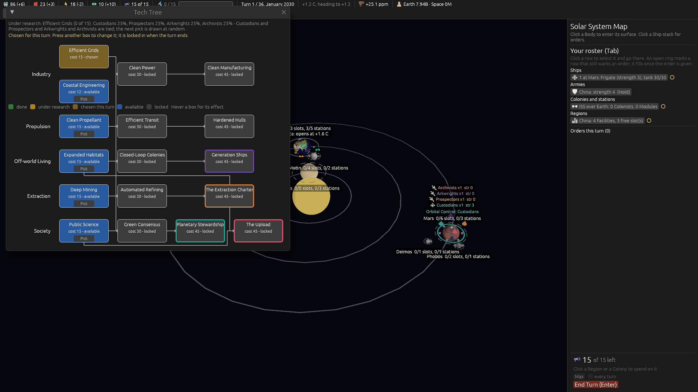

# Version 0.08.0 — the schooling version

The Education Level stops being a fixed number on a card and becomes something a player moves; then
five other rules read it. Beside that: a Unique Facility for every Faction, a Constabulary that
defends, Relations kept but not spent, and an Archive you have to fill rather than stand beside.

The spec is [`docs/spec/version-0.08.0.md`](../../spec/version-0.08.0.md). The map is
[Map: version 0.08.0](https://github.com/whaleyjoshua2/Dying-Earth/issues/180).

---

## The icons

Four new pictures, one per Unique Facility, each picked by the designer off a sheet rendered at 16
and 28 pixels on the game's own dark ground and **looked at before anything was adopted**.

| Unique Facility | Icon | Author |
|---|---|---|
| Investment Bank (Prospectors) | Strongbox | Delapouite |
| Spaceport (Arkwrights) | Space Shuttle | Delapouite |
| Reactor (Archivists) | Nuclear | Sbed |
| Academy (Custodians) | Test Tubes | Lorc |

All three authors were already on the Credits screen, so it gains four rows and no new name.

**Two candidates were killed by the picture and by nothing else.** A **turbine** was the obvious
Reactor: at 16 pixels it is the Scrubber's computer fan exactly, a bright disc with radial blades,
twice over. A **harbour dock** was the obvious Spaceport: it carries an anchor, so it says sea.

The Academy took two rounds. Round one: the telescope is legible but says *astronomy*, which is the
Observatory's job; the astrolabe is mud at 16. Round two fetched eight more subjects and drew two --
the owl, the abacus, the greenhouse and the school bag are all grey smears at 16; Delapouite's own
graduate cap is muddier than the School's drawn cap and says the same word anyway; and a mortarboard
with a leaf above it reads as a table lamp.

The designer asked whether the flask on the neighbours sheet was free. **It was not**:
`assets/icons/candidates/round-bottom-flask.svg` is byte-identical to
`assets/icons/facility_research_lab.svg` -- that flask *is* the Research Lab.
[`academy-round2/sheet-c.png`](academy-round2/sheet-c.png) puts the two side by side to show it. The
pick went to its sibling, the test tubes, over the recommendation, which was a quill.



**Read at 16 pixels, the middle row**, the pairs worth checking all separate. The **Academy** is three
upright bars on a base where the **Research Lab** is a round blob with a neck -- the family
resemblance the designer accepted knowingly does not survive into the silhouette. The **Reactor**'s
bare trefoil has dark gaps where the **Scrubber**'s fan is a solid bright disc. The **Colony Ship** is
a diagonal streak where the **Spaceport** is upright. **The one to watch in play is the Launch Site
against the Spaceport**: both are a vertical element over a low mass, and they are the least distinct
pair on the sheet, though still tellable apart side by side.

The whole set is in [`icon-sheet-0.08.0.png`](icon-sheet-0.08.0.png), forty-two icons.

---

## The interface

Every picture below was taken headlessly, the release binary in `shot:` mode only.



The Region card's **Influence block carries a three-line breakdown** now, in the designer's own
format -- what the threshold is made of, what the holder's Standing and the margin make of it, and
what your Influence is worth here after Resistance. The old single sentence named neither Blame nor
Green Consensus though both already moved the figure. Blame and Green Consensus join the threshold
line only while they are biting, so the usual card is three lines.

The **Emigrants block** gained `Send 4 to Colony Ship 22 in orbit` beside the sea and station
buttons. It sends min(waiting, room) and never offers the crowded places: above +1.8 a Ship lifting
at Earth may take Colonists beyond its capacity and each of those may die on arrival, and a risk that
drowns people wants its sentence beside the button -- which is on the Ship's card, where the crowding
decision belongs.



**A Faction's build list carries its own Unique Facility and nobody else's.** The Custodians read
`Academy 25` where every other seat reads `School 25`; there is no plain School on their list at all.



**A Faction's start Region comes up with its own versions.** The Archivists' Power Plant is a Reactor
from turn 1, wearing the nuclear trefoil at slot-box size.



**The Archive block** carries `Uploaded: N of 12` and an `Upload N Colonists` button. The Colony's own
threshold breakdown is under it, in the case where the **threshold** binds rather than the margin --
which needed a fourth clause on that line, because "80 - 0 + 20 (margin)" is not 80 and reads as bad
arithmetic without one.



**The Relations grid**, four by four, a row per Faction's view of the others. On turn 1 every cell
reads `+0`, which is the rule working: the scale's +10 half is reserved and nothing fills it this
version, and measured over 80 games half of all ordered pairs never offend at all.

### The Tech Tree, diagnosed from a picture



The legend row was rendering **inside the tree**, in the gap between the Industry and Propulsion
bands, lying across the connector lines. The reading of the code made while the ticket was charted was
wrong; the picture is what found it. `tech_tree` paints every box with `painter_at` at absolute
coordinates, but each **Pick** button is placed with `ui.put()`, which advances the Ui's layout
cursor -- so the `ui.horizontal` that draws the legend started from wherever the last Pick button
landed. That is also why it read as wonky *when picking a Tech*: the set of boxes carrying a Pick
button is exactly what picking changes.

**The negative control** is the same window before the fix:



The Tech Tree window also gained a **default position clear of the Climate Panel**, which on the Earth
view was covering its left third -- every branch name and four of the five legend swatches. The first
two captures taken for ticket #194 were useless because of it.

---

## The sweep

Twenty seeds in each of four seatings, all seats computer-played, at the **shipped climate cell**
(`--sinks=6 --steps=300`, which is `climate.toml`'s own `natural_sink = 6.0` and `ppm_step = 300.0`).
The branch point was measured the same way, in a worktree, so the two tables are comparable. The full
output is in [`sweep-before.txt`](sweep-before.txt) and [`sweep-after.txt`](sweep-after.txt).

**Before, at the branch point:**

| seat 0 | wins | Collapses |
|---|---|---|
| Custodians | Archivists 19 | 1 |
| Prospectors | Archivists 9, Custodians 7, Prospectors 2 | 2 |
| Arkwrights | Arkwrights 6, Custodians 5, Archivists 3 | 6 |
| Archivists | Archivists 11, Custodians 9 | 0 |
| **totals** | **Archivists 42, Custodians 21, Arkwrights 6, Prospectors 2** | **9 of 80** |

**After, the finished version:**

| seat 0 | wins | Collapses |
|---|---|---|
| Custodians | Archivists 20 | 0 |
| Prospectors | Archivists 17, Custodians 3 | 0 |
| Arkwrights | Archivists 17, Arkwrights 2 | 1 |
| Archivists | Archivists 20 | 0 |
| **totals** | **Archivists 74, Custodians 3, Arkwrights 2, Prospectors 0** | **1 of 80** |

### The Upload made the Archivists stronger, not weaker

[Ticket #192](https://github.com/whaleyjoshua2/Dying-Earth/issues/192) said plainly that *"the
Archivists should be expected to fall sharply"*. **They rose from 42 wins of 80 to 74.**

The gate itself worked exactly as designed: the Module now stands at a median turn **8 to 10** instead
of 4, and completes at a median **13 to 15**. The delay landed. It is the **second part** that changed
the seat. From a single-seed log:

```
--- Turn 13 ---   Archivists uploaded 4 Colonists into the Archive at Axiom over Earth; 4 in all.
--- Turn 15 ---   Archivists uploaded 8 Colonists into the Archive at Axiom over Earth; 12 in all.
--- Turn 16 ---   Game over on turn 16: the Archivists win (met its Victory Condition).
```

**"Twelve uploaded" is a far easier condition than "twelve living at the Colony" was**, for two
reasons that compound. It is **cumulative** -- the old wording needed twelve people alive at one place
at one moment, where the new one banks them a batch at a time and nothing can take them back. And
**uploading empties the place**, so every batch read in frees the room the next batch needs: the same
bare station can feed the Archive over and over, where under the old rule it had to grow to hold
twelve at once, which measurably it rarely did.

**The rest of the table follows from that one fact.** The Archivists end the game around turn 16, so
every cumulative figure in every other column falls with the shorter game: Colonists off Earth at the
end drop from a median 33 / 38 / 144 / 29 to 20 / 22 / 57 / 14, and Scrubbers, Leapfrogs, Sea Walls
and Emigrant batches all fall in step. The Custodians (21 wins to 3) and the Arkwrights (6 to 2) are
not weaker; they are being beaten to the line. Collapses fell from 9 of 80 to 1 for the same reason:
the world has fewer turns in which to burn.

### What the other clauses did, and what they were expected to do

- **The Constabulary's margin** moved nothing, exactly as ticket #190 predicted in advance. Written
  down there before the sweep so a flat result would not be read as failure.
- **Relations** moved nothing, as ticket #191 said it should not: the score is read, not spent, and no
  computer player reads it.
- **The Investment Bank** has not yet saved the Prospectors -- still 0 wins of 80, with the Fund at a
  median 227 to 317 against the new bar of 1000. Ticket #182 said what to conclude if this happened,
  but the shorter games make that reading unsafe: a seat whose engine compounds needs turns, and the
  median game now ends around turn 16.

---

## Red witnesses

Seventeen false states were constructed across this version's work, each watched failing on the
assertion with its measured value and each restored to green. Three of them are worth recording
because they found something rather than confirming it:

- **The Academy's Ducat check came back GREEN on its false state.** It read its expected figure from
  the same table the rule reads, so setting the figure to zero moved both sides together -- the
  common-mode trap exactly. The figure is now pinned as a literal beside a separate assertion that the
  card still carries it.
- **The claim that the Archive's gate is checked ONCE was not being checked at all.** Two
  perturbations of the build path left the test green. It now drives the build to completion with the
  place emptied, which is the thing the rule actually promises.
- **A weight of zero does not remove an order.** Setting the computer's `upload` weight to 0 left it
  uploading anyway, so that false state had to perturb the code that pushes the order, not the number
  that prices it.
