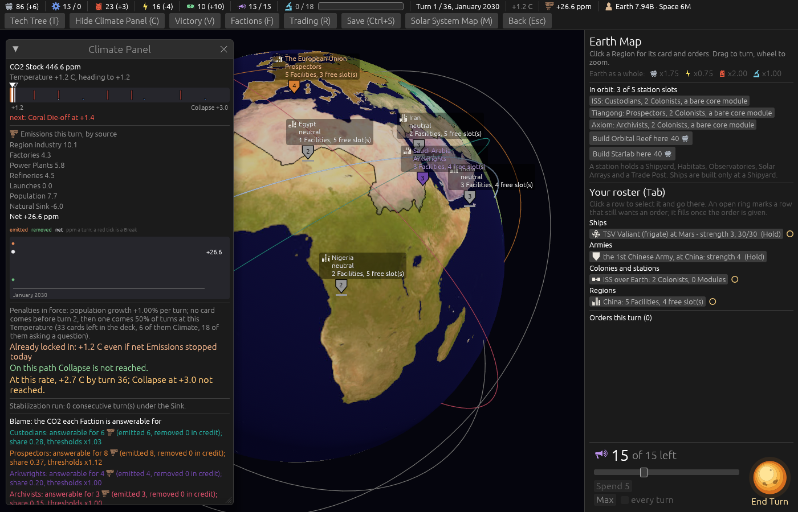
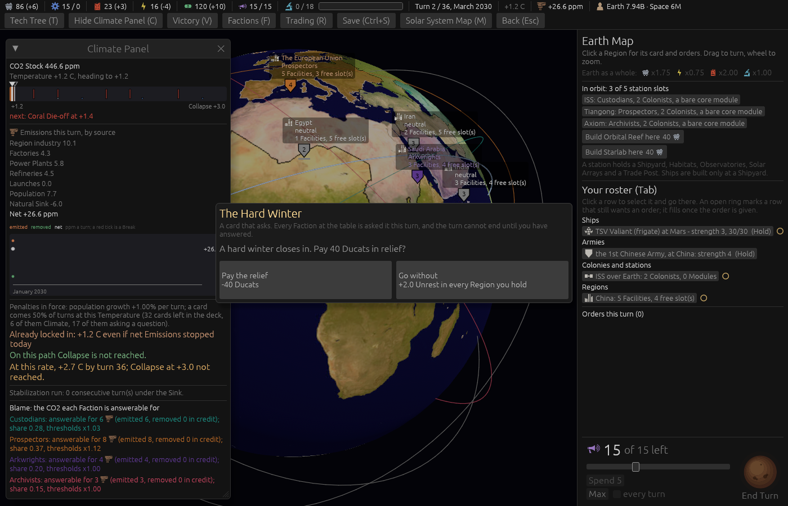

# Ticket #367: no card on the first turn

The designer: *"do not draw an event card on first turn."* Decided on the ticket in one round: no
card of either kind, the deck untouched, the turn a figure.

[The resolution](https://github.com/whaleyjoshua2/Dying-Earth/issues/367) is the authority;
[§1 of the spec](../../../spec/version-0.09.2.md#1-no-card-on-the-first-turn) records it.

## What was built

- `first_draw_turn = 2` in `events.toml`, refused by the loader at nought.
- The Question phase returns before rolling while the turn is below it. The deck is not touched,
  so the top card waits for turn 2's ordinary roll.
- The driver's help says so, and the glossary's **Draw Chance** entry carries the clause.

## The red witness

`no_card_of_either_kind_is_drawn_on_the_first_turn_and_the_deck_is_untouched`, run with the figure
loaded but the rule absent:

    assertion `left == right` failed: seed 1: turn 1 drew Choice(ConscriptionNotice)

and `the_loader_refuses_a_first_draw_turn_of_nought`, on a copy of the data folder with the one line
changed to 0:

    a first_draw_turn of 0 is refused

Both green after the rule. The rule test also checks that turn 2 still rolls a coin: over sixty
seeds some draw and some do not, so the rule holds off turn 1 alone.

## The sweep after it

[`../sweeps/after-367.txt`](../sweeps/after-367.txt), 20 seeds x four seatings at the shipped cell,
against 0.09.1's closing **6 / 28 / 3 / 2**, collapses 41:

| | 0.09.1 closing | after #367 |
|---|---|---|
| Custodians | 6 | **8** |
| Prospectors | 28 | **28** |
| Arkwrights | 3 | **0** |
| Archivists | 2 | **2** |
| collapses of 80 | 41 | **42** |

Gates completed 70 / 63 / 55 / 39 of 80, against 73 / 58 / 50 / 40. The Arkwrights' three wins went
to nought; whether that is the missing turn-1 card or the seeds is not measured here, and it is
reported as a figure, not chased. The rule reaches every seat the same way, since the phase is one
phase for all four.

## The pictures

Both taken headlessly with the rebuilt binary, `window:1400x900`.

`shot:turn-one`. **Turn 1, January 2030, no modal.** The Climate Panel's penalties line now says
*"no card comes before turn 2, then one comes 50% of turns at this Temperature (33 cards left in the
deck, 6 of them Climate, 18 of them asking a question)"*: the deck untouched, all thirty-three dealt
cards still in it.

`shot:card-modal card:the_hard_winter ducats:120`. **Turn 2, March 2030.** The picture aid that
stages a card stacks the deck and rolls the game's own Question phase; on a fresh board (turn 1) it
would now never draw, so it stands the board on the first drawing turn first. The Hard Winter is up
with both sides, and the deck line behind it reads the ordinary *"a card comes 50% of turns"*.

## The review

Two axes, run as sub-agents over `git diff main...HEAD`.

**Standards**: no hard violation. Three judgement calls, all taken: the driver's help clause on its
own line; the fixture line the three card tests shared (`g.turn = g.turn.max(first_draw_turn)`)
pulled into one helper, `stand_on_a_drawing_turn`, in the file's helper style; the loader test
brought to the shape of its three precedents (a clean copy asserted to load before the one line is
changed, files only, the folder removed before it is made).

**Spec**: the rule correct on every point it checked. **One regression found and fixed**: the
`shot:` card aid in `src/shot.rs` was the mirror of the test fixture and had not been moved, so
every card picture would have failed with *"never came up in two hundred rolls"*. Four stale
sentences fixed: the Climate Panel's *"a card comes N% of turns"* on turn 1 (now the line above),
the `events.toml` header, the `draw_chance_base` doc comment, and the driver's module doc. One test
gap filled: a `first_draw_turn` of 1, the rule as it stood, is accepted, as the refusal's text
promises.
