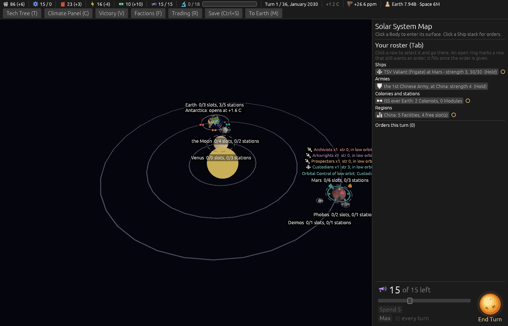
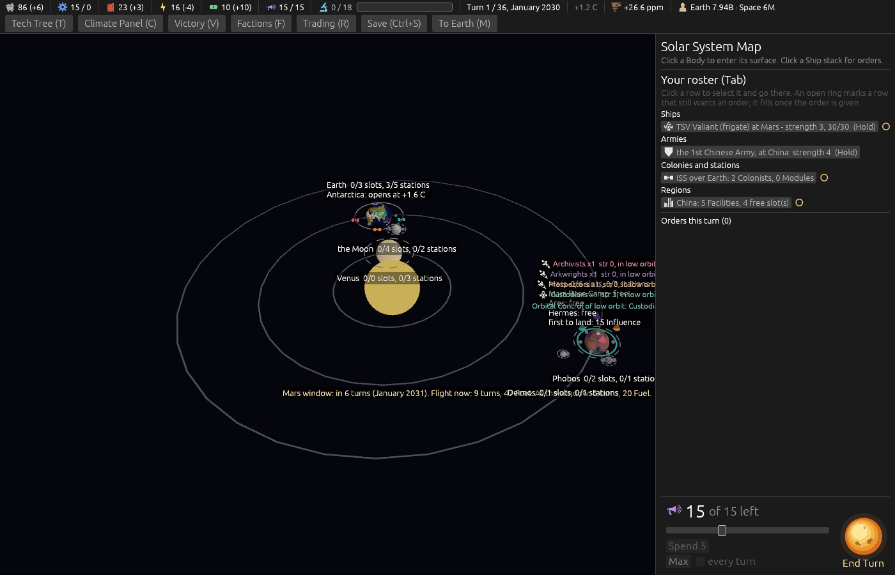

# Ticket #368: the first-to-land line off the system map

The designer: *"do not display 1st founding bonus on system map."* Decided on the ticket in one
round: both states off the open label, folded into the Body's hover under the slot list, the surface
card unchanged.

[The resolution](https://github.com/whaleyjoshua2/Dying-Earth/issues/368) is the authority;
[§2 of the spec](../../../spec/version-0.09.2.md#2-the-first-to-land-line-off-the-system-map)
records it.

## What was built

One block in `src/ui.rs` moved from the always-open part of the Body label into the `hovering`
branch, after the orbital-slot lines. It is not counted into the label's line spacing, as it was
not before, for the reason the pictures below show. No engine change, no data change, no save
change.

## The pictures

Both taken headlessly, `window:1400x900`, on a turn-1 board with the shot aid's staged fleets at Mars.

`shot:map-open`. **The open map.** Every Body label is one line, name and counts (*"Mars 0/6 slots,
0/3 stations"*); Earth keeps its Antarctic line. No *"first to land"* anywhere.

`shot:map-hover hover:mars`. **Mars under the pointer.** The label unfolds to *"Mars Base Camp:
free / Ares: free / Hermes: free / first to land: 15 Influence"*, the line under the slot list as
decided, and the label's foot clears the disc.

**A first cut of this picture was wrong and is not kept.** The moved line was counted into the
label's spacing, which pushed the unfolded label 7.5 px higher, up into the Orbital Control flag,
exactly as #345's note in the code said it would. Uncounted, as it was when it stood open, the label
stands where it did before this ticket. Its top still lies over the staged fleets' stack labels
above Mars; that overlap was there before this ticket (the same five lines of text, one of them
open) and is not this ticket's to change.

## The gate

`cargo clippy --workspace --release --all-targets -- -D warnings` clean (the root crate re-checked,
forced, since a two-second pass after a `ui.rs` edit was too quick to trust on exit status); engine
484 + 6, root 8. No sweep: nothing in the engine moved.
