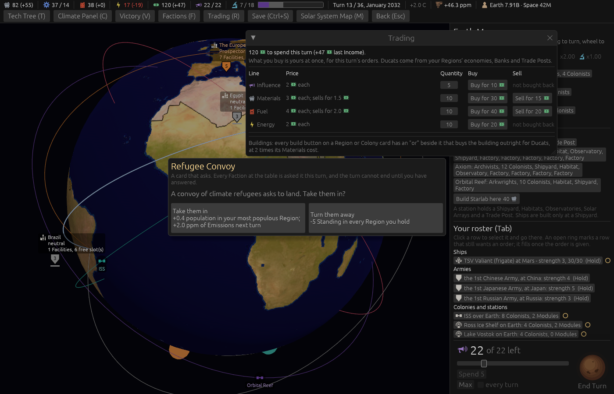
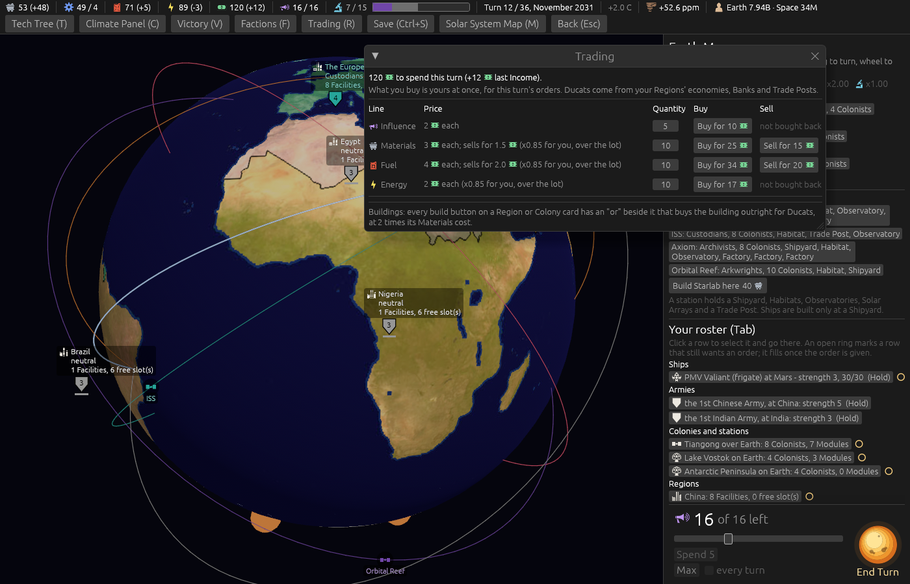

# Ticket #369: glyphs in the Trading window

The designer: *"glyphs in market window."* Decided on the ticket in one round: a glyph at the head
of each row and on every figure, the way the top bar does it; the Buildings sentence and the
Trades-this-turn list by the same rule.

[The resolution](https://github.com/whaleyjoshua2/Dying-Earth/issues/369) is the authority;
[§3 of the spec](../../../spec/version-0.09.2.md#3-glyphs-in-the-trading-window) records it.

## What was built

`trading_window` in `src/ui.rs` alone. The header, the price column, the Buildings sentence and the
trades list go through `text_with_icons`, the one number-then-word rule; each row's name through
`icon_word`; the Buy and Sell buttons through `priced_button`, handed a Cost of Ducats alone, which
is how a glyph reaches a button face. The sell price gained the word "Ducats" so its figure has a
word to trade. No engine change, no data change, no save change.

## The pictures

Both taken headlessly, `window:1400x900`, the Trading window open over Earth.

`shot:trading-custodians turns:12 trade:1 panel:0 ducats:120`. **The Custodians, turn 13.** The
header reads *"120 [ducats] to spend this turn (+47 [ducats] last Income)"*; each row opens with
its good's glyph and name; the Materials price reads *"3 [ducats] each; sells for 1.5 [ducats]"*;
the buttons *"Buy for 30 [ducats]"* and *"Sell for 15 [ducats]"*. The Buildings sentence carries no
glyph, since no figure in it is a quantity of a good, which is the rule working. The Refugee Convoy
under the window is a card the staged turn drew; it covers nothing.

`shot:trading-prospectors player:prospectors turns:11 trade:1 panel:0 ducats:120`. **The
Prospectors, turn 12.** The same window with the 15% off: *"3 [ducats] each; sells for 1.5 [ducats]
(x0.85 for you, over the lot)"*, the longest shape the price cell ever holds, on one line; *"Buy for
25 [ducats]"* where the Custodians pay 30.

**The first cut of both pictures was wrong and is not kept.** The price cell wrapped one word to a
line (*"3 [ducats] / each; / sells / for 1.5 / [ducats]"*, and the discount clause eleven lines
tall), because the glyph line wraps at the width it is given and a Grid cell has none until its
content has one. The cell is given a floor of 340 px, sized to the discount clause. The first
Prospectors picture was also under a card the staged turn drew, so it is taken a turn earlier.

## The review

Two axes, run as sub-agents over the commit.

**Standards**: no violation. Two judgement calls taken: the strong text colour was bound to `ink`,
which is the file's name for the plain one, so it is `head` now; the price cell's floor is a named
constant, `TRADE_PRICE_W`, beside the file's other widths. The Buy and Sell hunks were near-twins
and are one helper now, `ducat_button`, for the reason below.

**Spec**: nothing missing against the decision, nothing stale elsewhere. **One edge found and
fixed**: `priced_button` drops a nought from a price, and a nought is reachable in this window
(Materials at 1 Ducat, one unit, the Prospectors' 15% off comes to 0), so the face would have read a
bare *"Buy for"* where it read *"Buy for 0 Ducats"* before. `ducat_button` writes a nought out in
words. The pictures above were re-taken with the final code.

## The gate

`cargo clippy --workspace --release --all-targets -- -D warnings` clean, the root crate re-checked;
engine 484 + 6, root 8. No sweep: nothing in the engine moved.
