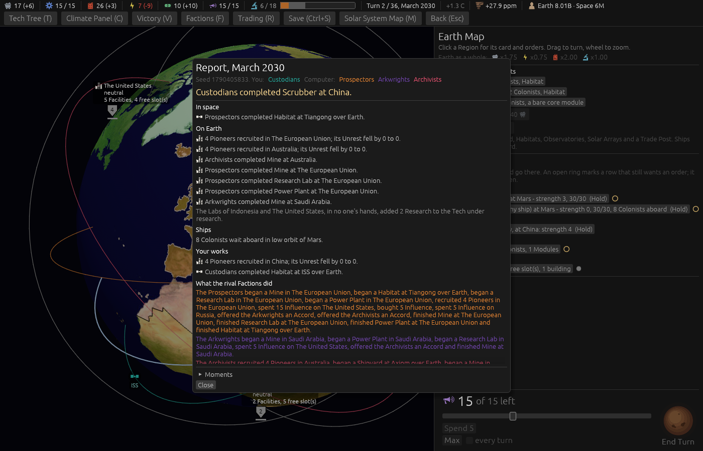

# Ticket #370: Colonists waiting aboard off Earth, and a Ships heading

The designer: *"add report line about colonist waiting to be settled for those still in ships in
low orbit of any body but earth."* Decided on the ticket in one round: every turn, one line a Body,
the player's own Ships in any orbit off Earth, *"blocked by rivals' control of the orbit"* when so;
and a **Ships** heading above Your works that every Ship line moves to.

[The resolution](https://github.com/whaleyjoshua2/Dying-Earth/issues/370) is the authority;
[§4 of the spec](../../../spec/version-0.09.2.md#4-colonists-waiting-aboard-off-earth-and-a-ships-heading-in-the-report)
records it.

## What was built

- A pass at the end of Resolution, `report_waiting_colonists`, after every landing the turn has
  made: the player's Ships at a Body off Earth with Colonists aboard, summed by orbit, one line a
  Body, `colonists_waiting` in `report.toml` with the `waiting_blocked` ending. Blocked reads a
  rival's Orbital Control for low orbit and a blockade for a station's orbit.
- `Section::Ships`, fifth of the Report's headings, between The climate and Your works; every
  `LineKind::Ship` line files there. The interface draws the headings from the list, so it needed
  no change.

## The red witness

`colonists_waiting_aboard_off_earth_are_reported_every_turn_under_ships`, run with the section and
the words in place but the pass absent:

    assertion `left == right` failed: one line, the player's, not the rival's: []
      left: 0
     right: 1

Green after the pass, with the words, the place, the section, the no-headline rank, the second
turn, the rival's silence and the blocked ending all asserted. `ship_lines_read_under_ships_above_your_works`
carries the heading's order and name and follows a real arrival through a turn.

## The picture

`shot:waiting settler:mars turns:1 menus:1 window:1400x900`, taken headlessly. **The Report of turn
2, March 2030.** The headings run In space, On Earth, **Ships**, Your works (The climate is absent
because nothing climatic happened that turn, which is the rule for an empty heading), and under
Ships the one line, *"8 Colonists wait aboard in low orbit of Mars."*, the Colony Ship the roster on
the right lists at Mars with 8 Colonists aboard.

**A first cut of this picture showed no line**, because the picture harness composes the settler's
Ship after the turn is played, so the Resolution never saw it. The `settler:` aid now writes the
line itself through the same pass the Resolution runs, and says so in its comment.

## The review

Two axes, run as sub-agents over the commit.

**Standards**: two breaches, both fixed. The `{where}` fragments a player reads were built in Rust
with `format!`; they are seven `waiting_*` phrases in `report.toml`'s `[phrase]` table now, as every
other fragment is. The test's frigate fixture duplicated the tree's own `ship_in`; it uses it. Three
judgement calls taken: the pass keys its orbits on `Orbit` rather than the raw slot, drops a closure
that took the game it already had, and names the player `me` as the file does elsewhere.

**Spec**: nothing missing against the decision. **One collision with the glossary, fixed**: a rival's
Blockade of a station's orbit had the same ending as a rival's Orbital Control of low orbit, and the
glossary insists they are different things; a docked Ship shut by a Blockade now reads *", blocked by
a rival's Blockade of Ares"*. That arm has no test of its own. Six comments still said "four
headings"; they say five. **One reading left for the designer**: the player's own *loaded* and
*disembarked* lines are filed as works of the player's (Your works) and did not move; a rival's did.
If those count as Ship lines, it is one word each to move them.

## The gate

`cargo clippy --workspace --release --all-targets -- -D warnings` clean; engine 486 + 6, root 8.
No sweep: a Report line moves no rule, so the win column cannot move.
