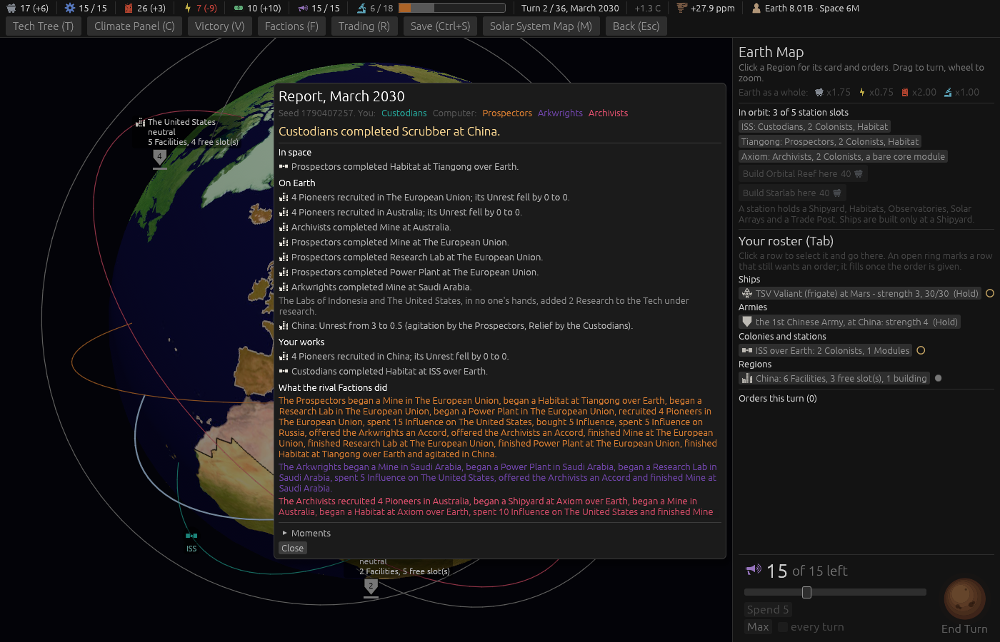

# Ticket #371: one net Unrest line a Region

The designer: *"quiet unrest spam"*, and from the playtest, *"Unrest lines in the Report run out of
order."* Decided on the ticket in one round: one net line per Region with its causes named, for the
player's own Regions and any the player acted in, every change and not only a crossing, by Region in
the board's order, the refugee line folded in.

[The resolution](https://github.com/whaleyjoshua2/Dying-Earth/issues/371) is the authority;
[§5 of the spec](../../../spec/version-0.09.2.md#5-one-net-unrest-line-a-region) records it.

## What was built

- `Pending` carries the turn's Unrest, folded: each Region's figure as the Resolution opened, and
  every cause that moved it (the Region, the words, whether the player acted). Six emission sites
  push a cause where they wrote a line; the migration line pushes the arrivals as a cause and keeps
  only the migration.
- `report_unrest_net`, at the end of `resolve_unrest`: one `unrest_net` line per Region that has a
  cause, for the player's Regions and any the player acted in, with a threshold crossing as its
  ending. The old keys are gone from `report.toml`; the causes are `cause_*` phrases.
- The log keeps every old line, so the driver and the sweep read as before.

## The red witness

`the_report_says_one_net_unrest_line_a_region_with_its_causes` passed on its first run, which is
the case to distrust, so the fold's call was removed on purpose and the test run again:

    assertion `left == right` failed: []
      left: []
     right: ["China: Unrest 3 → 1.5 (agitation by the Prospectors, Relief by the Custodians)."]

Restored, green. Three older tests that quoted the old lines were brought to the new ones. (The
arrow in that quotation was the line's first wording; the first picture showed the interface's font
has no arrow glyph and drew a box, so the line reads *"Unrest from 3 to 1.5"* now.)

## Measured

Eighty games (20 seeds x four seatings, seat 0 played by the computer), 2,560 turns, a throwaway
diagnostic (not committed) counting the Report's lines of the Unrest and migration kinds:

| | before | after |
|---|---|---|
| Unrest lines a turn | **2.47** (6,325 in all) | **1.01** (2,591 in all) |
| Region-turns with more than one Unrest line | **631** | **0** |
| most Unrest and migration lines in one turn | 31 | 23 |
| migration lines a turn | 2.78 | 2.78 |

The migration lines are untouched in number: they lost their Unrest clause, not their place. The
worst turn is now almost all migration, which was not this ticket's.

## The picture

`shot:restive restive:1 turns:1 menus:1 window:1400x900`, taken headlessly. **The Report of turn 2.**
Under On Earth, after the Regions' other lines, the one line: *"China: Unrest from 3 to 0.5
(agitation by the Prospectors, Relief by the Custodians)."*, both causes in the order they landed,
the turn's falls taking the rest. The `restive:1` aid stages the two acts and runs the game's own
Unrest pass, since the board is composed after the turn is played.

**A first cut of this picture was wrong and is not kept.** The line's arrow (*"3 → 1.5"*) drew as a
box, because the interface's font has no arrow glyph; the line reads *"from 3 to 1.5"* now. And the
aid's figures read *"0.5 to 0.5"*, because the fold's fallback for its "before" figure -- the one it
uses when a Resolution pass is run on its own -- was read after the pass had brought that figure up
to date; the fold runs ahead of that now.

## The gate

`cargo clippy --workspace --release --all-targets -- -D warnings` clean; engine 487 + 6, root 8.
No sweep: the Report changed, no rule did.
