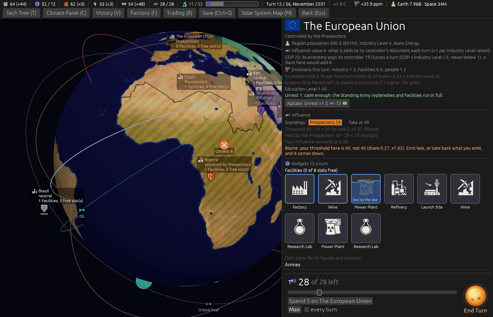
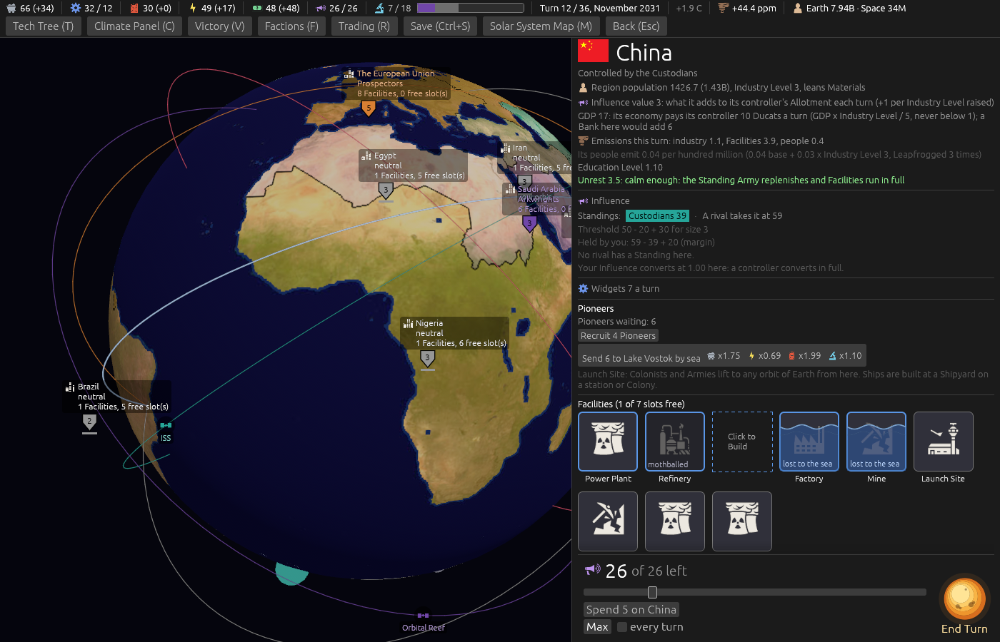
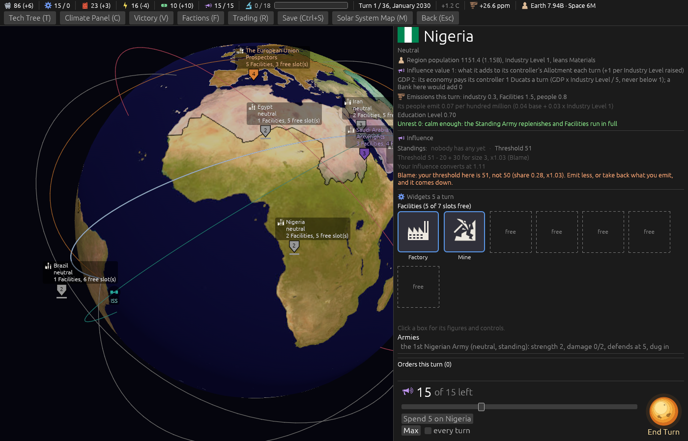

# Ticket #372: the Influence figure on a card reads the holder

The designer: *"update influence thresholds on cards to reflect current holders influence."* Decided
on the ticket in one round: on a held place the row shows the price to take it; the player's own
price, the challenger line keeping each rival's; every hover uses the real margin.

[The resolution](https://github.com/whaleyjoshua2/Dying-Earth/issues/372) is the authority;
[§7 of the spec](../../../spec/version-0.09.2.md#7-the-influence-figure-on-a-card-reads-the-holder)
records it.

## What was built

`src/ui.rs` alone. Two helpers, `rival_take_price` (the lowest price any rival pays, each by the
rule) and `margin_words` (the margin from `challenge_margin_for`, with its parts named), and the
standings row's figure in three states: *"Take at N"* on a rival's place, *"A rival takes it at N"*
on the player's own, *"Threshold T"* on nobody's. The chip hovers and the row's explain hover read
the same helpers. No engine change.

## The pictures

Three Region cards, taken headlessly at `window:1400x900`, the Climate Panel closed.

`shot:rival select:europe turns:11 cardanswer:refuse panel:0`. **A rival's place, turn 12.** The row
reads *"Prospectors 29 · Take at 49"*, and the breakdown beneath agrees with it line by line:
*"Threshold 40 - 20 + 20 for size 2, x1.02 (Blame)"*, *"Held by the Prospectors: 49 - 29 + 20
(margin)"*. Before this the row read *"Threshold 40"* over the same breakdown.

`shot:own select:eastasia turns:11 cardanswer:refuse panel:0`. **The player's own place.**
*"Custodians 39 · A rival takes it at 59"*, the lowest price any rival pays; *"Held by you: 59 - 39 +
20 (margin)"* under it, now read for that same rival.

`shot:nobody select:subsaharanafrica panel:0`. **Nobody's place, turn 1.** *"Threshold 51"*, as before.

The first cuts of the held cards were under a card the staged turn drew (`cardanswer:refuse` answers
it first now), and the neutral one opened no card because the aid takes a Region's id, not its
name; all re-taken with the final code.

## The review

Two axes, run as sub-agents over the commit.

**Standards**: four things, all taken. The two helpers had landed between `standings_row`'s doc
comment and the function; moved above it. `margin_words` re-tested the Constabulary in the interface
to name the margin's parts; the engine now keeps the margin in its three parts
(`challenge_margin_parts`), `challenge_margin_for` is their sum, and the interface reads them. Two
hovers ran over the six-line ceiling and were cut. The own-chip hover said *"your Standing plus the
margin"* where a rival's threshold binds instead; it says which binds.

**Spec**: the row, the chip hovers and the explain hovers were right; **three more places still
quoted the flat margin**, all fixed: the breakdown's second line (which also read the margin with
no challenger, so a rival's cold relations were missing from it, and on the player's own place read
the player's own meaningless price), the Region card's owner hover, and the Influence heading's
hover. **One interpretation, flagged on the ticket**: on the player's own place the row reads *"A
rival takes it at N"*, the lowest price any rival pays, which the decision did not name; the
challenger line beneath still names the nearest rival by its own rule, so the two can name
different rivals.

## The gate

`cargo clippy --workspace --release --all-targets -- -D warnings` clean; engine 492 + 6, root 8.
No sweep: nothing in the engine moved.
