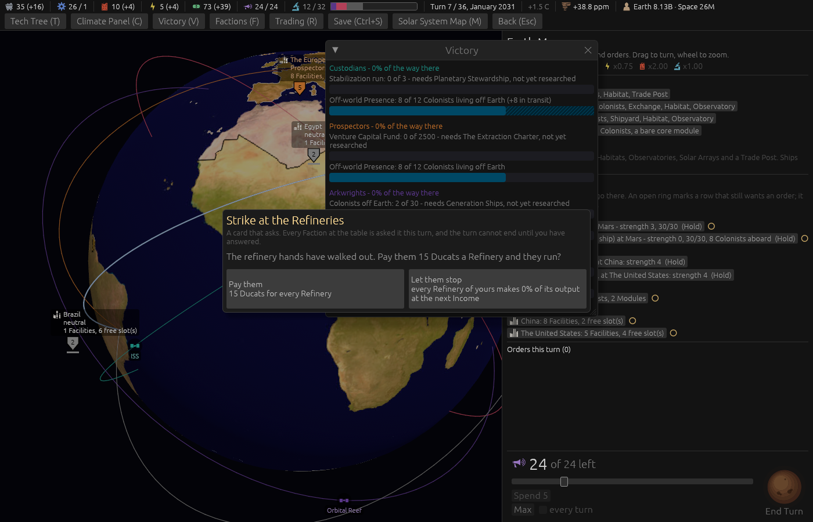
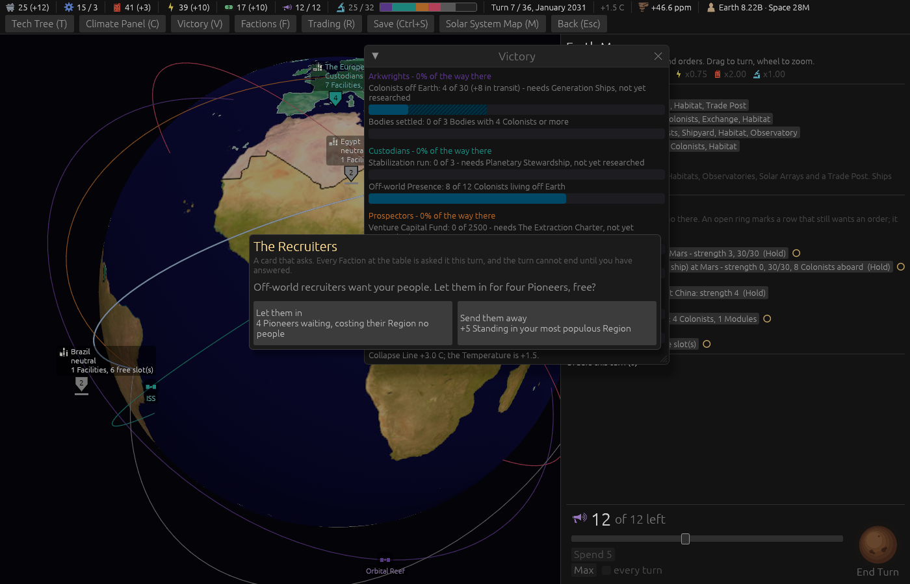

# Ticket #373: the Victory bar's band for Colonists in transit

The designer: *"victory bar should only count settled colonist but add a extra area to represent
those in transit, similar to the temperature bar, make the in transit darker and add lines at 45
degrees."* Decided on the ticket: settled as it was, in transit is everyone aboard the Faction's
Ships anywhere, the band as described on every bar that counts Colonists, the temperature bar left
flat.

[The resolution](https://github.com/whaleyjoshua2/Dying-Earth/issues/373) is the authority;
[§8 of the spec](../../../spec/version-0.09.2.md#8-the-victory-bar-counts-settled-colonists-with-a-band-for-those-in-transit)
records it.

## What was built

- The engine's `Progress` carries `first_transit` and `second_transit`, the seat's Colonists aboard
  its Ships (`colonists_aboard`), for the parts that count Colonists off Earth and no other. They
  count toward nothing: `first_fraction`, `met` and the score are untouched.
- The Victory window draws each bar itself (`victory_bar`): the settled fill, then the band beyond
  it in the fill's hue darkened with 45-degree lines, clipped to the bar; the label says *"(+N in
  transit)"* where N is not nought.

## The red witness

`colonists_aboard_ride_the_victory_progress_as_transit_and_count_toward_nothing` passed on its
first run, which is the case to distrust, so `colonists_aboard` was made to return nought and the
test run again:

    assertion `left == right` failed
      left: 0
     right: 8

Restored, green. The test also holds that the settled figure, the fraction and the win do not move
with eight aboard, that a rival's Ships count for the rival, and that the Arkwrights' per-Body part
carries no band.

## The pictures

Both taken headlessly, `window:1400x900`, with the `settler:mars` aid's Colony Ship (eight aboard) in
the player's fleet.

`shot:band victory:1 settler:mars turns:6 cardanswer:refuse panel:0`. **The Custodians.** The second
bar's label reads *"8 of 12 Colonists living off Earth (+8 in transit)"*; the settled fill runs to
8, and the band, darker and hatched at 45 degrees, from there to the bar's end, since 8 + 8 is past
12. The Stabilization bar above it, which counts no Colonists, has no band.

`shot:band-arkwrights player:arkwrights victory:1 settler:mars turns:6 cardanswer:refuse panel:0`.
**The Arkwrights.** The first bar reads *"4 of 30 (+8 in transit)"* with the band from 4 to 12; the
per-Body bar beneath, *"0 of 3 Bodies"*, has none.

## The gate

`cargo clippy --workspace --release --all-targets -- -D warnings` clean; engine 493 + 6, root 8.
No sweep: the band counts toward nothing, so no rule moved.
