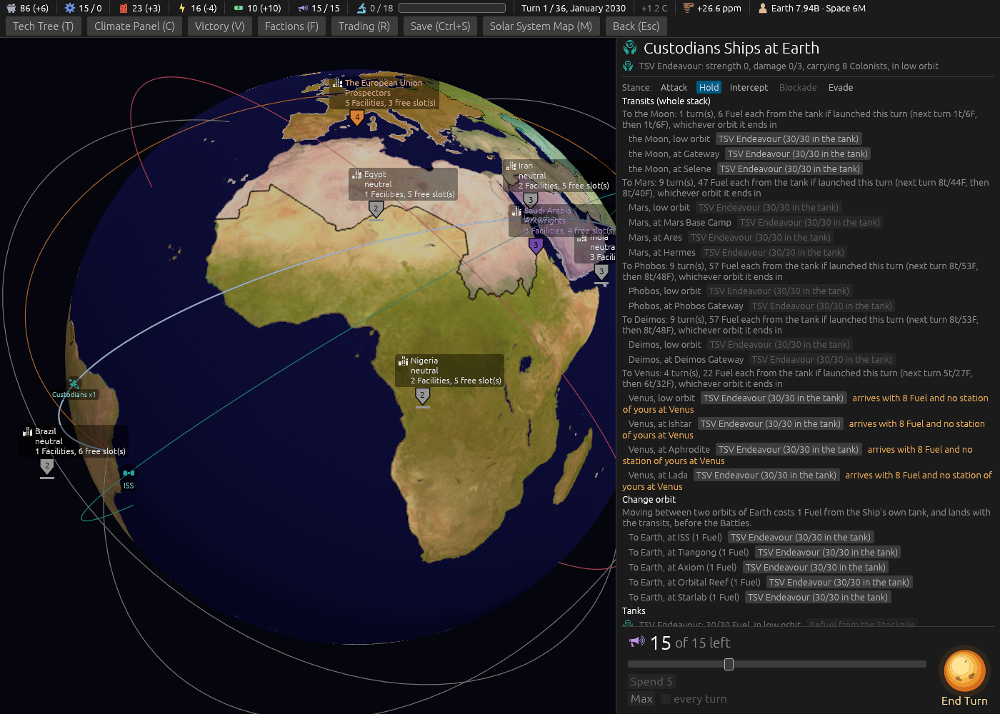
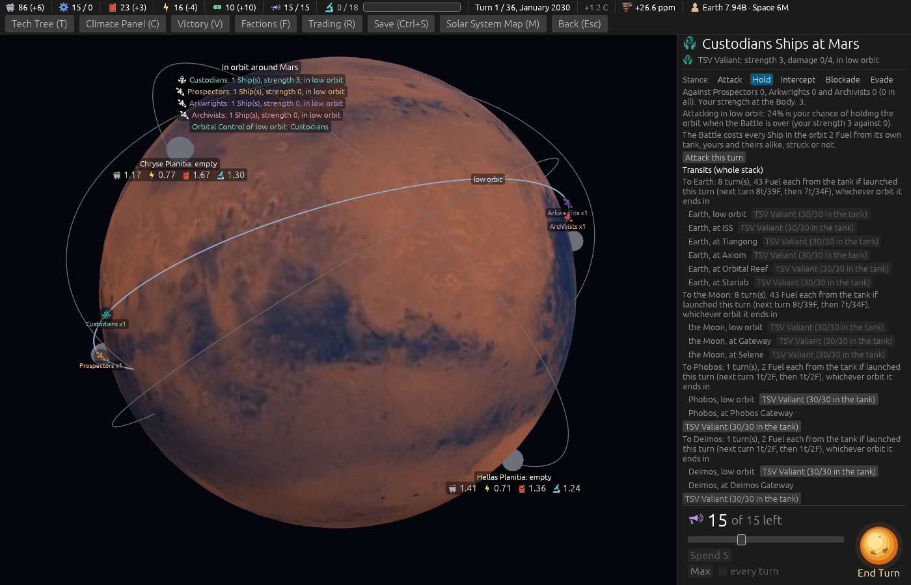
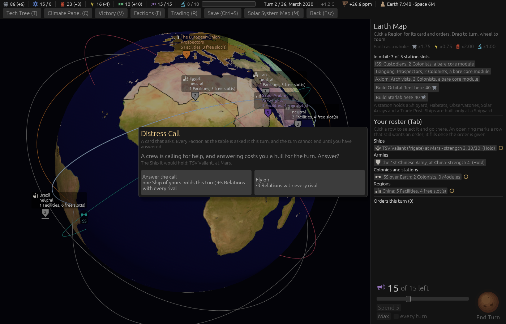

# Ticket #375: a quote that went stale, and a Distress Call that froze a Ship

From the playtest: *"The flying table quoted a leg at 4 turns and 17 Fuel and it cost 6 and 26,
leaving the hull stranded with an empty tank and no station to refuel at. The Distress Call card
silently froze the only ship mid-transit."* Decided on the ticket in one round: the quote labelled
for this turn with the next two beside it, a warning (never a refusal) where a leg would strand the
hull, the Distress Call holding a docked Ship only and naming it before and after.

[The resolution](https://github.com/whaleyjoshua2/Dying-Earth/issues/375) is the authority;
[§9 of the spec](../../../spec/version-0.09.2.md#9-a-quote-that-says-when-it-holds-a-warning-before-a-stranding-and-a-distress-call-that-names-its-ship)
records it.

## What was built

- `arrival_leaves_stranded` in the engine: the tank after the leg, where it is under the cheapest
  leg out of the far Body priced for the turn of arrival and no refuelling station of the Faction's
  or a partner's stands there. The Ship card's Transit block and the driver's ship rows read it.
- The Transit block's *"To X"* line and the driver's flying table carry the next two turns' figures.
- `card_would_hold`: the docked Ship with the fullest tank, or none; `card_holds_one_ship` reads it,
  the shortfall names the closed side, the modal and the driver name the Ship before the answer,
  and the Resolution writes `ship_held` for the Ship turned aside.

## The red witness

Both tests passed on their first run, which is the case to distrust, so both were perturbed on
purpose and watched go red:

- The docked filter dropped from the card's pick: *"the docked Ship, though the one in flight is
  fuller: left: Some(ShipId(18)), right: Some(ShipId(19))"*, the fuller Ship in flight chosen, which
  is the playtest's silent freeze.
- The stranding predicate silenced: *"arrives with nought and no way out: left: None, right:
  Some(0)"*.

Restored, both green.

## The pictures

Three, taken headlessly.

`shot:strand settler:earth panel:0 window:1400x1000`. **A Colony Ship at Earth, turn 1.** Every leg's
quote is dated -- *"To Venus: 4 turn(s), 22 Fuel each from the tank if launched this turn (next turn
5t/27F, then 6t/32F)"* -- and beside each of the four Venus buttons the warning, in amber: *"arrives
with 8 Fuel and no station of yours at Venus"*, since 30 less 22 is 8 and the cheapest leg out of
Venus is more. The Moon's buttons carry none: from the Moon the way home is six Fuel. The Mars legs
are unaffordable and greyed, which is the check's business, not the warning's.

`shot:transit stack:1 panel:0`. **The Frigate at Mars.** The same dated quote on every leg; no
warning, since Phobos and Deimos are two Fuel away and a Frigate that reaches them can always fly on.

`shot:call card:distress_call panel:0`. **The Distress Call.** Under the question, *"The Ship it would
hold: TSV Valiant, at Mars."*, before either side is chosen.

## The sweep

The Distress Call's pick is a rule the computer plays to, so the sweep was run:
[`../sweeps/after-375.txt`](../sweeps/after-375.txt), 20 seeds x four seatings at the shipped cell:
**7 / 24 / 1 / 4, collapses 44 of 80**, the same as after #366. The computer takes the card only when
nothing of its own is in transit, so a docked Ship was always the one held for it.

## The gate

`cargo clippy --workspace --release --all-targets -- -D warnings` clean; engine 495 + 6, root 8.
