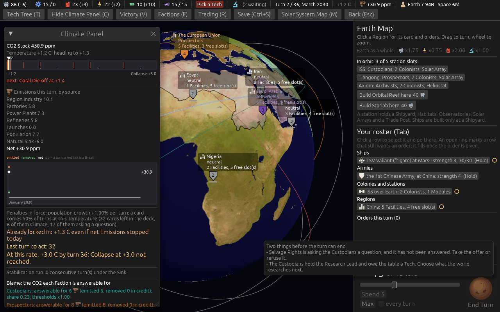

# Ticket #386: defects from the list, and the Tech tree audit

Three items from the designer's list for 0.09.3 that were things the game said untruly or badly,
and the Tech tree audit the list asked for. Decided in one round of three
(*"q1 yes q2 a q3 b"*); [the resolution](https://github.com/whaleyjoshua2/Dying-Earth/issues/386)
is the authority, [§1 of the spec](../../../spec/version-0.09.3.md#1-defects-from-the-list-and-the-tech-tree-audit)
records it.

## What was built

| | item | what changed |
|---|---|---|
| 1 | The Fund called "0 Materials, banking 0% of output" | The line was the headless driver's, not the window's. It, the Report's set-share line and the Investment Bank's *1 Material* say Ducats; seven code comments with them. |
| 2 | End Turn's blockers reported one at a time | `end_turn_refusal` gathers everything owed and names it in one message, one line each; the driver prints the engine's message and its Tech banner says *MUST* only when the engine would refuse. |
| 3 | The Tech tree audit | No Tech names a Choice Card and nothing is stale by name; four under-stated effect lines left as they are by the designer's choice; the Launch Pad Fire's text says the live rule. |

## The pictures and lines

**The sun's hover with a card and a Tech both owed**, taken headlessly with `pick:0 card:salvage_rights
cardshut:1 tip:Two` on seed 7. Five lines, within the six-line ceiling.



**The driver**, a new game as the Prospectors on seed 7 and a `check` with nothing ordered:

```
Venture Capital Fund: 0 Ducats, banking 0% of Ducat income (0 banked last turn)
  *** YOU MUST PICK THE NEXT TECH (a `tech <name>` line); the turn cannot end until you do. A free choice of everything available: ***
STILL OWED: The Prospectors hold the Research Lead and owe the table a Tech. Choose what the world researches next. The turn cannot end until you do.
```

## The red witness

`the_refusal_names_everything_owed_at_once` in `engine/tests/formulas.rs`: seat 0 owes the first
Tech and is asked Salvage Rights; the refusal must name both and begin *"Two things"*. Red before
the change (*"and the Tech: Salvage Rights is asking the Custodians a question …"*, the card alone),
green after; answering the card leaves the Tech's line alone, and picking clears it. The suite is
504 in the engine, 8 and 6 in the root crate; the clippy gate
`cargo clippy --workspace --release --all-targets -- -D warnings` is clean.
