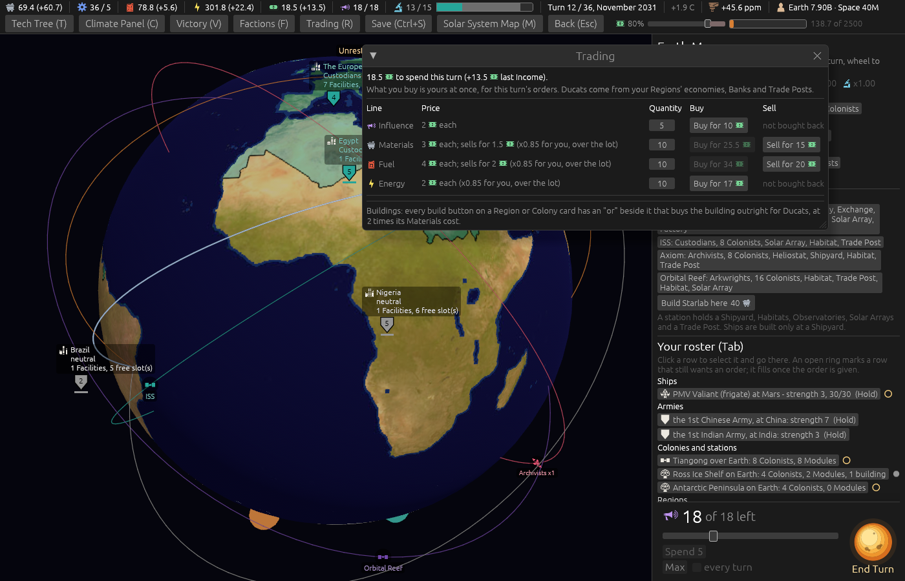

# Ticket #387: Materials, Fuel, Energy and Ducats carried to a tenth

The designer's *"allow energy, duckets, and materials to float to 0.1, sweep for places these are
rounded and adjust."* Decided in one round of three (*"q1 c + fuel q2 everything that is already
whole stays so if it has a partial cost or upkeep it stays q3 a"*);
[the resolution](https://github.com/whaleyjoshua2/Dying-Earth/issues/387) is the authority,
[§2 of the spec](../../../spec/version-0.09.3.md#2-materials-fuel-energy-and-ducats-carried-to-a-tenth)
records it.

## What was built

The four stockpile figures, the Fund, a Ship's tank, last turn's income and every cost became
fractions, settled to the nearest tenth at every write by one helper (`tenth`), and printed by one
helper (`figure`: whole when whole, one decimal otherwise). Thirty-one rounding sites that floored,
rounded or integer-divided one of the four resources to a whole were removed; the sites that round
Widgets and Research were left. The Sea Wall's keep, which was saved up in a side figure and paid
when it reached a whole, is paid each turn to the tenth and the side figure is gone. `SAVE_VERSION`
moved to 7.

Twenty-eight existing tests asserted a floored figure and moved to the tenth, each marked with the
ticket on its line (East Asia's economy 10 to 10.2, the Refinery under Automated Refining 4 to 4.5,
the Prospectors' Factory 21 to 21.3, the Investment Bank's Fund 520 to 520.2, and the rest).

## The picture

**The Trading window as the Prospectors on turn 12**, `player:prospectors turns:11 trade:1 panel:0
window:1400x900`. The top bar carries a tenth where one arose (69.4 Materials, +60.7; 301.8 Energy)
and none where none did (18 of 18 Influence); a whole price stays whole (Materials 3 each, sells for
1.5), and the Prospectors' 0.85 on a lot of ten reads 25.5.

## The red witness

Four new tests were run against the tree with the types changed and the floors still standing, and
failed on the floored figures ([`red-witness.txt`](red-witness.txt)):

| test | floored | to the tenth |
|---|---|---|
| a Prospectors' Facility price | 21.0 | 21.3 |
| a Prospectors' Region's Ducats | 14.0 | 14.4 |
| the Fund banking its share | 7.0 | 7.2 |
| a Refinery under Automated Refining | 4.0 | 4.5 |

A fifth test, of the settle-and-print helpers themselves, was green from its first run, the helpers
having been written first; it is kept as a guard, not quoted as a witness. Green after the floors
went; the suite is 509 in the engine, 8 and 6 in the root crate; the clippy gate
`cargo clippy --workspace --release --all-targets -- -D warnings` is clean.

## The sweep

A first run with the sweep's default cells (steps 90 to 140) collapsed all 480 games by turn 16,
which is what those cells do and not a finding; the shipped cell is `--sinks=6 --steps=300`. The
sweep after, [`../sweeps/after-387.txt`](../sweeps/after-387.txt), 20 seeds x four seatings at the
shipped cell, against 0.09.2's closing sweep:

| | 0.09.2 | after #387 |
|---|---|---|
| Custodians | 2 | 5 |
| Prospectors | 5 | 6 |
| Arkwrights | 0 | 1 |
| Archivists | 11 | 9 |
| collapses of 80 | 62 | 59 |

Every seat earns slightly more, since the floors on the Bank's, the Trade Post's and every
Region's Ducats went and a fifth of a GDP figure is no longer rounded down; the gates completed in
71 / 69 / 66 / 63 of 80 against 73 / 68 / 64 / 65. Missile Carriers built 69 (51), Launches 40
(31), games with an orbital Battle 35 of 80 (30). Reported as figures; the balance version reads
its baseline from the closing sweep.

The sweep's own per-seat Fuel sums printed float drift on the first run (*4.800000000000001*),
the sweep adding tenths without settling them; fixed in the same commit.

## The review

Two axes, standards and spec. **Two writes were not settled**: the main pay site in
`commit_orders` and a Module decommission's refund stored raw subtraction, so 69.4 less 21.3 sat
in the stockpile as 48.10000000000001 until the next Income resettled it; a threshold read the same
turn would have read it wrong. Witnessed red by `tenths_paying_a_cost_leaves_an_exact_tenth`
against the unsettled site, green with both writes through one `Stockpile::settled`. Also from the
review: **Widgets under the Drought had gained a tenth's rounding before their floor** (17 x 0.35
would have read 6 where it reads 5), put back as they were; six bare prints and two `{:.1}` prints
moved to `figure`; three stale doc comments and the save's history line corrected; the glossary's
Exchange and Spillover sentences, which spoke of floors, corrected; and two consequences named in
the spec for the designer's eye: the Sea Wall's keep paid each turn to the tenth, and a Friendly ppm
of carbon credits costing half a Ducat where its half was rounded up to one.
