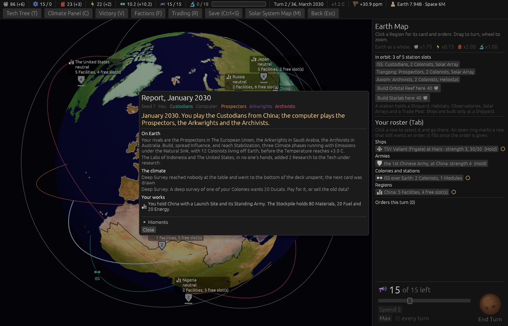
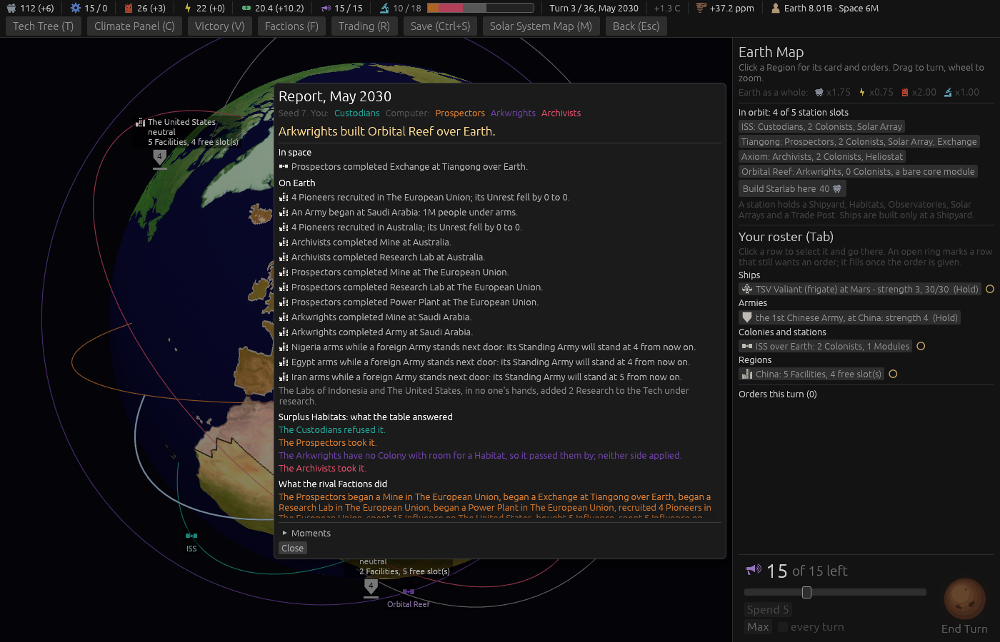

# Ticket #388: a Choice Card the player cannot engage with

The designer's *"Choice Cards you cannot engage with still stop the turn. Three of four cards in
one game were ship cards for a seat with no ships; each printed 'you had nothing to decide' without
saying why, or which side was taken."* Decided in one round of three (*"q1 c q2 a q3 a"*): a card
that reaches nobody is put back and the next drawn, a seat the card cannot reach is told why and
that neither side applied, and nothing is applied to such a seat.
[The resolution](https://github.com/whaleyjoshua2/Dying-Earth/issues/388) is the authority,
[§5 of the spec](../../../spec/version-0.09.3.md#5-a-choice-card-the-player-cannot-engage-with)
records it.

## What the reading found

The card never held the turn: a seat neither side reaches has *nothing to decide* written as its
answer at the draw, and End Turn counts that as answered. The stop the designer saw was the
headless driver, which printed the whole card and both `answer` lines before *"you had nothing to
decide"*, and the Report's line, which named no reason.

## What was built

The Question phase puts a Choice Card that reaches no seat back at the bottom of the deck, unspent,
and draws the next, once a turn, saying so in one Report line. A new `card_lack` reads why a card
cannot reach a seat off the same per-effect test the draw decides by, and the Report's line for
such a seat carries it with *neither side applied*; the driver prints the name, the question and
that line for a card that passed it by. The reasons are eight phrases in `report.toml`.

## The pictures

**A card put back**, `seed:7 card:deep_survey cardshut:1 menus:1 window:1400x900`: the Deep
Survey wants a Colony with a Mine and on turn 2 nobody has one, so the Report of the draw reads
*"Deep Survey reached nobody at the table and went to the bottom of the deck unspent; the next
card was drawn."* (The aid's deck holds that one card, so it came up again for a table it passes
by, which a real deck would not do twice in a turn.)

**A seat passed by**, `seed:7 card:surplus_habitats cardanswer:refuse menus:1 window:1400x900`:
Surplus Habitats wants a Colony with room, and the Arkwrights start with no station, so under the
card's block the Report reads *"The Arkwrights have no Colony with room for a Habitat, so it
passed them by; neither side applied."* beside the three seats' answers. The player's own line
reads *You have no Ship, so it passed you by* in the witness below; on this fixture the player has
everything every card wants.

## The red witnesses

- `a_card_that_reaches_nobody_goes_to_the_bottom_and_the_next_is_drawn`: red at *the card under it
  is the draw: left Choice(OrbitalDebris), right Choice(SalvageRights)*; green after.
- `a_seat_the_card_cannot_reach_is_told_why_and_that_neither_side_applied`: red with the old
  *"The Custodians had nothing to decide."* line and no reason; green after.

One existing test that asserted the old line moved to the reason, marked with the ticket. After the
review two more: `a_card_is_put_back_once_a_turn_and_a_deck_of_one_gives_it_back` in the engine,
and `the_players_passed_by_line_is_found_as_the_players_answer` in the root crate, red at *left
Some((GroundedFleet, None)), right Some((GroundedFleet, Some(Seat(0))))* against the old seat test,
green after. The suite is 519 in the engine, 9 and 6 in the root crate; the clippy gate
`cargo clippy --workspace --release --all-targets -- -D warnings` is clean.

## The review

Two axes, standards and spec. **One defect**, which the pictures could not show because the
fixture's player has everything every card wants: the Report window finds a card line's seat by
the Faction's name, and the player's new line names none (*You have no Ship …*), so it fell out of
the answers block into a bare line under Your works. The window now takes a second-person line for
the player's; a test in the root crate witnessed it red. Also from the review: the reach test and
the reason were two matches over the same effects, merged into one (`card_effect_lack`, which the
draw decides by and the Report explains by); the line's voice chosen by the same test the Report
files the line under; the driver's line made the Report's line word for word; the once-a-turn rule
and the one-card case, which the first witness did not prove, stated in the spec and witnessed by a
second test; the glossary's Event Deck entry, which still said every drawn card is spent; the
sweep's not-asked counter's doc.

## The sweep

[`../sweeps/after-388.txt`](../sweeps/after-388.txt), 20 seeds x four seatings at the shipped
cell, against the sweep after #395:

| | after #395 | after #388 |
|---|---|---|
| Custodians | 6 | 6 |
| Prospectors | 6 | 4 |
| Arkwrights | 1 | 1 |
| Archivists | 5 | 7 |
| collapses of 80 | 62 | 62 |

Within a seed's noise. The put-back changes which card a table sees on the turns a card reaches
nobody, which the computer seats feel as a different card a few times a game.
