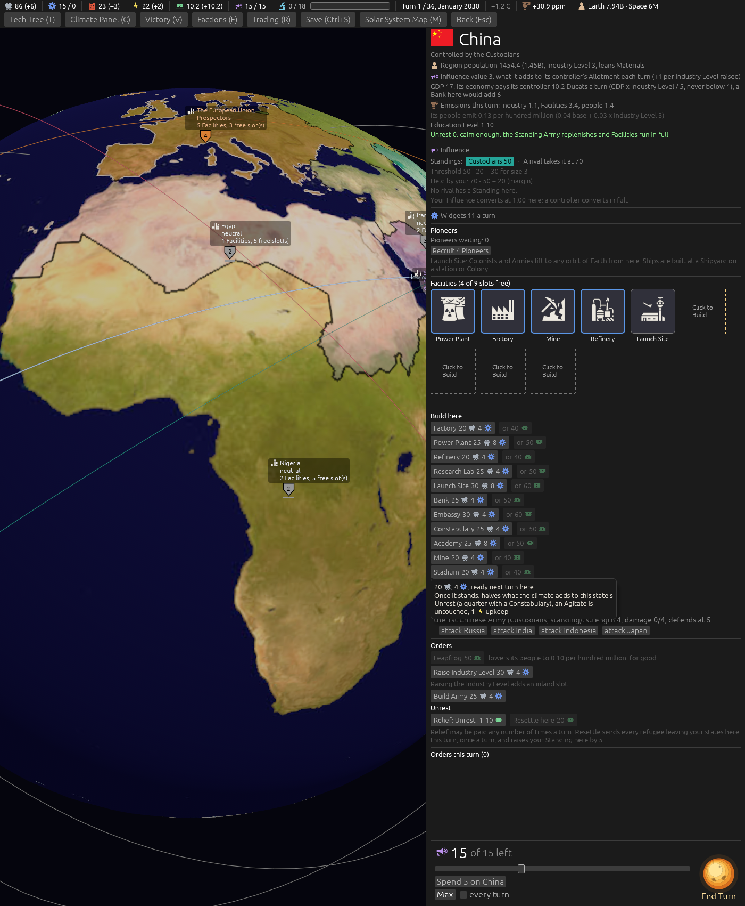

# Ticket #389: the Stadium, an entertainment building that lowers Unrest

The designer's *"new building that reduces unrest - entertainment themed."* Decided in two rounds
(*"stop let me reenter all those"*, then *"q1 stadium q2 c q3 b q4 a q5 b"* and *"q2a b q2b a"*):
the Stadium; damping only, every climate rise, stacking with a Constabulary; the cheaper row; no
Faction versions; the computer raising it after a Constabulary.
[The resolution](https://github.com/whaleyjoshua2/Dying-Earth/issues/389) is the authority,
[§7 of the spec](../../../spec/version-0.09.3.md#7-the-stadium-an-entertainment-building-that-lowers-unrest)
records it.

## What was built

A seventeenth Facility kind, appended last with its data row; a `stadium_factor` in `unrest.toml`
that `raise_unrest` multiplies a climate rise by after the Constabulary's and the green Techs'
damping; the one-per-Region door widened from the Constabulary to both; a `build_stadium` weight
for each computer Faction and an arm that offers it only where a Constabulary stands and Unrest is
5 or more, with the Constabulary's multipliers; an icon, a bowl of tiers round a field; a note on
the Region card; a glossary entry.

## The picture

**The build list of a Region with a free slot**, the Stadium button and its hover, taken headlessly
with the `tip:Stadium` aid.

## The red witnesses

Three tests, run before the rule stood (the enum, the row and the computer's arm had to exist for
them to compile):

- `a_stadium_halves_a_climate_rise_and_quarters_it_with_a_constabulary`: red at *a heat rise of 1
  lands as a half: left 1.0, right 0.5*; green after.
- `a_stadium_is_one_to_a_region`: red on the second Stadium going through; green after.
- `a_computer_seat_raises_a_stadium_only_after_a_constabulary_where_unrest_stays_high`: red with
  no Stadium among the seat's orders at Unrest 9 beside a Constabulary, until the Stadium took the
  Constabulary's multipliers as well as its weight; green after.

## The sweep

[`../sweeps/after-389.txt`](../sweeps/after-389.txt), 20 seeds x four seatings at the shipped
cell, against the sweep after #388:

| | after #388 | after #389 |
|---|---|---|
| Custodians | 6 | 6 |
| Prospectors | 4 | 4 |
| Arkwrights | 1 | 1 |
| Archivists | 7 | 9 |
| collapses of 80 | 62 | 60 |

Within a seed's noise. The sweep gained a Stadium count beside its Constabularies for this ticket:
**42 Stadiums** built by the computer seats over the four seatings (4, 30, 4 and 4, the thirty in
the Prospectors' seating) against **404 Constabularies**, so the rule fires, and rarely, as the
"after a Constabulary, still at 5" gate means it to.
