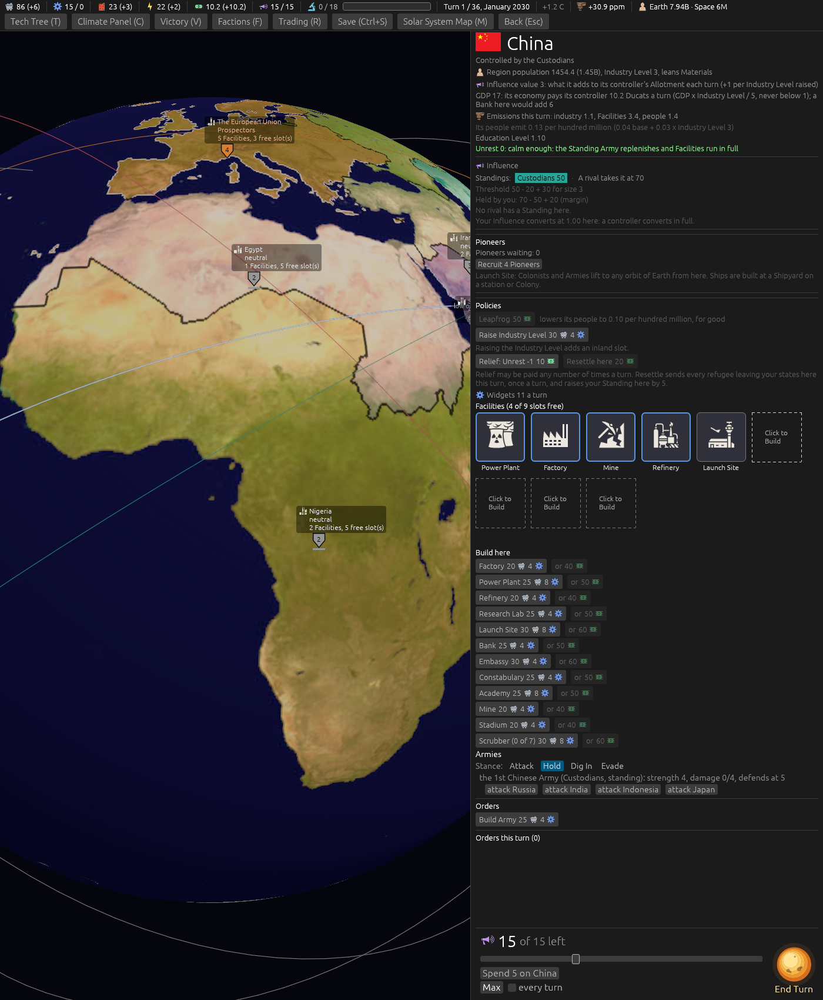
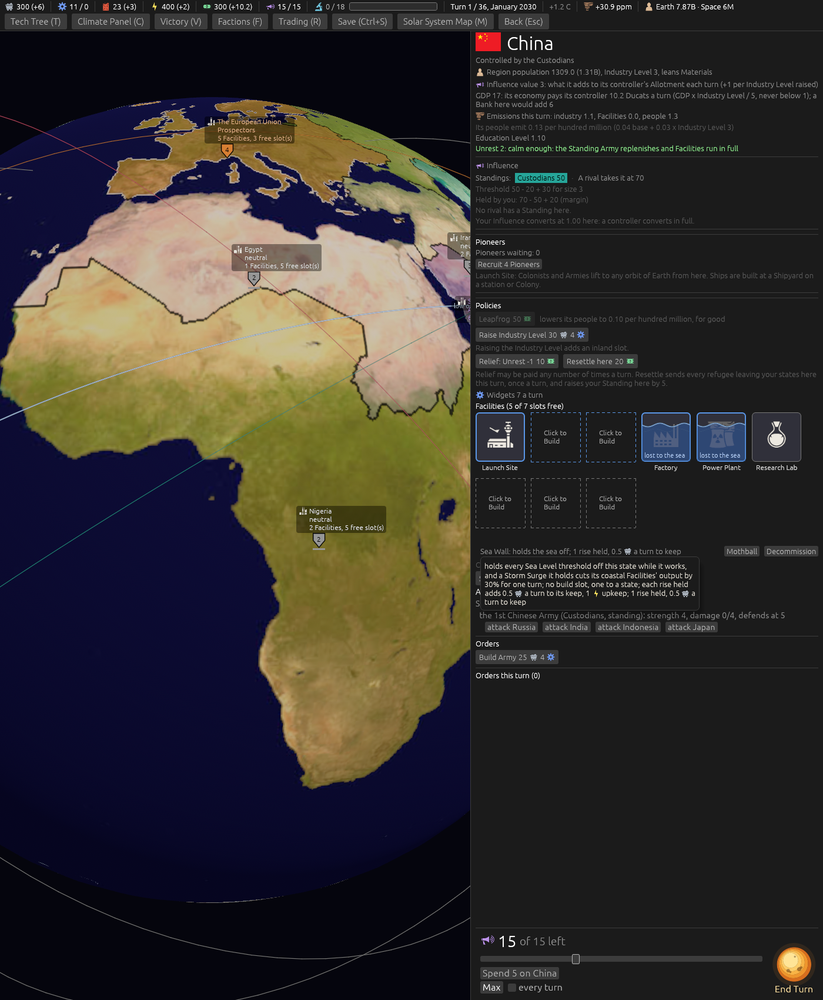
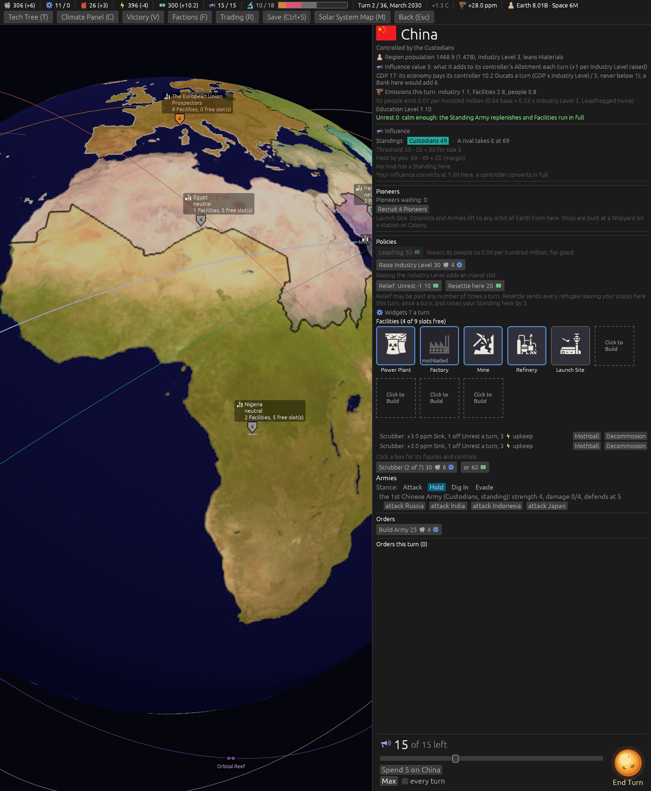

# Ticket #390: the Region card rearranged

Three items of the designer's, on the one card: Armies in their own section, Orders renamed
Policies between the Pioneers and the Facilities, and the Sea Wall and the Scrubber said shorter
and placed between the tiles and the build list. Decided in one round of four with two
clarifications (*"q1 a q2 a q3 a"*, *"q4 a"*, and *"all army/ship builds should be in orders
sections for both"*), which put Build Army in an Orders block at the foot of both cards rather than
in the Armies section.
[The resolution](https://github.com/whaleyjoshua2/Dying-Earth/issues/390) is the authority,
[§8 of the spec](../../../spec/version-0.09.3.md#8-the-region-card-rearranged) records it.

## What was built

`state_panel` reordered: a `policies_block` drawn under the Pioneers, the foot's Orders block left
with Build Army; the strip under the slot boxes split out of `slot_boxes` into `slot_strip` so the
completed slotless rows (`no_slot_rows`) draw between the boxes and the strip, and the two slotless
build buttons (`no_slot_buttons`) after it, the Scrubber's cap in its label; a completed Scrubber or
Sea Wall row reads one line from `no_slot_figures`, its whole sentence on the hover; the Scrubbers'
note under Influence gone. The Colony card is untouched.

## The pictures

**The card of the player's home Region on turn 1**, `seed:7 select:eastasia slotbox:free panel:0
window:1400x1700`: Influence, Pioneers, Policies, Widgets, the Facilities with a free box clicked
and the build strip under the boxes, the Armies, and Orders with Build Army at the foot.

**The same card with a Sea Wall standing**, the `walls:1` aid (two coastal slots taken, the wall
holding) with `tip:Surge` forcing the row's hover: the completed row between the boxes and the
strip, one line -- *Sea Wall: holds the sea off; 1 rise held, 0.5 Materials a turn to keep* -- with
its Mothball and Decommission beside it, and its hover the whole sentence, five lines, within the
six-line ceiling.

**The same card with two Scrubbers standing**, the `scrub:2` aid alone (it placed none beside
`walls:1`): two one-line rows, *Scrubber: +3.0 ppm Sink, 1 off Unrest a turn, 3 Energy upkeep*,
glyph-rendered, each with its Mothball and Decommission, and the Scrubber's button reading *(2 of
7)*.

## The review

Two axes, standards and spec. What they found and what changed: the short row's hover had the
row's whole sentence and the rules text both, which put a Sea Wall's hover past the six-line
ceiling; the hover is the sentence alone now, six lines at most. The Sea Wall's keep clause was
written twice, in the short row and the full sentence; it is one helper now, and the row's words
are the resolution's (*nothing held yet*, *unkept this turn*). A doc comment had landed on the
wrong function, three comments still named the old layout, and two blank lines doubled. The
glossary gained a **Policies** entry and says where the Army and Ship builds live. Two departures
from the resolution's wording the spec now names plainly: the slotless buttons stand under the
strip rather than "among" it, since the strip shows buttons only while a free box is clicked; and
the *or* the resolution said should go is the Ducat-price button every build button carries, so it
stays. The Scrubber's one-line row, unpictured in the first pass, is pictured below.

## No rule moved

The suite is unchanged in meaning; no sweep.
