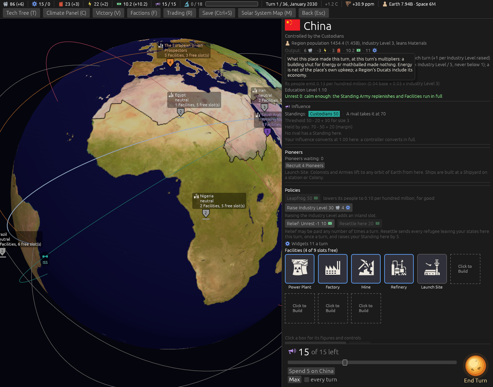
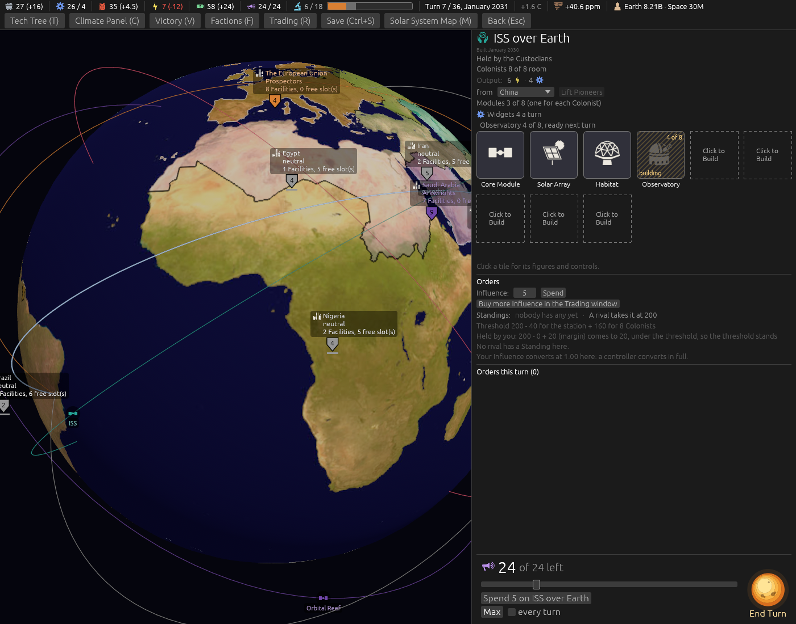
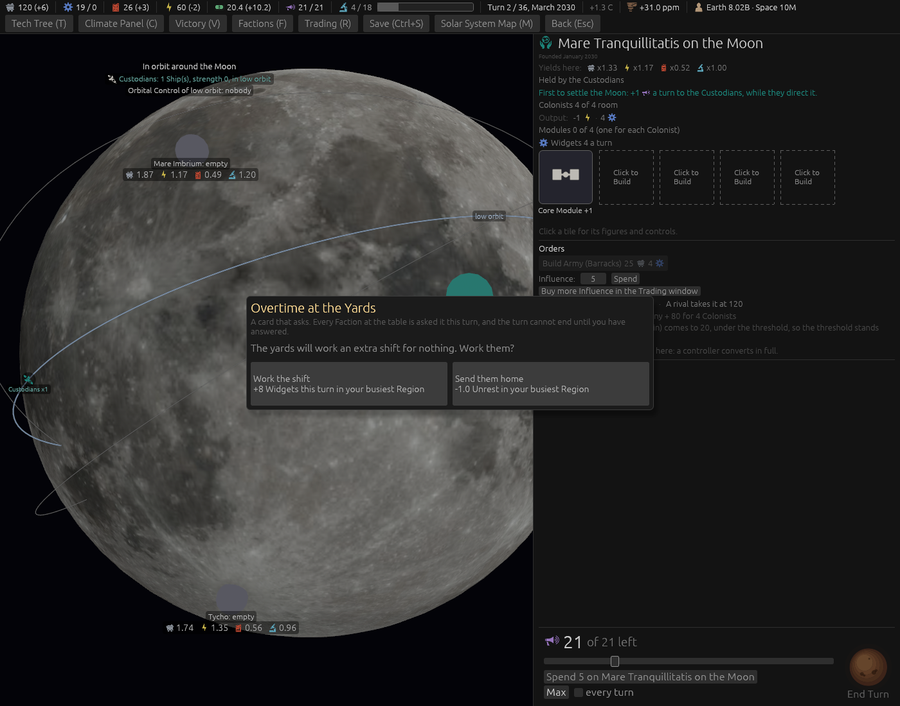

# Ticket #391: every place card says its output, and a Colony's founding date

Two items of the designer's: *"place cards need to show total output - put in first section under
region population"* and *"each colony/station card has the date it was founded under its name in
the header."* Decided in one round of four (*"q1 a q2 a q3 a q4 yes"*).
[The resolution](https://github.com/whaleyjoshua2/Dying-Earth/issues/391) is the authority,
[§9 of the spec](../../../spec/version-0.09.3.md#9-every-place-card-says-its-output-and-a-colonys-founding-date)
records it.

## What was built

`Game::place_output(place)` in the engine, summing the director's working producers at that place
from the same per-building yields the Income pass builds (`producers_of`), Energy net of upkeep, a
Region's economy in its Ducats, settled to a tenth; `output_row` on both cards under the
population line; the date line under a Colony's or station's name, *Founded* or *Built*, from the
`founded_turn` every Colony has carried and no card showed.

## The pictures

**The Region card**, `seed:7 select:eastasia tip:multipliers`: *Output:* under the population line,
with the row's hover forced.

**A station's card**, `seed:7 turns:6 hab:1`: *Built January 2030* under the name, and its Output.

**A ground Colony's card**, `seed:7 first:1 hab:ground`: *Founded January 2030* under the name
(the aid lands the Colony Ship on the first turn), and its Output, *-1 Energy, 4 Widgets*, the
Core Module's upkeep with nothing yet to make Energy.

## The red witness

`a_places_output_is_its_working_buildings_summed_with_energy_net_of_upkeep`: the home Region's row
against its Facilities' yields summed by hand, red at *Energy net of upkeep: 6 against -3* with the
upkeep term taken out, green with it; the same test holds a mothballed Mine out of the row and a
neutral Region to no row. The suite is 528 in the engine, 9 and 6 in the root crate; the clippy
gate `cargo clippy --workspace --release --all-targets -- -D warnings` is clean. No rule moved; no
sweep.
