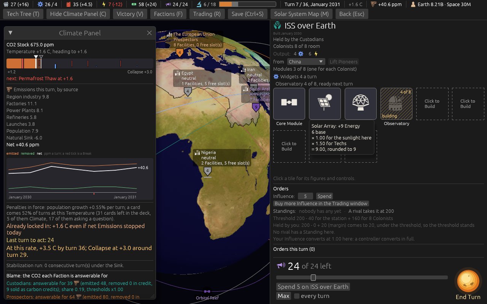

# Ticket #391: every place card says its output, and a Colony's founding date

Two items of the designer's: *"place cards need to show total output - put in first section under
region population"* and *"each colony/station card has the date it was founded under its name in
the header."* Decided in one round of four (*"q1 a q2 a q3 a q4 yes"*).
[The resolution](https://github.com/whaleyjoshua2/Dying-Earth/issues/391) is the authority,
[§9 of the spec](../../../spec/version-0.09.3.md#9-every-place-card-says-its-output-and-a-colonys-founding-date)
records it.

## What was built

`Game::place_output(place)` in the engine, summing the director's working producers at that place
from the same per-building yields the Income pass builds (`producers_of`), Energy net of upkeep, a
Region's economy in its Ducats, settled to a tenth; `output_row` on both cards under the
population line; the date line under a Colony's or station's name, *Founded* or *Built*, from the
`founded_turn` every Colony has carried and no card showed.

## The pictures

**The Region card**, `seed:7 select:eastasia tip:multipliers`: *Output:* under the population line,
with the row's hover forced.

**A station's card**, `seed:7 turns:6 hab:1`: *Built January 2030* under the name, and its Output,
*4 Widgets, 6 Energy*: the Core Module's Widgets, and its Solar Array's 6 at Earth less the Core's
1 and the Habitat's 2 gives 3, so the 6 is the Array under Efficient Grids (x1.5, 9 less 3), a
rung-1 Tech the Custodians hold by turn 6 on this seed; the Array's own hover says so.

**A ground Colony's card**, `seed:7 first:1 hab:ground`: *Founded January 2030* under the name
(the aid lands the Colony Ship on the first turn), and its Output, *4 Widgets, -1 Energy*, the
Core Module's upkeep with nothing yet to make Energy.

## The red witness

`a_places_output_is_its_working_buildings_summed_with_energy_net_of_upkeep`: the home Region's row
against its Facilities' yields summed by hand, red at *Energy net of upkeep: 6 against -3* with the
upkeep term taken out, green with it; the same test holds a mothballed Mine out of the row and a
neutral Region to no row.

## The review

The spec review caught the row's order: the resolution says *the top bar's order*, and the bar
runs Materials, Widgets, Fuel, Energy, Ducats, Research; the first build ran the ticket's own
list. Reordered, the pictures re-taken. It also found the edge the pictures do not show: an
occupied Region's economy pays nobody (the Income pass credits an economy only to a controller),
so the row an occupier reads must leave it out;
`an_occupied_regions_output_row_leaves_out_the_economy_nobody_is_paid` was red at *10.2 held, 10.2
occupied* and is green with the guard. The standards review found the row's doc comment hung on
the Widgets block's, a glyph size of 14 against the income row's 15, and the Energy figure's
silence about a Reactor's relief, which is the seat's and no place's: the doc, the hover and §9
now say so. The suite is 529 in the engine, 9 and 6 in the root crate; the clippy gate
`cargo clippy --workspace --release --all-targets -- -D warnings` is clean. No rule moved; no
sweep.
