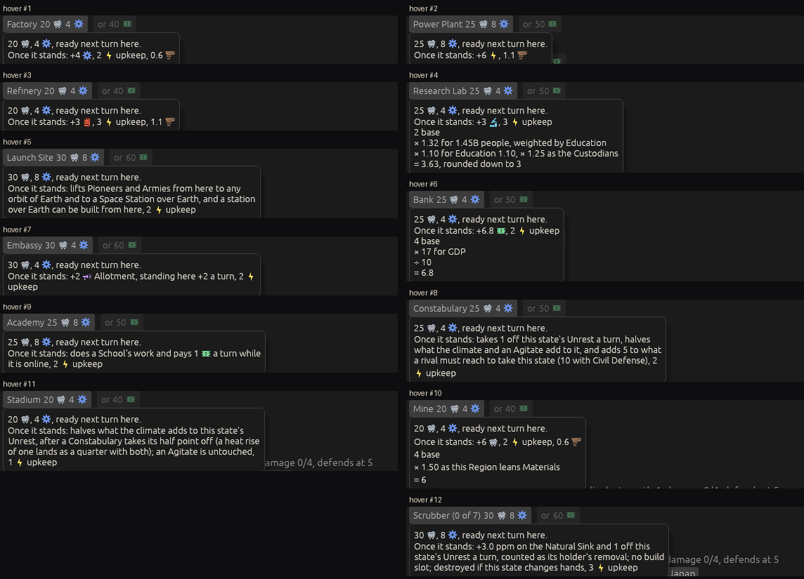
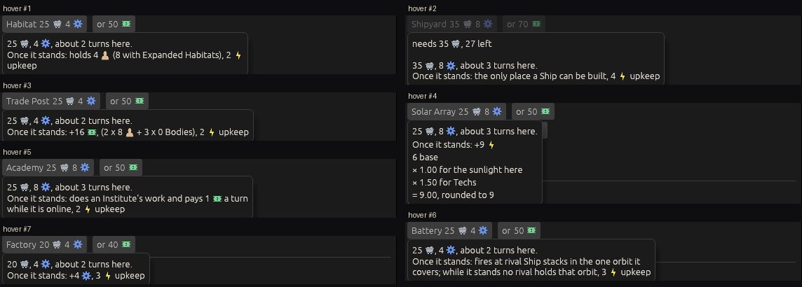
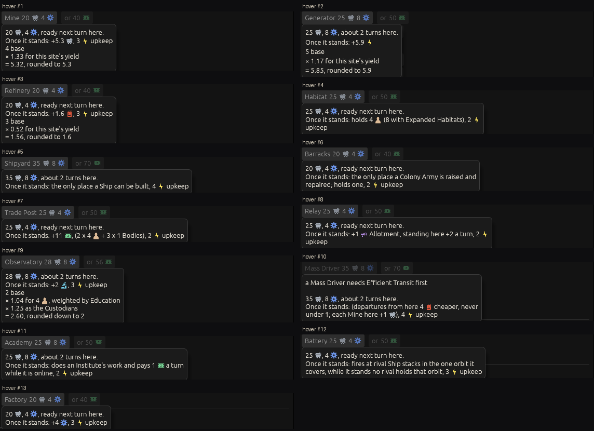

# Ticket #392: glyphs on the build hover

The designer's item: *"mouseover when selecting a building to build needs to use glyphs for
outputs."* The ticket's first act was to look, since the code said the glyph mechanism already
reached the build hover. Decided in one round of three (*"check the build list from stations and
colonies and each building. q2 a q3 a"*).
[The resolution](https://github.com/whaleyjoshua2/Dying-Earth/issues/392) is the authority,
[§10 of the spec](../../../spec/version-0.09.3.md#10-glyphs-on-the-build-hover) records it.

## Before

Six hovers as 0.09.2 left them, `seed:7 select:eastasia slotbox:free panel:0 window:1400x1700`
with `tip:<a phrase of the hover>`; the station's with `turns:6 hab:1 habtile:free`. Every figure
already wore its glyph; what read as words was the sentences of the buildings that do rather than
make, and two figures with no glyph, *Colonists* and *Bodies*.

| picture | what it shows |
|---|---|
| [`before-factory.png`](before-factory.png) | *20 [ore], 4 [cog], ready next turn here. Once it stands: +4 [cog], 2 [bolt] upkeep, 0.6 [chimney]* |
| [`before-power-plant.png`](before-power-plant.png) | *+6 [bolt], 1.1 [chimney]* |
| [`before-constabulary.png`](before-constabulary.png) | five lines of sentence, *2 [bolt] upkeep* at the end |
| [`before-launch-site.png`](before-launch-site.png) | four lines of sentence, *2 [bolt] upkeep* at the end |
| [`before-trade-post.png`](before-trade-post.png) | *+16 [coin], (2 x 8 Colonists + 3 x 0 Bodies), 2 [bolt] upkeep*: two figures as words |
| [`before-mine-tile.png`](before-mine-tile.png) | a standing Mine's tile hover with its chain: *4 base, × 1.50 as this Region leans Materials, = 6* |

## What was built

Two words on the glyph list, *Colonists* (and *Colonist*) wearing the population head and the
singular *Ducat* wearing the coin; the rule itself unchanged. And a building aid: `tip:<word>#<k>`
shows the k-th tooltip containing the word, which is how every button below was pictured, since
every build hover carries *Once it stands*.

**A defect the full sweep found.** With every button pictured, three hovers drew a figure's word as
a word: the Region Mine's *0.6 Emissions*, the station Solar Array's *+9 Energy* and the Colony
Generator's *+5.9 Energy*, each the last word of its line with the chain under it. The glyph drawer
split its text on spaces alone, so the line break rode inside the word (*Emissions
4*) and the
word never matched. A line break is now a piece of its own. Those three were re-taken after the fix;
the sheets below carry the fixed pictures.

## After: every button on the three lists

Each sheet is every build button on one list, its hover forced with `tip:Once it stands#k` and
cropped from a `window:1400x1700 panel:0` shot; a greyed button whose refusal fills the hover has no
*Once it stands* and is not counted. Nothing is edited but the crop.

**The Region's list**, `seed:7 select:eastasia slotbox:free`: twelve buttons (the Sea Wall waits
on Coastal Engineering, so it is not offered on turn 1).

**A station's list**, `seed:7 turns:6 hab:1 habtile:free`: seven of nine, the Observatory greyed
(one is under way) with its hover the refusal alone, since its five-line chain would not fit under
it within the six-line ceiling.

**A ground Colony's list**, `seed:7 first:1 hab:ground habtile:free`, Mare Tranquillitatis on the
Moon: all thirteen, the chain under each yield the site multiplies, *4 [head]* in the Observatory's
chain wearing the new glyph.

## The red witnesses

`colonists_and_a_single_ducat_take_their_glyphs_after_a_figure_and_bodies_stay_a_word`, in the
root crate against the glyph rule's decision (`glyph_for`), red without the two words and green with
them; `a_word_ending_a_line_is_bare_and_the_break_is_its_own_piece` against the new `glyph_tokens`,
whose red is the three pictures above as first taken. The suite is 529 in the engine, 11 and 6 in
the root crate; the clippy gate `cargo clippy --workspace --release --all-targets -- -D warnings`
is clean. No rule moved; no sweep.
