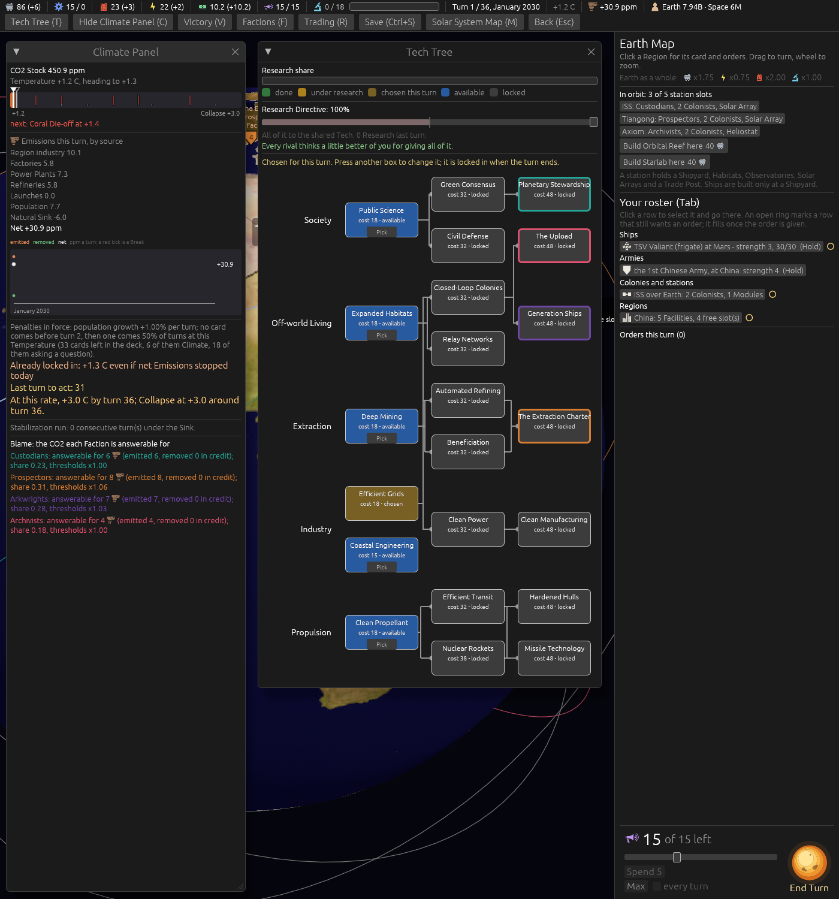

# Ticket #393: Nuclear Rockets, a rung-2 Tech that cuts transit times by a fifth

The designer's *"add level 2 tech called 'nuclear rockets' that cuts transit times by 20%,
remember the way translated fight times to turn counts, cost 38."* Decided in one round of four
(*"q1 a q2 a hardend hulls requires both q3 yes i want to be costlier q4 priority to victory chain
than propulsion chain than to lowest"*);
[the resolution](https://github.com/whaleyjoshua2/Dying-Earth/issues/393) is the authority,
[§3 of the spec](../../../spec/version-0.09.3.md#3-nuclear-rockets-a-rung-2-tech-that-cuts-transit-times-by-a-fifth)
records it.

## What was built

The twenty-second Tech, appended last with its enum variant; a `speed` factor on the crossing's
days inside the one transit-cost function, before the rounding up, read from the Tech's `value`
(0.8) table-wide and through the seat's Provisional-Findings-aware multiplier for the quote;
Hardened Hulls needing both rung-2 Propulsion Techs; the four computer pick lists rewritten to the
designer's order; the glossary's Tech, Transit and Launch Window entries amended and a Nuclear
Rockets entry added.

## What the Tech does, turn by turn

Read out of the engine with a throwaway test over the thirty-six turns, Earth to Mars and Earth to
Venus, turns before and after the Tech:

| | Mars | Venus |
|---|---|---|
| turns on which the crossing loses a turn | 36 of 36 | 31 of 36 |
| turns on which it loses two | 6 (9 to 7, 8 to 6, 7 to 5) | 2 (7 to 5) |
| at the window | 5 to 4 (turns 6 to 8, 19 to 21, 32 to 34) | 3 to 2 (turns 9, 18, 28) |
| unchanged | none | turns 8, 19, 26, 27, 30 |

A hop inside a system (Earth to the Moon, Mars to Phobos) is one turn and stays one.

## The picture

**The Tech Tree**, `seed:7 tech:1 window:1400x900`, Nuclear Rockets stacked with Efficient Transit
on Propulsion's second rung, Hardened Hulls drawing from both.

## The red witness

Three tests, run before the rule, the prerequisite and the pick lists existed:

- `nuclear_rockets_takes_a_turn_off_a_crossing_and_none_off_a_hop`: red at *Mars: a turn off ...
  left (5, 20.0), right (4, 20.0)*; green after.
- `hardened_hulls_needs_both_rung_two_propulsion_techs`: red on Hardened Hulls opening off Efficient
  Transit alone; green after.
- `a_computer_seat_picks_its_gate_chain_then_propulsion_then_the_cheapest`: red at *left
  CoastalEngineering, right CleanPropellant*; green after.

Three existing tests that count the Techs or price the rungs moved to twenty-two and to the tree's
new total of 735 Research, each marked with the ticket. The suite is 513 in the engine, 8 and 6 in
the root crate; the clippy gate `cargo clippy --workspace --release --all-targets -- -D warnings`
is clean.

## The sweep

[`../sweeps/after-393.txt`](../sweeps/after-393.txt), 20 seeds x four seatings at the shipped
cell, against the sweep after #387:

| | after #387 | after #393 |
|---|---|---|
| Custodians | 5 | 5 |
| Prospectors | 6 | 6 |
| Arkwrights | 1 | 1 |
| Archivists | 9 | 7 |
| collapses of 80 | 59 | 61 |

The win column barely moved. What did: **the Victory gates completed in 67 / 58 / 50 / 49 of 80
games against 71 / 69 / 66 / 63**, and the orbital war quietened, Missile Carriers built 32 (69),
Launches 20 (40), games with an orbital Battle 22 of 80 (35). Two things changed under this ticket
and both bear on it: the tree grew a 38-Research Tech that every list now takes before the
cheapest fallback, and the Custodians' and Archivists' lists lost the Techs outside their chains.
Reported as figures; whether the pick order or the price should move is the designer's call.
