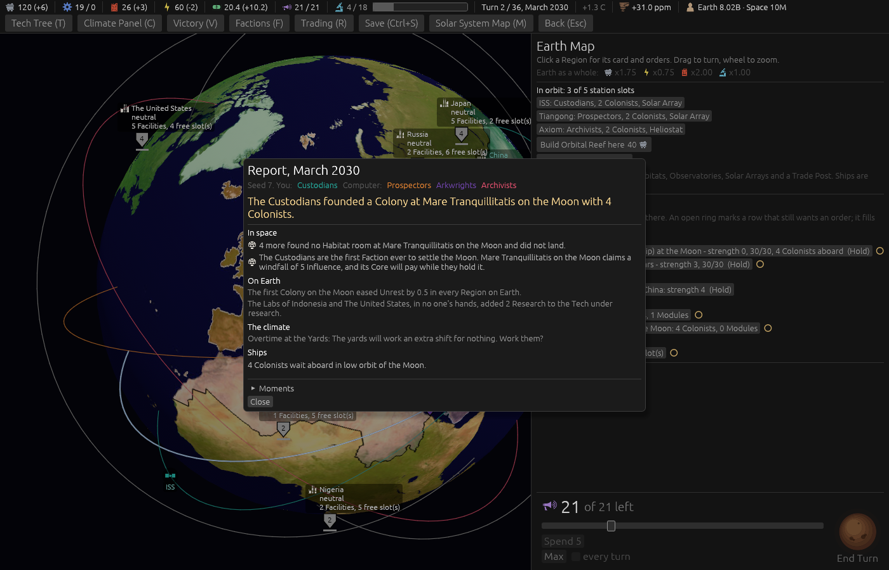

# Ticket #395: the first Colony on each Body eases Unrest everywhere

The designer's *"when the first colony is founded on another body their is a very small reduction
in unrest globally."* Decided in one round of four (*"q1 a q2 a q3 b q4 b"*): every Region, half
a point, once for each Body, one table-wide line.
[The resolution](https://github.com/whaleyjoshua2/Dying-Earth/issues/395) is the authority,
[§4 of the spec](../../../spec/version-0.09.3.md#4-the-first-colony-on-each-body-eases-unrest-everywhere)
records it.

## What was built

The easing rides the hook that already pays a Body's first-founding windfall (`claim_first`): when
it claims, every Region is lowered by `first_colony_ease` (0.5 in `unrest.toml`) through the same
`lower_unrest` every fall uses, one Report line is written for the whole Earth under the Unrest
heading, and the First to a Body Moment gains the clause. The glossary's First to a Body entry says
so.

## The picture

**The Report after the first landing on the Moon**, `seed:7 first:1 cardshut:1 menus:1
window:1400x900`, the `first:1` aid driving a Colony Ship of the player's down onto the Moon and
running the turn. Under *In space* the founding and the windfall; under *On Earth* the one line,
*"The first Colony on the Moon eased Unrest by 0.5 in every Region on Earth."*; no Region's own
Unrest line, since the natural fall and the easing push no cause.

## The red witness

`the_first_colony_on_each_body_eases_unrest_everywhere_by_a_half`: every Region set to 4, the
Moon's first Colony claimed; red at *left 4.0, right 3.5* before the rule; green after, and the
same test holds a second Moon Colony to nothing and Mars's first to another half. The suite is 516
in the engine, 8 and 6 in the root crate; the clippy gate
`cargo clippy --workspace --release --all-targets -- -D warnings` is clean.

## The review

Two axes, standards and spec; the build matched the resolution on all four points. What the review
corrected: the spec had listed Venus among the Bodies whose first Colony eases, which the glossary
rules out (Venus has no ground to claim); the spec and a data comment said "under the Unrest
heading", and the Report has no such heading (the line is filed under *On Earth*); the hook's doc
comment did not say it now moves Unrest; the easing wrote no log line where every other Unrest move
does; the Report line's registry carried an argument its text never uses; and the test's doc
comment claimed a station and Antarctica, which it now asserts. Two consequences the review named
and the spec now states: the easing lands before the turn's Unrest step, so a Region at the top
eased to nine and a half does not throw its holder off that turn; and a Region whose net line has a
named cause that turn carries the half unnamed inside its figures, as it carries the natural fall,
which the glossary's Unrest entry now says.

## The sweep

[`../sweeps/after-395.txt`](../sweeps/after-395.txt), 20 seeds x four seatings at the shipped
cell, against the sweep after #393:

| | after #393 | after #395 |
|---|---|---|
| Custodians | 5 | 6 |
| Prospectors | 6 | 6 |
| Arkwrights | 1 | 1 |
| Archivists | 7 | 5 |
| collapses of 80 | 61 | 62 |

Within a seed's noise, as half a point once a game would be: the collapse count is the figure the
rule could move and it did not. The worlds settled are as they were (the Moon in 80 of 80 at
turn 15, Mars in 7 of 80 at turn 24, Venus never on the ground), so the easing lands once a game
around turn 15 and a second time in one game in ten.
