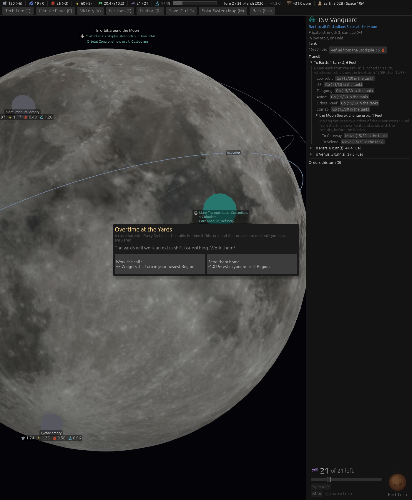

# Ticket #396: a Colony with a working Refinery refuels its low orbit

The designer's item, suggestion S4 of the space round: *"colonies with a refinery can refuel
ships."* Decided in one round of three (*"q1 a q2 a q3 a"*): the depot rule as a station's, Stranded
amended, the computer through the one predicate.
[The resolution](https://github.com/whaleyjoshua2/Dying-Earth/issues/396) is the authority,
[§12 of the spec](../../../spec/version-0.09.3.md#12-a-colony-with-a-working-refinery-refuels-its-low-orbit)
records it.

## What was built

`Game::refuel_depot(c)`: a station, or a ground Colony with a working Refinery. `fuels_for` reads
it, so every reader of the rule follows: `depot_in_orbit` finds the depot an orbit touches (a
station in its slot, a Refinery Colony under low orbit), `refuelling_station` asks it and the
orbit's Blockade (`orbit_blockaded_against`, the ring test generalised to low orbit), `stranded`
and `arrival_leaves_stranded` count it as a way out, the Refuel order's refusal names it and offers
the move to whichever orbit the open depot touches, the computer's orbit-change wants read the
Colony's own orbit, and the Refuel log line says *at a Refinery Colony* so the sweep counts it.
The Ship card's texts name the Refinery Colony beside the station. A building aid, `depot:1`,
gives seat 0's first ground Colony a Refinery and parks a half-full Frigate in its low orbit.

## The picture

**A Frigate in low orbit over a Moon Colony with a Refinery**, `seed:7 first:1 depot:1 stack:moon
ship:2 panel:0 window:1400x1700`: the Colony landed by the aid stands below with its Core and the
Refinery the aid gave it (the marker reads *Core Module, Refinery*), and the Frigate's card offers
*Refuel from the Stockpile 15* on a tank of 15 of 30, where before this ticket the card said *no
station of yours, or of a Refuel partner's, here to refuel at*. The stack card above it (`stack:moon`
alone) carries no Refuel line, since that button is a single Ship's.

## The red witness

`a_colony_with_a_working_refinery_refuels_its_low_orbit_and_rescues_a_stranded_ship`: a Colony
Ship with one Fuel in Mars low orbit, refused and Stranded with nothing of ours there; a ground
Colony with a Refinery stands, the Refuel is taken (red at *no station of yours, or of a Refuel
partner's, over Mars to refuel at* before the build), the tank fills from the Stockpile, the log
says where; the Refinery mothballed refuses it and strands the Ship again; a rival Frigate on
Blockade in low orbit shuts it; and an empty ring still fuels nothing.

## The review

The spec review found the Ship card's partner hover keyed on an own *station*, so one's own
Refinery Colony read as a partner's; the computer's Refuel Accord appetite read the same
station-only test; and the roster hover still said *in its own orbit*, which a ground Colony's
low orbit is only by the code's convention. All three now read the depot (`own_depot_at`, the
hover reworded). The standards review found the order's check and its refusal spelling *an open
depot* two ways, which with two ground depots in one low orbit could refuse a move to the orbit
the Ship sits in: one `open_depot_in_orbit` serves both. The glossary gains a **Depot** headword
and the Blockade entry says what a Blockade of low orbit now shuts; the witness gained the
partner's Refinery Colony, the Colony's Battery lifting a low-orbit Blockade, and the arrival
that a depot rescues, and builds its rival with the file's helper. One line in §12 is derived
rather than the designer's: that a Battery of the holder's lifts the Blockade, which follows from
the ring rule and is witnessed.

## The sweep

[`sweeps/after-396.txt`](../sweeps/after-396.txt) against the yard's
[`sweeps/after-398.txt`](../sweeps/after-398.txt): **6 / 4 / 1 / 9, collapses 60**, the same to
the win; hulls left dry by a Battle 8 (8), Fuel burned in Battle 163.2 (163.2), Missile Carriers
38 (38), games with an orbital Battle 27 (27). The new count on the Tanks line: **17 Refuels at a
Refinery Colony over the 80 games** (0, 3, 14 and 0 by seating), of 378 Refuel orders, so the
computer seats use a depot where one stands and the rule is otherwise quiet in the sweep. The
strandings at the end are the yard sweep's to the hull.
