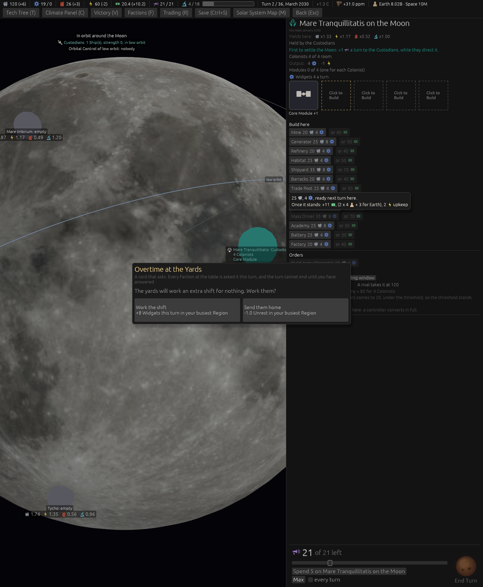
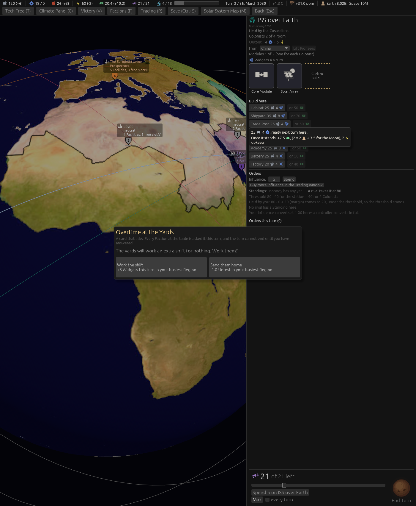

# Ticket #397: Trade Posts that pay by distance

The designer's item, suggestion S14 of the space round: a Trade Post's flat 3 Ducats per other
Body held becomes a figure per Body. Decided in one round of three (*"q1 a q2 moon 3.5 than as
suggested q3 a"*): from Earth, Earth 3, the Moon 3.5, Venus 4, Mars 5, Phobos and Deimos 6, the
Exchange following. [The resolution](https://github.com/whaleyjoshua2/Dying-Earth/issues/397) is
the authority, [§13 of the spec](../../../spec/version-0.09.3.md#13-trade-posts-that-pay-by-distance)
records it.

## What was built

`trade_pays` on every Body's row in `bodies.toml`, read by the Trade Post's yield in place of the
flat `per_other_body`, which is gone with its table; the yield's chain and hover name each Body
held with its figure. The Exchange's flat 1 is untouched. No code of the computer's moves.

## The pictures

**A Moon Colony's Trade Post button**, `seed:7 first:1 hab:ground habtile:free tip:for Earth`: the
hover reads *+11 [coin], (2 x 4 [head] + 3 for Earth)*, where it read *(2 x 4 Colonists + 3 x 1
Bodies)*.

**The ISS's Trade Post button with the Moon held**, `seed:7 first:1 hab:1 habtile:free tip:for the
Moon`: *+7.5 [coin], (2 x 2 [head] + 3.5 for the Moon)*, the designer's half more for the Moon.

## The red witness

`a_trade_post_pays_each_other_body_held_by_its_distance_from_earth`: a Mars Trade Post holding
Earth, the Moon and Venus pays 2 x 4 + 3 + 3.5 + 4 (red at *17 against 18.5* under the flat 3),
the arithmetic naming each Body; a Moon Trade Post with nobody living there pays 3 + 5 + 4 for
Earth, Mars and Venus, and 6 more for each of Phobos and Deimos; the Exchange pays its flat 1
above it.

## The sweep

[`sweeps/after-397.txt`](../sweeps/after-397.txt) against the depot's
[`sweeps/after-396.txt`](../sweeps/after-396.txt): **6 / 5 / 1 / 8, collapses 60** (6 / 4 / 1 / 9,
60 before): one game moved from the Archivists to the Prospectors. The Prospectors' Venture Capital
Fund at the end, the figure the ticket said to watch, by seating: median 1239, 1260, 721 and 739
Ducats of the 2500 their Victory Condition asks (1231, 1260, 721 and 739 before). Trade Posts standing
at the end: 60, 60, 58 and 44 by seating (59, 60, 58 and 45 before).
