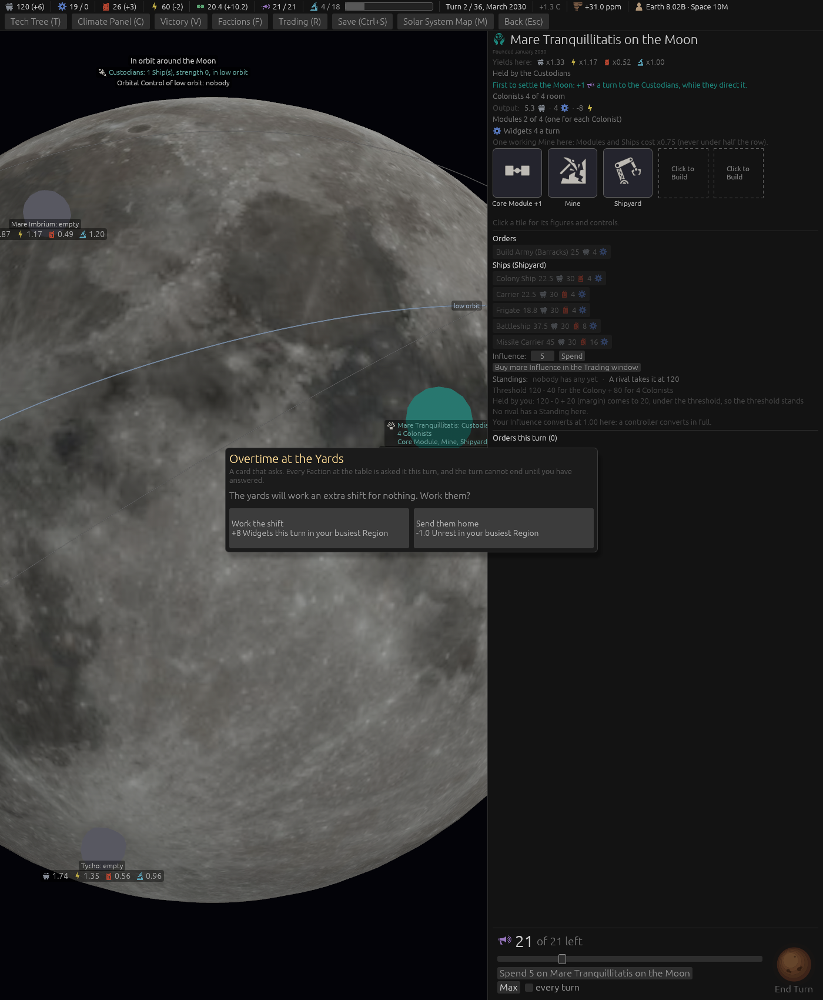
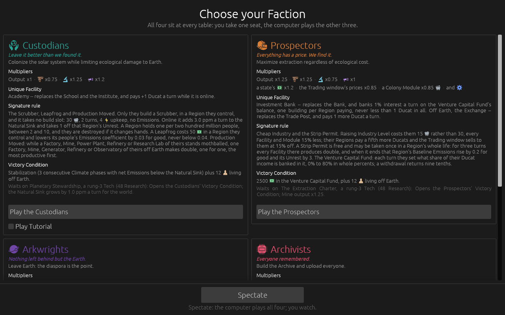

# Ticket #398: Build Where You Dig reaches Ships built on the Moon, Phobos or Deimos

The designer's item, suggestion S17 of the space round: *"Build Where You Dig, which excludes
Ships, reaches Ships built at a Shipyard on the Moon, Phobos or Deimos when that Colony has a
working Mine."* Decided in one round of four (*"q1 a q2 a q3 a q4 a"*): every kind of Ship, the
three low-gravity Bodies only, the Module's own steps, said on the buttons and the card's note.
[The resolution](https://github.com/whaleyjoshua2/Dying-Earth/issues/398) is the authority,
[§11 of the spec](../../../spec/version-0.09.3.md#11-build-where-you-dig-reaches-ships-built-on-the-moon-phobos-or-deimos)
records it.

## What was built

`Game::ship_materials_at(seat, site, kind)` beside `ship_materials`: at a Shipyard on a ground
Colony on a low-gravity Body with a working Mine, the seat's price times the `[in_situ]` step
(0.75 with one Mine, 0.6 with two or more), never under half the row; the Build Ship order and the
queue's cost read it; the Faction window keeps the seat's price. The Colony card's note reads
*Modules and Ships cost x0.75* on the three Bodies. The computer seats price a Ship through the
same order cost. A building aid, `yard:1`, gives seat 0's first ground Colony a Mine and a Shipyard.

## The pictures

**A Moon yard with one working Mine**, `seed:7 first:1 hab:ground yard:1 panel:0 window:1400x1700`:
the note *One working Mine here: Modules and Ships cost x0.75*, and the Ship buttons at three
quarters: *Frigate 18.8* against the row's 25, *Battleship 37.5* against 50, *Missile Carrier 45*
against 60. The buttons are greyed on this fresh Colony for want of Energy, the Shipyard newly
standing; the price is what the picture is for.

**The Faction window's Ship prices**, `seed:7 menus:1`, the seat's, unchanged.

## The red witness

`a_ship_built_at_a_low_gravity_yard_with_a_working_mine_takes_build_where_you_dig`: a Frigate at a
Moon Colony with one working Mine at three quarters (red at the full price before the build), every
kind of Ship cheaper there, two Mines at three fifths above the floor, the Mine mothballed back to
the full price, a Mars yard, a station and Earth at the full price, and the tank's Fuel untouched.

## The sweep, and what it found

[`sweeps/after-398.txt`](../sweeps/after-398.txt) against the Stadium's
[`sweeps/after-389.txt`](../sweeps/after-389.txt), the last sweep that moved a rule: **identical,
line for line** (`diff` empty). Wins 6 / 4 / 1 / 9, collapses 60, Missile Carriers built 40, games
with an orbital Battle 27 of 80, all unchanged. A rule that changes a price changes every game it
fires in, so the computer seats never once built a Ship at a low-gravity ground yard with a Mine.
Measured directly over 24 computer games of 36 turns: working ground Shipyards stood in 34
Colony-turns, **none on the Moon, Phobos or Deimos**. The computer builds its Shipyards on stations
and on Earth, and offers each Ship at the yard with the most Widgets (ticket #332, the designer's
rule), so the new price never reaches it. What the computer should do with the rule is the
designer's call, put to them on the ticket.
