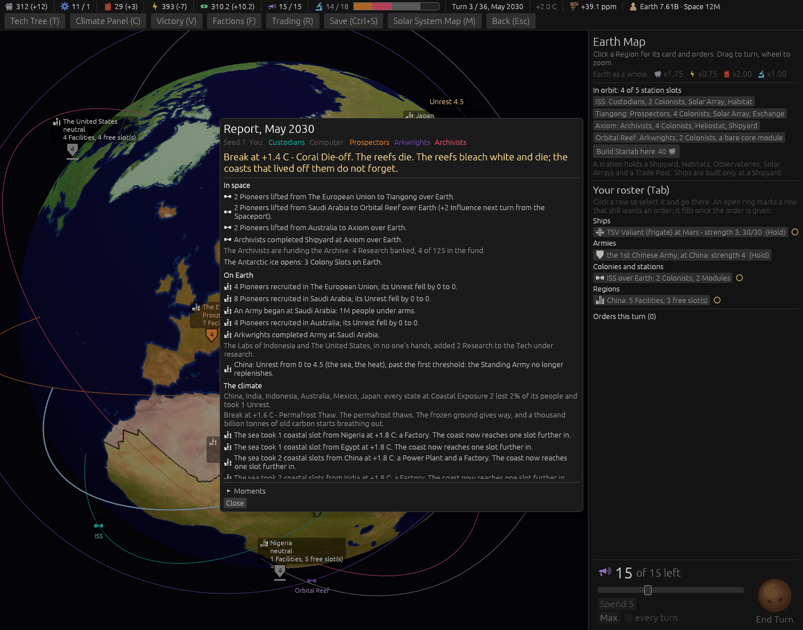

# Ticket #400: quiet the Unrest lines in the Report, again

The designer's *"quiet unrest spam in report."* Decided in one round of four (*"q1 a q2 a q3 a q4
a"*): the heat and the sea become causes on the net line, the board gets one heat line, the event
lines stay, and the measure counts every Unrest-bearing line.
[The resolution](https://github.com/whaleyjoshua2/Dying-Earth/issues/400) is the authority,
[§6 of the spec](../../../spec/version-0.09.3.md#6-the-unrest-lines-quieter-again) records it.

## What the reading found

Version 0.09.2's fold left six kinds of line that still carried an Unrest figure. The heat lines
were the spam: one for every Region on the board whose Unrest rose that Climate phase, unfiltered by
whose; 20,433 of the 31,842 Unrest-bearing lines in eighty games.

## What was built

The heat and the sea push a cause each (`cause_heat`, `cause_sea`) where they wrote a line and a
suffix; the heat pass writes one line for the board (`heat_board`); the net line moved from the
Resolution's end to after the Climate phase, and the Resolution's reset of its pending state now
carries the Unrest causes and the snapshot across, which the first build missed and a witness
caught. The `restive:1` picture aid writes the net line as the turn would.

## The measure

A throwaway test (not committed) played eighty games (20 seeds x four seatings, seat 0 by the
computer, so every Region's net line is written) and counted the Report's lines whose text carries
"Unrest", by kind:

| | before | after |
|---|---|---|
| turns | 2,351 | 2,351 |
| Unrest-bearing lines a turn | **13.54** (31,842) | **4.72** (11,099) |
| Climate kind (the heat lines, then the board line and the Break) | 20,433 | 1,472 |
| SeaLevel kind (the suffix) | 4,007 | 0 |
| Unrest kind (the net line) | 3,594 | 5,819 |
| Note kind (Pioneers mustered) | 2,644 | 2,644 |
| the other kinds (a throw-off, an Occupation's end, a Break, a card, a work of the player's) | 1,164 | 1,164 |
| most in one turn | 39 | 16 |

The net lines grew by what the heat and the sea now write to them; a human player sees only their
own Regions', so their Report is quieter than the count says.

## The review

Two axes, standards and spec. **The substantive finding**: moving the net line after the Climate
phase put the coral Break's own rise in Unrest inside the line's window, and the Break pushed no
cause, so a Region hit by it would have read *"from 4 to 6.5 (the heat)"* with the Break unnamed,
or earned no line at all. The Break's rise is a cause now, named for the Break, and the Break keeps
its line; witnessed red by `a_breaks_rise_is_a_cause_on_the_net_line_and_the_break_keeps_its_line`
against the Climate code before the fix. Also from the review: the board line's *took people from
m* counted only Regions whose Unrest rose, so a Region whose rise a Constabulary damped to nothing
was dropped from the count though its people fell; it counts every visible fall now, and the line
is written when either figure is above nought. A first turn with no Resolution before it had no
snapshot for the line's *before*; the Climate phase takes one when none stands. Four stale doc
comments that still put the line at the Resolution's end, and one that promised the deleted
shorter sentence, corrected; the spec's "the people lost" on the sea line, which names slots,
corrected; the diary's table given the row that makes its columns add up. One thing the build did
that the resolution did not ask for, named in the spec for the designer: a cause is named once on
the net line however many times it pushed in a turn.

## The picture

**The Report of a hot turn**, `seed:7 temp:1.95 turns:1 menus:1 window:1400x1100`, the
Temperature set just past where people begin to fall: the player's own Region's net line reads
*"China: Unrest from 0 to 4.5 (the sea, the heat), past the first threshold ..."*, and under The
climate there is no Region's heat line of its own. The Report window scrolls, and the board's one
line sits below its fold; read off the engine for the same board it reads *"The heat raised Unrest
in 14 Regions and took people from 14."* At +2.6 C, before the review's dedupe, China's causes
read *"the sea, the sea, the sea, the heat"*, three thresholds having fired in the one turn; a
cause is named once now.

## The red witnesses

- `the_heat_is_a_cause_on_the_net_line_and_the_board_is_one_line`: red on the per-Region heat
  lines standing; green after.
- `a_cause_from_the_resolution_survives_to_the_net_line_after_the_climate_phase`: red at *one net
  line for home: left 0, right 1*, the Agitate's cause dropped by the Resolution's reset; green after
  the two Unrest fields are carried across it.

Three existing tests that ran the Resolution or a sea threshold alone and read the net line from it
now write the line as the turn would, each marked with the ticket. The suite is 521 in the engine,
9 and 6 in the root crate; the clippy gate `cargo clippy --workspace --release --all-targets -- -D
warnings` is clean. No rule moved, so no sweep.
