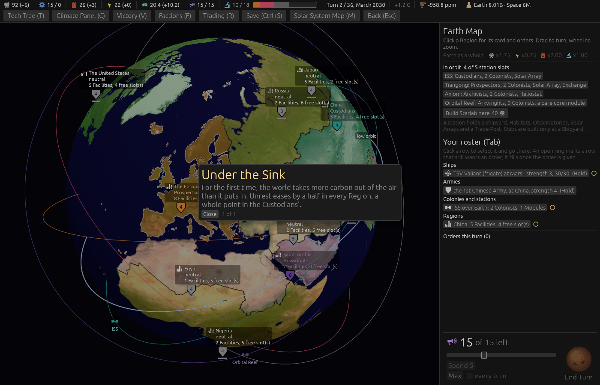

# The first turn under the Sink eases Unrest everywhere (ticket #405)

[Ticket #405](https://github.com/whaleyjoshua2/Dying-Earth/issues/405); the spec is §2 of
[`docs/spec/version-0.09.4.md`](../../../spec/version-0.09.4.md). Decided in two rounds (*"q1 a q2 a
q3 the same q4 that but we're talking on just the first turn even if the next turn is not
stablized"*, then *"q5 ok q6 ok"*).

## The picture

**The Moment**, `shot: menus:1 moment:sink seed:7 cardshut:1 window:1400x900`. The new `moment:sink`
aid raises the Natural Sink to 1000 and plays one turn, so that turn's Climate phase is the world's
first under the Sink; the top bar's -958.8 ppm is that staging, not a figure the game reaches.

## The red witness

`the_first_turn_under_the_sink_eases_every_region_once`: a copy of the game with the ease already
spent is the control, so the heat and whatever else the Climate phase does cancels out. Red at
*SubSaharanAfrica eased by 0, not 0.5* before the rule; green after, with a Custodian Region eased
by 1, every other by 0.5, one line, the Moment, and nothing on a second turn under the Sink.

## The sweep

[`../sweeps/before-405.txt`](../sweeps/before-405.txt) and [`../sweeps/after-405.txt`](../sweeps/after-405.txt),
`sweep 20 --seatings --balance --steps=300`. The sweep gained a line: *the world under the Natural
Sink at least once in N games (median first turn T)*, per seating and over all four. **10 of 80,
median first turn 28**, before and after. Wins **7 / 5 / 1 / 7, collapses 60**, unmoved; the
before is 0.09.3's closing sweep to the figure, since #404 moved nothing the computer does.

## The review

An agent that did not build it found the rule right on all six points and the sweep claim accurate,
and found five things, all fixed:

- **The Moment read *"0.5 … 1"* where the designer approved *"a half … a whole point"***; it now
  says the designer's words (the picture above is retaken), and so does the Report line.
- The spec had the ease landing after the turn's throw-off; the Climate phase is the turn's second
  phase and the throw-off comes in its Resolution, so the ease lands before it.
- The test could not tell the Stabilization test from the Climate Panel's net, nor catch an ease
  that fired again when a run broke and began again. A second test,
  `the_sink_ease_reads_the_stabilization_test_and_survives_a_broken_run`, was watched red against
  a rule keyed on the panel's net, and against one that forgot it had fired when a run broke (*one
  Moment over the three phases*).
- A save from before, written while the world stood under the Sink, would have announced the first
  time again; loading such a save now counts the ease as spent.

Noted and left: a Region's own net Unrest line does not name the ease as a cause, as the first
Colony's ease does not; the one table-wide line says it.
