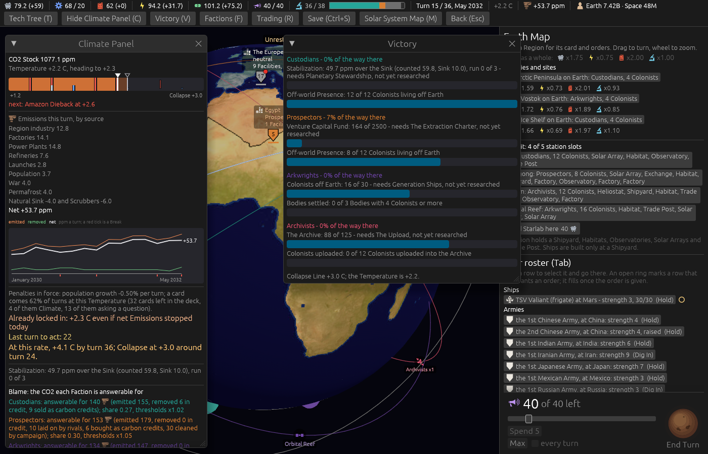

# The Custodians' Victory line in ppm, and partial credit for the run (ticket #406)

[Ticket #406](https://github.com/whaleyjoshua2/Dying-Earth/issues/406); the spec is §3 of
[`docs/spec/version-0.09.4.md`](../../../spec/version-0.09.4.md). Decided in two rounds (*"q1 a q2 c
q3 a"*, then *"q4 best q5 ok q6 ok"*).

## The picture

**The Victory window and the Climate Panel at turn 15**, `shot: victory:1 turns:14 seed:7 cardshut:1
window:1400x900`. The Custodians' row reads *"Stabilization: 49.7 ppm over the Sink (counted 59.8,
Sink 10.0), run 0 of 3"*, and the Climate Panel's Stabilization line says the same. This game's gap
has *grown* from its opening 30.9, so nothing is closed and the Custodians stand at 0%: the credit
pays for closing the gap, not for holding it.

## The red witness

`the_custodians_run_earns_partial_credit_for_the_best_run_and_the_gap_closed`: red on the opening
figure before the rule (the recorded opening gap nought, against the gap the stripped test board
opens at); green after, with half the gap closed worth three
tenths of a half, the best standing when the gap widens again, and a broken run of two worth two
thirds with the Condition still unmet. `the_stabilization_row_says_the_gap_in_ppm_beside_the_run`
pins the row's words.

## The sweep

[`../sweeps/before-406.txt`](../sweeps/before-406.txt) and [`../sweeps/after-406.txt`](../sweeps/after-406.txt).
The sweep gained a line per Faction: its score at the end and its places in the final ranking. The
Custodians at nought in 73 of 80 games before, 12 after; last in 67, then 15; wins 7 to 8, one
turn-36 win from the Prospectors.

## The review

An agent that did not build it found no wrong result in a real game, and found, all fixed:

- **The Climate Panel read the bar from `victory.toml` and the Victory window from the Custodians'
  card**, both 3 today; a bar moved on the card would have split the two screens. Both read the
  card now.
- **Two computer-seat readers took up the credit**, against *"no change in how they play"*: the
  gate-Tech pick (past half the first part) and the refusal of an Accord with a Faction at the door
  (a score of 0.95). Both read the part **as it stands** now. The sweep had shown no divergence in
  play; this keeps it so by rule. The Rival Moment and the Victory chart carry the credit, as the
  score does.
- **A bar's in-transit band could go below nought** where the credit filled more than the run; it
  cannot now.
- **The tests**: the *"still three in a row"* check was empty while the gate Tech was unresearched
  (held back either way); the gate now stands in the test, and a `met()` that read the credit was
  watched red. A run of three that breaks now fills the bar and meets nothing. The credit is shown
  to rank the Custodians first and to win at turn 36, watched red against a score without it. Two
  assertions that restated a definition or a constant are gone.
- **The glossary**: the run *over three*; the Victory Condition and the Victory bar entries amended.
