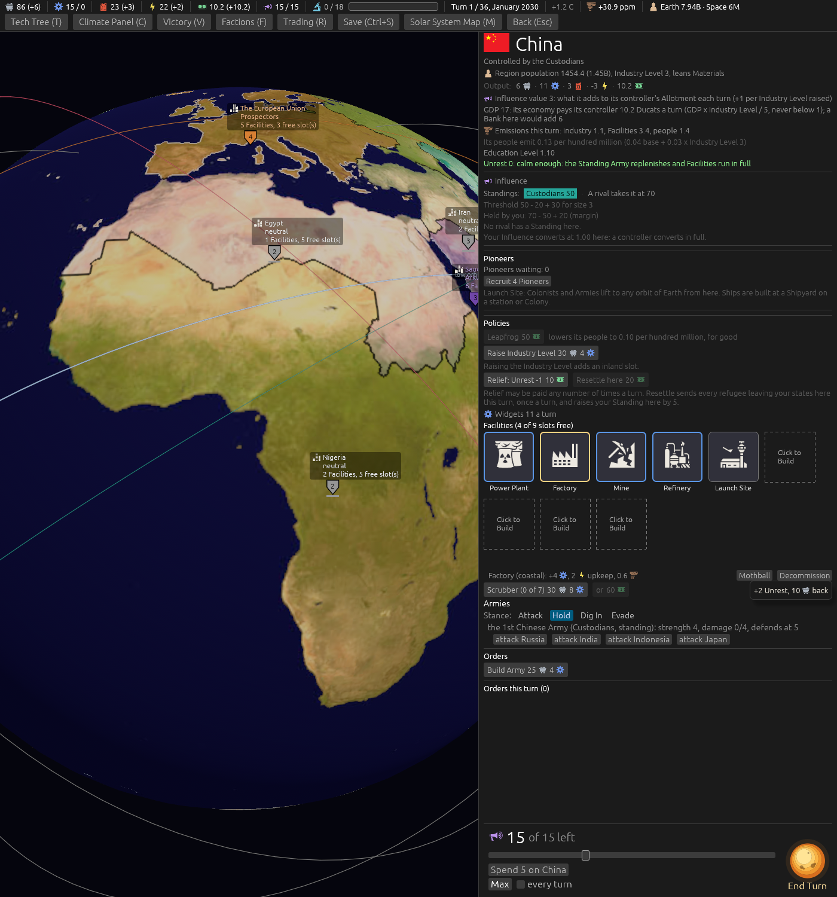
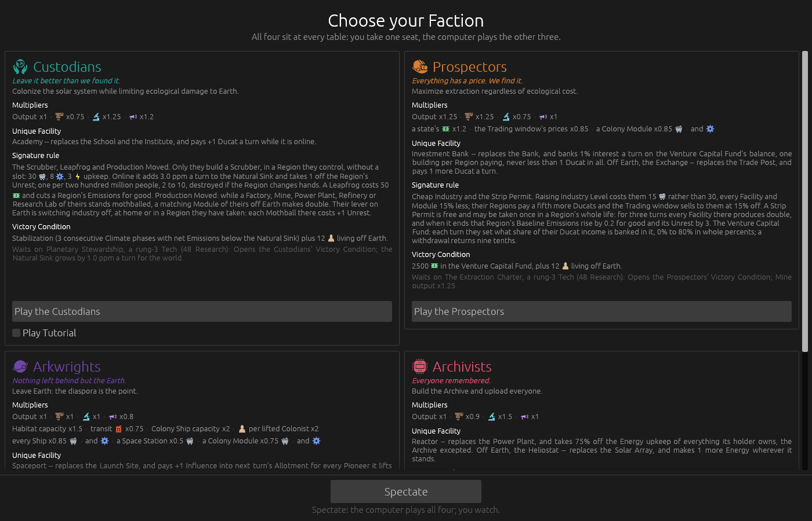

# Say Conquer-and-Mothball, and its price (ticket #407)

[Ticket #407](https://github.com/whaleyjoshua2/Dying-Earth/issues/407); the spec is §4 of
[`docs/spec/version-0.09.4.md`](../../../spec/version-0.09.4.md). Decided in one round and a
correction: *"q1 way way fewer words man q2 b q3 ok"*, then *"ok"* to the shorter hovers. No rule
moves, so no sweep.

## The pictures

**The Decommission hover on China's Factory**, `shot: select:eastasia slotbox:1 "tip:+2 Unrest"
panel:0 seed:7 cardshut:1 window:1400x1500`: *"+2 Unrest, 10 back"*, the word Materials drawn as
its glyph. The Mothball hover beside it reads *"+1 Unrest"*.

**The Custodians' text on the Faction choice screen**, `shot: factions:custodians rulebook:1 seed:7
cardshut:1 window:1400x900`: the Scrubber's figures read from the data (30, 8 Widgets, 3 upkeep),
and the last sentence saying their lever and its price.

## The red witness

`a_mothball_and_a_decommission_say_their_price`, red against a stub that said nothing (*left: None,
right: Some("+1 Unrest")*). `the_custodians_text_reads_its_figures_from_the_data_and_says_the_lever`
was red on its first run, reading *"eight Widgets, three Energy upkeep"* where the data module's
word figures had been used; the digits formatter fixed it.

## The audit

The other three Factions' texts, every figure checked against the data by an agent: the Arkwrights'
Colony Ship (16 with Generation Ships too; 25.5 Materials to them) and the Archivists' Provisional
Findings (the 75% contribution) were stale and are corrected. **The Reactor is put to the designer**:
the Archivists' text says it takes 75% off the Energy upkeep, the code and the Reactor's own line say
the holder pays three quarters, a quarter off.

## The review

An agent that did not build it found no blocking defect and confirmed the refund the hover names is
the Resolution's (the data row's half, the Prospectors' included). Fixed from it: the Archivists'
text read as the same turn where the rule reads last turn's split; the Scrubber's *"two hundred
million"* and the Archivists' *75%* are read from the data now; *"one for one"* is back on
Production Moved; the test now decommissions and checks the Materials the Resolution pays against
the hover, and checks the Decommission's confirm. The turn's order list reads *(+1 Unrest)* for a
Mothball where it read *(free)*, as ticket #404 made every confirm do.

The designer ruled the Reactor's code right (Q4, A): the Archivists' text now says *a quarter off*.
