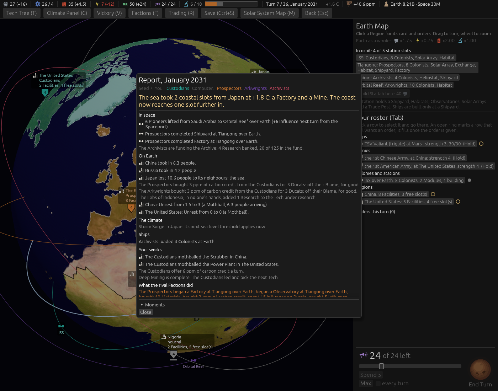
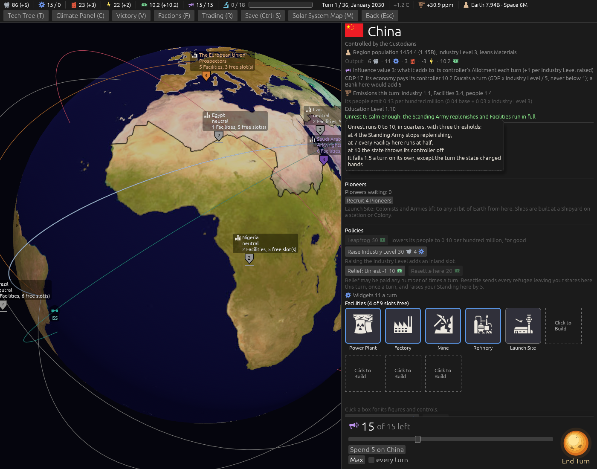

# Cut the language (ticket #408)

[Ticket #408](https://github.com/whaleyjoshua2/Dying-Earth/issues/408); the spec is §5 of
[`docs/spec/version-0.09.4.md`](../../../spec/version-0.09.4.md). Decided in one round (*"q1 all
four"*). No rule moves, so no sweep.

## The picture

**The Report on turn 7**, `shot: menus:1 turns:6 seed:7 cardshut:1 window:1400x1100`: under Your
works, *"Deep Mining is complete. The Custodians led and pick the next Tech."*

## The red witness

`the_cut_report_lines_say_only_what_they_must`, red on the Tech line's old words (*"…is complete;
every Faction has it. The Prospectors led (Prospectors 6) and pick…"*); green after, the five lines
in the designer's words. Two tests that quoted the old Sea Wall and first-to-a-Body words now quote
the new.

Seen in passing, and left: the same Report carries *"The United States: Unrest from 0 to 0 (a
Mothball)"*, a net line that moved nothing.

## The review

An agent that did not build it found nothing blocking; fixed from it:

- **The Constabulary's box was wrong**, and with the card's sentence gone it was the only word
  left: it said *halves* where the engine takes a flat half point, and left out refugees. It now says
  it as the engine does. The Stadium's box, which contradicted it, agrees.
- **An Occupation of a Colony that broke claimed +2 Unrest** a Colony has not got (the old line did
  too, but it was now the whole sentence); it says the break alone, and
  `an_occupation_of_a_colony_that_breaks_claims_no_unrest` was watched red against a line that
  always claimed it.
- *"The United States's Sea Wall"* reads *"The United States' Sea Wall"*.
- **The card, pictured**: China's card with the Unrest hover forced open, *"Unrest runs 0 to 10, in
  quarters"*, `shot: select:eastasia "tip:in quarters" panel:0 seed:7`.

For the designer, not changed: the cut Occupation line no longer says the break is an offence or
that the Standing it won is gone, and the throw-off line no longer says where Unrest settles; the
log keeps both.
