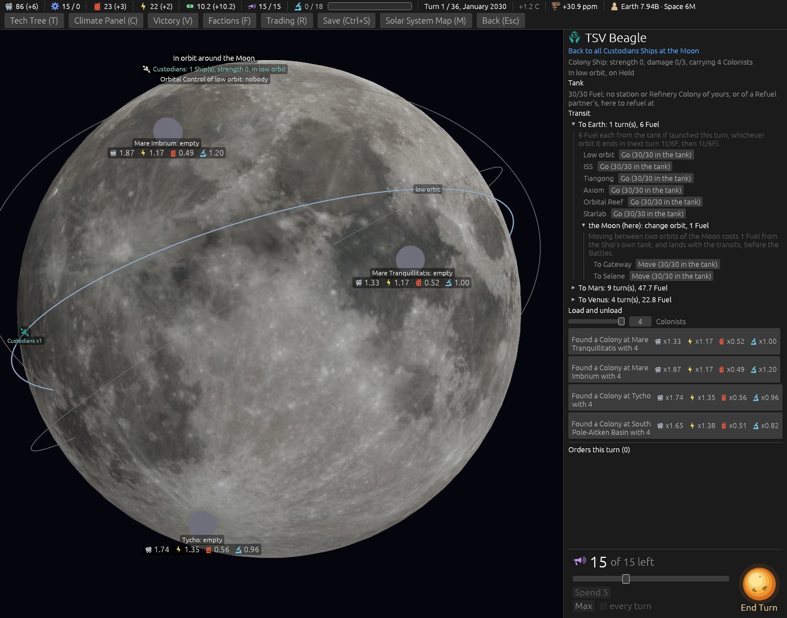

# A Colony Ship unloads any count of Colonists (ticket #409)

[Ticket #409](https://github.com/whaleyjoshua2/Dying-Earth/issues/409); the spec is §6 of
[`docs/spec/version-0.09.4.md`](../../../spec/version-0.09.4.md). Decided in one round (*"q1 c - up to
max number the outpost will take q2 yes q3 just make sure they can unload any interger of coloist or
they'll get stuck too"*). No rule moves, so no sweep.

## The picture

**A loaded Colony Ship's card at the Moon**, `shot: loaded:1 stack:moon ship:1 seed:7 cardshut:1
window:1400x1100`: one slider, *4 Colonists*, over the four founding buttons, each reading *"Found a
Colony at … with 4"*. The first take had a slider under every button; one per Ship is enough, since
a new Colony takes the same on every slot.

## The red witness

`a_colony_ship_unloads_any_count_up_to_what_the_place_will_take`, red against a stub limit of
nought (*left 0, right 4*); green after: a founding with two lands two and keeps five aboard, one
Colonist is an order into the Colony, and every Unload a computer seat gives, founding and (with
every other slot taken) disembarking, asks for no more than fits and stands.

## The review

An agent that did not build it found the logic right and no way for a seat to stick, and found:
the test's computer clause never ran (the seat founded, and only disembarks were checked), and the
computer's founding asked for 5 where 4 fit, which the Resolution clamped. The computer's founding
now asks for what lands, and the test checks every Unload the seat gives, founding and disembarking,
watched red with the cap taken off (*"the computer asks for 5 into Slot(Moon, 1), more than
fits"*). The turn's order list names a founding's count; *"1 Colonist"*.
