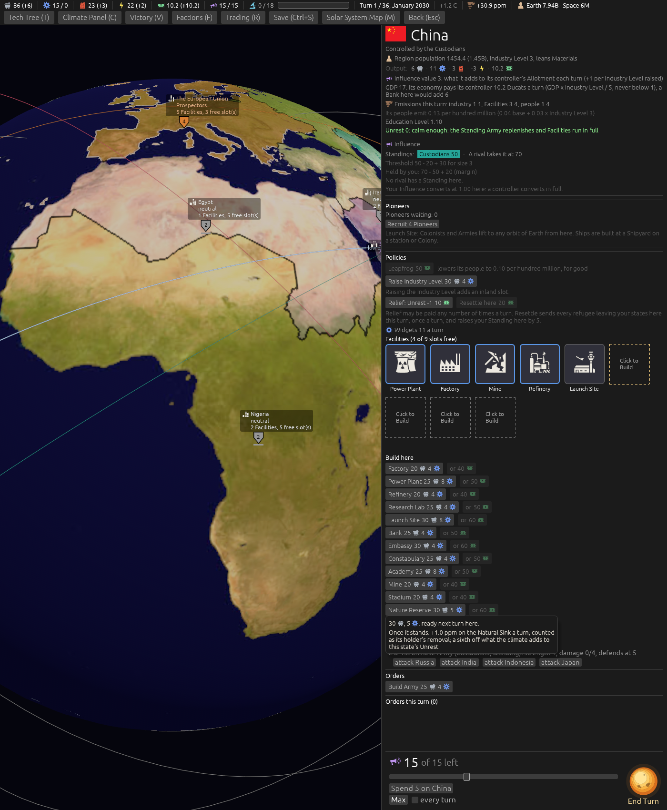
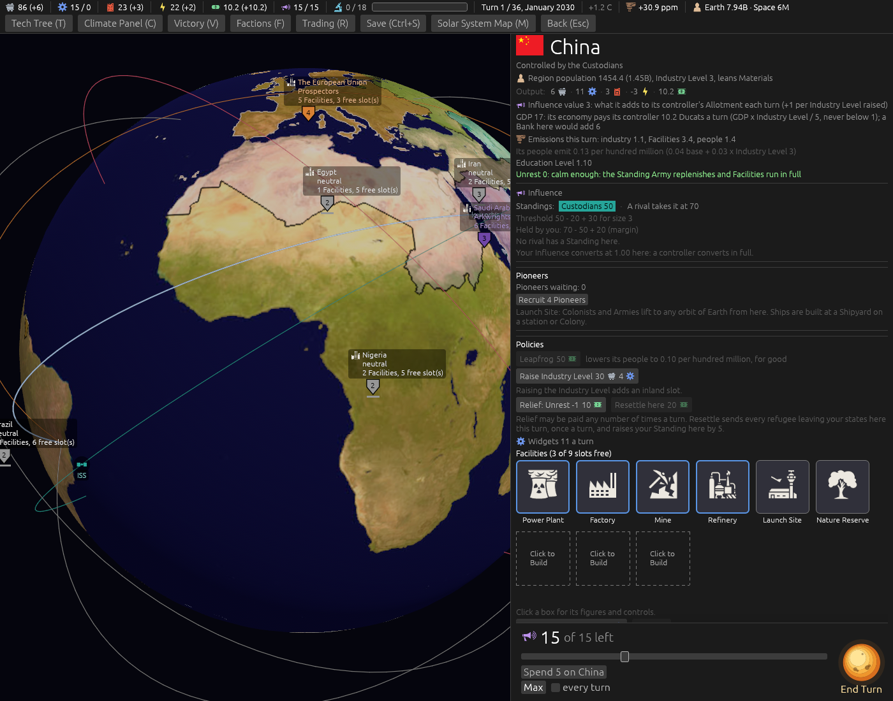

# A Nature Reserve that grows the Natural Sink (ticket #411)

[Ticket #411](https://github.com/whaleyjoshua2/Dying-Earth/issues/411); the spec is §14 of
[`docs/spec/version-0.09.4.md`](../../../spec/version-0.09.4.md). Decided in two rounds (*"q1 a plus
give it a third of stadiums effects on unrest q2 30 materials and 5 widgets q3 see q1 q4 ok q5 need
link for review q6 ok but make sure its part of their unrest managment strategy"*, then *"q5 beech
q7 a q8 ok"*).

## The icon

Seven game-icons.net candidates fetched and rendered at the game's sizes beside the Scrubber and
the Stadium (`cargo run --release --example icon_sheet`), the sheet [pushed for the designer to
open](icon-candidates.png); the **beech** chosen.

## The picture

China's build list on turn 1, `shot: select:eastasia slotbox:free "tip:Natural Sink a turn" panel:0
seed:7`: *Nature Reserve 30, 5* with its hover. (The hover's words were cut shorter after the
picture.)

## The red witness

`a_nature_reserve_grows_the_sink_and_calms_a_climate_rise`. Its first form computed the expected
rise from the table's own figure and passed with the figure set to one (no effect); it now pins the
figures (a climate rise of 1.2 lands 1.0, and 0.5 with a Stadium) and was watched red with the
figure at one.

## The sweep

[`../sweeps/after-411.txt`](../sweeps/after-411.txt) against [`../sweeps/after-419.txt`](../sweeps/after-419.txt):
97 Reserves built, wins 9 / 5 / 0 / 9 to 7 / 6 / 0 / 10, collapses 57, the world under the Sink in
15 of 80 either way.

## The review

An agent that did not build it found nothing broken and reproduced the sweep. Fixed from it: **the
Reserve's figure was typed 0.8333333, not five sixths**, so a rise of 1.5 landed 1.24999995 and a
Region could read *7.00* while sitting under the threshold; it is five sixths to the last digit now,
the test pinning *1.5 lands 1.25 exactly* (the rerun sweep keeps every figure §14 quotes). The
Climate Panel, the Blame hovers and the Climate log say *Scrubbers and Reserves* where they said
Scrubbers. **The icon on the card**, with a new building aid `reserve:1`: the beech in China's box,
*Nature Reserve*.

