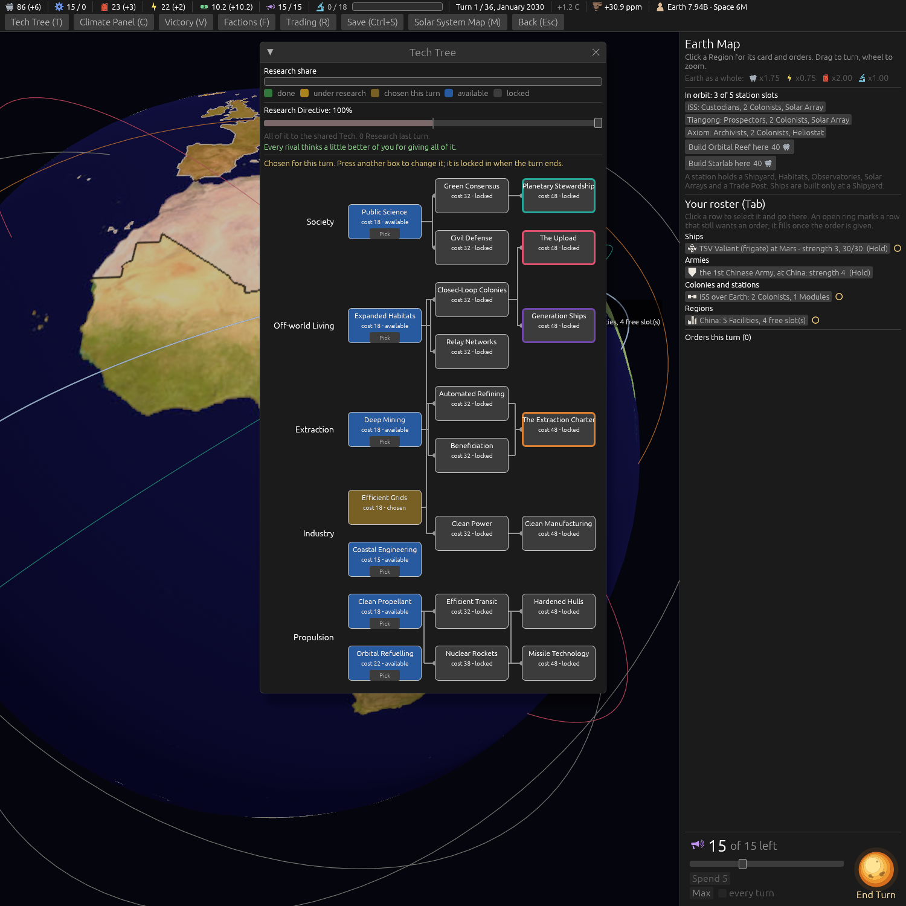

# Orbital Refuelling, and Clean Propellant's bigger tanks (ticket #413)

[Ticket #413](https://github.com/whaleyjoshua2/Dying-Earth/issues/413); the spec is §9 of
[`docs/spec/version-0.09.4.md`](../../../spec/version-0.09.4.md). Decided in one round (*"q1 ok q2 a
q3 ok q4 ok"*).

## The picture

**The Tech tree on turn 1**, `shot: tech:1 panel:0 seed:7 cardshut:1 window:1500x1500`: Orbital
Refuelling on Propulsion rung 1 under Clean Propellant, *cost 22 - available*, no line in or out.
The line from Clean Propellant to Nuclear Rockets runs down the lane beside it, which at a glance
can read as Nuclear Rockets needing it; the Tech tree's own ticket lights a Tech's real path on a
hover.

## The red witness

`orbital_refuelling_stacks_with_nuclear_rockets_and_clean_propellant_widens_the_tank`: red before
the stacking (Mars *9 -> 7 -> 7*, the new Tech doing nothing), and red again on *"a new Ship is built
full"* until every tank read went through the seat's tank; green after. Five older tests that counted
the Techs, priced the tree or pinned the pick order were moved to the new tree.

## The sweep

[`../sweeps/after-413.txt`](../sweeps/after-413.txt) against [`../sweeps/after-412.txt`](../sweeps/after-412.txt):
wins 8 / 4 / 0 / 5 to 9 / 5 / 0 / 9, collapses 63 to 57, the gates completed less often, the
orbital war quieter.

## The review

An agent that did not build it reran the sweep byte for byte and found nothing blocking. Fixed from
it: **the computer's choice of destination still read a tank of 30**, so a leg of 30 to 35 Fuel
the bigger tank pays was ruled out (Mars far off its window, the Mars moons); it reads the seat's own
tanks now, and the rerun sweep keeps every headline figure (ground Colonies on Mars 13 to 11,
Phobos 2 to 4). The picture aids fill their Ships from the seat's tank; the glossary's Tank entry
names the +5; the test pins the spec's crossing table at the window.

Two edges left as built and noted: a Ship ordered before Clean Propellant and completed after it is
built full at 35 having paid 30 (the decision's *"a new Ship is built full"*); and under the
Archivists' half-read of Clean Propellant a tank can stand at 32 of 30 if the half-read lapses, until
it is burned down.
