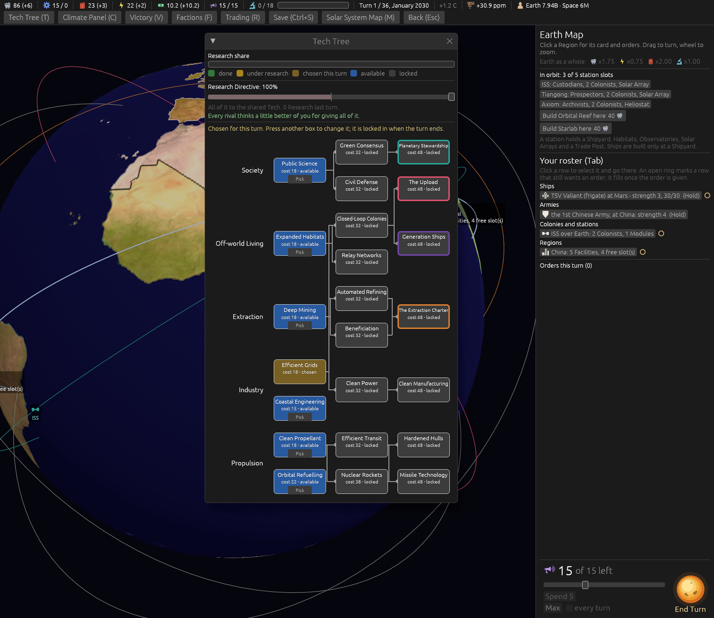
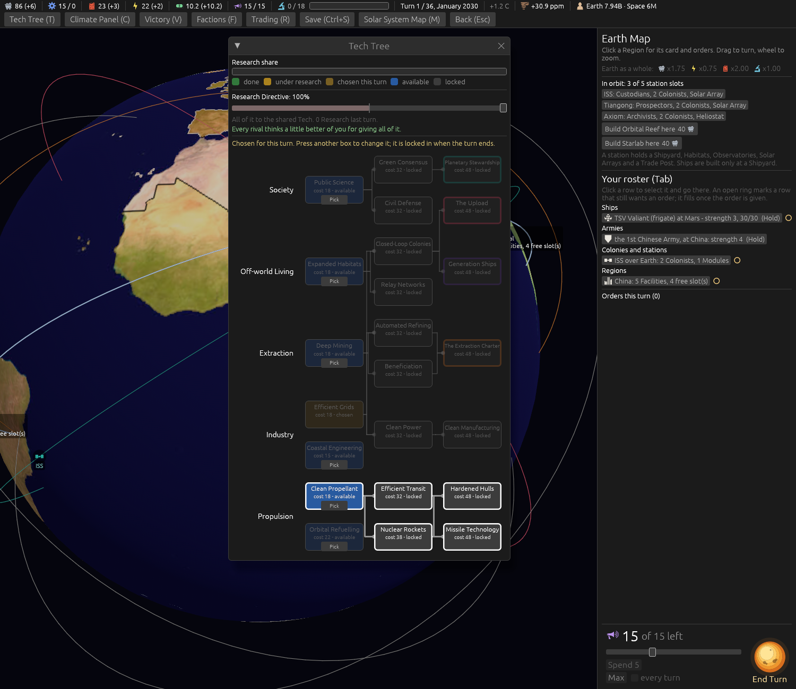
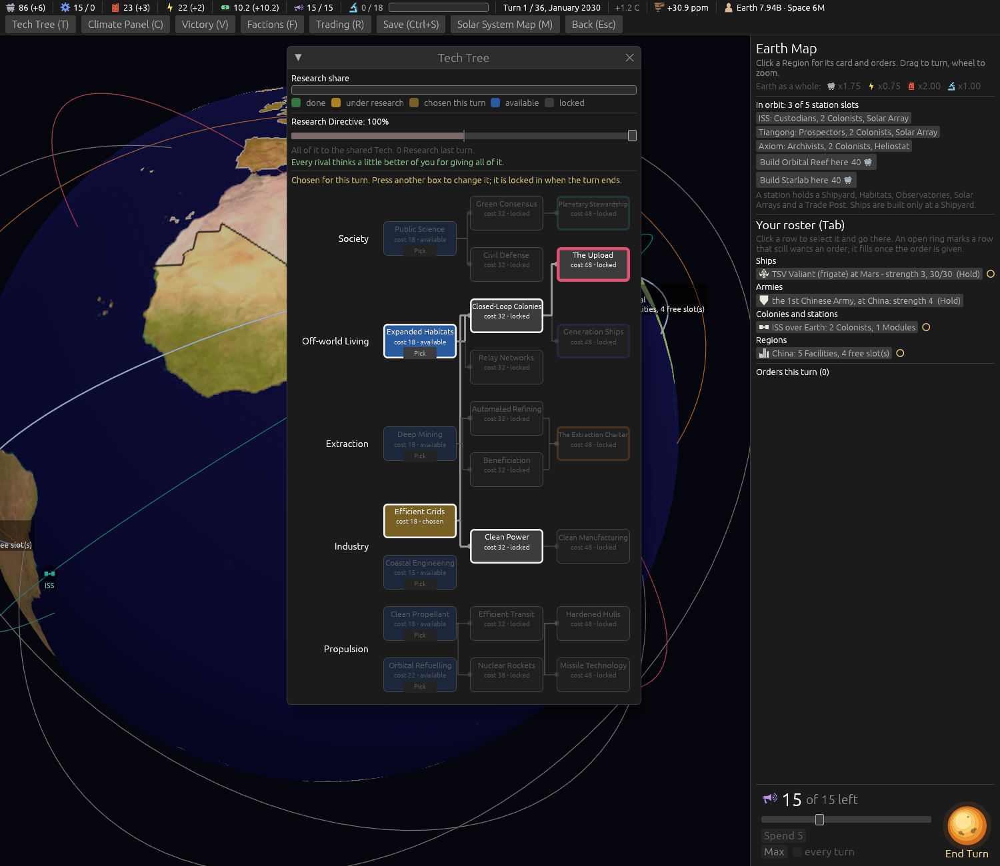

# The Tech tree: the path lit on a hover, the boxes a tenth smaller (ticket #414)

[Ticket #414](https://github.com/whaleyjoshua2/Dying-Earth/issues/414); the spec is §10 of
[`docs/spec/version-0.09.4.md`](../../../spec/version-0.09.4.md). Decided in one round (*"q1 a q2 ok
q3 a"*). No rule moves.

## The pictures

**At rest, a tenth smaller**, `shot: tech:1 panel:0 seed:7 cardshut:1 window:1500x1300`. The first
take spilled *Planetary Stewardship* and *The Extraction Charter* past their boxes at the new width;
those two names now come down only as far as they must, the rest stay 12 point.

**Missile Technology hovered**, the same with `techhover:missile_technology` (a new building aid,
since no pointer enters a headless window): Missile Technology, Hardened Hulls, both rung-2 Techs
under it and Clean Propellant lit, the rest faded to a third. Orbital Refuelling, whose box the
Clean Propellant line runs beside, stays dark, which settles what ticket #413's picture could not.

## The red witness

`the_tech_trees_lit_path_is_everything_a_tech_needs`, on the engine's `Tables::tech_path` the tree
reads: red with the path cut to one step (*"EfficientTransit is on Missile Technology's path:
[MissileTechnology, HardenedHulls]"*), green with the whole descent.

## The review

An agent that did not build it found one real defect, fixed: **the hover read the pointer's place
on the whole screen**, so a box scrolled out of the window, or under another window over the tree,
lit the path while the pointer was on the map or on a slider; it reads the pointer through the
tree's own layer and clip now. Also fixed: the Pick buttons on faded boxes fade with them; a stale
test comment on the old grid. **A lit Victory gate keeps its Faction's border**, drawn thicker, at
the designer's word (Q4, A): The Upload below, pink and heavier.

