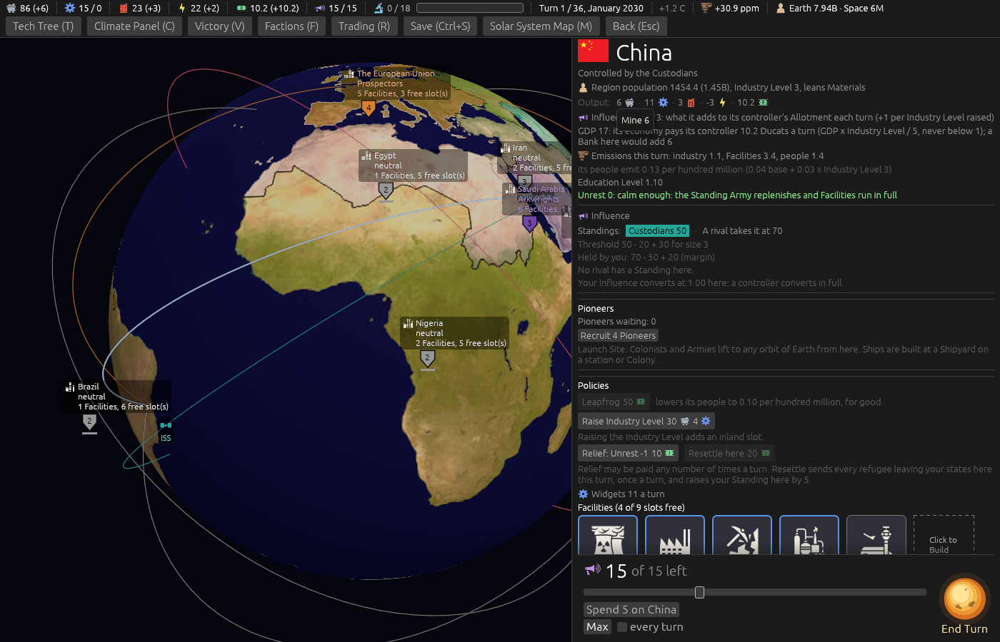

# The Output row names its sources on a hover (ticket #415)

[Ticket #415](https://github.com/whaleyjoshua2/Dying-Earth/issues/415); the spec is §13 of
[`docs/spec/version-0.09.4.md`](../../../spec/version-0.09.4.md). Decided in two rounds (*"q1 yes q2
a q3 sounds great"*, *"q4 yes"*). No rule moves.

## The pictures

China on turn 1, `shot: select:eastasia "tip:<word>" panel:0 seed:7 cardshut:1`: **Energy -3**
reads *upkeep -9, Power Plant 6*; **Materials 6** reads *Mine 6*.

## The red witness

`the_output_rows_sources_add_up_to_its_figures`, on a Region and the ISS: red with the upkeep line
left out (*"Energy, net of the upkeep line: 6 against -3"*), green after.

## The review

An agent that did not build it found no defect. Taken from it: the row is now **summed from the very
list its hovers show**, so the two can never disagree (the sweep after is identical to the line);
the Widgets list reads bare names and drops a nought line (*Industry Level 0 0*). Noted: a lit
Reactor's relief is not on the row, which the cut sentence had said.
